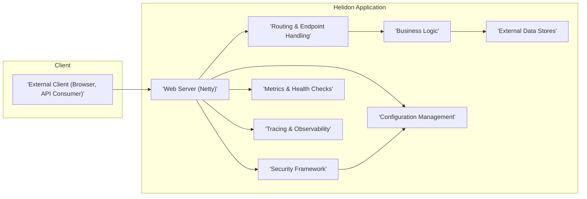
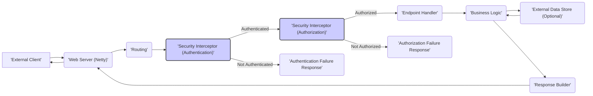

# Project Design Document: Helidon

**Version:** 1.1
**Date:** October 26, 2023
**Author:** AI Software Architect

## 1. Introduction

This document provides an enhanced architectural design of the Helidon project, an open-source, cloud-native Java framework for building microservices. This revised document aims to provide a more detailed foundation for subsequent threat modeling activities, offering deeper insights into the components, interactions, and potential security considerations within Helidon applications.

## 2. Goals

* Provide a clear, concise, and more detailed overview of the Helidon project's architecture.
* Identify key components and elaborate on their specific responsibilities, particularly concerning security.
* Describe the data flow within a typical Helidon application with a focus on security checkpoints.
* Highlight potential areas of security concern with more specific examples for future threat modeling.

## 3. Target Audience

This document is intended for:

* Security engineers and architects responsible for threat modeling Helidon-based applications.
* Developers working with Helidon seeking a comprehensive understanding of its architecture and security implications.
* Operations teams involved in deploying, managing, and securing Helidon applications.

## 4. Project Overview

Helidon is a lightweight collection of Java libraries providing the building blocks for creating cloud-native microservices. It offers two distinct programming models, sharing a common core designed for modern, cloud-centric environments:

* **Helidon SE:** A reactive, functional programming model offering a simple and efficient API.
* **Helidon MP:** An implementation of the Eclipse MicroProfile specification, providing a standardized approach to microservice development.

## 5. Architectural Design

The following sections detail the architecture of Helidon, emphasizing key components and their interactions relevant to security.

### 5.1. High-Level Architecture Diagram

### 5.2. Component Description

* **External Client:** Represents any entity interacting with the Helidon application, such as web browsers, mobile applications, or other microservices.
* **Web Server (Netty):**  Helidon leverages Netty, a high-performance, asynchronous event-driven network application framework, to handle incoming HTTP requests and responses. This component is the entry point for external interactions.
* **Routing & Endpoint Handling:** This component is responsible for mapping incoming HTTP requests to specific handlers or resources within the application based on defined routes. It defines the application's API surface and is crucial for controlling access to different functionalities.
* **Business Logic:** This encompasses the core functionality of the microservice, implementing specific business rules, data processing, and workflows. This is where the application's primary purpose is realized.
* **Configuration Management:** Helidon provides a robust configuration system allowing applications to be configured through various sources like files, environment variables, and external configuration servers. Secure management of configuration is vital.
* **Security Framework:** This component handles security concerns such as authentication (verifying user identity), authorization (granting access to resources), and secure communication (TLS). It integrates with various security standards and providers.
* **Metrics & Health Checks:** Helidon offers built-in support for exposing application metrics (e.g., request rates, error counts) and health check endpoints. These are essential for monitoring and detecting anomalies, including potential security breaches.
* **Tracing & Observability:** Helidon supports distributed tracing, enabling the tracking of requests across multiple services. This is crucial for understanding complex interactions and identifying potential security issues in distributed environments.
* **External Data Stores:** Represents external systems the Helidon application interacts with, such as databases, message queues, or other APIs. Secure interaction with these stores is paramount.

### 5.3. Data Flow

The following diagram illustrates a typical request flow within a Helidon application, highlighting security-relevant steps:

**Detailed Data Flow Steps:**

1. **External Client** initiates an HTTP request to the Helidon application.
2. **Web Server (Netty)** receives the incoming request.
3. **Routing** component analyzes the request URI and method to determine the appropriate endpoint handler.
4. **Security Interceptor (Authentication)** intercepts the request to verify the identity of the client. This might involve checking for valid credentials, tokens, or certificates.
    * If authentication is **successful**, the request proceeds to the **Authorization** step.
    * If authentication **fails**, an **Authentication Failure Response** is generated and sent back to the client.
5. **Security Interceptor (Authorization)** determines if the authenticated client has the necessary permissions to access the requested resource or perform the requested action. This often involves checking roles, permissions, or policies.
    * If authorization is **successful**, the request proceeds to the **Endpoint Handler**.
    * If authorization **fails**, an **Authorization Failure Response** is generated and sent back to the client.
6. **Endpoint Handler** invokes the relevant **Business Logic** to process the request.
7. **Business Logic** may interact with **External Data Stores** to retrieve or persist data. Secure communication and data handling are crucial here.
8. **Response Builder** constructs the HTTP response based on the outcome of the business logic execution.
9. **Web Server (Netty)** sends the response back to the **External Client**.

### 5.4. Deployment Considerations

Helidon applications are designed for flexible deployment across various environments:

* **Containers (Docker, Kubernetes):** Helidon's lightweight nature makes it ideal for containerization. Security considerations include container image security, secure orchestration, and network policies.
* **Cloud Platforms (AWS, Azure, GCP):** Helidon integrates well with cloud services. Security best practices for cloud deployments, such as IAM roles, security groups, and encryption, are essential.
* **Traditional Application Servers:** While optimized for cloud-native, Helidon MP applications can be deployed in traditional Java EE application servers. Security configurations of the application server must be considered.
* **Standalone JAR:** Helidon SE applications can be packaged as self-contained executable JAR files. Security involves protecting the JAR file and the environment it runs in.

### 5.5. Technology Stack

* **Java:** The primary programming language for Helidon development.
* **Netty:**  Provides the foundation for the non-blocking, event-driven web server.
* **MicroProfile (for Helidon MP):**  A collection of specifications for building portable cloud-native microservices.
* **CDI (Contexts and Dependency Injection):**  Used for managing dependencies and application components.
* **JSON-B (JSON Binding):**  For serializing and deserializing Java objects to and from JSON.
* **RESTeasy (for Helidon MP):**  An implementation of the JAX-RS specification for building RESTful APIs.
* **Security Libraries:**  Integrations with various security standards and libraries (e.g., JWT, OAuth 2.0, JCA/JCE providers).

## 6. Security Considerations (For Threat Modeling)

The following areas represent key security considerations for threat modeling Helidon applications:

* **Authentication and Authorization Vulnerabilities:**
    * **Broken Authentication:** Weak password policies, lack of multi-factor authentication, insecure session management.
    * **Broken Authorization:** Privilege escalation, insecure direct object references, missing authorization checks.
    * **Insecure API Keys/Tokens:**  Exposure of API keys or tokens in logs, configuration files, or client-side code.
* **Input Validation Flaws:**
    * **Injection Attacks:** SQL injection, cross-site scripting (XSS), command injection, LDAP injection due to insufficient input sanitization.
    * **Data Integrity Issues:**  Manipulation of data due to lack of validation, leading to incorrect processing or security breaches.
* **Secure Communication (TLS) Misconfigurations:**
    * **Weak Cipher Suites:** Using outdated or weak cryptographic algorithms.
    * **Missing or Invalid Certificates:**  Failure to properly configure and manage TLS certificates.
    * **Protocol Downgrade Attacks:** Vulnerability to attacks that force the use of older, less secure TLS versions.
* **Configuration Management Weaknesses:**
    * **Exposure of Sensitive Information:** Storing credentials, API keys, or other sensitive data in plain text in configuration files or environment variables.
    * **Configuration Injection:**  Ability for attackers to inject malicious configuration values.
    * **Default Credentials:**  Using default usernames and passwords for administrative interfaces or services.
* **Dependency Vulnerabilities:**
    * **Use of Components with Known Vulnerabilities:**  Including outdated or vulnerable libraries in the application's dependencies.
    * **Lack of Dependency Management:**  Failure to track and update dependencies, leaving the application vulnerable to known exploits.
* **Logging and Monitoring Deficiencies:**
    * **Insufficient Logging:**  Lack of logging for security-relevant events, making it difficult to detect and respond to attacks.
    * **Exposure of Sensitive Information in Logs:**  Accidentally logging sensitive data, such as passwords or API keys.
    * **Lack of Monitoring and Alerting:**  Failure to monitor logs and system metrics for suspicious activity.
* **Error Handling Issues:**
    * **Verbose Error Messages:**  Revealing sensitive information about the application's internal workings in error messages.
    * **Lack of Proper Error Handling:**  Leading to unexpected application behavior or security vulnerabilities.
* **Third-Party Integration Risks:**
    * **Insecure Communication with External Services:**  Failure to use secure protocols (e.g., HTTPS) when communicating with external APIs.
    * **Vulnerabilities in Integrated Services:**  Exposure to vulnerabilities in third-party services that the application relies on.
* **Denial of Service (DoS) Vulnerabilities:**
    * **Lack of Rate Limiting:**  Susceptibility to attacks that overwhelm the application with excessive requests.
    * **Resource Exhaustion:**  Vulnerabilities that allow attackers to consume excessive resources (e.g., memory, CPU).
* **Data Storage Security Weaknesses:**
    * **Lack of Encryption at Rest:**  Storing sensitive data in databases or other storage without encryption.
    * **Insufficient Access Controls:**  Failure to properly restrict access to data stores.

## 7. Dependencies

Helidon applications rely on the following key dependencies:

* **Java Development Kit (JDK):**  The foundation for running Java-based applications. Security updates to the JDK are crucial.
* **Maven or Gradle:**  Build tools used for managing project dependencies. Secure configuration of build tools is important.
* **Specific Helidon Libraries:**  Dependencies on individual Helidon modules (e.g., `helidon-webserver`, `helidon-config`). Keeping these updated is vital for security.
* **Third-Party Libraries:**  External libraries used for various functionalities (e.g., database drivers, logging frameworks, security providers). Regularly scanning and updating these is essential.

## 8. Future Considerations

* **Detailed Sequence Diagrams:**  Illustrating the interaction between components for specific security-related scenarios (e.g., authentication flow).
* **Threat Modeling Diagrams:**  Visual representations of potential threats and vulnerabilities based on the architecture.
* **Security Feature Deep Dive:**  Detailed design and implementation specifics of security features like authentication mechanisms and authorization policies.
* **Deployment-Specific Security Architectures:**  Detailed security considerations for specific deployment environments (e.g., Kubernetes security context constraints).

This enhanced document provides a more comprehensive understanding of the Helidon project's architecture and its security implications, serving as a valuable resource for conducting thorough threat modeling activities. The more specific examples of security considerations aim to facilitate a more targeted and effective security analysis.