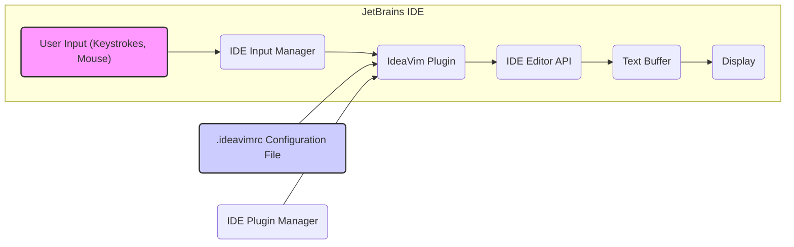
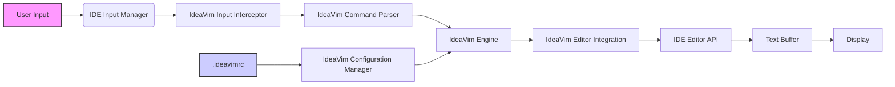

# Project Design Document: IdeaVim Plugin

**Version:** 1.1
**Date:** October 26, 2023
**Author:** AI Software Architect

## 1. Introduction

This document provides an enhanced and more detailed design overview of the IdeaVim plugin for JetBrains Integrated Development Environments (IDEs). IdeaVim emulates the Vim text editor within the JetBrains IDE environment, offering users a powerful and efficient modal editing experience. This document elaborates on the plugin's architecture, key components with greater specificity, data flow with more detail, and security considerations with concrete examples. It is intended to serve as a robust foundation for subsequent threat modeling activities.

## 2. Goals and Objectives

The primary goals of the IdeaVim plugin remain:

*   Provide a faithful and performant emulation of Vim's core editing features within JetBrains IDEs.
*   Offer a high degree of customizability through Vim's `.ideavimrc` configuration file.
*   Integrate seamlessly with the IDE's existing features and functionalities, respecting IDE conventions where appropriate.
*   Maintain compatibility with various JetBrains IDE versions, adapting to API changes as needed.
*   Ensure a stable and reliable user experience, minimizing performance impact on the IDE.

## 3. System Architecture

IdeaVim operates as a plugin within the host JetBrains IDE. It intercepts user input events at a low level and translates them into Vim commands, which then manipulate the IDE's text editor through its API.

### 3.1. High-Level Architecture Diagram

### 3.2. Component Description

*   **User Input (Keystrokes, Mouse):** Represents the user's physical interaction with the keyboard and mouse.
*   **IDE Input Manager:** The JetBrains IDE component responsible for capturing and routing raw input events.
*   **IdeaVim Plugin:** The core component responsible for Vim emulation. It comprises several key sub-components:
    *   **Input Interceptor:** Hooks into the IDE's input stream to capture relevant keyboard and mouse events intended for the editor.
    *   **Command Parser:** Analyzes the intercepted input sequences to identify complete Vim commands (e.g., `dw`, `:wq`). This includes handling different modes and key mappings.
    *   **Vim Engine:** The central logic unit that emulates Vim's behavior. This includes:
        *   **Mode Management:** Tracking and switching between Vim's modes (Normal, Insert, Visual, Command-line, etc.).
        *   **Motion Handling:** Implementing cursor movement commands (e.g., `h`, `j`, `k`, `l`, `w`, `b`).
        *   **Operator Execution:**  Handling operators like `d` (delete), `c` (change), `y` (yank) in combination with motions.
        *   **Command Execution:**  Processing colon commands (e.g., `:save`, `:q`, `:set`).
    *   **Editor Integration Layer:**  The bridge between the Vim Engine and the JetBrains IDE's text editing capabilities. This layer translates Vim commands into corresponding calls to the IDE's Editor API.
    *   **Configuration Manager:**  Responsible for loading, parsing, and applying settings from the `.ideavimrc` file. This includes handling Vimscript syntax within the configuration.
    *   **Plugin Interface (Optional):**  If implemented, this component handles the loading and execution of external Vim plugins, potentially using a compatibility layer.
*   **IDE Editor API:** The set of interfaces provided by the JetBrains IDE that allows plugins to interact with and manipulate the text editor component.
*   **Text Buffer:** The in-memory representation of the content of the currently open file being edited.
*   **Display:** The visual rendering of the text buffer within the IDE's editor window.
*   **.ideavimrc Configuration File:** A plain text file, typically located in the user's home directory, where users define custom IdeaVim settings and mappings using Vimscript.
*   **IDE Plugin Manager:** The IDE component responsible for managing the lifecycle of plugins, including installation, updates, enabling, and disabling.

## 4. Data Flow

The following describes the typical data flow during an editing session, providing more detail on the data exchanged:

1. **User Input:** The user presses a key or interacts with the mouse. This generates raw input events.
2. **IDE Event Capture:** The JetBrains IDE's Input Manager captures these raw input events.
3. **IdeaVim Interception:** The IdeaVim Plugin's Input Interceptor filters these events, identifying those relevant to text editing within an editor where IdeaVim is active.
4. **Command Parsing:** The Command Parser analyzes the sequence of intercepted key presses to form a complete Vim command. This involves state management based on the current Vim mode.
5. **Vim Engine Processing:** The Vim Engine receives the parsed command and performs the corresponding action. This might involve:
    *   **Mode Change Signals:** Updating the internal mode state.
    *   **Cursor Position Updates:** Calculating the new cursor position based on motions.
    *   **Text Manipulation Instructions:** Determining the changes to be made to the text buffer (insertions, deletions, replacements).
    *   **Command Execution Parameters:**  Extracting parameters from colon commands.
6. **Editor API Interaction:** The Editor Integration Layer translates the Vim Engine's instructions into specific calls to the IDE's Editor API. This involves passing data like:
    *   **Cursor position coordinates.**
    *   **Text to be inserted or replaced.**
    *   **Ranges of text to be deleted.**
    *   **Command parameters for IDE actions (e.g., saving a file).**
7. **Text Buffer Modification:** The IDE's Text Buffer is updated by the IDE's core based on the calls from the Editor API.
8. **Display Update:** The IDE's Display component is notified of the changes in the Text Buffer and re-renders the editor window.
9. **Configuration Loading:** During IDE startup and plugin initialization, the IdeaVim Configuration Manager reads the `.ideavimrc` file. This involves:
    *   **File Path Resolution:** Locating the `.ideavimrc` file.
    *   **File Reading:** Reading the contents of the file.
    *   **Vimscript Parsing:** Interpreting the Vimscript commands within the file.
    *   **Applying Settings:** Updating IdeaVim's internal configuration based on the parsed commands (e.g., key mappings, options).

### 4.1. Data Flow Diagram

## 5. Security Considerations

This section provides more specific examples and details regarding potential security considerations relevant to IdeaVim, which will be crucial for thorough threat modeling.

*   **Malicious `.ideavimrc` Configuration:** A maliciously crafted `.ideavimrc` file poses a significant risk due to the ability to execute arbitrary commands. Examples include:
    *   Using `:!` followed by a shell command to execute system-level operations (e.g., `:! rm -rf /`).
    *   Using `:source` to load and execute external Vimscript files from untrusted sources, potentially containing malicious code.
    *   Defining custom commands or mappings that trigger harmful actions.
*   **Vulnerabilities in the Vim Engine Emulation:**  Bugs or vulnerabilities in the IdeaVim plugin's implementation of the Vim engine could be exploited. For instance, a buffer overflow in the handling of a specific command or motion could lead to code execution.
*   **Interaction with IDE Features:**  The way IdeaVim interacts with the IDE's features can introduce vulnerabilities:
    *   If IdeaVim uses IDE APIs to access the file system based on user-provided paths (e.g., in `:e` command), insufficient validation could lead to path traversal vulnerabilities.
    *   If IdeaVim interacts with network-related IDE features (through plugin support or custom commands), vulnerabilities in that interaction could be exploited.
*   **Plugin Security (If Supported):** If IdeaVim supports Vim plugins, the security of those plugins becomes a major concern. Malicious plugins could:
    *   Access sensitive data within the IDE environment.
    *   Modify files outside the current project.
    *   Establish network connections to external servers.
    *   Interfere with the normal operation of the IDE.
*   **Information Disclosure:**  Error messages or logging within IdeaVim could inadvertently leak sensitive information, such as file paths or internal state details.
*   **Denial of Service:**  A carefully crafted `.ideavimrc` or a sequence of commands could potentially cause the IDE to become unresponsive or crash due to excessive resource consumption or infinite loops within the Vim engine emulation.
*   **Input Sanitization:** While primarily emulating Vim commands, if IdeaVim processes any input beyond standard Vim syntax (e.g., in custom command handlers), proper sanitization is crucial to prevent injection attacks.
*   **Permissions and Access Control:** The plugin operates within the security context of the IDE process. Understanding the IDE's permission model and ensuring IdeaVim adheres to the principle of least privilege is important.

## 6. Deployment

IdeaVim is deployed as a plugin within the JetBrains IDE ecosystem. The typical deployment process involves:

*   **Plugin Packaging:** The plugin is packaged as a `.jar` file containing the compiled code and necessary resources.
*   **JetBrains Marketplace:** The plugin is often distributed through the JetBrains Marketplace, where users can browse and install plugins.
*   **Installation via IDE:** Users install the plugin directly from within the IDE using the Plugin Manager. This involves downloading the plugin package from the marketplace or a local file.
*   **Plugin Loading:** Upon IDE startup, the IDE's Plugin Manager loads the installed plugins, including IdeaVim. This involves initializing the plugin's components and hooking into the IDE's event system.
*   **Updates:** The IDE's Plugin Manager handles updates to installed plugins, allowing users to easily upgrade to newer versions.

## 7. Future Considerations

*   **Sandboxing of Vimscript Execution:** Implementing a sandboxed environment for executing Vimscript from `.ideavimrc` could mitigate the risks associated with malicious configuration files.
*   **Secure Plugin API (If Supported):** If plugin support is enhanced, providing a secure API with well-defined permissions and restrictions for Vim plugins would be crucial.
*   **Integration with IDE Security Features:** Exploring integration with the IDE's existing security features, such as permission management or security scanning tools.
*   **Regular Security Audits and Penetration Testing:** Conducting regular security assessments to identify and address potential vulnerabilities in the plugin's code and design.
*   **Content Security Policy (CSP) for UI Elements:** If IdeaVim introduces any custom UI elements, applying CSP principles can help prevent cross-site scripting (XSS) attacks.
*   **Improved Input Validation:** Implementing stricter validation of input, especially when interacting with IDE APIs or external resources.

## 8. Conclusion

This enhanced design document provides a more detailed and nuanced understanding of the IdeaVim plugin's architecture, data flow, and security considerations. The added specificity in component descriptions, data flow details, and security examples will be invaluable for conducting a comprehensive threat model. This document serves as a critical foundation for identifying and mitigating potential security risks associated with the IdeaVim plugin.
