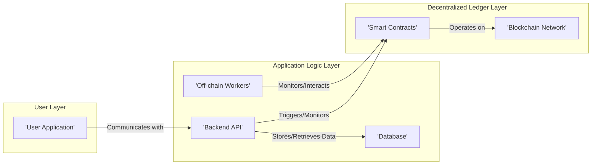
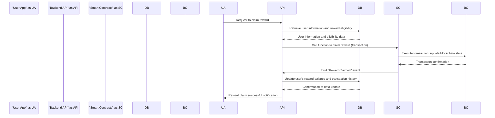

# Project Design Document: Koin - Decentralized Rewards System

**Version:** 1.1
**Date:** October 26, 2023
**Author:** Gemini (AI Language Model)

## 1. Introduction

This document provides an enhanced design overview of the Koin project, a decentralized rewards system leveraging blockchain technology. Its primary purpose is to offer a detailed and clear understanding of the system's architecture, individual components, and data flow. This document will serve as a crucial input for subsequent threat modeling activities. The design is informed by the information available in the public GitHub repository: [https://github.com/insertkoinio/koin](https://github.com/insertkoinio/koin). This revised version aims for improved clarity and detail compared to the initial draft.

## 2. Goals and Objectives

The overarching goals of the Koin project are:

*   Establish a transparent and auditable mechanism for reward distribution.
*   Utilize blockchain technology to ensure secure and tamper-proof tracking of rewards.
*   Facilitate a decentralized approach to reward management, minimizing dependence on central authorities.
*   Offer a flexible and extensible platform adaptable to diverse reward mechanisms and criteria.

## 3. High-Level Architecture

The Koin system is structured around several interconnected components that collectively manage the reward distribution process. The following diagram illustrates the high-level architecture and the relationships between these components:

**Key Components:**

*   **User Application:** The primary interface through which users interact with the Koin system. This could manifest as a web portal, a mobile application, or another client-side interface.
*   **Backend API:**  Serves as the central communication hub between the user interface and the decentralized ledger. It manages user requests, interacts with smart contracts, and handles off-chain data management.
*   **Database:** Responsible for storing off-chain data pertinent to the rewards system, such as user profiles, detailed reward configurations (which might be too complex or costly to store on-chain), and potentially cached blockchain data to optimize performance.
*   **Off-chain Workers:** Autonomous background processes designed to execute tasks unsuitable for direct on-chain execution due to cost or complexity. These include monitoring blockchain events, performing complex reward calculations based on various criteria, and interacting with external systems if necessary.
*   **Smart Contracts:** The foundational logic of the Koin system, deployed and executed on the blockchain. They codify the rules governing reward distribution, token mechanics, and other core on-chain functionalities.
*   **Blockchain Network:** The underlying distributed ledger technology providing the essential characteristics of immutability, transparency, and decentralization for the Koin system's operations.

## 4. Component Details

This section delves into a more granular description of each component, outlining their specific responsibilities and technologies.

### 4.1. User Application

*   **Purpose:** To provide users with a functional interface for engaging with the Koin rewards system.
*   **Key Functionalities:**
    *   Secure user authentication and authorization to protect user accounts and data.
    *   Displaying a comprehensive list of available rewards, along with their specific eligibility criteria.
    *   Enabling users to initiate the process of claiming earned rewards.
    *   Providing a transparent view of the user's transaction history within the Koin system.
    *   Allowing users to manage their personal profiles and preferences.
*   **Likely Technologies:**  A modern web framework (e.g., React, Vue.js, Angular) for web-based applications, or a cross-platform framework (e.g., React Native, Flutter) for mobile applications.
*   **Communication Interfaces:** Interacts with the Backend API via standard HTTP/HTTPS requests, typically utilizing RESTful API principles.

### 4.2. Backend API

*   **Purpose:** To act as the central orchestrator and intermediary, connecting the User Application with the Blockchain layer and managing off-chain data.
*   **Key Functionalities:**
    *   Receiving, validating, and processing requests originating from the User Application.
    *   Constructing and executing calls to functions within the Smart Contracts deployed on the blockchain.
    *   Retrieving and interpreting data directly from the Blockchain.
    *   Managing the storage and retrieval of off-chain data from the dedicated Database.
    *   Coordinating and triggering actions performed by the Off-chain Workers.
    *   Implementing robust user authentication and authorization mechanisms to secure access to the system's functionalities.
*   **Likely Technologies:** A robust server-side framework such as Node.js with Express, Python with Flask or Django, or similar technologies.
*   **Communication Interfaces:**
    *   Accepts incoming HTTP/HTTPS requests from the User Application.
    *   Communicates with the Smart Contracts using a blockchain Software Development Kit (SDK) like Web3.js or Ethers.js.
    *   Establishes connections with the Database using appropriate database drivers.
    *   Interacts with Off-chain Workers, potentially through message queues (e.g., RabbitMQ, Kafka) or direct function calls depending on the worker implementation.

### 4.3. Database

*   **Purpose:** To persistently store off-chain data essential for the operation of the Koin system.
*   **Key Functionalities:**
    *   Storing detailed user profiles, including preferences and relevant identifying information.
    *   Managing comprehensive reward configurations, encompassing rules, criteria, and associated metadata.
    *   Potentially caching frequently accessed blockchain data to improve query performance and reduce reliance on real-time blockchain reads.
    *   Maintaining logs and audit trails for system activities, aiding in monitoring and debugging.
*   **Likely Technologies:**  Could be a relational database (e.g., PostgreSQL, MySQL) for structured data, or a NoSQL database (e.g., MongoDB, Cassandra) for more flexible data models, depending on the specific data requirements.
*   **Communication Interfaces:** Accessed by the Backend API using standard database drivers compatible with the chosen database technology.

### 4.4. Off-chain Workers

*   **Purpose:** To execute background and asynchronous tasks that are not suitable for direct execution on the blockchain.
*   **Key Functionalities:**
    *   Continuously monitoring the Blockchain Network for specific events emitted by the Smart Contracts.
    *   Performing complex calculations related to reward distribution, potentially incorporating data from various sources.
    *   Triggering automated actions within the system based on predefined events or conditions.
    *   Interacting with external services or APIs when necessary to retrieve data or initiate actions.
*   **Likely Technologies:**  Implementation can vary widely depending on the task requirements, potentially including Python scripts, Node.js processes, or dedicated message queue consumers.
*   **Communication Interfaces:**
    *   Typically listen for events broadcast by the Smart Contracts, often relayed or facilitated by the Backend API.
    *   May communicate with the Backend API to update the Database or trigger further actions within the system.

### 4.5. Smart Contracts

*   **Purpose:** To immutably define and enforce the core business logic and rules of the Koin rewards system on the blockchain.
*   **Key Functionalities:**
    *   Defining the properties and behavior of the Koin token itself.
    *   Managing reward pools, including their funding and distribution parameters.
    *   Tracking individual user balances of Koin tokens and records of reward claims.
    *   Implementing governance mechanisms for the Koin system, if applicable.
    *   Emitting structured events to notify off-chain services about significant state changes or actions.
*   **Likely Technologies:** Primarily written in Solidity, the dominant smart contract language for Ethereum-compatible blockchains.
*   **Communication Interfaces:**
    *   Interacted with by the Backend API through the submission of blockchain transactions.
    *   Emit events that can be subscribed to and processed by off-chain services.

### 4.6. Blockchain Network

*   **Purpose:** To provide the underlying decentralized, secure, and transparent infrastructure for the Koin system.
*   **Key Functionalities:**
    *   Storing and cryptographically verifying all transactions within the Koin system.
    *   Maintaining the current state of the Smart Contracts and the Koin token.
    *   Providing a robust consensus mechanism to ensure the integrity and security of the network.
*   **Likely Technologies:** Could be a public blockchain like Ethereum, or a private/permissioned blockchain depending on the specific requirements for access and control.
*   **Communication Interfaces:** Interacted with through connection to blockchain nodes and the use of client libraries (e.g., Web3.js, Ethers.js).

## 5. Data Flow

The following sequence diagram illustrates the typical flow of data during a reward claim process, providing a visual representation of the interactions between components:

**Detailed Steps of the Reward Claim Data Flow:**

1. **User Initiation:** The user interacts with the User Application to initiate the process of claiming a reward.
2. **API Request:** The User Application sends a request to the Backend API, specifying the reward to be claimed.
3. **Eligibility Verification:** The Backend API queries the Database to retrieve the user's information and verify their eligibility for the requested reward based on predefined rules stored off-chain.
4. **Smart Contract Interaction:** If the user is deemed eligible, the Backend API constructs and sends a transaction to invoke the appropriate function within the Smart Contracts on the Blockchain. This transaction initiates the on-chain reward distribution process.
5. **Blockchain Processing:** The Blockchain Network receives the transaction, validates it, executes the relevant smart contract logic, and updates the global state of the ledger to reflect the reward distribution.
6. **Transaction Confirmation:** The Blockchain Network broadcasts a confirmation of the successful transaction execution back to the interacting parties, including the Smart Contracts.
7. **Event Emission:** The Smart Contracts emit a specific event (e.g., "RewardClaimed") signaling the successful completion of the reward claim on the blockchain.
8. **Off-chain Data Update:** The Backend API (or a dedicated Off-chain Worker monitoring blockchain events) detects the "RewardClaimed" event and proceeds to update the off-chain Database with the user's updated reward balance and a record of the transaction for historical purposes.
9. **Confirmation to User:** The Backend API sends a confirmation message back to the User Application, informing the user that their reward claim was successful.

## 6. Deployment Architecture

While precise deployment details are subject to the specific infrastructure choices, a typical deployment architecture for Koin would likely involve:

*   **Cloud-Based Infrastructure:** The Backend API, Database, and Off-chain Workers are commonly hosted on a cloud platform like AWS, Google Cloud, or Azure, leveraging their scalability and reliability.
*   **Containerization with Docker:** Docker is likely used to package the Backend API and Off-chain Workers into containers, ensuring consistent execution environments across different deployments.
*   **Container Orchestration with Kubernetes:** Kubernetes may be employed to manage and orchestrate the containerized components, providing features like automated scaling, self-healing, and simplified deployments.
*   **Blockchain Node Connectivity:** The Backend API requires a connection to a Blockchain node to interact with the Smart Contracts. This could involve running a self-hosted node or utilizing a third-party blockchain infrastructure provider.
*   **Robust Security Measures:** Implementing comprehensive security measures, including secure network configurations, strict access controls, and data encryption (both in transit and at rest), is crucial for protecting the deployed components and sensitive data.
*   **Environment Separation:** Utilizing separate environments for development, staging, and production to ensure code quality and minimize risks associated with deploying new changes.

## 7. Security Considerations (For Threat Modeling)

This section highlights key areas of potential security vulnerabilities that will be the focus of a detailed threat modeling exercise:

*   **Smart Contract Vulnerabilities:**  The potential for bugs or logical flaws within the Smart Contracts that could be exploited for unauthorized reward distribution, token manipulation, or denial-of-service attacks.
*   **Backend API Security Weaknesses:**  Common web application vulnerabilities present in the Backend API, such as SQL injection, cross-site scripting (XSS), insecure authentication and authorization mechanisms, and API abuse vulnerabilities.
*   **Database Security Breaches:** The risk of unauthorized access to or manipulation of the Database, potentially exposing sensitive user data and reward information.
*   **Compromise of Off-chain Workers:**  The potential for malicious actors to compromise Off-chain Workers and use them to manipulate reward logic, inject false data, or perform other harmful actions.
*   **Authentication and Authorization Flaws:**  Weak or improperly implemented authentication and authorization mechanisms that could allow unauthorized users to gain access to sensitive functionalities or data.
*   **Transaction Security Risks:**  Ensuring the integrity and authenticity of transactions interacting with the Blockchain, preventing tampering or replay attacks.
*   **Insecure Key Management:**  The critical need for secure storage and management of private keys used for interacting with the Blockchain, preventing unauthorized access and control.
*   **Dependency Vulnerabilities:**  The risk posed by vulnerabilities present in third-party libraries and dependencies used by the various components of the system.
*   **Denial of Service (DoS) Attack Vectors:**  Potential vulnerabilities that could be exploited to launch denial-of-service attacks, disrupting the availability and functionality of the Koin system.

## 8. Assumptions and Constraints

*   The core reward logic and token management are implemented and enforced through a blockchain network.
*   Smart contracts are developed using a language compatible with the chosen blockchain, likely Solidity.
*   A Backend API serves as the primary interface between the user-facing application and the blockchain infrastructure.
*   Off-chain storage solutions are utilized for managing non-sensitive and frequently accessed data to optimize performance and cost.
*   Users interact with the Koin system through a dedicated application interface.

## 9. Future Considerations

*   **Decentralized Governance Implementation:** Exploring and implementing mechanisms for decentralized governance of the Koin system, allowing community participation in decision-making.
*   **Scalability Enhancements and Optimizations:**  Focusing on improving the system's ability to handle a growing number of users and transactions efficiently.
*   **Cross-Chain Interoperability:** Investigating opportunities to integrate with other blockchain platforms or systems, expanding the reach and utility of the Koin system.
*   **Development of Advanced Reward Mechanisms:**  Exploring and implementing more sophisticated and dynamic reward rules and models to enhance engagement and incentivize desired behaviors.

This revised design document offers a more detailed and refined understanding of the Koin project's architecture and components. It provides a strong foundation for conducting a comprehensive threat modeling exercise aimed at identifying and mitigating potential security vulnerabilities.