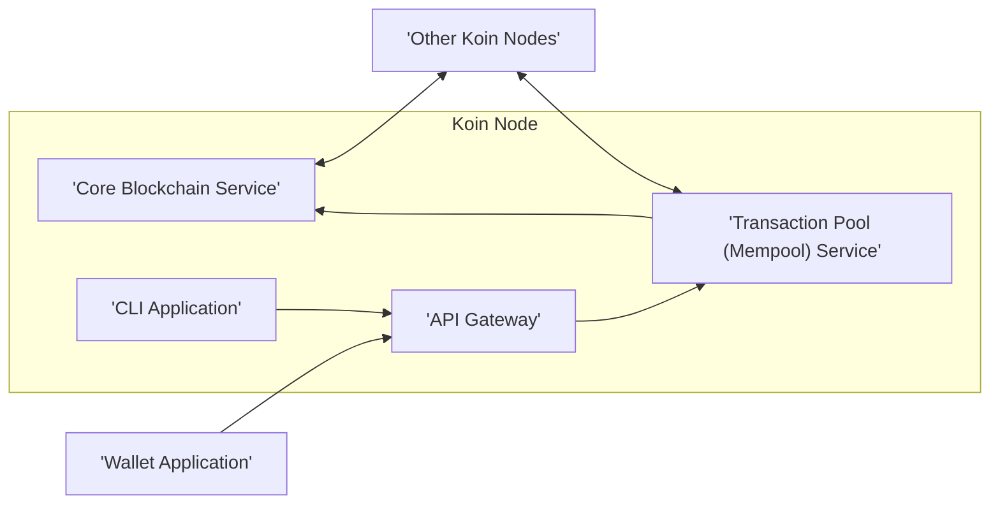
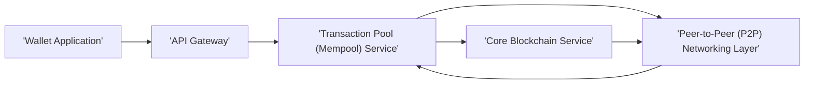
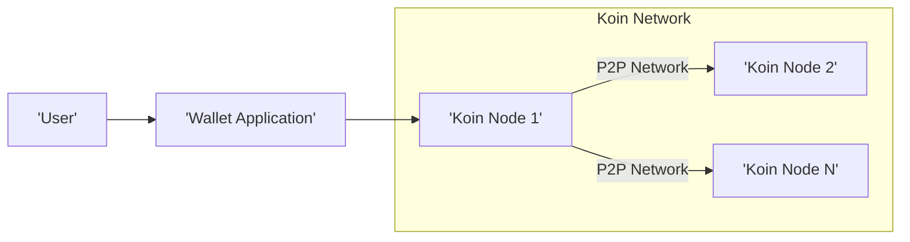

# Project Design Document: Koin - Decentralized Cryptocurrency

**Version:** 1.1
**Date:** October 26, 2023
**Author:** Gemini AI (as per prompt request)

## 1. Introduction

This document provides an enhanced design overview of Koin, a decentralized cryptocurrency project as found in the [insertkoinio/koin](https://github.com/insertkoinio/koin) repository. This revised document aims to offer a more detailed and structured understanding of the system's architecture, components, and data flow, specifically tailored for subsequent threat modeling activities. It builds upon the previous version by providing more granular descriptions and clarifying component interactions.

## 2. Goals and Scope

The primary goal of this document is to present a clear, detailed, and improved description of the Koin project's design. This includes:

*   Clearly identifying the core components of the system and their responsibilities.
*   Elaborating on the interactions and communication pathways between these components.
*   Providing a more granular outline of the data flow within the system for key operations.
*   Identifying the likely technologies and frameworks used, with more specific examples where possible.
*   Offering a more detailed high-level overview of the deployment architecture and its implications.

The scope of this document remains focused on the software architecture relevant for threat modeling. While it touches upon aspects like consensus, it does not delve into the intricate details of cryptographic algorithms or the economic model unless they directly influence the system's structure, component interactions, and data flow.

## 3. System Architecture

The Koin system comprises the following key components, each with distinct responsibilities:

*   **Core Blockchain Service:** The foundational component responsible for maintaining the integrity and immutability of the distributed ledger.
*   **Transaction Pool (Mempool) Service:** A temporary holding area for validated but unconfirmed transactions awaiting inclusion in a block.
*   **Wallet Application:**  Software enabling users to securely manage their Koin keys and interact with the blockchain to send and receive Koin.
*   **API Gateway:**  Provides a controlled and managed programmatic access point to the Koin network's functionalities.
*   **Command Line Interface (CLI) Application:**  A text-based interface for administrators and advanced users to interact directly with a Koin node.
*   **Peer-to-Peer (P2P) Networking Layer:**  The underlying communication infrastructure enabling Koin nodes to discover, connect, and synchronize with each other.

## 4. Component Details

This section provides a more detailed description of each component, focusing on their specific roles and interactions.

### 4.1. Core Blockchain Service

*   **Purpose:**  To maintain the authoritative, immutable, and distributed ledger of all Koin transactions and the overall state of the Koin network.
*   **Functionality:**
    *   Persistent storage of validated blocks containing sets of transactions.
    *   Verification of the cryptographic integrity and validity of newly proposed blocks.
    *   Enforcement of the consensus mechanism rules to ensure agreement on the blockchain's state across the network.
    *   Providing read access to historical transaction data and current account balances.
*   **Data Handling:** Stores serialized block data (including transaction details, timestamps, and metadata), potentially using a database optimized for append-only operations.
*   **Dependencies:** Relies on the P2P Networking Layer for receiving and propagating blocks, and the consensus mechanism implementation for block validation.

### 4.2. Transaction Pool (Mempool) Service

*   **Purpose:** To act as a temporary repository for valid transactions that have been submitted to the network but not yet included in a confirmed block.
*   **Functionality:**
    *   Receiving newly broadcast transactions from Wallet Applications and other Koin nodes.
    *   Performing initial validation checks on transactions (e.g., signature verification, basic script execution, double-spending checks against the current blockchain state).
    *   Prioritizing transactions for inclusion in the next block based on factors like transaction fees or arrival time.
    *   Broadcasting newly received and validated transactions to other connected Koin nodes.
*   **Data Handling:** Stores pending transaction data in memory for efficient access and processing, potentially with persistence mechanisms for recovery after restarts.
*   **Dependencies:** Interacts with the API Gateway (for receiving transactions), the Core Blockchain Service (for state validation), and the P2P Networking Layer (for broadcasting and receiving transactions).

### 4.3. Wallet Application

*   **Purpose:** To provide a secure and user-friendly interface for users to manage their Koin identities (private and public keys) and interact with the Koin network.
*   **Functionality:**
    *   Generation and secure storage of cryptographic key pairs (private and public keys).
    *   Construction of new Koin transactions (specifying sender, recipient, amount, and optional data).
    *   Digitally signing transactions using the user's private key to authorize the transfer of Koin.
    *   Broadcasting signed transactions to the Koin network via the API Gateway.
    *   Displaying transaction history, account balances, and other relevant blockchain information retrieved through the API Gateway.
*   **Data Handling:** Securely stores private keys (potentially using encryption or hardware security modules), public keys, and potentially a local cache of transaction history.
*   **Dependencies:** Primarily interacts with the API Gateway to submit transactions and query blockchain data.

### 4.4. API Gateway

*   **Purpose:** To serve as a secure and controlled entry point for external interactions with the Koin node, abstracting away internal complexities and providing rate limiting and authentication.
*   **Functionality:**
    *   Receiving and validating transaction submissions from Wallet Applications.
    *   Providing endpoints for querying blockchain data (e.g., block details, transaction information, account balances).
    *   Exposing network information (e.g., peer list, node status).
    *   Potentially implementing authentication and authorization mechanisms to control access to certain functionalities.
    *   Forwarding requests to the appropriate internal services (Transaction Pool Service, Core Blockchain Service).
*   **Data Handling:** Receives transaction data from wallets, processes queries, and returns blockchain data retrieved from internal services.
*   **Dependencies:** Interacts with the Transaction Pool Service for submitting new transactions and the Core Blockchain Service for querying blockchain data.

### 4.5. Command Line Interface (CLI) Application

*   **Purpose:** To offer a text-based interface for administrators and advanced users to directly interact with and manage a Koin node.
*   **Functionality:**
    *   Submitting transactions to the network.
    *   Querying detailed blockchain information and node status.
    *   Managing node configuration parameters.
    *   Potentially performing administrative tasks like peering management or network diagnostics.
*   **Data Handling:** Similar to the API Gateway, it interacts with the underlying services to execute commands and retrieve data.
*   **Dependencies:**  Utilizes the API Gateway or potentially interacts directly with internal services for core functionalities.

### 4.6. Peer-to-Peer (P2P) Networking Layer

*   **Purpose:** To facilitate communication and data synchronization between all participating Koin nodes in a decentralized manner.
*   **Functionality:**
    *   Node discovery mechanisms to find and connect to other peers in the network.
    *   Establishing and maintaining connections with other Koin nodes.
    *   Broadcasting new transactions received by a node to its peers.
    *   Propagating newly created and validated blocks across the network.
    *   Mechanisms for synchronizing the blockchain with peers to ensure all nodes have the latest state.
*   **Data Handling:** Transmits raw transaction data, block data, and peer discovery information.
*   **Dependencies:** Relies on underlying network protocols (e.g., TCP/IP, UDP) and potentially a specific P2P networking library or framework.

## 5. Data Flow

This section details the typical data flow for a transaction lifecycle within the Koin network, providing a more granular view of the interactions between components.

1. **Transaction Creation and Signing:** A user initiates a transaction using their **Wallet Application**. The **Wallet Application** constructs the transaction and signs it cryptographically using the user's private key.
2. **Transaction Submission to API:** The **Wallet Application** submits the signed transaction to a Koin node's **API Gateway**.
3. **API Gateway Reception and Validation:** The **API Gateway** receives the transaction and performs initial validation checks (e.g., signature format, basic data integrity).
4. **Forwarding to Mempool:** The **API Gateway** forwards the validated transaction to the **Transaction Pool (Mempool) Service**.
5. **Mempool Validation:** The **Transaction Pool (Mempool) Service** performs more comprehensive validation, including verifying the transaction signature against the sender's public key and checking for sufficient funds by querying the **Core Blockchain Service** for the sender's current balance.
6. **Transaction Broadcasting:** If the transaction is valid, the **Transaction Pool (Mempool) Service** broadcasts it to other connected Koin nodes via the **Peer-to-Peer (P2P) Networking Layer**.
7. **Block Proposal and Creation:** A Koin node (acting as a miner or block proposer, depending on the consensus mechanism) selects a set of valid, pending transactions from its **Transaction Pool (Mempool) Service**. It then constructs a new block containing these transactions, along with necessary metadata.
8. **Block Validation by Peers:** The newly proposed block is broadcast to other nodes via the **Peer-to-Peer (P2P) Networking Layer**. These nodes validate the block according to the consensus rules, including verifying transaction validity and the block's cryptographic integrity.
9. **Block Addition to Blockchain:** Upon successful validation by a sufficient number of nodes (as defined by the consensus mechanism), the new block is appended to the **Core Blockchain Service** of all participating nodes.
10. **Transaction Confirmation:** Once the block containing the transaction is added to the **Core Blockchain Service**, the transaction is considered confirmed and becomes a permanent part of the distributed ledger.

## 6. Technology Stack

Based on a review of typical blockchain implementations and common practices, the following technologies are likely to be employed in the Koin project:

*   **Core Programming Language:**  Likely Go (Golang), given its performance characteristics and suitability for building concurrent and networked applications.
*   **P2P Networking Library:**  Potentially `libp2p` or custom-built networking logic using Go's standard library.
*   **Cryptography Library:**  Standard Go cryptography packages (`crypto`) or specialized libraries like `go-ethereum/crypto` for elliptic curve cryptography, hashing algorithms (e.g., SHA-256), and digital signatures.
*   **Data Storage for Blockchain:**  Likely a key-value store database like LevelDB or RocksDB, optimized for fast reads and writes of immutable data.
*   **API Framework:**  Potentially a Go web framework such as Gin, Echo, or net/http for building the API Gateway.
*   **CLI Framework:**  Standard Go libraries like `flag` or more advanced libraries like `spf13/cobra` for building the Command Line Interface.
*   **Consensus Mechanism Implementation:**  The specific libraries and algorithms used will depend on the chosen consensus mechanism (e.g., Proof-of-Work, Proof-of-Stake).

**Note:** This list is based on common practices and inferences. A definitive technology stack can only be determined by a thorough examination of the project's codebase and dependencies.

## 7. Deployment Architecture

The Koin network is designed for decentralized operation, with multiple independent nodes participating in the network. A typical deployment architecture involves:

*   **Distributed Koin Nodes:** Numerous instances of the Koin node software deployed across various geographical locations and operated by different entities.
*   **Independent Node Operation:** Each Koin node operates autonomously, maintaining its own copy of the blockchain and participating in the consensus process.
*   **Wallet Application Distribution:** Wallet Applications are typically separate software that users install on their devices (desktop, mobile) or access through web browsers.
*   **Potential Deployment Environments:** Koin nodes can be deployed on various infrastructure, including:
    *   Physical servers in data centers.
    *   Virtual machines in cloud environments (e.g., AWS, Azure, GCP).
    *   Containerized environments using Docker and orchestration platforms like Kubernetes.
*   **Network Connectivity:**  Nodes require stable internet connectivity to participate in the P2P network and communicate with other peers.

## 8. Security Considerations (Preliminary)

This section highlights key security considerations relevant to the Koin project, which will be the focus of subsequent threat modeling activities.

*   **Private Key Management:** Secure generation, storage, and handling of user private keys are critical to prevent unauthorized access to funds.
*   **Transaction Security:** Ensuring the integrity and authenticity of transactions through robust digital signature schemes and validation processes.
*   **P2P Network Security:** Protecting the peer-to-peer network from various attacks, including:
    *   **Sybil Attacks:** Where a single attacker controls a large number of identities.
    *   **Eclipse Attacks:** Isolating a node from the rest of the network.
    *   **Denial-of-Service (DoS) Attacks:** Overwhelming the network with malicious traffic.
*   **Consensus Mechanism Security:** The robustness of the consensus mechanism against attacks like 51% attacks (for Proof-of-Work) or stake grinding (for Proof-of-Stake).
*   **API Gateway Security:** Securing the API Gateway against unauthorized access, injection attacks, and other common web vulnerabilities through authentication, authorization, and input validation.
*   **Code Security:**  Ensuring the codebase is free from vulnerabilities such as buffer overflows, injection flaws, and cryptographic weaknesses through secure coding practices and regular security audits.
*   **Dependency Security:**  Managing and securing external dependencies to prevent supply chain attacks by verifying the integrity and authenticity of libraries and frameworks.

## 9. Future Considerations

Potential future enhancements and modifications to the Koin system could include:

*   **Smart Contract Functionality:** Implementing a virtual machine or scripting language to enable the execution of decentralized applications (dApps) on the Koin blockchain.
*   **Scalability Solutions:** Integrating techniques like sharding or layer-2 solutions to increase the transaction throughput and overall scalability of the network.
*   **Privacy Enhancements:** Incorporating privacy-preserving technologies such as zero-knowledge proofs or confidential transactions to enhance user privacy.
*   **Cross-Chain Interoperability:** Developing mechanisms to enable communication and asset transfers between the Koin blockchain and other blockchain networks.
*   **Governance Mechanisms:** Implementing on-chain or off-chain governance models to facilitate community-driven decision-making and upgrades to the Koin protocol.

This enhanced design document provides a more comprehensive and detailed understanding of the Koin project's architecture and components. It serves as a more robust foundation for conducting a thorough threat model to identify potential security vulnerabilities and design appropriate mitigation strategies.