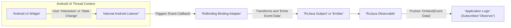

# Project Design Document: RxBinding

**Version:** 1.1
**Date:** October 26, 2023
**Author:** Gemini (AI Language Model)

## 1. Introduction

This document provides an enhanced and more detailed design overview of the RxBinding library, available at [https://github.com/jakewharton/rxbinding](https://github.com/jakewharton/rxbinding). This revised document is specifically tailored to serve as a robust foundation for subsequent threat modeling activities. It outlines the library's purpose, architecture, key components, and data flow with greater clarity and depth.

## 2. Project Overview

RxBinding is a collection of Android library artifacts that offer RxJava Bindings for Android UI widgets. It effectively wraps various Android UI events and properties into reactive `Observable` streams provided by RxJava. This enables developers to handle user interactions and UI state changes in a reactive programming paradigm, simplifying asynchronous operations and event management within Android applications.

## 3. Goals of this Document

*   Provide a clear and comprehensive architectural overview of the RxBinding library, emphasizing aspects relevant to security.
*   Precisely identify key components, their functionalities, and their interactions within the library.
*   Thoroughly describe the data flow within the library, highlighting potential points of interest for security analysis.
*   Explicitly highlight potential areas of interest and concerns for security threat modeling, offering concrete examples.
*   Serve as a definitive and easily understandable reference point for security assessments, discussions, and threat mitigation strategies.

## 4. Target Audience

*   Security engineers responsible for performing threat modeling on applications using RxBinding.
*   Software developers actively working with or integrating the RxBinding library into their Android projects.
*   Software architects reviewing the design, architecture, and security implications of incorporating RxBinding.

## 5. Architectural Overview

RxBinding's architecture is fundamentally based on providing extension functions (primarily in Kotlin) and static factory methods (in Java versions) that instantiate RxJava `Observable` instances for a wide range of Android UI components and their associated events. It directly leverages the Android SDK and the RxJava library.

```mermaid
graph LR
    subgraph "Android Application Context"
        A["'Android UI Widget' (e.g., 'Button', 'EditText')"]
    end
    B["'RxBinding Library'"]
    C["'RxJava Observable'"]

    A -- "Triggers 'UI Event' (e.g., 'Click', 'Text Change')" --> B
    B -- "Internally 'Creates Observable'" --> C
    C -- "Asynchronously 'Emits Event Data'" --> "Application 'Logic' (Consuming 'RxJava Streams')"
```

**Key Architectural Aspects:**

*   **Decoupled Event Handling:** RxBinding promotes a decoupled approach to UI event handling, moving away from traditional Android listeners and enabling a more reactive and composable programming style.
*   **Abstraction of Complexity:** It effectively abstracts away the underlying complexities of managing Android listeners, their lifecycles, and thread synchronization.
*   **Extension Functions and Static Factories:** The library primarily utilizes Kotlin extension functions (or static factory methods in Java) to seamlessly add binding capabilities directly to Android UI components. This makes the integration feel natural within the Android development ecosystem.
*   **Core Reliance on RxJava:**  RxJava's `Observable` is the central abstraction for representing asynchronous event streams, providing powerful operators for transforming, filtering, and composing events.

## 6. Detailed Component Description

RxBinding is modularly organized, with each module targeting specific Android UI components or categories of event types. This granular structure allows developers to include only the necessary bindings, reducing the application's size and potential attack surface.

*   **`rxbinding-core`:**
    *   Contains essential core utilities, base classes, and interfaces that are shared and utilized by other RxBinding modules.
    *   Provides the fundamental mechanisms for creating, managing, and subscribing to `Observable` streams derived from Android event sources.
*   **`rxbinding-appcompat`:**
    *   Offers bindings specifically for components within the `androidx.appcompat.widget` package (e.g., `'Toolbar'`, `'SearchView'`).
    *   Provides `Observable` streams for various events such as clicks, text changes, query submissions, and item selections within these `AppCompat` widgets.
*   **`rxbinding-drawerlayout`:**
    *   Provides bindings tailored for the `'androidx.drawerlayout.widget.DrawerLayout'` component.
    *   Offers `Observable` streams representing events like the drawer opening, closing, and changes in the drawer slide offset.
*   **`rxbinding-material`:**
    *   Offers bindings for components adhering to the Material Design specification (e.g., `'FloatingActionButton'`, `'Snackbar'`, `'BottomNavigationView'`).
    *   Provides `Observable` streams for events such as clicks, dismissals, item selections, and changes in visibility or state.
*   **`rxbinding-recyclerview`:**
    *   Provides specialized bindings for the `'androidx.recyclerview.widget.RecyclerView'`.
    *   Offers `Observable` streams for scroll events, item click events, and notifications about changes in the underlying data set.
*   **`rxbinding-slidingpanelayout`:**
    *   Provides bindings for the `'androidx.slidingpanelayout.widget.SlidingPaneLayout'`.
    *   Offers `Observable` streams for events related to the sliding panel, such as slide events and changes in the panel's open/closed state.
*   **`rxbinding-swiperefreshlayout`:**
    *   Provides a binding for the `'androidx.swiperefreshlayout.widget.SwipeRefreshLayout'`.
    *   Offers an `Observable` stream that emits an event when the user triggers a refresh action via a swipe gesture.
*   **`rxbinding-viewpager`:**
    *   Provides bindings for `'androidx.viewpager.widget.ViewPager'` and the newer `'androidx.viewpager2.widget.ViewPager2'`.
    *   Offers `Observable` streams for page selection events, page scroll state changes, and page settlement events.
*   **`rxbinding-widget`:**
    *   Provides a comprehensive set of bindings for standard Android `'android.widget'` components (e.g., `'Button'`, `'EditText'`, `'TextView'`, `'CompoundButton'`, `'AdapterView'`).
    *   Offers a wide array of `Observable` streams for common events like clicks, text input changes, focus changes, checked state alterations, item selections in lists and spinners, and more.

**Common Implementation Patterns:**

*   **Specific Event Data Classes:**  Many modules define dedicated event data classes (e.g., `'TextViewTextChangeEvent'`, `'AdapterViewItemClickEvent'`) to encapsulate relevant information associated with a particular UI event.
*   **Descriptive Observable Factory Methods:** Extension functions or static factory methods are typically named intuitively to clearly indicate the target UI component and the specific event being observed (e.g., `clicks()`, `textChanges()`, `itemSelections()`).
*   **Internal Listener Management:** RxBinding internally handles the complexities of attaching and detaching Android listeners, ensuring proper resource management and preventing potential memory leaks. This is crucial for the stability and performance of Android applications.

## 7. Data Flow

The typical data flow within RxBinding can be visualized as follows:



**Step-by-Step Breakdown:**

1. **User Interaction or State Change:** A user interacts with an Android UI widget (e.g., presses a button, enters text into an input field), or the widget's state is programmatically modified.
2. **Internal Android Listener Invoked:** The corresponding Android listener (e.g., `OnClickListener`, `TextWatcher`), which RxBinding has internally set up, is triggered by the Android framework.
3. **RxBinding Binding Adapter Processes Event:** RxBinding's internal binding adapter (often implemented as a custom listener or a wrapper around an existing one) receives the event callback from the Android listener.
4. **Event Data Extraction and Emission:** The binding adapter extracts the relevant data from the received event (e.g., the text entered, the coordinates of a touch event) and emits this data through an RxJava `Subject` (like `PublishSubject`) or an `Emitter`.
5. **Observable Stream Creation:** The `Subject` or `Emitter` acts as the source of the `Observable` that was initially obtained and is being observed by the application developer's code.
6. **Event Propagation via Observable:** The `Observable` emits the extracted event data to any observers that have subscribed to it within the application's logic.
7. **Application Logic Reacts to Event:** The application logic, having subscribed to the `Observable`, receives the emitted event data and executes the necessary business logic or UI updates in response.

**Illustrative Examples:**

*   **Button Click Event:**
    1. A user physically clicks on a `'Button'` on the screen.
    2. The `'OnClickListener'` that RxBinding has internally configured for this button is triggered by the Android system.
    3. RxBinding's internal logic, within its binding adapter, emits a `Unit` value (or a more specific click event object if available) through a `PublishSubject`.
    4. The `Observable<Unit>` returned by the `button.clicks()` extension function emits this `Unit` value.
    5. The application's observer, which has subscribed to `button.clicks()`, receives the `Unit` value and proceeds to execute its defined actions.

*   **EditText Text Change Event:**
    1. A user begins typing text into an `'EditText'` field.
    2. The `'TextWatcher'` that RxBinding has set up for this `'EditText'` is triggered with each character input.
    3. RxBinding's internal logic extracts the current text from the `'EditText'` and emits it through a `PublishSubject`.
    4. The `Observable<CharSequence>` returned by the `editText.textChanges()` extension function emits the current text as a `CharSequence`.
    5. The application's observer, subscribed to `editText.textChanges()`, receives the updated text and can react accordingly (e.g., performing validation or updating other UI elements).

## 8. Security Considerations for Threat Modeling

While RxBinding primarily focuses on facilitating UI event handling and doesn't directly manage sensitive data or authentication mechanisms, several security considerations are relevant when performing threat modeling on applications that utilize this library:

*   **Potential for Denial of Service (DoS):**  Malicious or unintentionally excessive and rapid emission of UI events could potentially overwhelm the application's UI thread. This could lead to the application becoming unresponsive or crashing. For instance, programmatically and rapidly triggering events on a bound `'EditText'` or `'Button'` in a loop could exhaust resources.
*   **Indirect UI Redress/Clickjacking Vulnerabilities:** If the application's logic incorrectly handles or insufficiently validates events emitted by RxBinding, it could become susceptible to UI redress or clickjacking attacks. For example, if a button click event, facilitated by RxBinding, triggers a sensitive action without proper confirmation or validation, an attacker might trick a user into performing unintended actions. It's crucial to understand that RxBinding itself doesn't introduce this vulnerability, but it provides the mechanism for the interaction that could be exploited if not handled securely by the application.
*   **Indirect Information Disclosure Risks:** The timing, frequency, or specific nature of UI events emitted by RxBinding could inadvertently leak sensitive information if the application logic processes or reacts to these events in a way that reveals confidential details. For example, the precise timing of certain UI interactions, captured via RxBinding, might be observable and could reveal patterns or user behavior that should remain private.
*   **Indirect Data Injection Concerns:** Although RxBinding doesn't directly inject data into the application, if the application logic uses the event data emitted by RxBinding to update UI elements or internal state without proper sanitization or validation, it could be vulnerable to data injection attacks. For instance, text input received via `editText.textChanges()` should be carefully validated before being used in sensitive operations.
*   **Backpressure Handling and Resource Exhaustion:** If the application logic consuming the `Observable` streams doesn't properly handle backpressure (i.e., the rate at which events are emitted exceeds the rate at which they can be processed), it could lead to resource exhaustion and potential crashes. While RxBinding facilitates the emission of events, the responsibility for managing the flow of these events lies with the consuming application.
*   **Error Handling and Exception Propagation:** Understanding how RxBinding handles errors originating from the underlying Android listeners or during its internal event processing is crucial. If errors are not properly handled or propagated, it could lead to unexpected application behavior or security vulnerabilities.
*   **Dependency Vulnerabilities:** As with any external library, potential security vulnerabilities within RxBinding's dependencies (primarily RxJava and the Android SDK) could introduce risks to the application. Regularly updating these dependencies is essential.

**Specific Areas for Focused Threat Modeling:**

*   A detailed examination of the implementation of RxBinding's internal listeners and how they extract and process event data from the underlying Android framework.
*   Analysis of the types of data emitted by each specific binding and whether any sensitive information could be unintentionally included in these event streams.
*   Assessment of the potential for race conditions or unexpected behavior if multiple UI events are emitted in rapid succession and how RxBinding and the consuming application handle such scenarios.
*   Scrutiny of the error handling mechanisms within RxBinding and how errors are propagated (or not propagated) to the application's `Observable` streams.

## 9. Assumptions

*   The application utilizing RxBinding is assumed to be running on a standard, non-rooted Android device with a reasonably secure operating environment.
*   The underlying Android framework and the RxJava library are assumed to be functioning correctly and without inherent security vulnerabilities (to the best of current knowledge).
*   The developers of the application integrating RxBinding are ultimately responsible for the secure handling and validation of data received from RxBinding's `Observable` streams and for implementing appropriate security measures within their application logic.

## 10. Out of Scope

This design document specifically focuses on the internal design and architecture of the RxBinding library itself. The following aspects are explicitly considered outside the scope of this document:

*   The inherent security design and implementation of the Android operating system and its various components.
*   The internal design, architecture, and security considerations of the RxJava library.
*   The specific implementation details and potential vulnerabilities within the individual Android UI widgets that RxBinding provides bindings for.
*   The application-specific business logic that consumes the events emitted by RxBinding's `Observable` streams. This includes how the application processes, validates, and acts upon these events.
*   Security considerations related to network communication, data storage, or server-side interactions of the application.

## 11. Conclusion

This enhanced design document provides a more comprehensive and detailed architectural overview of the RxBinding library, with a specific focus on aspects relevant to security threat modeling. By clearly outlining the library's components, data flow, and potential areas of concern, this document aims to equip security engineers and developers with the necessary information to effectively identify, assess, and mitigate potential security risks associated with the use of RxBinding in Android applications. This document serves as a valuable and informative resource for conducting thorough security assessments and fostering informed discussions about the security implications of integrating RxBinding into Android projects.