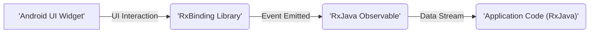
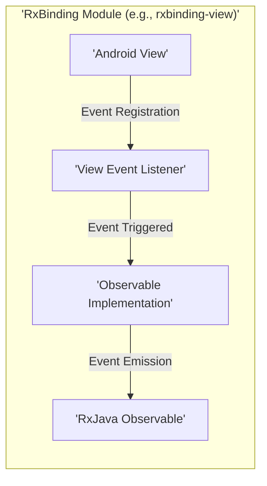
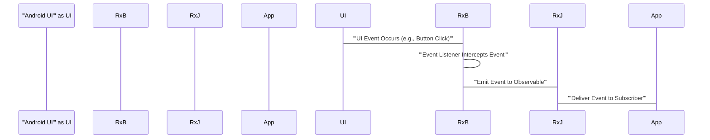

# Project Design Document: RxBinding

**Version:** 1.1
**Date:** October 26, 2023
**Author:** AI Software Architect

## 1. Introduction

This document provides an enhanced design overview of the RxBinding library, a collection of RxJava bindings for Android UI widgets. This detailed description of the library's architecture, components, and data flow is specifically intended to facilitate comprehensive threat modeling and security analysis. This version builds upon the initial design by providing more granular detail and emphasizing security implications.

## 2. Goals and Non-Goals

* **Goals:**
    * To offer a streamlined and reactive programming paradigm for interacting with Android UI elements.
    * To furnish a curated set of pre-built bindings covering frequently used UI events and properties.
    * To simplify the observation of UI events and the subsequent reactive handling using RxJava's capabilities.
    * To maintain a lightweight footprint and ensure optimal performance.
    * To provide developers with clear, intuitive, and well-documented APIs.

* **Non-Goals:**
    * To supplant the standard Android UI event handling mechanisms entirely. RxBinding operates as an abstraction layer.
    * To offer bindings for every conceivable Android UI widget or event. The focus is on common and useful scenarios.
    * To implement custom UI components or introduce new UI paradigms.
    * To manage complex application-level UI state beyond the scope of individual event observation.

## 3. High-Level Architecture

RxBinding serves as an intermediary, translating interactions within the Android UI framework into observable streams consumable by RxJava. This allows developers to react to UI events in a declarative and composable manner.



* **'Android UI Widget':** Represents any interactive element within an Android application's user interface, such as a `'Button'`, `'TextView'`, or `'EditText'`. User interactions with these widgets trigger events.
* **'RxBinding Library':**  Encapsulates the core logic responsible for intercepting specific UI events on designated widgets and transforming these events into corresponding RxJava Observables.
* **'RxJava Observable':** A reactive stream of events emitted by the RxBinding library. Each emitted item represents a specific UI interaction that occurred on the observed widget.
* **'Application Code (RxJava)':** The portion of the application logic that subscribes to the RxBinding Observables. This code defines how the application reacts to the observed UI events.

## 4. Component Architecture

The RxBinding library is modular, with each module focusing on providing bindings for specific categories of Android UI components or event types. This modularity enhances maintainability and allows developers to include only the necessary bindings.

* **'rxbinding-core' Module:**
    * Contains fundamental classes and interfaces shared across all other RxBinding modules.
    * Provides abstract base classes that facilitate the creation of custom bindings for less common UI scenarios.
    * Manages the lifecycle of subscriptions to prevent memory leaks and ensure proper resource disposal.

* **'rxbinding-view' Module:**
    * Offers bindings for general `'View'` events applicable to most UI elements.
    * Includes Observables for events like `'clicks'` (`'ViewClickObservable'`), `'long clicks'` (`'ViewLongClickObservable'`), `'focus changes'` (`'ViewFocusChangeObservable'`), `'hover events'` (`'ViewHoverObservable'`), and `'layout changes'` (`'ViewLayoutChangeObservable'`).

* **'rxbinding-widget' Module:**
    * Provides specialized bindings for widgets within the `'android.widget'` package.
    * Includes bindings for `'TextView'` (e.g., `'text changes'` via `'TextViewTextChangeObservable'`), `'EditText'` (similar to `'TextView'`), `'CompoundButton'` (e.g., `'checked changes'` via `'CompoundButtonCheckedObservable'`), `'AdapterView'` (e.g., `'item clicks'` via `'AdapterViewItemClickObservable'`), `'SeekBar'` (`'changes'` and `'user changes'`), `'RatingBar'` (`'rating changes'`), `'PopupMenu'` (`'item clicks'`), `'NumberPicker'` (`'value changes'`), `'DatePicker'` (`'date changes'`), and `'TimePicker'` (`'time changes'`).

* **'rxbinding-appcompat' Module:**
    * Offers bindings for components introduced by the Android AppCompat library, ensuring backward compatibility.
    * Includes bindings for `'Toolbar'` (`'navigation clicks'` via `'ToolbarNavigationClickObservable'`), `'SearchView'` (`'query text changes'` and `'submission events'`), and `'MenuItem'` (`'clicks'`).

* **'rxbinding-drawerlayout' Module:**
    * Provides bindings specifically for `'DrawerLayout'` events, managing the state of navigation drawers.
    * Includes Observables for `'drawer opened'` and `'drawer closed'` states.

* **'rxbinding-recyclerview' Module:**
    * Offers bindings for events within `'RecyclerView'`, a fundamental component for displaying lists and grids.
    * Includes bindings for `'item clicks'` and potentially other interactions within the RecyclerView.

* **'rxbinding-swiperefreshlayout' Module:**
    * Provides a binding for the `'refreshes'` event of a `'SwipeRefreshLayout'`, indicating when the user initiates a refresh action.

* **'rxbinding-material' Module:**
    * Offers bindings for components from the Material Design Components library.
    * Includes bindings for components like `'BottomNavigationView'` (`'item selection events'`).

Each specific binding within these modules typically comprises:

* **A static factory method:**  Serves as the primary entry point for developers to create an Observable for a given UI element and event. For example, `'RxView.clicks(button)'`.
* **An Observable implementation:**  Internally manages the subscription to the underlying Android UI event listener. When the event occurs, this implementation emits the relevant data to its subscribers.
* **Optionally, a `Consumer` implementation:**  Allows for setting properties of UI elements reactively. For instance, setting the text of a `'TextView'` based on an emitted value.



## 5. Data Flow

The flow of data within RxBinding starts with user interaction and culminates in the delivery of event data to the application's reactive streams.

1. The application developer utilizes a static factory method provided by RxBinding (e.g., `'RxView.clicks(button)'`) to instantiate an Observable that will emit events related to a specific UI element and interaction.
2. Internally, RxBinding registers the appropriate event listener on the target UI element. For example, for button clicks, it sets an `'OnClickListener'`.
3. When the user interacts with the UI element (e.g., clicks the button), the Android UI framework invokes the registered event listener.
4. The RxBinding's event listener implementation intercepts this event.
5. The listener then transforms the native Android UI event data into a format suitable for emission by the RxJava Observable.
6. The Observable emits this event data.
7. Application code that has subscribed to this Observable receives the emitted event, enabling it to react to the UI interaction.



## 6. Security Considerations

While RxBinding primarily facilitates UI event handling, it's crucial to consider potential security implications arising from its use:

* **Input Validation Vulnerabilities:** RxBinding itself does not perform any input validation. Applications consuming data from RxBinding Observables are solely responsible for validating any user-provided input received from UI events (e.g., text from an `'EditText'`). Failure to implement robust input validation can lead to vulnerabilities such as cross-site scripting (XSS), SQL injection (if the input is used in database queries), or command injection.
* **Sensitive Data Exposure:**  Care must be taken when handling sensitive information obtained from UI interactions. Ensure that such data is not inadvertently logged, persisted insecurely, or transmitted without proper encryption within the application's RxJava streams. For example, avoid logging the content of password fields.
* **Resource Management and Denial of Service:** Improper management of RxJava subscriptions related to RxBinding Observables can lead to resource leaks, potentially causing memory exhaustion or impacting performance. In extreme cases, this could contribute to denial-of-service conditions if excessive resources are consumed. Ensure proper disposal of subscriptions using techniques like `dispose()` or `takeUntil()`.
* **Dependency Vulnerabilities:** RxBinding relies on the Android SDK and RxJava. Vulnerabilities discovered in these underlying dependencies could indirectly affect applications using RxBinding. Regularly updating dependencies to their latest stable versions is essential to mitigate these risks. Utilize dependency scanning tools to identify potential vulnerabilities.
* **UI Redress Attacks (Clickjacking):** While RxBinding doesn't directly introduce clickjacking vulnerabilities, the application's logic for handling UI events based on RxBinding Observables could be susceptible. Ensure that critical UI interactions are protected against malicious overlays that could trick users into performing unintended actions. Consider implementing frame busting techniques or using the `X-Frame-Options` header.
* **Information Disclosure through Timing Attacks:** In certain scenarios, the timing of UI events and the application's response, as observed through RxBinding, could potentially leak sensitive information. For instance, the time taken to process a login attempt could reveal whether a username exists. Be mindful of potential timing side-channels when designing event handling logic.
* **Untrusted Data Binding:** If RxBinding is used to bind data from untrusted sources directly to UI elements without proper sanitization, it could lead to vulnerabilities. For example, displaying HTML content from an untrusted source in a `'TextView'` without proper escaping could result in XSS.
* **Accessibility Issues Leading to Security Flaws:** Incorrectly using RxBinding in conjunction with accessibility features might inadvertently create security vulnerabilities. For example, exposing sensitive information through accessibility services that should otherwise be protected.

## 7. Dependencies

* **Android SDK:** RxBinding is inherently tied to the Android SDK and its UI component APIs. The specific target and compile SDK versions should be considered for compatibility.
* **RxJava (io.reactivex.rxjava3:rxjava or io.reactivex.rxjava2:rxjava):** RxBinding is a wrapper around RxJava and has a direct and fundamental dependency on it. The specific version of RxJava used (either RxJava 2 or RxJava 3) will dictate the corresponding RxBinding version. Be aware of potential security updates and bug fixes in RxJava releases.
* **Android Support/AppCompat Libraries (androidx.appcompat:appcompat):** Modules like `'rxbinding-appcompat'` depend on the AndroidX AppCompat library for compatibility with older Android versions. Ensure these support libraries are also kept up-to-date.
* **Material Components Library (com.google.android.material:material):** The `'rxbinding-material'` module depends on the Material Components for Android library to provide bindings for Material Design UI elements.

## 8. Deployment

RxBinding is distributed as a set of Android library modules through dependency management systems like Gradle. Developers integrate it into their Android projects by declaring the necessary module dependencies in their application's `build.gradle` file.

```
dependencies {
    implementation 'io.reactivex.rxjava3:rxjava:3.x.x' // Or io.reactivex.rxjava2:rxjava:2.x.x, ensure consistency
    implementation 'com.jakewharton.rxbinding4:rxbinding-core:4.x.x'
    implementation 'com.jakewharton.rxbinding4:rxbinding-view:4.x.x'
    implementation 'com.jakewharton.rxbinding4:rxbinding-widget:4.x.x'
    // ... add other RxBinding modules as required by the project
    implementation 'androidx.appcompat:appcompat:1.x.x' // Example for AppCompat dependency
    implementation 'com.google.android.material:material:1.x.x' // Example for Material dependency
}
```

Upon adding these dependencies, the RxBinding APIs become accessible within the application's Kotlin or Java codebase, allowing developers to create Observables for UI events and react to them using RxJava's operators. The integration is seamless and doesn't require any special deployment steps beyond standard Android library inclusion.

## 9. Future Considerations

* **Expansion of Binding Coverage:**  Future development may include adding bindings for newly introduced Android UI components and events as the Android platform evolves. This could introduce new attack surfaces if not carefully designed.
* **Enhanced Error Handling and Resilience:** Improvements to handle potential errors during event processing or within the RxJava streams could be implemented. Consider the security implications of error handling, such as preventing sensitive information leakage in error messages.
* **Performance Optimizations:** Continuous efforts to optimize the performance of the bindings are likely. Ensure that performance optimizations do not inadvertently introduce security vulnerabilities.
* **Integration with Kotlin Coroutines Flow:** Exploring potential integration with Kotlin Coroutines Flow for alternative reactive stream handling. Consider the security implications of interoperability between RxJava and Coroutines.
* **Security Audits and Best Practices Documentation:**  Future efforts could include formal security audits of the library and the development of comprehensive best practices documentation for secure usage of RxBinding.
* **Support for Jetpack Compose:** As Jetpack Compose becomes more prevalent, future versions might explore providing bindings for Compose UI elements, which would require careful consideration of Compose's unique architecture and security model.

This enhanced design document provides a more detailed and security-focused overview of the RxBinding library. This information is crucial for conducting thorough threat modeling and ensuring the secure development of Android applications utilizing RxBinding.