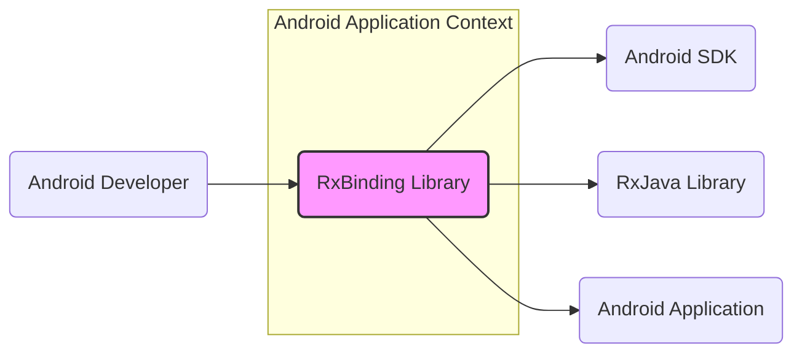
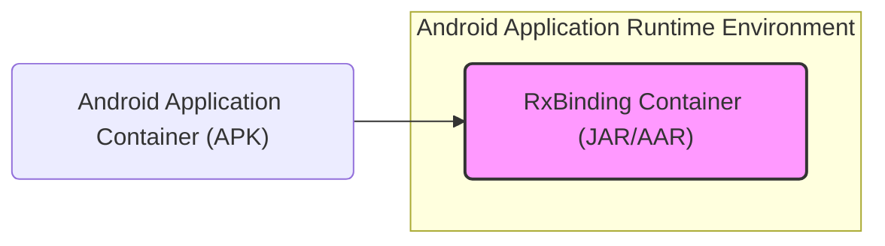
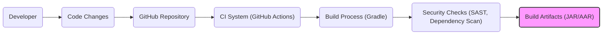

# BUSINESS POSTURE

- Business Priorities and Goals:
  - Simplify Android UI event handling for developers using RxJava.
  - Improve developer productivity by providing a reactive programming approach to Android UI events.
  - Enhance code readability and maintainability in Android applications that utilize reactive programming paradigms.
  - Reduce boilerplate code associated with traditional Android event listeners.

- Business Risks:
  - Dependency risk: Introducing a third-party library dependency into Android projects, which could become a single point of failure or introduce vulnerabilities if the library is not actively maintained or contains security flaws.
  - Integration risk: Potential for incompatibility or conflicts with other libraries or frameworks used in Android projects.
  - Adoption risk: Developers may not fully understand or correctly use RxBinding, leading to improper implementation and potential issues in applications.
  - Maintenance risk: If the library becomes unmaintained, it could become outdated and incompatible with newer versions of Android or RxJava, requiring migration or replacement efforts in dependent projects.

# SECURITY POSTURE

- Existing Security Controls:
  - security control: Open Source Project - The project is hosted on GitHub, allowing for public scrutiny of the code and contributions from the community.
  - security control: Code Review - Changes to the codebase are typically reviewed through pull requests on GitHub, providing a level of peer review.
  - security control: Dependency Management - The project uses Gradle for dependency management, allowing for control over included libraries and their versions.
  - accepted risk: Reliance on external dependencies - The library depends on RxJava and Android SDK, inheriting any potential vulnerabilities present in these dependencies.
  - accepted risk: Community-driven security - Security relies on the vigilance of the open-source community to identify and report vulnerabilities.

- Recommended Security Controls:
  - recommended security control: Automated Dependency Scanning - Implement automated tools to scan dependencies for known vulnerabilities during the build process.
  - recommended security control: Static Application Security Testing (SAST) - Integrate SAST tools into the CI/CD pipeline to automatically analyze the codebase for potential security flaws.
  - recommended security control: Regular Security Audits - Conduct periodic security audits of the codebase, especially before major releases, to proactively identify and address potential vulnerabilities.
  - recommended security control: Vulnerability Disclosure Policy - Establish a clear process for reporting and handling security vulnerabilities, including a public disclosure policy.

- Security Requirements:
  - Authentication: Not directly applicable to a library. Authentication is the responsibility of the applications that use RxBinding.
  - Authorization: Not directly applicable to a library. Authorization is the responsibility of the applications that use RxBinding.
  - Input Validation: RxBinding primarily handles events from Android UI components. Input validation is generally the responsibility of the application logic that consumes these events. RxBinding itself should not introduce vulnerabilities through improper handling of UI events.
  - Cryptography: Not directly applicable to RxBinding. Cryptographic operations are the responsibility of the applications that use RxBinding if they need to handle sensitive data.

# DESIGN

- C4 CONTEXT



  - C4 CONTEXT Elements:
    - - Name: Android Developer
      - Type: Person
      - Description: Software engineers who develop Android applications and utilize RxJava for reactive programming.
      - Responsibilities: Use RxBinding library to simplify handling UI events in their Android applications. Integrate RxBinding into their projects and write code that interacts with it.
      - Security controls: Secure coding practices in application development, proper usage of RxBinding APIs to avoid introducing vulnerabilities.
    - - Name: RxBinding Library
      - Type: Software System
      - Description: A library that provides RxJava bindings for Android UI widgets, enabling developers to observe UI events as reactive streams.
      - Responsibilities: Provide reactive extensions for Android UI components. Handle UI events and expose them as RxJava Observables. Ensure efficient and safe event handling.
      - Security controls: Input validation (though limited, ensure no unexpected behavior from UI events), adherence to secure coding practices in library development, dependency management for included libraries.
    - - Name: Android SDK
      - Type: Software System
      - Description: The Android Software Development Kit, providing the necessary tools and libraries for building Android applications, including UI components and APIs.
      - Responsibilities: Provide the underlying UI framework and APIs that RxBinding interacts with. Ensure the security and stability of the Android platform.
      - Security controls: Security controls are managed by Google as the maintainer of the Android SDK. Developers rely on Google to address vulnerabilities in the SDK.
    - - Name: RxJava Library
      - Type: Software System
      - Description: A library for composing asynchronous and event-based programs using observable sequences for the Java Virtual Machine (JVM).
      - Responsibilities: Provide the reactive programming framework that RxBinding is built upon. Ensure the stability and security of the RxJava library itself.
      - Security controls: Security controls are managed by the RxJava project maintainers. RxBinding relies on the security of the RxJava library.
    - - Name: Android Application
      - Type: Software System
      - Description: The final Android application built by developers, which integrates and utilizes the RxBinding library to handle UI events reactively.
      - Responsibilities: Utilize RxBinding to manage UI events. Implement application-specific logic and security controls. Deploy and run on Android devices.
      - Security controls: Application-level security controls, including authentication, authorization, input validation, data protection, and secure communication. The application is responsible for the overall security posture, including the secure usage of RxBinding.

- C4 CONTAINER



  - C4 CONTAINER Elements:
    - - Name: RxBinding Container (JAR/AAR)
      - Type: Container (Library)
      - Description: The packaged RxBinding library, distributed as a JAR or AAR file, which is included in Android applications.
      - Responsibilities: Encapsulate the RxBinding library code. Provide a reusable component for Android developers to integrate into their applications. Expose APIs for reactive UI event handling.
      - Security controls: Code reviews, SAST during development, dependency scanning, and secure build process to produce the JAR/AAR artifact.
    - - Name: Android Application Container (APK)
      - Type: Container (Application)
      - Description: The Android application package (APK) that includes the RxBinding library along with application code and other dependencies, ready for deployment on Android devices.
      - Responsibilities: Host and execute the RxBinding library within the application context. Provide the runtime environment for RxBinding to interact with Android UI components.
      - Security controls: Application-level security controls, including secure packaging, code signing, runtime permissions, and protection against reverse engineering. The application container is responsible for the secure execution of RxBinding within its environment.

- DEPLOYMENT

```mermaid
graph LR
    subgraph "Android Device"
        android_os("Android OS")
        subgraph "Application Runtime"
            apk_package("APK Package")
        end
        android_os --> Application Runtime
    end
    developer_workstation("Developer Workstation") --> github_repo("GitHub Repository")
    github_repo --> build_system("Build System (CI/CD)")
    build_system --> apk_package

    style apk_package fill:#f9f,stroke:#333,stroke-width:2px
```

  - DEPLOYMENT Elements:
    - - Name: Android Device
      - Type: Infrastructure
      - Description: Physical or virtual Android devices where the Android application, including RxBinding, is deployed and executed.
      - Responsibilities: Provide the runtime environment for Android applications. Enforce security policies and permissions. Manage application lifecycle.
      - Security controls: Device security features (e.g., screen lock, encryption), Android OS security patches, application sandboxing, runtime permissions.
    - - Name: Android OS
      - Type: Software Environment
      - Description: The Android operating system running on the device, providing core functionalities and APIs for applications.
      - Responsibilities: Manage system resources, provide security features, and execute applications.
      - Security controls: OS-level security controls, including kernel security, permission management, and regular security updates provided by device manufacturers and Google.
    - - Name: APK Package
      - Type: Software Artifact
      - Description: The Android application package (APK) containing the compiled application code, RxBinding library, and resources, ready for installation on Android devices.
      - Responsibilities: Package and distribute the application. Be installed and executed by the Android OS.
      - Security controls: Code signing to ensure integrity and authenticity, application permissions requested during installation, and protection against tampering.

- BUILD



  - BUILD Elements:
    - - Name: Developer
      - Type: Person
      - Description: Software developer contributing to the RxBinding project.
      - Responsibilities: Write code, fix bugs, implement new features, and submit code changes. Follow secure coding practices.
      - Security controls: Secure development environment, code review participation, and security awareness training.
    - - Name: GitHub Repository
      - Type: Code Repository
      - Description: Central repository hosting the RxBinding source code, issue tracking, and collaboration tools.
      - Responsibilities: Version control, code storage, collaboration platform, and access control.
      - Security controls: Access control (authentication and authorization), audit logging, and vulnerability scanning of the repository platform itself.
    - - Name: CI System (GitHub Actions)
      - Type: Automation System
      - Description: Continuous Integration system, likely GitHub Actions, used to automate the build, test, and security checks of the RxBinding project.
      - Responsibilities: Automate build process, run tests, perform security scans, and generate build artifacts.
      - Security controls: Secure configuration of CI pipelines, access control to CI system, and secure storage of build secrets and credentials.
    - - Name: Build Process (Gradle)
      - Type: Build Tool
      - Description: Gradle build tool used to compile, package, and build the RxBinding library.
      - Responsibilities: Compile source code, manage dependencies, run build scripts, and package the library into JAR/AAR artifacts.
      - Security controls: Dependency management, build script security, and ensuring the integrity of the build environment.
    - - Name: Security Checks (SAST, Dependency Scan)
      - Type: Security Tooling
      - Description: Automated security tools integrated into the CI pipeline to perform Static Application Security Testing (SAST) and dependency vulnerability scanning.
      - Responsibilities: Identify potential security vulnerabilities in the code and dependencies. Generate reports and alerts for identified issues.
      - Security controls: Configuration and maintenance of security scanning tools, secure handling of scan results, and integration with vulnerability management processes.
    - - Name: Build Artifacts (JAR/AAR)
      - Type: Software Artifact
      - Description: The final compiled and packaged RxBinding library in JAR or AAR format, ready for distribution and inclusion in Android applications.
      - Responsibilities: Represent the distributable form of the RxBinding library. Be consumed by Android developers in their projects.
      - Security controls: Integrity checks (e.g., checksums) to ensure artifacts are not tampered with, secure storage and distribution of artifacts.

# RISK ASSESSMENT

- Critical Business Processes:
  - Development of Android applications that rely on reactive UI event handling.
  - Maintaining the quality and security of Android applications using RxBinding.
  - Developer productivity and efficiency in building reactive Android UIs.

- Data Sensitivity:
  - The RxBinding library itself does not directly handle sensitive data. Data sensitivity is determined by the Android applications that use RxBinding. If an application uses RxBinding to handle UI events related to sensitive data (e.g., user input fields for passwords, personal information), then the application must implement appropriate security measures to protect that data. The sensitivity level is application-dependent and not inherent to RxBinding.

# QUESTIONS & ASSUMPTIONS

- Questions:
  - What is the intended use case and security context for applications using RxBinding? Are they expected to handle highly sensitive data?
  - What is the process for reporting and addressing security vulnerabilities in RxBinding? Is there a dedicated security team or contact?
  - What are the typical security practices of developers who are expected to use RxBinding? Are they generally security-aware?
  - Are there any specific regulatory compliance requirements for applications that might use RxBinding (e.g., HIPAA, GDPR)?

- Assumptions:
  - RxBinding is intended to be used in a wide range of Android applications, with varying security requirements.
  - Developers using RxBinding are responsible for implementing application-level security controls and ensuring the secure usage of the library within their applications.
  - The primary security concern for RxBinding is to prevent the library itself from introducing vulnerabilities into applications that use it.
  - The build and release process for RxBinding follows standard open-source project practices, including code review and community contributions.