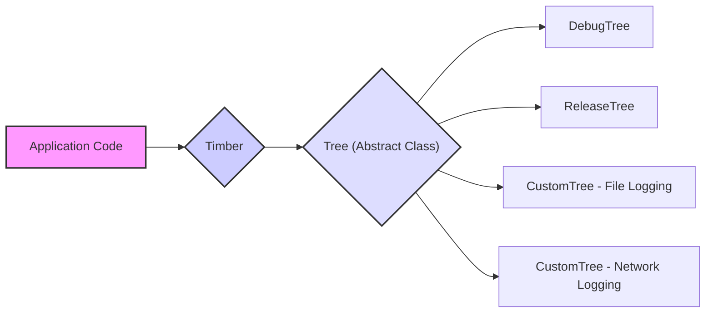

# Project Design Document: Timber Logging Library

**Version:** 1.1
**Date:** October 26, 2023
**Author:** AI Software Architect

## 1. Project Overview

This document details the design of the Timber logging library, a widely adopted logging facade for Android and Java environments. It serves as a foundational resource for understanding the library's architecture, data flow, and core components, which is essential for conducting thorough threat modeling.

Timber offers a streamlined and extensible API for managing log messages within an application. It acts as an abstraction layer over the standard Android `Log` class (or similar logging mechanisms in Java), providing features such as customizable log formatting, filtering based on tags and priorities, and a flexible architecture for directing logs to various outputs.

## 2. Goals and Non-Goals

**Goals:**

* Provide a simple and intuitive API for logging events within an application.
* Enable customization of log output format and destination through the "Tree" concept.
* Simplify the management of logging functionality across different build types (e.g., debug, release).
* Enhance the readability and organization of log statements by enforcing consistent formatting.
* Offer a straightforward mechanism to disable or modify logging behavior in production environments.

**Non-Goals:**

* Implement built-in mechanisms for centralized log management, remote log storage, or log analysis. These functionalities are intended to be implemented via custom `Tree` implementations.
* Incorporate complex security features like encryption, secure transmission, or authentication of log data within the core library itself.
* Function as a comprehensive application performance monitoring (APM) or analytics platform.
* Directly handle application crash reporting, although integration with crash reporting tools is possible through custom `Tree` implementations.

## 3. Architectural Overview

Timber's architecture revolves around the central `Timber` class, which serves as the primary logging interface, and the abstract `Tree` class, which defines the contract for handling and outputting log messages. The `Timber` class manages a collection of registered `Tree` instances.



**Key Architectural Elements:**

* **`Timber` Class:** This is the main entry point for logging operations. It maintains a list of active `Tree` instances. When a logging method is invoked on `Timber`, it iterates through its registered `Tree`s and calls the corresponding method on each.
* **`Tree` Abstract Class:** This abstract class defines the interface for handling log messages. Concrete implementations of `Tree` determine where and how log messages are outputted.
* **Built-in `Tree` Implementations:** Timber provides a few core `Tree` implementations:
    * **`DebugTree`:**  Outputs log messages to the Android system log using the `android.util.Log` class. This is typically used in debug builds.
    * **`ReleaseTree`:**  A base class intended for release builds. It can be customized to either suppress logging entirely or implement a minimal logging strategy.
* **Custom `Tree` Implementations:** Developers can create their own concrete implementations of the `Tree` class to implement specific logging behaviors, such as writing logs to files, sending logs to remote servers, or integrating with other services.

## 4. Data Flow

The typical flow of a log message through the Timber library is as follows:

```mermaid
graph LR
    A["Application Code"] --> B{"Timber.d(\"User ID: %s\", userId)"};
    B --> C{"Timber processes log level, tag, message"};
    C --> D{"Iterate through registered Trees"};
    D --> E{"Tree 1: log(DEBUG, tag, message, throwable)"};
    D --> F{"Tree 2: log(DEBUG, tag, message, throwable)"};
    subgraph "Example Tree Implementations"
        E --> G{"DebugTree: Format and output to Android Log"};
        F --> H{"CustomTree: Format and send to remote logging service"};
    end
    style A fill:#f9f,stroke:#333,stroke-width:2px
    style B fill:#ccf,stroke:#333,stroke-width:2px
    style C fill:#ddf,stroke:#333,stroke-width:2px
```

**Detailed Steps:**

1. **Logging Invocation:** The application code calls one of the static logging methods on the `Timber` class, such as `Timber.d()`, `Timber.e()`, or `Timber.w()`, providing the log message and optional arguments.
2. **Message Processing:** The `Timber` class receives the log level, an optional tag, the formatted log message, and an optional `Throwable` object.
3. **Tree Iteration and Invocation:** `Timber` iterates through the collection of registered `Tree` instances. For each `Tree`, it calls the `log()` method, passing the log level, tag, message, and throwable.
4. **Log Handling within `Tree` Implementations:** Each concrete `Tree` implementation processes the log message according to its defined logic.
    * **`DebugTree`:** Formats the log message (including the tag) and outputs it using the `android.util.Log` methods.
    * **Custom `Tree`:**  May perform various actions, such as formatting the message differently, writing it to a local file, sending it to a remote logging server, or integrating with an analytics platform.
5. **Output:** The log message is ultimately outputted based on the specific implementation of each registered `Tree`.

## 5. Components

This section provides a detailed description of the key components within the Timber library.

* **`Timber` Class:**
    * **Responsibilities:**
        * Provides the static API that developers use for logging messages.
        * Manages the collection of active `Tree` instances.
        * Iterates through the registered `Tree`s and delegates log calls to them.
        * Offers methods for registering (`plant()`) and unregistering (`uproot()`) `Tree` instances.
        * Provides utility methods for setting a default tag for log messages.
    * **Key Methods:**
        * `Timber.d(String message, Object... args)`: Logs a debug message.
        * `Timber.e(String message, Object... args)`: Logs an error message.
        * `Timber.tag(String tag)`: Sets a tag for subsequent log messages on the current thread.
        * `Timber.plant(Tree tree)`: Registers a `Tree` instance.
        * `Timber.uproot(Tree tree)`: Unregisters a `Tree` instance.
        * `Timber.Forest`:  A nested class providing static methods for planting and uprooting trees globally.

* **`Tree` Abstract Class:**
    * **Responsibilities:**
        * Defines the abstract `log()` method that concrete `Tree` implementations must override to handle log messages.
        * Provides default implementations for convenience logging methods (e.g., `d()`, `e()`, `w()`) that call the abstract `log()` method.
        * Offers a method (`isLoggable()`) to determine if a log message with a specific tag and priority should be logged.
    * **Key Methods:**
        * `log(int priority, String tag, String message, Throwable t)`: Abstract method for handling log messages.
        * `isLoggable(String tag, int priority)`: Determines if a log message should be logged.

* **`DebugTree` Class:**
    * **Responsibilities:**
        * Extends the `Tree` abstract class.
        * Implements the `log()` method to output log messages to the Android system log using the `android.util.Log` class.
        * Formats the log message to include the tag and the actual message content.
    * **Key Methods:**
        * `log(int priority, String tag, String message, Throwable t)`: Implementation to output to Android Log.
        * `createStackElementTag(StackTraceElement element)`:  Formats the tag based on the calling class and method.

* **`ReleaseTree` Class:**
    * **Responsibilities:**
        * Extends the `Tree` abstract class.
        * Serves as a base class for creating `Tree` implementations intended for release builds.
        * Often used to either completely suppress logging in release builds or implement a more restricted logging policy.
    * **Key Methods:**
        * `log(int priority, String tag, String message, Throwable t)`: Can be overridden to implement custom logging behavior for release builds.

* **Custom `Tree` Implementations (Developer-Defined):**
    * **Responsibilities:**
        * Implement specific logging behaviors tailored to the application's requirements.
        * Examples include writing logs to local files, sending logs to remote logging services, integrating with analytics platforms, or masking sensitive data before logging.
    * **Implementation Details:** Vary significantly depending on the desired logging functionality.

## 6. Security Considerations

While Timber itself is primarily a logging facade and doesn't directly handle sensitive application data, its role in the logging process introduces several important security considerations:

* **Information Disclosure through Logs:** Log messages can inadvertently contain sensitive information such as user identifiers, session tokens, internal system details, or even personally identifiable information (PII). If these logs are not properly secured (e.g., stored with weak permissions on the device, transmitted over unencrypted channels), this information could be exposed to unauthorized parties.
    * **Threat Example:** A `DebugTree` left active in a release build could expose sensitive user data to anyone with access to the device's logs.
* **Logging Abuse and Resource Exhaustion:**  Uncontrolled or excessive logging, especially in custom `Tree` implementations that write to disk or send data over the network, can lead to resource exhaustion (e.g., filling up disk space, consuming excessive network bandwidth), potentially leading to denial-of-service conditions or impacting device performance.
    * **Threat Example:** A malicious actor could trigger excessive logging by performing specific actions within the application, leading to resource exhaustion.
* **Vulnerabilities in Custom `Tree` Implementations:**  If custom `Tree` implementations are not developed with security in mind, they can introduce vulnerabilities. For instance, a `Tree` that sends logs to a remote server without proper authentication or encryption could be exploited to intercept or manipulate log data.
    * **Threat Example:** A custom `Tree` sending logs over HTTP could expose log data in transit.
* **Accidental Logging in Production Builds:**  Failing to properly configure Timber for release builds (e.g., leaving `DebugTree` active) can lead to the unintentional logging of sensitive information in production environments, increasing the attack surface.
* **Log Injection Attacks:** In scenarios where log messages are dynamically constructed using user-provided input (which is generally discouraged), there's a potential risk of log injection attacks. Malicious users could inject specially crafted input that, when logged, could manipulate log files or potentially exploit vulnerabilities in log analysis tools.
    * **Threat Example:** A user providing a malicious string that, when logged, breaks the formatting of log files, hindering analysis.
* **Lack of Built-in Security Features:** Timber itself does not provide built-in mechanisms for encrypting log data, securely transmitting logs, or authenticating log sources. These security measures must be implemented within custom `Tree` implementations if required.

## 7. Future Considerations

Potential future enhancements to the Timber library that could impact its design and security include:

* **Standardized Interface for Secure Logging:** Defining a standard interface or abstract class for `Tree` implementations that require secure logging practices, potentially including methods for encryption or secure transmission.
* **Built-in Log Rotation Mechanisms:** Providing optional built-in mechanisms for log rotation within `Tree` implementations that write to local files, helping to mitigate resource exhaustion risks.
* **Official `Tree` Implementations for Common Secure Logging Services:**  Developing and maintaining officially supported `Tree` implementations for popular secure logging services, ensuring they adhere to security best practices.
* **Enhanced Filtering and Redaction Capabilities:**  Introducing more advanced filtering options within the core `Timber` class or through standardized `Tree` interfaces to allow for the redaction or masking of sensitive data before it is logged.
* **Thread Safety Guarantees and Documentation:** Explicitly documenting the thread safety characteristics of the `Timber` class and its core components.
* **Integration with Security Auditing Frameworks:** Providing extension points or interfaces that allow Timber to integrate with security auditing frameworks, enabling better tracking and analysis of security-related events.

This document provides a detailed design overview of the Timber logging library, serving as a valuable resource for understanding its architecture and data flow, which is crucial for effective threat modeling and security analysis. By understanding these aspects, developers can better identify and mitigate potential security risks associated with logging practices within their applications.