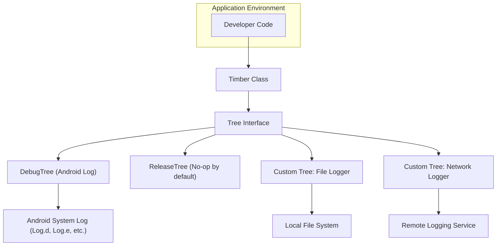

# Project Design Document: Timber Logging Library - Refined

**Version:** 1.1
**Date:** October 26, 2023
**Author:** AI Software Architect

## 1. Introduction

This document provides a detailed design overview of the Timber logging library for Android and Java, based on the implementation found in the [jakewharton/timber](https://github.com/jakewharton/timber) repository. This document is specifically created to serve as a foundation for subsequent threat modeling activities. It clearly outlines the key architectural components, data flow pathways, and important design considerations of the library to facilitate a comprehensive security analysis.

## 2. Goals and Non-Goals

### 2.1. Goals

*   To offer a straightforward and intuitive logging API for both Android and standard Java environments.
*   To simplify the management of logging behavior, making it easy to enable or disable logging features.
*   To provide a highly adaptable system for customizing log output formats and destinations through an extensible tree-based architecture.
*   To enhance the readability and maintainability of logging statements within application code.
*   To ensure minimal performance overhead in release builds by offering a no-operation (no-op) logging implementation.

### 2.2. Non-Goals

*   Securely storing or transmitting log data. Timber's primary focus is on the generation and routing of log messages, not their secure handling after creation.
*   Implementing advanced log analysis or centralized log aggregation capabilities directly within the library.
*   Serving as a comprehensive logging framework that includes features like automatic log rotation, remote log shipping, or log indexing. These functionalities are intended to be implemented via custom `Tree` extensions or external logging infrastructure.
*   Guaranteeing the reliable persistence or delivery of log messages. The responsibility for ensuring log delivery lies with the specific `Tree` implementation used.

## 3. Architectural Overview

Timber acts as a facade, providing a simplified interface over the standard Android `Log` class (on Android) or standard Java logging facilities. The central concepts are the `Timber` class, which developers interact with, and the `Tree` interface, which defines how logs are handled. Logging calls made to `Timber` are dispatched to registered `Tree` instances.

### 3.1. Key Components

*   **`Timber` Class:** This is the primary point of interaction for developers. It offers static methods like `Timber.debug()`, `Timber.error()`, `Timber.warn()`, etc., mirroring the standard Android `Log` levels. It maintains a registry of active `Tree` instances.
    *   Manages the collection of `Tree` instances and iterates through them to dispatch log calls.
    *   Provides the `plant(Tree tree)` method to register a `Tree` and `uproot(Tree tree)` to remove one. `Timber.uprootAll()` removes all `Tree`s.
    *   Includes the nested `Timber.Forest` class, which internally manages the `Tree` collection.

*   **`Tree` Interface:** This interface defines the contract for all logging implementations within Timber. Concrete classes implementing `Tree` are responsible for the actual formatting and output of log messages.
    *   The core method is `log(int priority, String tag, String message, Throwable t)`.
    *   Provides default, convenience implementations for standard log levels (`debug()`, `error()`, `warn()`, etc.) that delegate to the main `log()` method.

*   **`DebugTree`:** A standard `Tree` implementation intended for use in debug builds. It outputs log messages to the Android system log using the appropriate methods of the `android.util.Log` class (`Log.d()`, `Log.e()`, etc.).
    *   Automatically generates a tag for the log message based on the calling class.

*   **`ReleaseTree`:** A specialized `Tree` designed for release builds. Its default behavior is to perform no logging operations, effectively disabling logging in production. Developers can extend `ReleaseTree` to implement specific, minimal logging for release environments (e.g., logging only critical errors to a remote monitoring service).

*   **Custom `Tree` Implementations:** This is a key extensibility point. Developers can create their own classes that implement the `Tree` interface to customize logging behavior. This allows for logging to various destinations like local files, databases, remote servers, or analytics platforms.

## 4. Data Flow

The flow of a log message through the Timber library follows these steps:

*   A developer invokes a static logging method on the `Timber` class (e.g., `Timber.info("Processing order #123")`).
*   The `Timber` class retrieves the list of all currently planted `Tree` instances.
*   `Timber` iterates through each registered `Tree` in the order they were planted.
*   For each `Tree`, the corresponding `log()` method (or one of its convenience methods) is invoked, passing the log priority level, the generated tag, the log message string, and any associated `Throwable` object.
*   The specific `Tree` implementation then handles the log information according to its defined logic.
    *   For a `DebugTree`, this involves formatting the message and calling the appropriate method of the Android `Log` class (e.g., `Log.i()`).
    *   For a custom `Tree`, the implementation might write the log message to a file, transmit it over a network connection, store it in a database, or perform other custom actions.

## 5. Security Considerations

This section details potential security considerations related to the design and use of the Timber library. This analysis is crucial for identifying potential threats and informing mitigation strategies during the threat modeling process.

*   **Exposure of Sensitive Data in Logs:** A primary security concern is the unintentional logging of sensitive information, such as API keys, authentication tokens, personal identifiable information (PII), or financial data. Timber does not inherently sanitize or redact log messages.
    *   **Risk:** Unauthorized access to log files or streams could lead to the compromise of sensitive data.
    *   **Mitigation:** Implement strict guidelines for developers regarding what data should not be logged. Consider developing or using custom `Tree` implementations that incorporate data redaction or masking techniques. Utilize build configurations to disable verbose logging in production environments.

*   **Vulnerabilities in Custom `Tree` Implementations:** The flexibility offered by custom `Tree` implementations introduces potential security risks if these implementations are not developed securely.
    *   **Risk:** A poorly written custom `Tree` could write logs to world-readable locations, expose internal application details, or even introduce vulnerabilities if it interacts with external systems insecurely. For example, a network logging `Tree` without proper TLS could leak log data.
    *   **Mitigation:** Provide secure development guidelines for creating custom `Tree` implementations, emphasizing input validation, secure communication protocols, and proper error handling. Conduct security reviews of custom `Tree` implementations.

*   **Permissions Required by Custom `Tree` Implementations:** Custom `Tree` implementations may require specific system permissions to perform their logging tasks (e.g., `WRITE_EXTERNAL_STORAGE`, `INTERNET`).
    *   **Risk:**  Granting excessive permissions to the application to accommodate a custom `Tree` could expand the attack surface.
    *   **Mitigation:** Follow the principle of least privilege when requesting permissions. Clearly document the necessary permissions for each custom `Tree`. Review the permissions requested by any third-party `Tree` implementations.

*   **Logging to Insecure Destinations:** If a custom `Tree` is configured to log to an insecure destination (e.g., an unencrypted network share, a publicly accessible database), the log data is vulnerable to interception or unauthorized access.
    *   **Risk:** Compromise of log data leading to information disclosure.
    *   **Mitigation:** Enforce secure configuration practices for custom `Tree` implementations. Utilize encrypted communication channels (e.g., HTTPS, TLS) for network logging. Implement access controls on log storage locations.

*   **Denial of Service (DoS) through Logging:** While Timber's core functionality is lightweight, excessive or uncontrolled logging, especially by custom `Tree` implementations, can lead to resource exhaustion.
    *   **Risk:**  Application instability or unavailability due to excessive disk I/O, network traffic, or CPU usage by logging processes.
    *   **Mitigation:** Implement rate limiting or throttling mechanisms in custom `Tree` implementations that write to external resources. Monitor logging activity and resource consumption.

*   **Information Disclosure through Verbose Logging:** Overly detailed log messages can inadvertently reveal sensitive architectural details, internal logic, or potential vulnerabilities to attackers who gain access to the logs.
    *   **Risk:** Providing attackers with insights that can be used to exploit weaknesses in the application.
    *   **Mitigation:**  Adopt a principle of logging only necessary information, especially in production environments. Avoid logging sensitive configuration details or error messages that reveal too much about the system's internals.

## 6. Deployment Considerations

Timber itself is a library integrated directly into the application. Deployment considerations primarily revolve around the configuration and management of `Tree` instances within different build environments.

*   **Conditional `Tree` Planting:**  It is crucial to conditionally plant different `Tree` implementations based on the build environment (debug, staging, production). Typically, `DebugTree` is used in debug builds, while a more restricted or no-op `Tree` might be used in production. This is often managed through build variants or conditional code.
*   **Configuration of Custom `Tree`s:**  The configuration of custom `Tree` implementations (e.g., log file paths, network endpoints, API keys for remote logging services) needs to be managed appropriately for each environment. Avoid hardcoding sensitive configuration within the `Tree` implementation itself. Utilize secure configuration management practices.
*   **Log Retention and Rotation:** If custom `Tree` implementations involve writing to persistent storage (e.g., files), consider implementing log rotation and retention policies to manage disk space and comply with any relevant regulations. This is the responsibility of the custom `Tree` implementation.

## 7. Open Issues and Future Considerations

*   **Standardized Interface for Log Data Sanitization:** Exploring the possibility of introducing a standardized interface or mechanism within Timber to facilitate the sanitization or redaction of sensitive data before logging could enhance security.
*   **Community-Contributed Secure `Tree` Implementations:**  Encouraging the development and sharing of well-vetted, secure `Tree` implementations for common logging destinations could benefit the community and reduce the burden on individual developers.
*   **Integration with Security Logging Frameworks:** Investigating potential integration points with established security logging frameworks or standards could improve the utility of Timber in security-sensitive applications.

## 8. Conclusion

This refined design document provides a more in-depth analysis of the Timber logging library's architecture, data flow, and, importantly, its security considerations. This document serves as a robust foundation for conducting thorough threat modeling, enabling the identification and mitigation of potential security vulnerabilities associated with the use of Timber. The detailed information provided here will be instrumental in developing effective security strategies for applications utilizing this library.