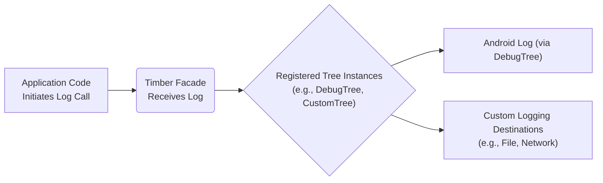
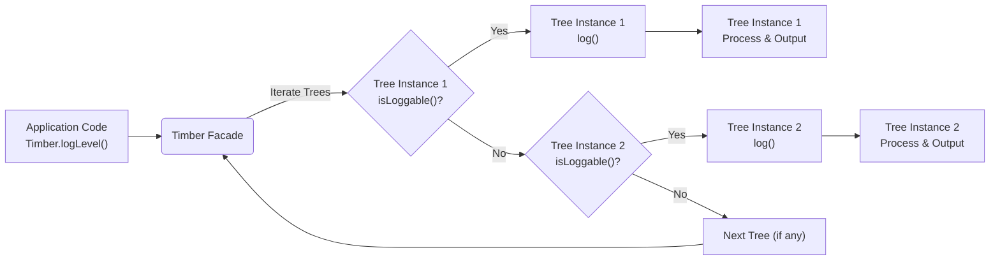

# Project Design Document: Timber Logging Library

**Version:** 1.1
**Date:** October 26, 2023
**Author:** Gemini (AI Language Model)
**Project:** Timber (https://github.com/jakewharton/timber)

## 1. Introduction

This document provides a detailed design overview of the Timber logging library for Android and Java. The primary purpose of this document is to facilitate a comprehensive understanding of Timber's architecture, components, and data flow, specifically for use in subsequent threat modeling activities. This document aims to be clear, concise, and technically accurate, providing sufficient detail for security analysis and identification of potential vulnerabilities.

## 2. Goals

*   Clearly and comprehensively document the architecture and components of the Timber logging library.
*   Precisely describe the data flow within the library, from the initiation of a log call to its final output through various `Tree` implementations.
*   Identify and explain key interfaces, extension points, and configuration options within the library that are relevant to security considerations.
*   Provide a solid and detailed foundation for identifying potential security vulnerabilities, attack vectors, and areas of risk associated with the use of the Timber library.

## 3. Overview

Timber is a logging library that acts as a facade over the standard Android `Log` class and Java logging facilities, offering a more streamlined, extensible, and controlled approach to logging. The central concept revolves around intercepting log calls made through the `Timber` facade and dispatching them to registered `Tree` instances for customized processing and output. `Tree` instances define where and how log messages are handled.

Here's a high-level overview of the logging process within Timber:

Key components of Timber include:

*   **Timber Facade:** The main entry point for developers to initiate logging calls. It manages the registered `Tree` instances.
*   **Tree (Abstract Class):** Defines the contract for handling log messages. Custom implementations dictate where and how logs are output.
*   **DebugTree (Concrete Tree):** A default `Tree` implementation primarily used in debug builds to output logs to the Android system log (Logcat).
*   **Tree Planting:** The mechanism by which `Tree` instances are registered with the `Timber` facade, making them active for processing log calls.

## 4. Detailed Design

### 4.1. Components

*   **`Timber` Class (Facade):**
    *   Acts as the primary interface for logging, providing static methods corresponding to different log levels: `verbose(v)`, `debug(d)`, `info(i)`, `warn(w)`, `error(e)`, and `wtf` (What a Terrible Failure).
    *   Maintains an ordered collection (typically a `List` or similar) of registered `Tree` instances. The order of registration can be significant as `Tree` instances are often processed sequentially.
    *   Delegates incoming log calls to the registered `Tree` instances.
    *   Provides methods for planting (`Timber.plant()`) and uprooting (`Timber.uproot()`, `Timber. Forest.plant()`, `Timber.Forest.uproot()`) `Tree` instances, allowing for dynamic management of logging destinations.
    *   Includes logic to check if a specific `Tree` should process a log message based on the result of its `isLoggable()` method.
    *   Manages the log tag. If no explicit tag is provided in the log call, it can automatically generate a tag based on the calling class (particularly in `DebugTree`).
    *   Handles optional throwable parameters passed to the logging methods.

*   **`Timber.Tree` (Abstract Class):**
    *   Defines the abstract methods that concrete `Tree` implementations must provide to handle log messages at different levels: `v(String message, Object... args)`, `d(String message, Object... args)`, `i(String message, Object... args)`, `w(String message, Object... args)`, `e(String message, Object... args)`, `wtf(String message, Object... args)`, and their counterparts accepting a `Throwable`.
    *   Provides a default implementation for `isLoggable(String tag, int priority)` which can be overridden by concrete `Tree` implementations to implement custom filtering logic based on the tag and log priority.
    *   Offers a `tag(String tag)` method that can be overridden to customize or modify the log tag before processing.
    *   Contains a central `log(int priority, String tag, String message, Throwable t)` method that is invoked by the `Timber` facade. This method in turn calls the level-specific abstract methods. Concrete `Tree` implementations typically override the level-specific methods.

*   **`Timber.DebugTree` (Concrete `Tree`):**
    *   A concrete implementation of `Timber.Tree` intended primarily for use in debug builds.
    *   Outputs log messages to the Android system log (Logcat) using the `android.util.Log` class.
    *   Formats the log message, including the tag and the message content. If a `Throwable` is provided, it's also included in the log output.
    *   Includes logic to automatically determine the calling class and method name to generate a default log tag if no explicit tag is provided in the logging call. This involves inspecting the stack trace.

*   **Custom `Tree` Implementations:**
    *   Developers can create their own classes that extend `Timber.Tree` to implement custom logging behavior tailored to specific needs.
    *   Examples of custom `Tree` implementations include:
        *   `FileLoggingTree`: Writes log messages to a file on the device's storage.
        *   `NetworkLoggingTree`: Sends log messages to a remote logging server or service.
        *   `CrashReportingTree`: Logs error and warning messages to a crash reporting platform (e.g., Firebase Crashlytics, Sentry).
        *   `AnalyticsLoggingTree`:  Logs specific events or data points to an analytics platform.
    *   These custom implementations have complete control over how log data is processed, formatted, filtered, and where it is ultimately sent. They can implement complex logic for handling log messages.

### 4.2. Data Flow

The typical flow of a log call through Timber involves the following steps:

1. **Log Call Initiation:** The application code invokes a static logging method on the `Timber` facade, specifying the log level, message, and optional throwable (e.g., `Timber.tag("MyActivity").d("User ID: %s", userId)`).

2. **Facade Processing:** The `Timber` facade receives the log call, including the log level, tag (if provided), message, and throwable.

3. **Tree Iteration and Filtering:** The `Timber` facade iterates through the registered `Tree` instances in the order they were planted. For each `Tree`, it calls the `isLoggable(tag, priority)` method.

4. **Loggability Check:** The `isLoggable()` method of the `Tree` determines whether the current log message should be processed by that specific `Tree`. This allows for filtering logs based on tag, priority, or other custom criteria implemented in the `Tree`.

5. **Tag Preparation:** The `Timber` facade determines the final tag for the log message. If an explicit tag was provided in the log call, it's used. Otherwise, `DebugTree` (and potentially other custom `Tree` implementations) might attempt to automatically generate a tag based on the calling class. The `Tree`'s `tag()` method can also modify the tag.

6. **Log Dispatch to Tree:** If the `isLoggable()` method returns `true`, the `Timber` facade calls the appropriate level-specific `log()` method (e.g., `v()`, `d()`, `e()`) of the `Tree` instance, passing the determined tag, formatted message, and the throwable (if any).

7. **Tree-Specific Processing:** The concrete `Tree` implementation receives the log message and performs its specific processing logic. This might involve:
    *   Formatting the message further.
    *   Writing the message to a log output (e.g., Logcat via `android.util.Log.println()`, a file, a network socket).
    *   Filtering or transforming the message content.
    *   Sending the log data to an external service.
    *   Handling exceptions or errors during the logging process.

8. **Output:** The log message is outputted or transmitted according to the implementation of the specific `Tree`.

### 4.3. Key Interfaces and Extension Points

*   **`Timber.Tree` Abstract Class:** The primary interface for extending Timber's functionality. Developers implement custom `Tree` classes to direct logs to various destinations and customize processing.
*   **`isLoggable(String tag, int priority)` Method in `Tree`:** Provides a powerful mechanism for filtering log messages at the `Tree` level based on tag and priority. Custom implementations can add more complex filtering logic.
*   **`tag(String tag)` Method in `Tree`:** Allows for modification or customization of the log tag by individual `Tree` implementations.
*   **`Timber.plant(Tree tree)` and `Timber.uproot(Tree tree)` Methods:** Enable dynamic registration and unregistration of `Tree` instances at runtime, offering flexibility in managing logging destinations.
*   **Log Level Methods (`v`, `d`, `i`, `w`, `e`, `wtf`):**  While part of the facade, these methods represent the entry points and allow for semantic categorization of log messages, which can be used for filtering.

## 5. Security Considerations (For Threat Modeling)

This section details potential security concerns and areas of risk associated with the Timber logging library, providing a basis for subsequent threat modeling activities.

*   **Accidental Exposure of Sensitive Information in Logs:**
    *   **Threat:** Log messages, especially when using string formatting or including object details, might inadvertently contain sensitive data such as API keys, authentication tokens, personally identifiable information (PII), or internal system details.
    *   **Impact:** Exposure of this data could lead to unauthorized access, identity theft, or other security breaches, depending on the sensitivity of the information leaked.
    *   **Examples:** Logging request parameters containing passwords, logging user session IDs without proper redaction, or logging error details that reveal internal system architecture.

*   **Malicious or Compromised Custom `Tree` Implementations:**
    *   **Threat:** If an attacker can influence the `Tree` instances that are planted (e.g., by compromising a dependency, exploiting a vulnerability in the application's configuration, or through malicious code injection), they could introduce a malicious `Tree`.
    *   **Impact:** A malicious `Tree` could intercept and exfiltrate log data, inject malicious data into log streams, cause denial of service by flooding logging systems, or even execute arbitrary code if the logging destination allows it.
    *   **Examples:** A compromised `NetworkLoggingTree` sending logs to an attacker-controlled server, or a `FileLoggingTree` writing malicious data to a shared storage location.

*   **Denial of Service (DoS) through Uncontrolled or Excessive Logging:**
    *   **Threat:** An attacker might be able to trigger excessive logging by manipulating application behavior or exploiting vulnerabilities, leading to resource exhaustion (CPU, memory, storage) on the device or logging infrastructure.
    *   **Impact:** This can cause the application to become unresponsive or crash, and can overwhelm logging servers, making legitimate logs difficult to analyze.
    *   **Examples:** Repeatedly triggering error conditions that generate verbose logs, or exploiting a loop that continuously logs data.

*   **Information Disclosure through Debug Logs in Production Builds:**
    *   **Threat:** If `DebugTree` or other verbose logging configurations intended for development are mistakenly left enabled in production builds, sensitive debugging information could be exposed.
    *   **Impact:** This can reveal internal application logic, data structures, and potential vulnerabilities to attackers.
    *   **Examples:** Logging detailed error stack traces that reveal code paths, or logging intermediate values of sensitive calculations.

*   **Log Injection Attacks (Indirect Threat):**
    *   **Threat:** If log messages are constructed using untrusted input without proper sanitization or encoding, it could potentially lead to log injection vulnerabilities in downstream systems that process these logs.
    *   **Impact:** Attackers could inject malicious commands or data into log files, potentially compromising log analysis tools or other systems that rely on log data.
    *   **Examples:** Using user-provided input directly in log messages without escaping special characters, which could lead to command injection in log processing scripts.

*   **Tampering or Spoofing of Log Data:**
    *   **Threat:** Depending on the logging destination and security measures, there might be a risk of attackers tampering with existing log data or injecting fabricated log entries.
    *   **Impact:** This can hinder incident response, make it difficult to track malicious activity, or even be used to frame legitimate users.
    *   **Examples:** Modifying log files on a compromised device, or sending spoofed log messages to a remote logging server if authentication is weak.

## 6. Future Considerations (Out of Scope for Initial Threat Model)

*   Standardized interfaces or base classes for common logging destinations to promote consistency and security best practices.
*   Built-in mechanisms for automatically redacting or masking sensitive data in log messages.
*   More sophisticated filtering and routing capabilities within the core `Timber` facade.
*   Asynchronous logging options to minimize performance impact on the main application thread.

This improved document provides a more detailed and comprehensive design overview of the Timber logging library, specifically tailored for threat modeling purposes. The enhanced descriptions of components, data flow, and the expanded security considerations section should provide a solid foundation for identifying and mitigating potential security risks.