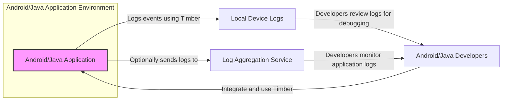
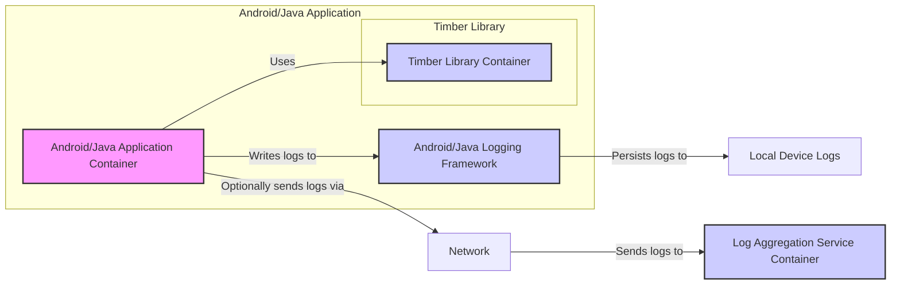

# BUSINESS POSTURE

- Business Priorities and Goals:
  - Provide a robust, flexible, and easy-to-use logging library for Android and Java applications.
  - Simplify the process of adding logging to applications, improving developer productivity and code maintainability.
  - Enhance application debugging, monitoring, and issue tracking through structured and informative logs.
- Business Risks:
  - Security vulnerabilities in the library could be inherited by applications using it, potentially leading to data leaks or application instability.
  - Performance overhead introduced by the logging library could negatively impact application responsiveness and user experience.
  - Incompatibility with certain Android versions or devices could limit the library's adoption and usefulness.
  - Lack of ongoing maintenance and updates could lead to the library becoming outdated and less secure over time.

# SECURITY POSTURE

- Existing Security Controls:
  - security control Open Source Code: The library is open source, allowing for community review and scrutiny of the codebase. Implemented in: Github repository.
  - security control Dependency Management: The library is distributed through Maven Central, which provides a level of trust in the source and integrity of the artifact. Implemented in: Maven Central distribution.
- Accepted Risks:
  - accepted risk Dependency Vulnerability: As a dependency, vulnerabilities in Timber could affect applications using it. Mitigation: Regular updates and security scanning of dependencies in applications.
  - accepted risk Logging Sensitive Data: Developers might unintentionally log sensitive data using Timber. Mitigation: Developer training and guidelines on secure logging practices.
- Recommended Security Controls:
  - security control Static Analysis Security Testing (SAST): Regularly scan the Timber codebase for potential security vulnerabilities using SAST tools.
  - security control Dependency Scanning: Implement automated dependency scanning to detect and alert on known vulnerabilities in Timber's dependencies.
  - security control Secure Development Practices: Follow secure coding practices during development, including input validation and secure handling of potentially sensitive data within the library itself (though limited in scope for a logging library).
- Security Requirements:
  - Authentication: Not directly applicable to a logging library itself. Authentication is relevant in the context of systems that consume and process logs generated by applications using Timber (e.g., log aggregation services).
  - Authorization: Not directly applicable to a logging library itself. Authorization is relevant in the context of access control to logs generated by applications using Timber.
  - Input Validation: While Timber primarily handles string inputs for log messages, input validation is important in applications using Timber to ensure that data being logged is sanitized and does not introduce vulnerabilities if logs are processed by external systems.
  - Cryptography: Not a core requirement for a logging library. Cryptography might be relevant if logs need to be transmitted or stored securely, which would be handled by systems consuming the logs, not Timber itself.

# DESIGN

## C4 CONTEXT



- Context Diagram Elements:
  - - Name: Android/Java Application
    - Type: Software System
    - Description: The Android or Java application that integrates and uses the Timber logging library.
    - Responsibilities: Generate log events using Timber, execute application logic, interact with the Android/Java environment.
    - Security controls: Application-level security controls, including input validation, authorization, and secure data handling.
  - - Name: Android/Java Developers
    - Type: Person
    - Description: Software developers who integrate Timber into their applications and use logs for debugging and monitoring.
    - Responsibilities: Develop and maintain applications, integrate Timber, review logs, debug issues, monitor application behavior.
    - Security controls: Secure development practices, access control to development environments and log data.
  - - Name: Local Device Logs
    - Type: Data Store
    - Description: Logs stored locally on the device where the application is running. These logs are typically used for debugging during development and testing.
    - Responsibilities: Store log messages generated by the application.
    - Security controls: Device-level security controls, access control to device logs (typically restricted to developers or authorized personnel).
  - - Name: Log Aggregation Service
    - Type: External System
    - Description: An optional external service used to collect, store, and analyze logs from multiple application instances. Examples include cloud-based logging services or self-hosted ELK stacks.
    - Responsibilities: Aggregate logs from multiple sources, provide search and analysis capabilities, enable centralized monitoring and alerting.
    - Security controls: Authentication and authorization for access, encryption of logs in transit and at rest, data retention policies, security monitoring and incident response.

## C4 CONTAINER



- Container Diagram Elements:
  - - Name: Android/Java Application Container
    - Type: Application Runtime
    - Description: Represents the runtime environment of the Android or Java application. This is where the application code and the Timber library execute.
    - Responsibilities: Execute application logic, manage application resources, interact with the underlying operating system and hardware.
    - Security controls: Operating system level security controls, application sandbox, runtime permissions, secure coding practices within the application.
  - - Name: Timber Library Container
    - Type: Library
    - Description: The Timber logging library itself, packaged as a JAR or AAR file. It provides the API for developers to create and manage logs.
    - Responsibilities: Provide logging API, format log messages, delegate log output to the underlying logging framework.
    - Security controls: Code reviews, static analysis, dependency scanning, secure development practices for library development.
  - - Name: Android/Java Logging Framework
    - Type: System Service
    - Description: The built-in logging framework provided by the Android or Java platform (e.g., `Log` class in Android, `java.util.logging` in Java). Timber acts as a facade over this framework.
    - Responsibilities: Handle log message output, manage log levels, persist logs to local storage or forward them to system services.
    - Security controls: Operating system level security controls, logging framework configurations, access control to log files.
  - - Name: Local Device Logs
    - Type: Data Store
    - Description: Local storage on the device where logs are persisted by the Android/Java logging framework.
    - Responsibilities: Persistently store log messages.
    - Security controls: Device-level file system permissions, encryption of device storage (if enabled).
  - - Name: Network
    - Type: Communication Channel
    - Description: The network infrastructure used to transmit logs to an external log aggregation service. This could be the internet or a private network.
    - Responsibilities: Provide network connectivity for log transmission.
    - Security controls: Network security controls, encryption of data in transit (e.g., TLS/HTTPS), network segmentation, firewalls.
  - - Name: Log Aggregation Service Container
    - Type: External System
    - Description: The runtime environment of the external log aggregation service. This could be a cloud service or a self-hosted server.
    - Responsibilities: Receive, process, store, and analyze logs transmitted over the network.
    - Security controls: Server-side security controls, authentication and authorization, encryption at rest and in transit, security monitoring, access control to log data.

## DEPLOYMENT

For a library like Timber, the deployment context is primarily about how applications using Timber are deployed. Let's consider a typical Android application deployment.

```mermaid
flowchart LR
    subgraph "Developer Environment"
        DE[Developer Workstation]
        SDK[Android SDK]
        IDE[Integrated Development Environment]
    end
    subgraph "Build Environment"
        BC[Build Server]
        MA[Maven Artifact Repository]
    end
    subgraph "Target Environment - Android Device"
        AD[Android Device]
        OS[Android OS]
        APK[Application Package (APK)]
    end

    DE -- "Develops Application with Timber" --> IDE
    IDE -- "Uses SDK to build" --> BC
    BC -- "Retrieves Timber from" --> MA
    BC -- "Builds APK" --> MA
    MA -- "Distributes APK" --> AD
    AD -- "Installs and Runs" --> APK
    APK -- "Runs on" --> OS

    style DE fill:#e0e0ff,stroke:#333,stroke-width:1px
    style SDK fill:#e0e0ff,stroke:#333,stroke-width:1px
    style IDE fill:#e0e0ff,stroke:#333,stroke-width:1px
    style BC fill:#ffe0e0,stroke:#333,stroke-width:1px
    style MA fill:#ffe0e0,stroke:#333,stroke-width:1px
    style AD fill:#e0ffe0,stroke:#333,stroke-width:1px
    style OS fill:#e0ffe0,stroke:#333,stroke-width:1px
    style APK fill:#e0ffe0,stroke:#333,stroke-width:1px
```

- Deployment Diagram Elements:
  - - Name: Developer Workstation
    - Type: Infrastructure
    - Description: The developer's local computer used for writing code, testing, and development activities.
    - Responsibilities: Code development, local testing, running development tools.
    - Security controls: Workstation security policies, access control, endpoint protection, secure coding practices.
  - - Name: Android SDK
    - Type: Software
    - Description: The Android Software Development Kit, providing tools and libraries for Android development.
    - Responsibilities: Compiling code, building APK packages, providing emulators and debugging tools.
    - Security controls: Regular updates, secure download sources, access control to SDK tools.
  - - Name: Integrated Development Environment (IDE)
    - Type: Software
    - Description: Software application that provides comprehensive facilities to computer programmers for software development (e.g., Android Studio).
    - Responsibilities: Code editing, debugging, building, and deployment management.
    - Security controls: IDE security features, plugin security, secure configuration, access control.
  - - Name: Build Server
    - Type: Infrastructure
    - Description: A server dedicated to automating the build process, including compiling code, running tests, and packaging applications.
    - Responsibilities: Automated builds, continuous integration, running security scans during build.
    - Security controls: Build server hardening, access control, secure build pipelines, vulnerability scanning of build artifacts.
  - - Name: Maven Artifact Repository
    - Type: Infrastructure
    - Description: A repository for storing and managing build artifacts, including libraries like Timber and application packages (APKs).
    - Responsibilities: Storing and distributing build artifacts, managing dependencies.
    - Security controls: Access control, artifact integrity checks, vulnerability scanning of artifacts, secure repository configuration.
  - - Name: Android Device
    - Type: Infrastructure
    - Description: The target Android device where the application is installed and run.
    - Responsibilities: Running applications, providing device resources, storing application data and logs.
    - Security controls: Device security features, operating system security, application sandbox, user permissions.
  - - Name: Android OS
    - Type: Software
    - Description: The Android operating system running on the target device.
    - Responsibilities: Managing device resources, providing system services, enforcing security policies.
    - Security controls: Kernel security, system updates, permission management, security features like SELinux.
  - - Name: Application Package (APK)
    - Type: Software Artifact
    - Description: The Android application package file, containing the compiled application code, resources, and libraries, including Timber.
    - Responsibilities: Deployable unit of the application, contains all necessary components to run the application.
    - Security controls: Code signing, integrity checks, application permissions defined in the manifest.

## BUILD

```mermaid
flowchart LR
    subgraph "Developer"
        DEV[Developer]
        VC[Version Control (e.g., Git)]
    end
    subgraph "Build System"
        CI[CI/CD System (e.g., GitHub Actions)]
        BM[Build Machine]
        SAST[SAST Scanner]
        DAST[DAST Scanner]
        DS[Dependency Scanner]
    end
    subgraph "Artifact Repository"
        AR[Artifact Repository (e.g., Maven Central, Nexus)]
    end

    DEV -- "Code Changes" --> VC
    VC -- "Triggers Build" --> CI
    CI -- "Checkout Code" --> BM
    CI -- "Run SAST" --> SAST
    CI -- "Run DAST (if applicable)" --> DAST
    CI -- "Run Dependency Scan" --> DS
    CI -- "Compile & Test" --> BM
    BM -- "Build Artifacts" --> AR
    CI -- "Publish Artifacts" --> AR

    style DEV fill:#e0e0ff,stroke:#333,stroke-width:1px
    style VC fill:#e0e0ff,stroke:#333,stroke-width:1px
    style CI fill:#ffe0e0,stroke:#333,stroke-width:1px
    style BM fill:#ffe0e0,stroke:#333,stroke-width:1px
    style SAST fill:#ffe0e0,stroke:#333,stroke-width:1px
    style DAST fill:#ffe0e0,stroke:#333,stroke-width:1px
    style DS fill:#ffe0e0,stroke:#333,stroke-width:1px
    style AR fill:#e0ffe0,stroke:#333,stroke-width:1px
```

- Build Process Elements:
  - - Name: Developer
    - Type: Person
    - Description: Software developer writing and committing code changes.
    - Responsibilities: Writing code, committing changes to version control, performing local testing.
    - Security controls: Secure coding practices, code reviews, workstation security.
  - - Name: Version Control (e.g., Git)
    - Type: Software System
    - Description: System for tracking and managing changes to the codebase.
    - Responsibilities: Version control, code history, collaboration, branch management.
    - Security controls: Access control, branch protection, commit signing, audit logging.
  - - Name: CI/CD System (e.g., GitHub Actions)
    - Type: Software System
    - Description: Continuous Integration and Continuous Delivery system automating the build, test, and deployment pipeline.
    - Responsibilities: Build automation, testing, security scanning, artifact publishing, deployment orchestration.
    - Security controls: Secure pipeline configuration, access control, secret management, audit logging, build isolation.
  - - Name: Build Machine
    - Type: Infrastructure
    - Description: Server or virtual machine where the build process is executed.
    - Responsibilities: Compiling code, running tests, packaging artifacts.
    - Security controls: Build machine hardening, access control, secure configuration, regular patching.
  - - Name: SAST Scanner
    - Type: Software System
    - Description: Static Application Security Testing tool used to analyze source code for potential security vulnerabilities.
    - Responsibilities: Static code analysis, vulnerability detection, reporting security issues.
    - Security controls: Tool configuration, vulnerability database updates, secure integration into CI/CD pipeline.
  - - Name: DAST Scanner
    - Type: Software System
    - Description: Dynamic Application Security Testing tool used to analyze running application for potential security vulnerabilities (less applicable for a library, but could be used in integration tests of applications using the library).
    - Responsibilities: Dynamic application analysis, vulnerability detection in runtime environment, reporting security issues.
    - Security controls: Tool configuration, vulnerability database updates, secure deployment of test environment.
  - - Name: Dependency Scanner
    - Type: Software System
    - Description: Tool used to scan project dependencies for known vulnerabilities.
    - Responsibilities: Dependency vulnerability scanning, reporting vulnerable dependencies, suggesting updates.
    - Security controls: Tool configuration, vulnerability database updates, secure integration into CI/CD pipeline.
  - - Name: Artifact Repository (e.g., Maven Central, Nexus)
    - Type: Software System
    - Description: Repository for storing and managing build artifacts, including libraries and application packages.
    - Responsibilities: Artifact storage, versioning, distribution, access control.
    - Security controls: Access control, artifact integrity checks, vulnerability scanning of artifacts, secure repository configuration.

# RISK ASSESSMENT

- Critical Business Processes:
  - Application Logging and Monitoring: Timber facilitates logging, which is crucial for debugging, monitoring application health, and identifying issues in production. Failure or compromise of the logging mechanism can hinder incident response and problem resolution.
- Data Sensitivity:
  - Log Data: The sensitivity of data within logs depends entirely on what the application logs. Logs can potentially contain sensitive information such as user IDs, IP addresses, error messages revealing system internals, and in some cases, even more sensitive data if developers are not careful. The sensitivity level is highly variable and application-specific. For a general-purpose library like Timber, the risk is indirect, stemming from how developers use it within their applications.

# QUESTIONS & ASSUMPTIONS

- Questions:
  - What is the intended scope for threat modeling? Is it focused on the Timber library itself, or on applications that use Timber? (Document assumes focus on applications using Timber).
  - Are there specific compliance requirements (e.g., GDPR, HIPAA, PCI DSS) that applications using Timber need to adhere to regarding logging and data handling?
  - What are the typical use cases for applications using Timber? Understanding use cases can help prioritize security concerns.
- Assumptions:
  - Timber is used as a general-purpose logging library in Android and Java applications.
  - Security concerns are primarily related to the potential impact of using Timber on the security of applications that depend on it.
  - Developers using Timber are responsible for ensuring they do not log overly sensitive data and for securing the logs generated by their applications.
  - The build and deployment processes described are typical examples and might vary depending on specific project setups.