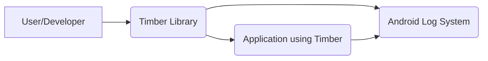
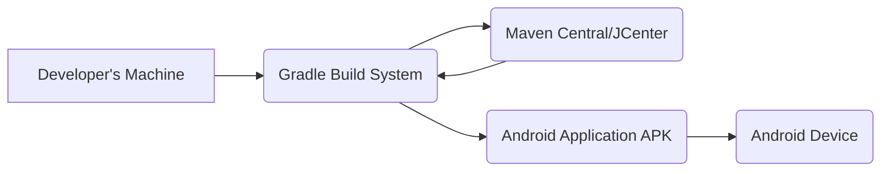

# Project Design Document: Timber

## BUSINESS POSTURE

Timber is a logging library for Android. It simplifies and enhances the standard Android logging mechanisms. Given its nature as a widely used open-source library, the business priorities and goals are centered around developer experience, maintainability, and stability.

Priorities and Goals:

*   Provide a simple, easy-to-use API for logging.
*   Enhance the built-in Android logging capabilities.
*   Maintain backward compatibility as much as possible.
*   Ensure high performance and minimal overhead.
*   Foster a healthy open-source community.
*   Ensure stability and prevent regressions.

Business Risks:

*   Introduction of bugs or performance regressions that impact applications using Timber.
*   Lack of adoption due to complexity or incompatibility.
*   Inability to keep up with changes in the Android platform.
*   Security vulnerabilities that could be exploited through logging mechanisms.
*   Reputational damage due to unresolved issues or lack of maintenance.

## SECURITY POSTURE

Timber, as a logging library, has a relatively small attack surface. However, improper use of logging can lead to security vulnerabilities. The library itself doesn't handle sensitive data directly, but it's crucial to ensure that developers using Timber don't inadvertently log sensitive information.

Existing Security Controls:

*   security control: The library's API design encourages structured logging, which can help in auditing and analysis. (Described in the library's README and documentation).
*   security control: The library itself does not persist logs; it relies on the underlying Android logging system. (Implicit in the design and documented behavior).
*   security control: Code reviews and static analysis are used during development. (Inferred from the project's contribution guidelines and open-source nature).

Accepted Risks:

*   accepted risk: Developers might log sensitive data, despite best practices. This is a risk inherent in any logging system and is mitigated through developer education and best practices.
*   accepted risk: The library depends on the security of the underlying Android logging system. Vulnerabilities in the Android platform itself are outside the control of Timber.

Recommended Security Controls:

*   security control: Integrate with linting tools to detect potential logging of sensitive data (e.g., PII, credentials).
*   security control: Provide clear documentation and examples on secure logging practices, emphasizing the risks of logging sensitive information.
*   security control: Regularly audit the codebase for potential vulnerabilities, especially related to format string bugs or injection vulnerabilities.

Security Requirements:

*   Authentication: Not applicable, as Timber is a library and doesn't handle authentication.
*   Authorization: Not applicable, as Timber is a library and doesn't handle authorization.
*   Input Validation: Timber itself doesn't handle user input directly. However, developers should be cautious about logging unvalidated user input, as this could lead to log injection vulnerabilities.
*   Cryptography: Not directly applicable. Timber doesn't handle encryption. However, developers should avoid logging sensitive data that should be encrypted.

## DESIGN

### C4 CONTEXT

Element Descriptions:

*   Element 1
    *   Name: User/Developer
    *   Type: Person
    *   Description: The developer integrating Timber into their Android application.
    *   Responsibilities: Uses Timber's API to write log messages.
    *   Security controls: Follows secure coding practices, avoids logging sensitive data.

*   Element 2
    *   Name: Timber Library
    *   Type: Software Library
    *   Description: The Timber logging library.
    *   Responsibilities: Provides a simplified API for logging, enhances Android logging.
    *   Security controls: API design encourages structured logging, relies on Android logging system for persistence.

*   Element 3
    *   Name: Android Log System
    *   Type: System
    *   Description: The underlying Android logging system (Logcat).
    *   Responsibilities: Handles the actual storage and retrieval of log messages.
    *   Security controls: Relies on Android platform security.

*   Element 4
    *   Name: Application using Timber
    *   Type: Software System
    *   Description: Android application that uses Timber for logging.
    *   Responsibilities: Runs on Android device, uses Timber for logging.
    *   Security controls: Follows secure coding practices, avoids logging sensitive data.

### C4 CONTAINER

Since Timber is a simple library, the container diagram is essentially the same as the context diagram. It doesn't have separate deployable units.

Element Descriptions:

*   Element 1
    *   Name: User/Developer
    *   Type: Person
    *   Description: The developer integrating Timber into their Android application.
    *   Responsibilities: Uses Timber's API to write log messages.
    *   Security controls: Follows secure coding practices, avoids logging sensitive data.

*   Element 2
    *   Name: Timber Library
    *   Type: Software Library
    *   Description: The Timber logging library.
    *   Responsibilities: Provides a simplified API for logging, enhances Android logging.
    *   Security controls: API design encourages structured logging, relies on Android logging system for persistence.

*   Element 3
    *   Name: Android Log System
    *   Type: System
    *   Description: The underlying Android logging system (Logcat).
    *   Responsibilities: Handles the actual storage and retrieval of log messages.
    *   Security controls: Relies on Android platform security.

*   Element 4
    *   Name: Application using Timber
    *   Type: Software System
    *   Description: Android application that uses Timber for logging.
    *   Responsibilities: Runs on Android device, uses Timber for logging.
    *   Security controls: Follows secure coding practices, avoids logging sensitive data.

### DEPLOYMENT

Timber is a library, not a standalone application. Therefore, it's deployed as part of an Android application. The deployment process involves including Timber as a dependency in the application's build configuration (typically using Gradle).

Possible deployment solutions:

1.  Include Timber as a dependency using Gradle.
2.  Manually include the Timber JAR file in the project.

Chosen solution (most common and recommended): Include Timber as a dependency using Gradle.

Element Descriptions:

*   Element 1
    *   Name: Developer's Machine
    *   Type: Device
    *   Description: The machine where the Android application is developed.
    *   Responsibilities: Hosts the source code, build tools, and development environment.
    *   Security controls: Standard development environment security practices.

*   Element 2
    *   Name: Gradle Build System
    *   Type: Software System
    *   Description: The build system used for Android applications.
    *   Responsibilities: Manages dependencies, compiles code, packages the application.
    *   Security controls: Dependency verification, build process integrity checks.

*   Element 3
    *   Name: Maven Central/JCenter
    *   Type: Repository
    *   Description: Repositories hosting the Timber library artifact.
    *   Responsibilities: Provides the Timber library for download.
    *   Security controls: Repository security measures, artifact signing.

*   Element 4
    *   Name: Android Application APK
    *   Type: Artifact
    *   Description: The packaged Android application, including Timber.
    *   Responsibilities: The deployable unit for the Android application.
    *   Security controls: Code signing, Android platform security.

*   Element 5
    *   Name: Android Device
    *   Type: Device
    *   Description: The device where the application is installed and run.
    *   Responsibilities: Executes the Android application.
    *   Security controls: Android platform security, app permissions.

### BUILD

Timber's build process is automated using Gradle. The project likely uses a CI/CD system (e.g., GitHub Actions, Travis CI) to build and test the library on every commit.

Security Controls in Build Process:

*   security control: Dependency Management: Gradle manages dependencies, ensuring that the correct versions of libraries are used.
*   security control: Static Analysis: The project likely uses static analysis tools (e.g., Lint) to identify potential code quality and security issues.
*   security control: Automated Testing: The project has a suite of unit tests to ensure the library functions correctly and to prevent regressions.
*   security control: CI/CD: The use of a CI/CD system ensures that the build and test process is consistent and repeatable.

## RISK ASSESSMENT

Critical Business Processes:

*   Providing a stable and reliable logging library for Android developers.
*   Maintaining the trust of the developer community.

Data Protection:

*   Timber itself does not handle or store any sensitive data. The primary concern is to prevent developers from inadvertently logging sensitive data using Timber. The sensitivity of the data logged is entirely dependent on the application using Timber.

## QUESTIONS & ASSUMPTIONS

Questions:

*   Are there any specific compliance requirements (e.g., GDPR, HIPAA) that applications using Timber typically need to adhere to? This would influence recommendations for secure logging practices.
*   What is the current process for handling security vulnerabilities reported in Timber?
*   What static analysis tools are currently used in the build process?
*   Is there a code coverage target for the unit tests?

Assumptions:

*   BUSINESS POSTURE: The primary goal is to provide a useful and reliable logging library for the Android developer community.
*   SECURITY POSTURE: Developers using Timber are responsible for ensuring they do not log sensitive data.
*   DESIGN: Timber relies on the underlying Android logging system for persistence and does not introduce its own storage mechanisms. The build process uses Gradle and a CI/CD system.