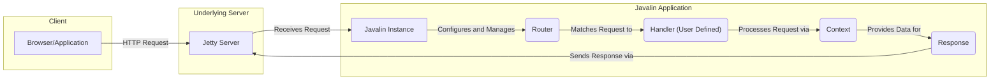
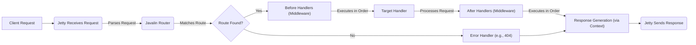
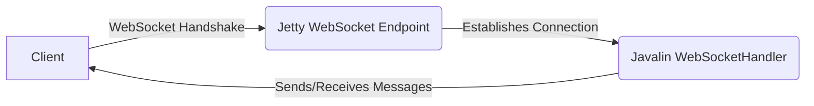

# Project Design Document: Javalin Web Framework

**Version:** 1.1
**Date:** October 26, 2023
**Author:** AI Software Architect

## 1. Introduction

This document provides an enhanced design overview of the Javalin web framework, building upon the previous version. Javalin is a lightweight and approachable web framework for Kotlin and Java, emphasizing simplicity and developer productivity. This document details the key architectural components, the flow of requests and data, and crucial security considerations, making it a robust foundation for subsequent threat modeling activities.

## 2. Goals and Objectives

*   To present a refined and more detailed architectural overview of the Javalin framework.
*   To clearly identify and describe the responsibilities of each key component and their interactions within the framework.
*   To provide a comprehensive explanation of the request lifecycle within Javalin, highlighting critical stages.
*   To explicitly outline potential security considerations and map them to relevant architectural components and data flows.
*   To serve as a precise and actionable resource for future threat modeling exercises, enabling targeted security analysis.

## 3. High-Level Architecture

Javalin leverages the embedded Jetty web server to handle HTTP requests. It offers a streamlined API for defining routes, processing requests through handlers, and managing application state. The design prioritizes ease of use and performance.

*   **Client:** Any entity initiating an HTTP request to the Javalin application, such as a web browser, a mobile application, or another service.
*   **Javalin Instance:** The central component of the framework, responsible for initializing and managing the embedded Jetty server, configuring routes, and orchestrating the request handling process.
*   **Router:**  The component responsible for inspecting incoming HTTP requests and mapping them to the appropriate user-defined `Handler` based on the request method and URL path.
*   **Handler (User Defined):**  The developer-implemented logic that processes a specific type of request. It receives a `Context` object containing request information and uses it to generate a response.
*   **Context:**  A crucial object that encapsulates all information related to the current HTTP request and response. It provides methods to access request parameters, headers, body, and to manipulate the response.
*   **Response:**  Represents the HTTP response being constructed, allowing the handler to set the status code, headers, and body content.
*   **Jetty Server:** The underlying, high-performance web server that handles the low-level network communication, request parsing, and response transmission.

## 4. Detailed Design

### 4.1. Core Components

*   **`Javalin` Class:** The primary class for bootstrapping and configuring a Javalin application. It initializes the embedded Jetty server, registers routes, and manages application lifecycle events.
*   **`Router` Interface (and Implementations):**  Defines the contract for mapping HTTP requests to their corresponding handlers. Implementations handle different routing strategies and parameter extraction.
*   **`Handler` Interface:** A functional interface that developers implement to define the core logic for processing incoming requests. It receives a `Context` object as its sole argument.
*   **`Context` Class:** A central data structure providing access to both request and response information. Key functionalities include:
    *   Accessing request parameters: `pathParam()`, `queryParam()`, `formParam()`.
    *   Retrieving request headers: `header()`, `req().getHeader()`.
    *   Reading the request body: `body()`, `bodyAsClass()`.
    *   Setting the response status code: `status()`.
    *   Setting response headers: `header()`.
    *   Setting the response body: `result()`, `json()`, `html()`, `render()`.
    *   Managing user sessions: `sessionAttribute()`, `sessionAttributeMap()`.
    *   Storing request-scoped attributes: `attribute()`, `attributeMap()`.
*   **`Response` Class (Implicit):** While not a directly instantiated class by the user, the `Context` object provides methods that manipulate the underlying response object managed by Jetty.
*   **`Request` Class (Accessed via Context):**  Provides access to the underlying Jetty request object, offering more fine-grained control over request details.
*   **`ErrorHandler` Interface:** Allows developers to define custom logic for handling specific HTTP error status codes (e.g., 404 Not Found, 500 Internal Server Error).
*   **`ExceptionHandler` Interface:** Enables developers to implement centralized exception handling for uncaught exceptions occurring within request handlers.
*   **`WebSocketHandler` Interface:** Provides the mechanism for handling WebSocket connections, defining callbacks for events like connection establishment, message reception, and connection closure.
*   **`EventListener` Interface:** Allows developers to register listeners for various Javalin lifecycle events, such as server startup, shutdown, and request processing stages.
*   **Middleware (Before/After Handlers):** Functions executed before or after the main request handler. They operate on the `Context` object and can be used for cross-cutting concerns like authentication, authorization, logging, request modification, and response enrichment.

### 4.2. Request Lifecycle

The following diagram illustrates the detailed flow of an HTTP request through a Javalin application:

*   **Client Request:** An HTTP request is initiated by a client targeting the Javalin application.
*   **Jetty Receives Request:** The embedded Jetty server receives the incoming HTTP request at the network level.
*   **Javalin Router:** Javalin's `Router` component analyzes the request method and URL path to find a matching route definition.
*   **Route Found?:** The router determines if a defined route matches the incoming request.
*   **Before Handlers (Middleware):** If a matching route is found, any registered "before" handlers (middleware) associated with that route are executed sequentially. These handlers can inspect or modify the request or response, perform authentication/authorization checks, or even halt the request processing.
*   **Target Handler:** The `Handler` function associated with the matched route is invoked. This is where the core application logic for processing the specific request resides. The handler receives the `Context` object.
*   **After Handlers (Middleware):** After the target handler completes its execution, any registered "after" handlers (middleware) for the route are executed in order. These handlers can perform tasks like logging, adding security headers, or modifying the final response.
*   **Response Generation (via Context):** The target handler and middleware manipulate the response by calling methods on the `Context` object (e.g., setting the response body, status code, and headers).
*   **Jetty Sends Response:** Jetty takes the generated response from the `Context` and sends it back to the requesting client.
*   **Error Handler (e.g., 404):** If no matching route is found, the configured `ErrorHandler` for the corresponding HTTP status code (e.g., 404 Not Found) is invoked to generate an appropriate error response.

### 4.3. Data Flow

Data within a Javalin application flows primarily through the `Context` object during the request lifecycle.

*   **Incoming Request Data:**
    *   The client sends data via the HTTP request (URL path, query parameters, request headers, request body).
    *   Jetty parses the raw request data.
    *   Javalin populates the `Context` object, making the parsed data accessible through methods like `ctx.pathParam()`, `ctx.queryParam()`, `ctx.header()`, and `ctx.body()`.
*   **Outgoing Response Data:**
    *   The target handler and middleware process the request data and generate the response.
    *   Response data (status code, headers, body) is set using methods on the `Context` object (e.g., `ctx.status()`, `ctx.header()`, `ctx.result()`, `ctx.json()`).
    *   Javalin utilizes the information in the `Context` to construct the HTTP response.
    *   Jetty transmits the constructed response back to the client.

### 4.4. WebSocket Communication

Javalin facilitates bidirectional, real-time communication using WebSockets.

*   **Client:** Initiates a WebSocket handshake with the Javalin application's WebSocket endpoint.
*   **Jetty WebSocket Endpoint:** Jetty manages the underlying WebSocket connection lifecycle and message framing.
*   **Javalin WebSocketHandler:** Developers implement the `WebSocketHandler` interface to define the application logic for handling WebSocket events, such as:
    *   `onConnect`: Called when a new WebSocket connection is established.
    *   `onMessage`: Called when a message is received from the client.
    *   `onClose`: Called when the WebSocket connection is closed.
    *   `onError`: Called when an error occurs on the WebSocket connection.
*   **Sends/Receives Messages:** Once the connection is established, both the client and the server can send and receive messages in real-time.

## 5. Security Considerations

This section details potential security considerations relevant to Javalin applications, providing a basis for threat modeling.

*   **Input Validation Vulnerabilities:**
    *   **Threat:** Malicious input injected through request parameters, headers, or the body can lead to vulnerabilities like Cross-Site Scripting (XSS), SQL Injection, Command Injection, and Path Traversal.
    *   **Javalin Components Involved:** `Context` (access to request data), `Handler` (processing of input).
    *   **Mitigation:** Implement robust input validation and sanitization within handlers before processing any user-provided data. Utilize parameterized queries for database interactions.
*   **Authentication and Authorization Weaknesses:**
    *   **Threat:** Lack of proper authentication allows unauthorized users to access the application. Weak or missing authorization controls can lead to privilege escalation.
    *   **Javalin Components Involved:** `Before Handlers` (for implementing authentication and authorization logic), `Context` (for accessing session information).
    *   **Mitigation:** Implement secure authentication mechanisms (e.g., OAuth 2.0, JWT). Enforce granular authorization checks based on user roles and permissions within middleware or handlers.
*   **Session Management Issues:**
    *   **Threat:** Insecure session handling can lead to session hijacking or fixation attacks.
    *   **Javalin Components Involved:** `Context` (session management methods).
    *   **Mitigation:** Use secure session IDs, implement proper session invalidation, and configure secure session attributes (e.g., `HttpOnly`, `Secure` flags).
*   **Cross-Site Request Forgery (CSRF):**
    *   **Threat:** Malicious websites can trick authenticated users into performing unintended actions on the Javalin application.
    *   **Javalin Components Involved:** `Handler` (processing state-changing requests).
    *   **Mitigation:** Implement CSRF protection mechanisms, such as synchronizer tokens, for state-changing requests.
*   **Security Header Misconfiguration:**
    *   **Threat:** Missing or misconfigured security headers can expose the application to various attacks (e.g., XSS, clickjacking).
    *   **Javalin Components Involved:** `After Handlers` (for setting response headers).
    *   **Mitigation:** Configure appropriate security headers like `Content-Security-Policy`, `Strict-Transport-Security`, `X-Frame-Options`, and `X-Content-Type-Options` within middleware.
*   **Dependency Vulnerabilities:**
    *   **Threat:** Vulnerabilities in Javalin's dependencies (including Jetty) can be exploited to compromise the application.
    *   **Javalin Components Involved:** The entire framework relies on its dependencies.
    *   **Mitigation:** Regularly update Javalin and its dependencies to the latest versions. Utilize dependency scanning tools to identify and address known vulnerabilities.
*   **Error Handling and Information Disclosure:**
    *   **Threat:** Verbose error messages exposed to clients can reveal sensitive information about the application's internal workings.
    *   **Javalin Components Involved:** `ErrorHandler`, `ExceptionHandler`.
    *   **Mitigation:** Implement custom error handling that logs detailed errors securely but provides generic error messages to clients.
*   **WebSocket Security Concerns:**
    *   **Threat:** Unsecured WebSocket connections can be intercepted. Lack of input validation on WebSocket messages can lead to vulnerabilities.
    *   **Javalin Components Involved:** `WebSocketHandler`.
    *   **Mitigation:** Use secure WebSocket connections (WSS). Implement input validation and authorization checks for WebSocket messages.
*   **Denial of Service (DoS) Attacks:**
    *   **Threat:** Attackers can overwhelm the application with excessive requests, making it unavailable to legitimate users.
    *   **Javalin Components Involved:** Jetty (handling incoming requests), `Handler` (resource consumption).
    *   **Mitigation:** Implement rate limiting, request size limits, and other DoS prevention mechanisms. Configure Jetty with appropriate timeouts and resource limits.
*   **Serialization and Deserialization Vulnerabilities:**
    *   **Threat:** When handling serialized data (e.g., JSON, XML), vulnerabilities in the serialization/deserialization libraries can lead to remote code execution or other attacks.
    *   **Javalin Components Involved:** `Context` (handling request bodies), `Handler` (processing serialized data).
    *   **Mitigation:** Use secure serialization libraries and avoid deserializing data from untrusted sources without proper validation.

## 6. Deployment Considerations

*   Javalin applications are typically deployed as self-contained executable JAR files (uber JARs) that include the application code and the embedded Jetty server.
*   Common deployment environments include:
    *   Virtual Machines (VMs) on cloud providers or on-premises infrastructure.
    *   Containerization platforms like Docker and Kubernetes.
    *   Platform-as-a-Service (PaaS) offerings from cloud providers (e.g., Heroku, AWS Elastic Beanstalk).
*   Security considerations during deployment:
    *   Ensure the underlying operating system and infrastructure are securely configured and patched.
    *   Implement network security measures, such as firewalls and security groups, to restrict access to the application.
    *   Enforce HTTPS by configuring TLS/SSL certificates for secure communication.
    *   Implement robust logging and monitoring to detect and respond to security incidents.
    *   Follow the principle of least privilege when configuring user accounts and permissions.

## 7. Future Enhancements (Potential Security Focus)

*   **Built-in CSRF Protection:** Consider adding optional built-in middleware for CSRF protection to simplify secure development.
*   **Security Header Defaults:** Explore the possibility of providing sensible default security headers that can be easily customized.
*   **Integration with Security Auditing Tools:** Provide guidance or integrations with security scanning tools to help developers identify vulnerabilities.
*   **Improved Session Management Options:** Offer more configurable and secure session management options out-of-the-box.
*   **Rate Limiting Middleware:** Include optional middleware for rate limiting to mitigate DoS attacks.

This improved design document provides a more detailed and structured understanding of the Javalin web framework, specifically focusing on aspects relevant to security. It serves as a valuable resource for conducting thorough threat modeling and implementing secure Javalin applications.