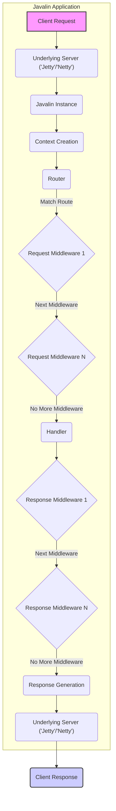

# Project Design Document: Javalin Web Framework

**Version:** 1.1
**Date:** October 26, 2023
**Author:** AI Software Architect

## 1. Introduction

This document provides an enhanced and more detailed design overview of the Javalin web framework. Javalin is a lightweight and developer-friendly web framework for Kotlin and Java, built upon either the Jetty or Netty embedded HTTP server. This document aims to provide a comprehensive and granular understanding of Javalin's architecture, core components, and their interactions. This detailed design will serve as a robust foundation for subsequent threat modeling activities, enabling a thorough analysis of potential security vulnerabilities.

## 2. Goals and Objectives

*   Provide an even more granular and precise description of Javalin's architecture and its key components, including sub-components and their responsibilities.
*   Elaborate on the interactions and data flow between different parts of the framework with greater specificity.
*   Clearly identify potential areas of interest and specific attack vectors for security analysis and threat modeling.
*   Serve as a comprehensive and authoritative reference point for developers, security professionals, and auditors working with or evaluating the security posture of Javalin applications.

## 3. Target Audience

This document is intended for a more technical audience, including:

*   Software architects and senior developers responsible for the design and implementation of Javalin-based applications.
*   Security engineers, penetration testers, and security analysts performing in-depth threat modeling, security audits, and vulnerability assessments.
*   Developers contributing to the Javalin framework itself, requiring a deep understanding of its internals.
*   Anyone seeking a highly detailed and technical understanding of Javalin's internal workings for security analysis or advanced development purposes.

## 4. High-Level Overview

Javalin is architected for simplicity and efficiency, offering a streamlined approach to building web applications and RESTful APIs in Kotlin and Java. Its core design principles emphasize:

*   **Microframework Design:**  Focuses on essential web framework functionalities without unnecessary abstractions or complexities.
*   **Intuitive API:** Provides a developer-friendly and easy-to-learn API, reducing the learning curve and development time.
*   **Flexible Routing Mechanism:** Offers a powerful and expressive routing system for mapping HTTP requests to specific handlers.
*   **Handler-Centric Model:**  Emphasizes the use of handlers (functional interfaces or lambdas) as the primary unit for processing requests and generating responses.
*   **Extensible Middleware Pipeline:**  Supports a robust middleware pipeline for intercepting and processing requests and responses, enabling cross-cutting concerns.
*   **Embedded Server Reliance:**  Leverages the capabilities of either the Jetty or Netty embedded HTTP server for handling network communication.
*   **Plugin-Based Extensibility:**  Allows for extending the framework's functionality through a well-defined plugin mechanism.

## 5. Detailed Design

### 5.1 Core Components (Detailed)

*   **`Javalin` Class:**
    *   Manages the lifecycle of the embedded server (Jetty or Netty).
    *   Holds the central `Router` instance.
    *   Provides methods for registering routes, middleware, exception handlers, and error mappers.
    *   Configures server settings (port, host, SSL, etc.).
    *   Manages application lifecycle events.
    *   Handles plugin registration and initialization.
*   **`Router`:**
    *   Maintains a collection of `RouteEntry` objects, each representing a specific route (method and path).
    *   Uses a matching algorithm to find the appropriate `RouteEntry` for an incoming request.
        *   Supports exact path matching.
        *   Supports path parameter matching using curly braces (e.g., `/users/{id}`).
        *   Supports wildcard matching (e.g., `/static/*`).
        *   Supports optional path parameters.
    *   Organizes routes into groups for better management.
    *   Provides methods for registering handlers for different HTTP methods.
*   **`Context` (or `ContextImpl`):**
    *   Provides access to the underlying `HttpServletRequest` and `HttpServletResponse` (when using Jetty).
    *   Offers convenient methods for accessing request data:
        *   `pathParam(name)`: Retrieves path parameters.
        *   `queryParam(name)`: Retrieves query parameters.
        *   `formParam(name)`: Retrieves form parameters.
        *   `body()`: Retrieves the raw request body.
        *   `bodyAsClass(Class)`: Attempts to parse the request body into an object.
        *   `header(name)`: Retrieves request headers.
        *   `cookie(name)`: Retrieves request cookies.
    *   Provides methods for setting the response:
        *   `status(code)`: Sets the HTTP status code.
        *   `header(name, value)`: Sets response headers.
        *   `cookie(name, value)`: Sets response cookies.
        *   `result(content)`: Sets the response body.
        *   `json(object)`: Serializes an object to JSON and sets the response body.
        *   `html(content)`: Sets the response body as HTML.
        *   `redirect(url)`: Sends a redirect response.
    *   Allows storing request-scoped attributes using `attribute(key, value)`.
*   **`Handler` Interface:**
    *   A functional interface with a single method: `handle(Context ctx)`.
    *   Implementations contain the core logic for processing a request and generating a response.
*   **`ExceptionHandler` Interface:**
    *   A functional interface with a single method: `handle(Exception e, Context ctx)`.
    *   Allows for custom handling of specific exception types.
*   **`ErrorMapper`:**
    *   Maps exceptions to HTTP status codes and can be used to customize error responses.
    *   Provides a default mapping for common exceptions.
*   **`LifecycleEvent`:**
    *   Enumerates different stages in the application lifecycle: `SERVER_STARTING`, `SERVER_STARTED`, `SERVER_STOPPING`, `SERVER_STOPPED`.
    *   Allows registering listeners to execute code at specific lifecycle stages.
*   **`Plugin` Interface:**
    *   Provides methods for initializing and applying plugin functionality to the `Javalin` instance.
    *   Plugins can register routes, middleware, exception handlers, and modify the application's configuration.

### 5.2 Request Processing Flow (Detailed)

1. **Request Reception:** The underlying embedded server (`Jetty` or `Netty`) receives an incoming HTTP request from a client.
2. **Socket Handling:** The server handles the low-level socket connection and parses the HTTP request.
3. **Context Instantiation:** Javalin creates a new `ContextImpl` object associated with the incoming request, encapsulating request and response information.
4. **Route Matching:** The `Router` iterates through its registered `RouteEntry` objects to find a match based on the request method and path. The matching process considers path parameters and wildcards.
5. **Request Middleware Execution:** If a matching route is found, the registered request middleware for that route (or globally registered middleware) is executed sequentially in the order of registration.
    *   Each middleware component receives the `Context` object.
    *   Middleware can inspect and modify the request, set attributes on the `Context`, or terminate the request processing early by setting a response.
6. **Handler Invocation:** Once all applicable request middleware has been executed, the `Handler` associated with the matched route is invoked, receiving the `Context` object.
    *   The `Handler`'s logic processes the request data available in the `Context`.
    *   The `Handler` sets the response details (status, headers, body) using methods on the `Context`.
7. **Response Middleware Execution:** After the `Handler` has executed, the registered response middleware for that route (or globally registered middleware) is executed in reverse order of registration.
    *   Response middleware can inspect and modify the response before it is sent to the client.
    *   This is a common place for tasks like logging, setting security headers, or compressing the response.
8. **Response Generation:** Javalin uses the information in the `Context` to construct the HTTP response.
9. **Response Transmission:** The underlying embedded server sends the generated HTTP response back to the client over the network.
10. **Exception Handling:** If an exception is thrown at any point during the request processing (within middleware or the handler), Javalin's exception handling mechanism is triggered.
    *   The `ErrorMapper` is consulted to determine the appropriate HTTP status code for the exception.
    *   The registered `ExceptionHandler` for the specific exception type (or a more general handler) is invoked with the exception and the `Context`.
    *   The `ExceptionHandler` can log the error, set a custom error response, or perform other error handling logic.

### 5.3 Key Functionalities (Enhanced)

*   **Routing:**
    *   Explicit registration of routes for different HTTP methods (GET, POST, PUT, DELETE, PATCH, HEAD, OPTIONS).
    *   Support for asynchronous handlers (using Kotlin coroutines or Java futures).
    *   Route groups for logical organization and applying shared middleware.
    *   Accessing matched path parameters by name.
    *   Optional path parameters using a question mark (e.g., `/users/{id}?`).
*   **Request Handling:**
    *   Direct access to the underlying `HttpServletRequest` for advanced use cases.
    *   Convenient methods for accessing various parts of the request (parameters, headers, cookies, body).
    *   Automatic parsing of JSON and XML request bodies into objects.
    *   Support for multipart form data and file uploads with configurable size limits and storage options.
*   **Response Handling:**
    *   Setting custom HTTP status codes.
    *   Setting multiple response headers.
    *   Setting and clearing cookies with various attributes (e.g., `HttpOnly`, `Secure`, `Max-Age`).
    *   Sending different content types (text, JSON, HTML, XML, binary).
    *   Streaming large responses efficiently.
    *   Implementing HTTP redirects with different status codes (e.g., 302 Found, 301 Moved Permanently).
    *   Serving static files from specified directories.
*   **Middleware:**
    *   Global middleware that applies to all routes.
    *   Route-specific middleware that applies only to certain routes or route groups.
    *   Order of middleware execution is determined by the order of registration.
    *   Middleware can access and modify both the request and the response.
    *   Middleware can be used for authentication, authorization, logging, request modification, response modification, and more.
*   **Data Binding and Validation:**
    *   Integration with popular JSON and XML libraries (e.g., Jackson, Gson, JAXB).
    *   Methods for easily parsing request bodies into data classes.
    *   Integration with validation libraries like Jakarta Bean Validation (using annotations).
    *   Customizable data binding and validation logic.
*   **WebSockets:**
    *   Registering WebSocket handlers for specific paths.
    *   Access to WebSocket sessions for sending and receiving messages.
    *   Handling WebSocket events (open, close, message, error).
    *   Support for broadcasting messages to multiple connected clients.
*   **Server-Sent Events (SSE):**
    *   Registering SSE endpoints for pushing real-time updates to clients.
    *   Sending SSE events with custom data and event types.
*   **OpenAPI (Swagger) Integration:**
    *   Libraries and plugins for generating OpenAPI specifications from Javalin route definitions and handler code.
    *   Integration with Swagger UI for visualizing and interacting with the API documentation.
*   **Testing Support:**
    *   Utilities for programmatically sending requests to a running Javalin application.
    *   Assertions for verifying response status codes, headers, and bodies.
    *   Mocks and test doubles for isolating components during testing.

### 5.4 Underlying Servers

*   **Jetty:**
    *   A fully featured and widely adopted Java HTTP server and Servlet container.
    *   Provides robust support for various web protocols and features.
    *   Well-integrated with the Java ecosystem.
*   **Netty:**
    *   A high-performance, asynchronous event-driven network application framework.
    *   Offers fine-grained control over network operations.
    *   Known for its speed and scalability.

The choice of server is typically configured when creating the `Javalin` instance.

### 5.5 Configuration (Detailed)

*   **Fluent API:**  Configuration options are chained together when creating the `Javalin` instance, providing a readable and concise way to configure the application.
*   **Configuration Objects:**  Allows for more structured configuration using dedicated configuration classes (e.g., `ServerConfig`, `HttpConfig`).
*   **Plugin Configuration:**  Plugins can introduce their own configuration options and mechanisms.
*   **Common Configuration Options:**
    *   Setting the server port and host address.
    *   Configuring SSL/TLS with certificates and key stores.
    *   Enabling and configuring static file serving with options for caching and directory listing.
    *   Customizing access logging formats and destinations.
    *   Registering custom exception handlers and error mappers.
    *   Integrating with dependency injection frameworks (e.g., Guice, Spring).
    *   Setting timeouts for requests and connections.
    *   Configuring WebSocket behavior.
    *   Customizing the underlying HTTP server's settings.

## 6. Data Flow Diagram

## 7. Security Considerations (Enhanced)

This section expands on potential security considerations, providing more specific examples and potential mitigation strategies:

*   **Input Validation Vulnerabilities:**
    *   **Threat:**  Failure to validate user input can lead to injection attacks (SQL injection, command injection, LDAP injection), cross-site scripting (XSS), and other vulnerabilities.
    *   **Examples:**  Not validating path parameters before using them in database queries, not sanitizing user-provided HTML before rendering it.
    *   **Mitigation:** Implement robust input validation using techniques like whitelisting, regular expressions, and data type checking. Utilize validation libraries and frameworks. Sanitize user-supplied data before rendering it in HTML to prevent XSS.
*   **Authentication and Authorization Flaws:**
    *   **Threat:**  Weak or missing authentication and authorization mechanisms can allow unauthorized access to sensitive resources and functionalities.
    *   **Examples:**  Using weak password hashing algorithms, not verifying user roles before granting access to certain endpoints, insecure session management.
    *   **Mitigation:** Implement strong authentication mechanisms (e.g., multi-factor authentication). Use secure password hashing algorithms (e.g., bcrypt, Argon2). Implement proper authorization checks based on user roles or permissions. Securely manage user sessions and tokens.
*   **Cross-Site Scripting (XSS) Attacks:**
    *   **Threat:**  Exploiting vulnerabilities to inject malicious scripts into web pages viewed by other users.
    *   **Examples:**  Displaying user-generated content without proper encoding, allowing users to inject JavaScript into form fields.
    *   **Mitigation:**  Sanitize user input before rendering it in HTML. Use context-aware output encoding. Implement a Content Security Policy (CSP) to restrict the sources from which the browser can load resources.
*   **Cross-Site Request Forgery (CSRF) Attacks:**
    *   **Threat:**  Tricking authenticated users into performing unintended actions on a web application.
    *   **Examples:**  Embedding malicious links or forms in emails or on other websites that target authenticated users of the application.
    *   **Mitigation:**  Implement CSRF protection mechanisms, such as synchronizer tokens (CSRF tokens) or the SameSite cookie attribute.
*   **Dependency Vulnerabilities:**
    *   **Threat:**  Using vulnerable versions of Javalin or its dependencies (including the underlying server) can expose the application to known security flaws.
    *   **Mitigation:**  Regularly update Javalin and its dependencies to the latest stable versions. Use dependency scanning tools to identify and address known vulnerabilities.
*   **Insecure Error Handling:**
    *   **Threat:**  Exposing detailed error messages to clients can reveal sensitive information about the application's internal workings, aiding attackers.
    *   **Mitigation:**  Implement generic error pages for production environments. Log detailed error information securely on the server-side. Avoid exposing stack traces or sensitive data in error responses.
*   **Denial of Service (DoS) and Rate Limiting:**
    *   **Threat:**  Attackers can overwhelm the application with a large number of requests, making it unavailable to legitimate users.
    *   **Mitigation:**  Implement rate limiting to restrict the number of requests from a single IP address or user within a given time period. Use techniques like request filtering and load balancing to mitigate DoS attacks.
*   **WebSocket Security Risks:**
    *   **Threat:**  Vulnerabilities in WebSocket implementations or usage can lead to unauthorized access, data injection, or denial of service.
    *   **Mitigation:**  Authenticate and authorize WebSocket connections. Validate and sanitize data received over WebSockets. Implement rate limiting for WebSocket messages.
*   **File Upload Vulnerabilities:**
    *   **Threat:**  Improperly handled file uploads can allow attackers to upload malicious files that can be executed on the server or used for other attacks.
    *   **Mitigation:**  Validate file types and sizes. Sanitize file names. Store uploaded files in a secure location outside the webroot. Implement virus scanning for uploaded files.
*   **CORS Misconfiguration:**
    *   **Threat:**  Incorrectly configured Cross-Origin Resource Sharing (CORS) policies can allow unauthorized access to the application's APIs from unintended domains.
    *   **Mitigation:**  Carefully configure CORS policies to allow only trusted origins to access resources. Avoid using overly permissive wildcard configurations.
*   **Exposure of Sensitive Information in OpenAPI:**
    *   **Threat:**  If OpenAPI documentation is publicly accessible, it might inadvertently reveal sensitive information about the API endpoints, parameters, or data structures.
    *   **Mitigation:**  Restrict access to OpenAPI documentation in production environments. Carefully review the generated documentation to ensure it does not expose sensitive details.
*   **Missing Security Headers:**
    *   **Threat:**  Not setting appropriate security headers can leave the application vulnerable to various attacks.
    *   **Mitigation:**  Implement security headers like `Content-Security-Policy`, `Strict-Transport-Security`, `X-Frame-Options`, `X-Content-Type-Options`, and `Referrer-Policy` to enhance security.

## 8. Deployment Considerations (Refined)

Javalin applications, typically packaged as executable JAR files (uber JARs or fat JARs), can be deployed in various environments:

*   **Traditional Infrastructure:**  Deployment on physical servers, virtual machines, or cloud-based instances (e.g., AWS EC2, Azure Virtual Machines, GCP Compute Engine).
*   **Containerized Environments:**  Deployment within Docker containers, orchestrated by platforms like Kubernetes, Docker Swarm, or cloud container services (e.g., AWS ECS, Azure Kubernetes Service, Google Kubernetes Engine).
*   **Platform as a Service (PaaS):**  Deployment on PaaS offerings that support Java applications (e.g., Heroku, AWS Elastic Beanstalk, Google App Engine).
*   **Serverless Computing (with limitations):** While Javalin is designed for long-running server processes, it might be possible to adapt it for serverless environments using custom runtimes or container-based serverless solutions (e.g., AWS Lambda with container images, Azure Container Apps). However, considerations around cold starts and the stateless nature of serverless functions need to be addressed.

## 9. Conclusion

This enhanced design document provides a more granular and detailed overview of the Javalin web framework's architecture and functionalities. The expanded security considerations section highlights specific potential vulnerabilities and mitigation strategies, making this document a valuable resource for in-depth threat modeling and security analysis. This comprehensive design serves as a solid foundation for building secure and robust web applications with Javalin.