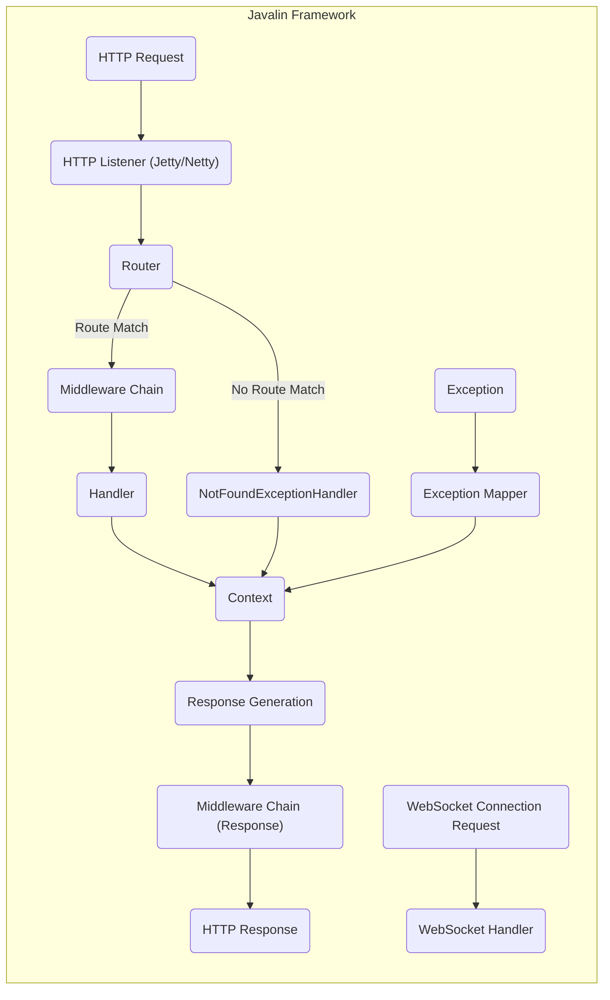

# Project Design Document: Javalin Web Framework

**Version:** 1.1
**Date:** October 26, 2023
**Author:** AI Software Architect

## 1. Introduction

This document provides a detailed architectural design of the Javalin web framework. It outlines the key components, their interactions, and the overall structure of the framework. This document is specifically designed to serve as a foundation for subsequent threat modeling activities, enabling a comprehensive understanding of potential security vulnerabilities and attack surfaces within Javalin applications.

## 2. System Overview

Javalin is a lightweight web framework for Kotlin and Java, inspired by the simplicity of Node.js's Express and Ruby's Sinatra. It empowers developers to rapidly build web applications and APIs with minimal boilerplate. Javalin prioritizes a straightforward and intuitive API while leveraging the performance and robustness of the Java Virtual Machine (JVM). Understanding Javalin's architecture is crucial for identifying potential entry points and data flows that could be targeted by malicious actors.

## 3. Architectural Design

The core of Javalin centers around the processing of incoming HTTP requests and their routing to appropriate handlers. The architecture can be dissected into the following key components, each representing a potential area for security scrutiny:

*   **HTTP Listener:** This component is responsible for accepting incoming network connections on specified ports and parsing raw network data into HTTP requests. It typically relies on a robust server implementation like Jetty or Netty. *From a security perspective, this is the initial entry point for all external interactions.*
*   **Router:** The router is the central decision-making component, responsible for mapping incoming request paths and HTTP methods to specific user-defined handlers. It maintains a registry of route definitions. *Incorrectly configured routes or vulnerabilities in the routing logic could lead to unauthorized access or information disclosure.*
*   **Handler:** A handler is a user-defined function or lambda expression that contains the application's business logic for processing a specific type of request. It receives the request context and generates a response. *Security vulnerabilities within handlers are a primary concern, as they directly process user input.*
*   **Context (Context):** An object that encapsulates all information pertaining to a single HTTP request and response cycle. This includes request parameters, headers, body, and the response object. *The Context object holds potentially sensitive data and its manipulation needs careful consideration.*
*   **Middleware:** Functions that intercept requests before they reach the final handler or responses before they are sent back to the client. Middleware forms a chain of responsibility and can be used for cross-cutting concerns like logging, authentication, authorization, request/response modification, and security headers. *Vulnerabilities in middleware can have a broad impact on the application's security posture.*
*   **Exception Mapper:** A component that intercepts exceptions thrown during request processing and translates them into appropriate HTTP error responses. *Improperly configured exception mappers can leak sensitive information through error messages.*
*   **WebSocket Handler:** Manages WebSocket connections, enabling bidirectional, full-duplex communication between the client and server. *WebSocket handlers introduce unique security considerations related to persistent connections and message handling.*
*   **Event Listener:** Provides hooks for various lifecycle events within the Javalin application, such as server start, stop, and request lifecycle events. *While not directly involved in request processing, event listeners can be points of interest for monitoring and potential security audits.*
*   **Plugin System:** Allows developers to extend Javalin's functionality by adding custom features and integrations. *Plugins, especially those from untrusted sources, can introduce security risks.*

## 4. Data Flow

Understanding how data flows through a Javalin application is crucial for identifying potential points of vulnerability. The typical data flow for an HTTP request is as follows:

*   A client initiates an interaction by sending an **HTTP Request** to the server. *This is the initial point of untrusted data entry.*
*   The **HTTP Listener** receives the raw request data over the network. *Vulnerabilities here could involve malformed requests causing parsing errors or denial of service.*
*   The **HTTP Listener** parses the raw data into an HTTP request object and passes it to the **Router**.
*   The **Router** examines the request path and method to determine the appropriate handler. *Incorrect routing logic could lead to unauthorized access to resources.*
*   If a matching route is found, the request is passed through the **Middleware Chain**. *Each middleware component can inspect and potentially modify the request and response. Vulnerabilities in middleware can have cascading effects.*
*   Each piece of **Middleware** in the chain executes sequentially, potentially performing actions like authentication, authorization, logging, or header manipulation. *Bypass vulnerabilities in authentication or authorization middleware are critical security concerns.*
*   After the middleware chain, the designated **Handler** is invoked. *The handler processes the request, potentially interacting with databases, external APIs, or other resources. This is where application-specific vulnerabilities are most likely to reside.*
*   The **Handler** uses the **Context** object to access request data and to build the response. *Improper handling of user input within the handler can lead to injection vulnerabilities.*
*   The **Handler** generates a response, which is stored in the **Context** object.
*   The response then passes through the response **Middleware Chain**. *Middleware at this stage might add security headers or perform final modifications to the response.*
*   Finally, the **HTTP Listener** serializes the **HTTP Response** and sends it back to the client. *Vulnerabilities in response handling could lead to information leakage.*
*   If no matching route is found, the **NotFoundExceptionHandler** is invoked to generate a 404 response. *While seemingly benign, improperly handled 404s can sometimes reveal information about the application's structure.*
*   If an exception occurs during request processing, the **Exception Mapper** handles it and generates an appropriate error response. *Error responses should be carefully crafted to avoid disclosing sensitive information.*

For WebSocket connections:

*   A client initiates a WebSocket handshake via an HTTP request.
*   The **HTTP Listener** recognizes the upgrade request and hands it off to the **WebSocket Handler**.
*   The **WebSocket Handler** establishes a persistent, bidirectional connection. *Security considerations here include authentication, authorization, and preventing abuse of the persistent connection.*
*   Messages are exchanged directly between the client and the **WebSocket Handler**. *Input validation and output encoding are crucial for WebSocket messages to prevent injection attacks.*

## 5. Security Considerations (Pre-Threat Modeling)

This section highlights potential areas of security concern within the Javalin framework and applications built upon it, serving as a starting point for more detailed threat modeling:

*   **Input Validation:**  Applications must rigorously validate all user-provided data (request parameters, headers, body) to prevent injection attacks (e.g., SQL injection, cross-site scripting, command injection). *Failure to validate input is a leading cause of security vulnerabilities.*
*   **Authentication and Authorization:**  Robust mechanisms are needed to verify user identity and control access to resources. Javalin provides the tools to implement these, but the specific implementation is the developer's responsibility. *Weak or missing authentication and authorization are critical security flaws.*
*   **Session Management:**  Securely managing user sessions is essential to maintain state across multiple requests. This includes protecting session IDs from theft and preventing session fixation attacks. *Vulnerabilities in session management can lead to account compromise.*
*   **Cross-Site Scripting (XSS):**  Applications must prevent the injection of malicious scripts into web pages served to other users. This requires careful output encoding of user-generated content. *XSS attacks can lead to data theft, account hijacking, and defacement.*
*   **Cross-Site Request Forgery (CSRF):**  Protecting against unauthorized actions performed on behalf of an authenticated user requires implementing CSRF prevention measures like synchronizer tokens. *CSRF attacks can allow attackers to perform actions as a logged-in user.*
*   **Dependency Management:**  Maintaining up-to-date dependencies and being aware of known vulnerabilities in those dependencies is crucial. Tools like dependency checkers should be used regularly. *Vulnerable dependencies can be exploited to compromise the application.*
*   **Error Handling:**  Error messages should be carefully crafted to avoid leaking sensitive information about the application's internal workings. *Verbose error messages can aid attackers in reconnaissance.*
*   **Logging:**  Securely logging relevant events (authentication attempts, access to sensitive data, errors) is important for auditing and incident response. Logs should be protected from unauthorized access. *Insufficient or insecure logging can hinder security investigations.*
*   **WebSocket Security:**  WebSocket connections require careful consideration of authentication, authorization, and input validation to prevent abuse. *Unsecured WebSockets can be exploited for various attacks.*
*   **Denial of Service (DoS):**  Applications should be designed to withstand DoS attacks by implementing rate limiting, input validation, and resource management strategies. *DoS attacks can render the application unavailable.*
*   **HTTP Header Security:**  Properly configuring HTTP security headers (e.g., Content Security Policy, Strict-Transport-Security, X-Frame-Options) can mitigate various client-side attacks. *Missing or misconfigured security headers leave the application vulnerable.*
*   **Trust Boundaries:** Clearly defining trust boundaries within the application (e.g., between the framework and user-provided handlers, between different microservices) is essential for understanding potential attack vectors. *Data crossing trust boundaries should be treated with extra scrutiny.*

## 6. Technology Stack

Understanding the underlying technologies helps identify potential technology-specific vulnerabilities:

*   **Programming Languages:** Kotlin (primary), Java - *Potential vulnerabilities related to JVM and language-specific features.*
*   **Web Server:**  Jetty (default), Netty (optional) - *Known vulnerabilities in the web server implementation need to be considered.*
*   **JSON Handling:**  Jackson (default), Gson (optional) - *Vulnerabilities in JSON parsing libraries can lead to deserialization attacks.*
*   **Logging:** SLF4j - *Potential for log injection if not handled carefully.*
*   **Routing:**  Custom implementation within Javalin - *Vulnerabilities could exist in the routing logic itself.*
*   **WebSocket:**  Jetty's WebSocket implementation or Netty's WebSocket implementation - *Security considerations specific to the chosen WebSocket implementation.*

## 7. Deployment Model

The deployment model influences the attack surface and potential threats:

*   **Standalone JAR:**  Embedding Jetty and running the application directly using `java -jar`. *Security considerations related to the JVM and the application's direct exposure.*
*   **WAR file in a Servlet Container:** Deploying the application to a servlet container like Tomcat or GlassFish. *Security considerations related to the servlet container and its configuration.*
*   **Cloud Platforms:** Deployment on cloud platforms like AWS, Azure, or Google Cloud, often using containerization technologies like Docker. *Security considerations related to the cloud platform, container security, and network configuration.*

## 8. Assumptions and Constraints

*   It is assumed that the underlying operating system and network infrastructure are reasonably secure and patched against known vulnerabilities.
*   The security of user-provided handlers and middleware is the ultimate responsibility of the application developer. Javalin provides the framework, but developers must implement secure coding practices.
*   This document focuses on the core Javalin framework and does not delve into the specifics of individual applications built using Javalin.
*   The default configurations of Javalin's dependencies are considered as the baseline. Custom configurations might introduce additional security considerations.

## 9. Out of Scope

The following are explicitly outside the scope of this design document:

*   Specific application logic, business rules, and data models implemented using Javalin.
*   Detailed configuration and security hardening of the underlying web servers (Jetty/Netty).
*   Security of external services, databases, or third-party APIs that a Javalin application might interact with.
*   Detailed performance analysis, scalability considerations, or high-availability design.
*   Specific deployment configurations beyond the general models mentioned.

## 10. Future Considerations

*   Potential integration with more advanced security libraries or frameworks for authentication, authorization, and vulnerability scanning.
*   Enhancements to built-in security features within Javalin, such as more robust CSRF protection or default security headers.
*   Improved documentation and guidance on secure development practices specifically tailored for Javalin applications, including common pitfalls and best practices.
*   Consideration of security auditing tools and integration points to facilitate automated security assessments.

## 11. Trust Boundaries

Identifying trust boundaries is crucial for threat modeling. Key trust boundaries within a Javalin application include:

*   **Client Browser / External System <-> HTTP Listener:** Data entering the application from external sources is untrusted.
*   **HTTP Listener <-> Router:**  Parsed HTTP requests are generally considered trusted within the framework's core.
*   **Router <-> Middleware Chain:**  Requests passed to middleware are generally within the application's trust boundary, but individual middleware components might introduce vulnerabilities.
*   **Middleware Chain <-> Handler:**  Data passed to the handler should be treated with caution, as it originates from potentially untrusted user input.
*   **Javalin Framework <-> User-Provided Handlers/Middleware:**  User-provided code is a significant trust boundary, as vulnerabilities here are common.
*   **Javalin Application <-> External Services/Databases:** Interactions with external systems require careful security considerations, including authentication and data sanitization.

## 12. Assets

Identifying key assets helps prioritize threats. Important assets within a Javalin application include:

*   **User Data:** Personally identifiable information (PII), financial data, etc.
*   **Authentication Credentials:** Usernames, passwords, API keys.
*   **Session Data:** Information about active user sessions.
*   **Application Code:** The source code of the Javalin application.
*   **Configuration Data:** Sensitive configuration parameters, database connection strings.
*   **System Resources:** CPU, memory, network bandwidth.