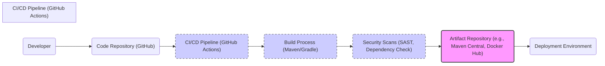

# BUSINESS POSTURE

- Business Priorities and Goals:
  - Javalin aims to provide a simple, lightweight, and modern HTTP server framework for Java and Kotlin developers.
  - It prioritizes ease of use and developer productivity, enabling rapid development of web applications and APIs.
  - It targets developers who need a less opinionated and more flexible alternative to full-fledged Java EE application servers or frameworks like Spring Boot for simpler web applications.
  - The project's goal is to offer a performant and reliable framework that simplifies web development in Java and Kotlin.

- Business Risks:
  - Risk of vulnerabilities in the Javalin framework itself, which could impact applications built on top of it.
  - Risk of insecure coding practices by developers using Javalin, leading to vulnerabilities in their applications.
  - Risk of lack of adoption if the framework does not meet developer needs or if better alternatives emerge.
  - Risk of insufficient community support or maintenance, potentially leading to unaddressed security issues or lack of updates.

# SECURITY POSTURE

- Existing Security Controls:
  - security control: Dependency management using Maven/Gradle, allowing for updates to address security vulnerabilities in dependencies. (Implemented in: build.gradle.kts, pom.xml)
  - security control: Open source project with community review, potentially leading to faster identification and resolution of security issues. (Implemented in: GitHub repository - public visibility and contribution model)
  - security control: Standard Java security features and libraries can be utilized within Javalin applications. (Implemented in: Developer responsibility when building applications)
  - security control: HTTPS support for secure communication. (Implemented in: Developer responsibility when configuring server)

- Accepted Risks:
  - accepted risk: Reliance on developers to implement security best practices in their applications built with Javalin.
  - accepted risk: Potential for vulnerabilities to be discovered in Javalin framework itself.
  - accepted risk: Security of applications depends on the security of underlying Java Virtual Machine (JVM) and operating system.

- Recommended Security Controls:
  - security control: Implement automated security scanning (SAST/DAST) in the Javalin project's CI/CD pipeline to identify potential vulnerabilities in the framework code.
  - security control: Provide security guidelines and best practices documentation for developers using Javalin to build secure applications.
  - security control: Encourage and facilitate security audits and penetration testing of Javalin framework by security experts.
  - security control: Establish a clear vulnerability reporting and response process for Javalin project.

- Security Requirements:
  - Authentication:
    - Requirement: Javalin should provide mechanisms for developers to easily implement various authentication methods (e.g., basic authentication, OAuth 2.0, JWT).
    - Requirement: Support for secure storage of credentials (e.g., using password hashing).
  - Authorization:
    - Requirement: Javalin should provide mechanisms for developers to implement fine-grained authorization controls to manage access to different parts of the application.
    - Requirement: Support for role-based access control (RBAC) and attribute-based access control (ABAC).
  - Input Validation:
    - Requirement: Javalin should encourage and facilitate input validation to prevent common vulnerabilities like injection attacks (SQL injection, cross-site scripting).
    - Requirement: Provide built-in mechanisms or recommendations for input sanitization and encoding.
  - Cryptography:
    - Requirement: Javalin should support and encourage the use of strong cryptography for protecting sensitive data in transit and at rest.
    - Requirement: Provide guidance on using secure cryptographic libraries and best practices.
    - Requirement: Support for TLS/SSL for secure communication over HTTPS.

# DESIGN

## C4 CONTEXT

```mermaid
flowchart LR
    subgraph "Organization"
        A("Web Application User")
        B("API Consumer")
    end
    C("Javalin Application")
    D("Database System")
    E("External API Services")

    A -->> C
    B -->> C
    C -->> D
    C -->> E

    style C fill:#f9f,stroke:#333,stroke-width:2px
```

- Elements of Context Diagram:
  - - Name: Web Application User
    - Type: Person
    - Description: End-users who interact with web applications built using Javalin through a web browser.
    - Responsibilities: Accessing and using the web application's features.
    - Security controls: Browser security controls, user authentication (handled by Javalin application).
  - - Name: API Consumer
    - Type: System
    - Description: External systems or applications that consume APIs exposed by Javalin applications.
    - Responsibilities: Integrating with and utilizing the API functionalities.
    - Security controls: API authentication and authorization mechanisms (handled by Javalin application), network security controls.
  - - Name: Javalin Application
    - Type: Software System
    - Description: The web application or API built using the Javalin framework. This is the system being designed.
    - Responsibilities: Handling user requests, processing business logic, interacting with databases and external services, and returning responses.
    - Security controls: Authentication, authorization, input validation, output encoding, session management, error handling, logging, monitoring (all implemented within the application).
  - - Name: Database System
    - Type: External System
    - Description: Database used by the Javalin application to store and retrieve data. Could be relational (e.g., PostgreSQL, MySQL) or NoSQL (e.g., MongoDB, Redis).
    - Responsibilities: Persisting application data, ensuring data integrity and availability.
    - Security controls: Database access controls, encryption at rest, network security, database auditing.
  - - Name: External API Services
    - Type: External System
    - Description: Third-party APIs or services that the Javalin application integrates with to extend its functionality (e.g., payment gateways, social media APIs).
    - Responsibilities: Providing external functionalities and data to the Javalin application.
    - Security controls: API keys, OAuth 2.0, network security, API rate limiting (provided by external services).

## C4 CONTAINER

```mermaid
flowchart LR
    subgraph "Javalin Application"
        direction TB
        A("Javalin Web Server")
        B("Application Logic")
        C("Data Access Layer")
    end
    D("Database System")
    E("External API Services")
    F("Web Browser")
    G("API Client")

    F -->> A
    G -->> A
    A -->> B
    B -->> C
    C -->> D
    B -->> E

    style A fill:#f9f,stroke:#333,stroke-width:2px
    style B fill:#f9f,stroke:#333,stroke-width:2px
    style C fill:#f9f,stroke:#333,stroke-width:2px
```

- Elements of Container Diagram:
  - - Name: Javalin Web Server
    - Type: Container - Web Server
    - Description: Embedded web server provided by Javalin framework, responsible for handling HTTP requests and responses. Typically uses Jetty or Netty as underlying server.
    - Responsibilities: HTTP request handling, routing, middleware execution, response generation, TLS termination.
    - Security controls: HTTPS configuration, request filtering, rate limiting, web server security configurations.
  - - Name: Application Logic
    - Type: Container - Application Code
    - Description: Contains the core business logic of the application, implemented using Java or Kotlin and Javalin framework APIs. Includes route handlers, controllers, and service classes.
    - Responsibilities: Business logic execution, request processing, data validation, authorization, interaction with data access layer and external services.
    - Security controls: Input validation, authorization logic, secure coding practices, output encoding, error handling, logging.
  - - Name: Data Access Layer
    - Type: Container - Application Code
    - Description: Responsible for interacting with the database system. Implements data access logic, queries, and data mapping. Can use ORM or raw SQL.
    - Responsibilities: Data persistence, data retrieval, database interaction, transaction management.
    - Security controls: Secure database connection management, parameterized queries or ORM usage to prevent SQL injection, data access authorization.
  - - Name: Database System
    - Type: External System
    - Description: Same as in Context Diagram.
    - Responsibilities: Same as in Context Diagram.
    - Security controls: Same as in Context Diagram.
  - - Name: External API Services
    - Type: External System
    - Description: Same as in Context Diagram.
    - Responsibilities: Same as in Context Diagram.
    - Security controls: Same as in Context Diagram.
  - - Name: Web Browser
    - Type: Person
    - Description: Same as Web Application User in Context Diagram.
    - Responsibilities: Same as Web Application User in Context Diagram.
    - Security controls: Same as Web Application User in Context Diagram.
  - - Name: API Client
    - Type: System
    - Description: Same as API Consumer in Context Diagram.
    - Responsibilities: Same as API Consumer in Context Diagram.
    - Security controls: Same as API Consumer in Context Diagram.

## DEPLOYMENT

- Deployment Options:
  - Option 1: Standalone deployment - Javalin application packaged as a JAR file and run directly on a server (physical or virtual).
  - Option 2: Containerized deployment - Javalin application containerized using Docker and deployed to container orchestration platforms like Kubernetes or Docker Swarm.
  - Option 3: Cloud Platform deployment - Deploying Javalin application to cloud platforms like AWS, Azure, or GCP using services like EC2, Azure VMs, or Google Compute Engine, or Platform-as-a-Service (PaaS) offerings.

- Detailed Deployment (Option 2: Containerized deployment with Docker and Kubernetes):

```mermaid
flowchart LR
    subgraph "Kubernetes Cluster"
        subgraph "Nodes"
            A("Node 1")
            B("Node 2")
        end
        C("Load Balancer")
    end

    subgraph "Node 1"
        D("Pod: Javalin App Instance 1")
    end

    subgraph "Node 2"
        E("Pod: Javalin App Instance 2")
    end

    F("Internet") -->> C
    C -->> D & E
    D -->> G("Database Service")
    E -->> G

    style A fill:#ccf,stroke:#333,stroke-width:1px,stroke-dasharray: 5 5
    style B fill:#ccf,stroke:#333,stroke-width:1px,stroke-dasharray: 5 5
    style D fill:#f9f,stroke:#333,stroke-width:2px
    style E fill:#f9f,stroke:#333,stroke-width:2px
```

- Elements of Deployment Diagram:
  - - Name: Kubernetes Cluster
    - Type: Environment - Container Orchestration Platform
    - Description: Kubernetes cluster responsible for managing and orchestrating containerized Javalin application instances.
    - Responsibilities: Container orchestration, scaling, health monitoring, service discovery, load balancing.
    - Security controls: Kubernetes RBAC, network policies, pod security policies, secrets management, cluster security hardening.
  - - Name: Nodes (Node 1, Node 2)
    - Type: Infrastructure - Compute Instance (Virtual Machines or Physical Servers)
    - Description: Worker nodes in the Kubernetes cluster where Javalin application pods are deployed and run.
    - Responsibilities: Running container workloads, providing compute resources.
    - Security controls: Operating system hardening, security patching, network security, access controls.
  - - Name: Pod: Javalin App Instance 1 & 2
    - Type: Container - Application Instance
    - Description: Instances of the Javalin application running as containers within Kubernetes pods.
    - Responsibilities: Handling application requests, executing business logic.
    - Security controls: Container image security scanning, resource limits, network isolation within pod, application-level security controls.
  - - Name: Load Balancer
    - Type: Infrastructure - Network Load Balancer
    - Description: Distributes incoming traffic from the internet to the Javalin application pods running in the Kubernetes cluster.
    - Responsibilities: Traffic distribution, load balancing, TLS termination.
    - Security controls: TLS configuration, DDoS protection, access control lists.
  - - Name: Database Service
    - Type: External System - Managed Database Service
    - Description: Managed database service (e.g., AWS RDS, Azure SQL Database, Google Cloud SQL) used by the Javalin application.
    - Responsibilities: Data persistence, database management, high availability.
    - Security controls: Database access controls, encryption at rest and in transit, database auditing, network security.
  - - Name: Internet
    - Type: Network - Public Network
    - Description: Public internet network from where users and API clients access the Javalin application.
    - Responsibilities: Providing network connectivity.
    - Security controls: Network security controls at organization perimeter, firewalls, intrusion detection/prevention systems.

## BUILD



- Elements of Build Diagram:
  - - Name: Developer
    - Type: Person
    - Description: Software developer writing and committing code for the Javalin application.
    - Responsibilities: Writing secure code, performing local testing, committing code changes.
    - Security controls: Secure development environment, code review, developer training on secure coding practices.
  - - Name: Code Repository (GitHub)
    - Type: System - Version Control System
    - Description: Git repository hosted on GitHub, used for source code management and collaboration.
    - Responsibilities: Source code storage, version control, collaboration, code review.
    - Security controls: Access control to repository, branch protection, audit logging, vulnerability scanning of repository.
  - - Name: CI/CD Pipeline (GitHub Actions)
    - Type: System - CI/CD Automation
    - Description: GitHub Actions workflows used for automating the build, test, security scanning, and deployment processes.
    - Responsibilities: Build automation, testing, security checks, artifact publishing, deployment automation.
    - Security controls: Secure pipeline configuration, access control to pipeline definitions, secret management for credentials, audit logging.
  - - Name: Build Process (Maven/Gradle)
    - Type: Tool - Build Automation Tool
    - Description: Maven or Gradle build tools used to compile the code, manage dependencies, and package the application.
    - Responsibilities: Code compilation, dependency management, artifact packaging (JAR, Docker image).
    - Security controls: Dependency vulnerability scanning, build tool security configurations, secure dependency resolution.
  - - Name: Security Scans (SAST, Dependency Check)
    - Type: Tool - Security Scanning Tools
    - Description: Static Application Security Testing (SAST) tools and dependency check tools integrated into the CI/CD pipeline to identify vulnerabilities in the code and dependencies.
    - Responsibilities: Static code analysis, dependency vulnerability scanning, reporting security findings.
    - Security controls: Configuration of security scanning tools, vulnerability reporting and tracking, integration with CI/CD pipeline.
  - - Name: Artifact Repository (e.g., Maven Central, Docker Hub)
    - Type: System - Artifact Repository
    - Description: Repository for storing and distributing build artifacts (e.g., JAR files, Docker images). Could be public (Maven Central, Docker Hub) or private.
    - Responsibilities: Artifact storage, versioning, distribution.
    - Security controls: Access control to repository, artifact signing, vulnerability scanning of artifacts, audit logging.
  - - Name: Deployment Environment
    - Type: Environment - Target Deployment Environment
    - Description: Target environment where the Javalin application is deployed (e.g., Kubernetes cluster, cloud platform).
    - Responsibilities: Running the application, providing runtime environment.
    - Security controls: Environment security hardening, runtime security controls, monitoring and logging.

# RISK ASSESSMENT

- Critical Business Processes:
  - The critical business processes depend on the applications built using Javalin. Examples include:
    - E-commerce transactions processing.
    - User authentication and authorization for accessing services.
    - Data processing and analytics pipelines.
    - Communication and messaging platforms.
  - Protecting these processes is crucial for business continuity and reputation.

- Data Sensitivity:
  - Data sensitivity depends on the applications built using Javalin. Potential data types include:
    - Personally Identifiable Information (PII) of users (e.g., names, addresses, emails, phone numbers).
    - Financial data (e.g., credit card details, bank account information).
    - Authentication credentials (e.g., passwords, API keys).
    - Business-sensitive data (e.g., trade secrets, intellectual property).
  - Sensitivity levels can range from public to confidential, requiring appropriate security controls based on classification.

# QUESTIONS & ASSUMPTIONS

- Questions:
  - What type of applications are primarily being built with Javalin (web applications, APIs, microservices)?
  - What are the specific compliance requirements for applications built with Javalin (e.g., GDPR, HIPAA, PCI DSS)?
  - What is the organization's risk appetite regarding security vulnerabilities in open-source frameworks?
  - What are the existing security tools and processes in place for software development and deployment?
  - What is the expected scale and performance requirements for applications built with Javalin?

- Assumptions:
  - Assumption: Javalin is used to build web applications and APIs that handle sensitive data.
  - Assumption: Security is a high priority for organizations using Javalin.
  - Assumption: Developers using Javalin have some level of security awareness but may need guidance on secure coding practices specific to Javalin.
  - Assumption: Applications built with Javalin will be deployed in cloud or containerized environments.
  - Assumption: Automated CI/CD pipelines are used for building and deploying Javalin applications.