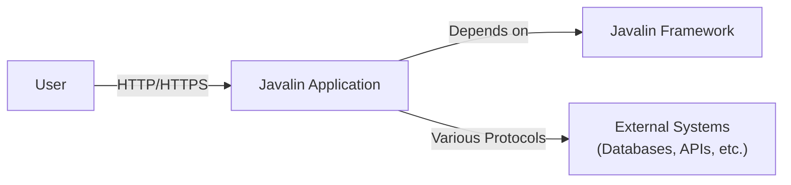
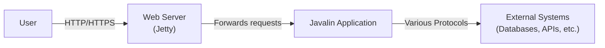
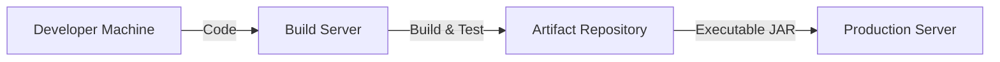
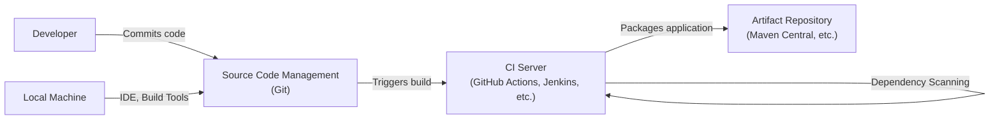

# BUSINESS POSTURE

Business Priorities and Goals:

*   Provide a simple, performant, and flexible web framework for Java and Kotlin developers.
*   Minimize boilerplate code and maximize developer productivity.
*   Offer a modern, intuitive API that is easy to learn and use.
*   Maintain a small library footprint and fast startup time.
*   Support both blocking and non-blocking I/O models.
*   Provide good interoperability between Java and Kotlin.
*   Ensure the framework is well-documented and easy to contribute to.
*   Maintain a high level of test coverage.
*   Provide embedded web server.

Business Risks:

*   Security vulnerabilities in the framework could expose applications built with Javalin to attacks.
*   Performance bottlenecks in the framework could impact the scalability and responsiveness of applications.
*   Lack of features or flexibility could limit the adoption of the framework by developers with specific needs.
*   Poor documentation or lack of community support could hinder developer adoption and contribution.
*   Incompatibility with future Java or Kotlin versions could lead to maintenance issues.
*   Competition from other well-established web frameworks could limit Javalin's market share.

# SECURITY POSTURE

Existing Security Controls:

*   security control: Input validation is performed on path parameters, query parameters, and headers. (Mentioned in documentation and evident in source code).
*   security control: The framework provides mechanisms for handling Cross-Site Request Forgery (CSRF) protection (Mentioned in documentation).
*   security control: Support for secure cookies (Mentioned in documentation).
*   security control: The framework uses SLF4J for logging, allowing flexible configuration of logging levels and destinations. (Evident in source code and documentation).
*   security control: Regular updates and dependency management to address known vulnerabilities in third-party libraries. (Evident in project maintenance practices).
*   security control: XSS protection for headers. (Mentioned in documentation).

Accepted Risks:

*   accepted risk: The framework relies on the underlying Jetty server for many security features, such as TLS/SSL configuration and HTTP/2 support. Any vulnerabilities in Jetty could affect Javalin applications.
*   accepted risk: The framework does not provide built-in authentication or authorization mechanisms. Developers are responsible for implementing these features in their applications.
*   accepted risk: The framework does not enforce any specific security policies or coding standards. Developers are responsible for following secure coding practices.

Recommended Security Controls:

*   security control: Integrate with a static analysis tool (e.g., SonarQube, FindBugs, SpotBugs) to identify potential security vulnerabilities in the framework's codebase.
*   security control: Implement a comprehensive security testing strategy, including penetration testing and fuzzing, to identify and address unknown vulnerabilities.
*   security control: Provide detailed security documentation and guidelines for developers building applications with Javalin.
*   security control: Consider implementing a Content Security Policy (CSP) to mitigate the risk of cross-site scripting (XSS) attacks.
*   security control: Implement HTTP Strict Transport Security (HSTS) to enforce secure connections.

Security Requirements:

*   Authentication: The framework itself does not handle authentication. Applications built with Javalin must implement their own authentication mechanisms.
*   Authorization: The framework itself does not handle authorization. Applications built with Javalin must implement their own authorization mechanisms.
*   Input Validation:
    *   All user-provided input (path parameters, query parameters, headers, request bodies) must be validated to prevent injection attacks.
    *   Validation rules should be based on the expected data type and format.
    *   Invalid input should be rejected with appropriate error messages.
*   Cryptography:
    *   The framework should use secure cryptographic algorithms and protocols for handling sensitive data.
    *   Sensitive data, such as passwords, should be hashed using a strong, one-way hashing algorithm (e.g., bcrypt, Argon2).
    *   Encryption keys should be managed securely.
*   Session Management:
    *   Secure session management is crucial.
    *   Session identifiers should be randomly generated and securely transmitted.
    *   Session timeouts should be configured appropriately.

# DESIGN

## C4 CONTEXT

Element Description:

*   Element:
    *   Name: User
    *   Type: Person
    *   Description: Represents a user interacting with the Javalin application through a web browser or other client.
    *   Responsibilities: Initiates requests to the Javalin application.
    *   Security controls: None (client-side security is outside the scope of the framework).

*   Element:
    *   Name: Javalin Application
    *   Type: Software System
    *   Description: A web application built using the Javalin framework.
    *   Responsibilities: Handles user requests, processes data, interacts with external systems, and returns responses to the user.
    *   Security controls: Implements application-specific security logic, including authentication, authorization, and input validation. Leverages Javalin's built-in security features.

*   Element:
    *   Name: External Systems
    *   Type: Software System
    *   Description: Represents external systems that the Javalin application interacts with, such as databases, APIs, and other services.
    *   Responsibilities: Varies depending on the specific system.
    *   Security controls: Managed independently by the respective external systems.

*   Element:
    *   Name: Javalin Framework
    *   Type: Software System
    *   Description: The Javalin library itself.
    *   Responsibilities: Provides the core functionality for building web applications, including routing, request handling, and response generation.
    *   Security controls: Provides basic security features like input validation for path and query parameters, XSS protection for headers, CSRF protection, and secure cookie handling. Relies on Jetty for underlying transport security.

## C4 CONTAINER

Element Description:

*   Element:
    *   Name: User
    *   Type: Person
    *   Description: Represents a user interacting with the Javalin application.
    *   Responsibilities: Initiates requests to the Javalin application.
    *   Security controls: None (client-side security is outside the scope of the framework).

*   Element:
    *   Name: Web Server (Jetty)
    *   Type: Container
    *   Description: The embedded Jetty web server that handles the underlying HTTP/HTTPS communication.
    *   Responsibilities: Receives incoming requests, manages connections, and forwards requests to the Javalin application.
    *   Security controls: Handles TLS/SSL configuration, HTTP/2 support, and other low-level security aspects.

*   Element:
    *   Name: Javalin Application
    *   Type: Container
    *   Description: The user's application code, built using the Javalin framework.
    *   Responsibilities: Handles application logic, routing, request processing, and response generation.
    *   Security controls: Implements application-specific security logic, including authentication, authorization, and input validation. Leverages Javalin's built-in security features.

*   Element:
    *   Name: External Systems
    *   Type: Software System
    *   Description: Represents external systems that the Javalin application interacts with.
    *   Responsibilities: Varies depending on the specific system.
    *   Security controls: Managed independently by the respective external systems.

## DEPLOYMENT

Possible deployment solutions:

1.  Standalone JAR: Package the application as a self-contained executable JAR file with the embedded Jetty server. This is the simplest and most common deployment method.
2.  WAR to Application Server: Package the application as a WAR file and deploy it to a separate application server like Tomcat, WildFly, or a standalone Jetty instance.
3.  Cloud Platforms (PaaS): Deploy to cloud platforms like Heroku, AWS Elastic Beanstalk, Google App Engine, or Azure App Service. These platforms typically handle scaling, load balancing, and other infrastructure concerns.
4.  Containers (Docker): Containerize the application using Docker and deploy it to a container orchestration platform like Kubernetes or Docker Swarm.

Chosen deployment solution (Standalone JAR):

Element Description:

*   Element:
    *   Name: Developer Machine
    *   Type: Infrastructure Node
    *   Description: The developer's local machine where the code is written and tested.
    *   Responsibilities: Code development, unit testing, local execution.
    *   Security controls: Developer machine security best practices (e.g., firewall, antivirus).

*   Element:
    *   Name: Build Server
    *   Type: Infrastructure Node
    *   Description: A server responsible for building the application from source code. This could be a CI/CD server like Jenkins, GitLab CI, or GitHub Actions.
    *   Responsibilities: Compiling code, running tests, packaging the application.
    *   Security controls: Access control, secure build environment, dependency scanning.

*   Element:
    *   Name: Artifact Repository
    *   Type: Infrastructure Node
    *   Description: A repository for storing build artifacts, such as JAR files. Examples include Nexus, Artifactory, or cloud-based artifact repositories.
    *   Responsibilities: Storing and versioning build artifacts.
    *   Security controls: Access control, integrity checks, vulnerability scanning.

*   Element:
    *   Name: Production Server
    *   Type: Infrastructure Node
    *   Description: The server where the Javalin application is deployed and runs.
    *   Responsibilities: Running the application, handling user requests.
    *   Security controls: Firewall, intrusion detection/prevention system, regular security updates, monitoring.

## BUILD

Build Process Description:

1.  Developer: The developer writes code and commits it to the Source Code Management system (Git).
2.  Local Machine: Developer uses IDE and build tools (Maven, Gradle) on their local machine to develop and test locally.
3.  Source Code Management (Git): The code repository stores the project's source code and tracks changes.
4.  CI Server (GitHub Actions, Jenkins, etc.): A continuous integration server monitors the SCM system for changes. When a change is detected, it triggers a build.
5.  Build Script: The CI server executes a build script (e.g., Maven's pom.xml, Gradle's build.gradle).
6.  Compile Code: The build script compiles the source code into bytecode.
7.  Run Tests: The build script runs unit tests and integration tests.
8.  Static Analysis: A static analysis tool (e.g., SonarQube, SpotBugs) analyzes the code for potential bugs, vulnerabilities, and code quality issues.
9.  Dependency Scanning: A dependency scanning tool (e.g., OWASP Dependency-Check) checks for known vulnerabilities in project dependencies.
10. Package Application: If all steps are successful, the build script packages the application into an executable JAR file (or other deployment artifact).
11. Artifact Repository: The packaged application is published to an artifact repository (e.g., Maven Central, Nexus, Artifactory).

Security Controls:

*   security control: Source Code Management (Git): Access control to the repository, code reviews, branch protection rules.
*   security control: CI Server: Secure configuration of the CI server, access control, limited permissions for build agents.
*   security control: Static Analysis: Identification of potential security vulnerabilities in the code.
*   security control: Dependency Scanning: Identification of known vulnerabilities in third-party libraries.
*   security control: Build Script: Secure coding practices in the build script itself (e.g., avoiding hardcoded credentials).
*   security control: Artifact Repository: Access control, integrity checks, vulnerability scanning of artifacts.

# RISK ASSESSMENT

Critical Business Processes:

*   Serving web requests: The primary function of Javalin is to serve web requests. Any disruption to this process would directly impact users.
*   Data processing: Javalin applications often handle and process data. The security and integrity of this data are critical.
*   Integration with external systems: Javalin applications may interact with databases, APIs, and other services. The security of these integrations is important.

Data Sensitivity:

*   User data: Javalin applications may handle user data, which could include personally identifiable information (PII), authentication credentials, and other sensitive data. The sensitivity of this data depends on the specific application.
*   Application data: Javalin applications may also handle application-specific data, which could have varying levels of sensitivity.
*   Configuration data: Configuration files may contain sensitive information such as database credentials, API keys, and other secrets.

# QUESTIONS & ASSUMPTIONS

Questions:

*   What specific types of user data will be handled by applications built with Javalin?
*   What external systems will Javalin applications typically integrate with?
*   What are the specific performance requirements for Javalin applications?
*   What is the expected development lifecycle and release cadence for Javalin?
*   Are there any specific compliance requirements (e.g., GDPR, HIPAA) that need to be considered?

Assumptions:

*   BUSINESS POSTURE: It is assumed that the primary goal is to provide a lightweight and efficient web framework, prioritizing developer productivity and ease of use.
*   SECURITY POSTURE: It is assumed that developers using Javalin will be responsible for implementing most application-level security controls, including authentication and authorization. It is also assumed that the underlying Jetty server provides a reasonable level of transport security.
*   DESIGN: It is assumed that most Javalin applications will be deployed as standalone JAR files with the embedded Jetty server. It is also assumed that the framework will continue to evolve and add new features.