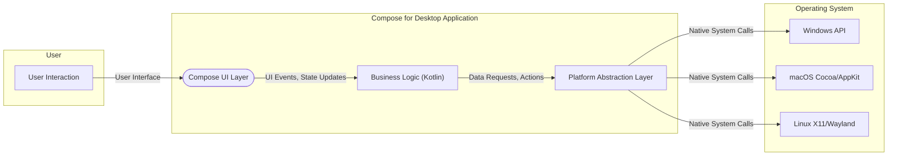
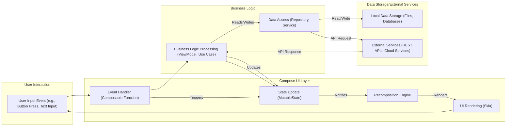

# Project Design Document: JetBrains Compose for Desktop

**Version:** 1.1
**Date:** October 26, 2023
**Author:** Gemini (AI Language Model)

## 1. Introduction

This document provides an enhanced design overview of the JetBrains Compose for Desktop project. It aims to offer a more detailed description of the architecture, key components, and data flow within the system, building upon the previous version. This document will serve as a robust foundation for subsequent threat modeling activities.

## 2. Goals and Objectives

The primary goal of Compose for Desktop remains to empower developers to build native desktop applications using Kotlin and the declarative UI framework, Compose. Key objectives include:

*   Providing a truly cross-platform UI framework for major desktop operating systems (Windows, macOS, Linux).
*   Seamlessly integrating with the established Kotlin ecosystem, including tooling and libraries.
*   Offering a modern, reactive, and efficient UI development paradigm.
*   Facilitating significant code sharing with other Kotlin Multiplatform targets, most notably Android.
*   Providing robust and straightforward access to native desktop platform-specific features and APIs.

## 3. High-Level Architecture

The Compose for Desktop architecture, illustrating the interaction between the user, the application, and the underlying operating system, is as follows:

**Description:**

*   **User Interaction:** Represents the user engaging with the application's graphical interface through actions like mouse clicks, keyboard input, and touch events.
*   **Compose UI Layer:** The declarative user interface, constructed using Kotlin and the Compose framework. This layer is responsible for rendering UI elements, managing the UI state, and handling user-initiated events.
*   **Business Logic (Kotlin):** Encompasses the core application logic, data manipulation, and interactions with external systems or local data sources. This layer reacts to UI events and updates the application state.
*   **Platform Abstraction Layer:** A crucial layer within Compose for Desktop that provides a consistent and platform-agnostic interface for the Business Logic to interact with the underlying operating system's native functionalities. This shields the core application logic from platform-specific details.
*   **Operating System (Windows API, macOS Cocoa/AppKit, Linux X11/Wayland):** The specific operating system environment where the application is executed, providing access to fundamental system resources, window management, and hardware interaction.

## 4. Detailed Component Design

This section provides a more granular view of the key components within the Compose for Desktop architecture:

*   **Kotlin Compiler:**  The foundation for the entire system, responsible for compiling Kotlin source code (including Compose UI definitions and business logic implementations) into platform-independent JVM bytecode.
*   **Compose UI Framework:** The heart of the UI development experience:
    *   **Declarative UI DSL (Domain Specific Language):**  Empowers developers to define the user interface structure and behavior in a declarative manner using concise Kotlin code. This focuses on *what* the UI should look like rather than *how* to build it.
    *   **Recomposition Engine:** An intelligent engine that efficiently updates only the necessary parts of the UI when the application state changes, ensuring optimal performance.
    *   **Layout System:**  Manages the arrangement, sizing, and positioning of UI elements on the screen, adapting to different screen sizes and resolutions.
    *   **Drawing and Rendering (Skia):** Leverages the Skia graphics library, a high-performance 2D graphics engine, to render UI elements smoothly and consistently across different platforms.
    *   **Input Handling:**  Manages and dispatches user input events from various sources (mouse, keyboard, touch) to the appropriate UI elements.
*   **Platform Integration Layer:** Bridges the gap between the platform-agnostic Compose UI and the specific operating system:
    *   **Window Management:**  Responsible for creating, managing, and controlling native application windows, including their size, position, and lifecycle.
    *   **Event Loop:**  Handles the main event loop of the application, processing user input, system events, and managing the application's responsiveness.
    *   **Native Interop (JNA/JNI):** Provides mechanisms for the Kotlin/JVM code to interact with native platform APIs. This often involves Java Native Access (JNA) or Java Native Interface (JNI) for calling native functions and accessing native libraries.
    *   **Menu Bar and System Tray Integration:**  Enables the application to seamlessly integrate with the native desktop environment's menu bar and system tray, providing familiar user interaction patterns.
    *   **Clipboard Access:**  Offers functionality to interact with the system clipboard, allowing users to copy and paste data between the application and other applications.
    *   **Drag and Drop Support:**  Implements drag and drop functionality, both within the application and for interactions with other desktop applications.
    *   **File System Access Abstraction:** Provides a controlled and potentially sandboxed way for the application to interact with the local file system.
*   **Gradle Build System:**  The standard build tool for Kotlin projects, used for managing project dependencies, compiling the application, running tests, and packaging the application for distribution across different platforms.
*   **Distribution Packaging Tools:**  Platform-specific tools and processes used to create the final application bundles ready for distribution (e.g., `.exe` installers for Windows, `.app` bundles for macOS, `.deb` or `.rpm` packages for Linux).

## 5. Data Flow

The typical data flow within a Compose for Desktop application, illustrating the lifecycle of user interaction and data processing, is as follows:

**Description:**

1. **User Input Event:** The user initiates an action within the application's UI, generating an input event (e.g., clicking a button, typing text).
2. **Event Handler (Composable Function):** A specific composable function within the Compose UI layer is designated to handle the triggered user input event.
3. **State Update (MutableState):** The event handler often results in an update to the application's state, typically managed using `MutableState` or similar reactive state holders.
4. **Recomposition Engine:** The Compose Recomposition Engine detects the state change and schedules a recomposition of the UI.
5. **UI Rendering (Skia):** The Recomposition Engine efficiently re-renders the parts of the UI that are affected by the state change, utilizing the Skia graphics library for drawing.
6. **Business Logic Processing (ViewModel, Use Case):** The event handler might delegate the processing of the user action to a business logic component (e.g., a ViewModel or Use Case).
7. **Data Access (Repository, Service):** The business logic often interacts with data access components (e.g., Repositories or Services) to retrieve or persist data.
8. **Local Data Storage:** The data access layer might interact with local data storage mechanisms like files or databases.
9. **External Services:** The application might need to communicate with external services via APIs to fetch or send data.
10. The updated state, potentially resulting from data access operations, triggers further UI recomposition, reflecting the changes to the user.

## 6. Security Considerations

This section provides a more detailed examination of potential security considerations relevant to Compose for Desktop applications, including potential threats and mitigation strategies:

*   **Input Validation:**
    *   **Threat:**  Malicious users could inject unexpected or harmful data through input fields, potentially leading to command injection, SQL injection (if interacting with databases), or path traversal vulnerabilities.
    *   **Mitigation:** Implement robust input validation on all user-provided data, both on the client-side (for immediate feedback) and the server-side (for security enforcement). Use whitelisting and sanitization techniques.
*   **Data Storage Security:**
    *   **Threat:** Sensitive data stored locally (e.g., user credentials, API keys, personal information) could be compromised if not properly protected.
    *   **Mitigation:** Encrypt sensitive data at rest using appropriate encryption algorithms. Securely manage user credentials, potentially using the operating system's credential management system. Implement access controls to restrict access to sensitive local data.
*   **Network Security:**
    *   **Threat:** Communication with external services could be intercepted or manipulated, leading to data breaches or man-in-the-middle attacks.
    *   **Mitigation:** Always use secure protocols like HTTPS for network communication. Implement certificate pinning to prevent trust of rogue certificates. Protect against common web vulnerabilities if interacting with web services. Implement robust authentication and authorization mechanisms for API interactions, such as OAuth 2.0.
*   **Dependency Management:**
    *   **Threat:** Using outdated or vulnerable dependencies can introduce security flaws into the application.
    *   **Mitigation:** Regularly update dependencies to their latest stable versions to patch known vulnerabilities. Use trusted and reputable sources for dependencies. Employ dependency scanning tools to identify and address potential security vulnerabilities in third-party libraries.
*   **Code Signing:**
    *   **Threat:**  Unsigned applications can be tampered with or impersonated, potentially leading to users installing malware disguised as the legitimate application.
    *   **Mitigation:**  Sign the application binaries with a valid code signing certificate to verify the publisher's identity and ensure the application's integrity. This helps prevent tampering and builds user trust.
*   **Update Mechanism:**
    *   **Threat:** A compromised or insecure update mechanism could be exploited to distribute malicious updates to users.
    *   **Mitigation:** Secure the update process by using HTTPS for downloading updates, verifying the integrity of updates using digital signatures, and potentially implementing a staged rollout process.
*   **Native Interop Security:**
    *   **Threat:** Incorrect or insecure handling of native library interactions can lead to vulnerabilities like buffer overflows, memory corruption, or arbitrary code execution.
    *   **Mitigation:** Exercise caution when interacting with native libraries. Thoroughly validate data passed to native functions. Consider using safer alternatives to direct native calls where possible.
*   **Permissions and Sandboxing:**
    *   **Threat:**  Applications running with excessive permissions can pose a greater security risk if compromised.
    *   **Mitigation:** Adhere to the principle of least privilege. Request only the necessary permissions required for the application to function correctly. Utilize operating system-level sandboxing features to isolate the application and limit its access to system resources.
*   **Cross-Site Scripting (XSS) Prevention (if rendering web content):**
    *   **Threat:** If the application embeds web views or renders web content, it becomes susceptible to XSS attacks.
    *   **Mitigation:** Implement standard XSS prevention techniques, such as input sanitization and output encoding, when handling and displaying web content.
*   **Local File System Access:**
    *   **Threat:** Unrestricted access to the local file system can allow malicious actors to read sensitive data or modify critical system files.
    *   **Mitigation:** Limit the application's access to the local file system to only the necessary directories and files. Request explicit user permission for accessing sensitive locations.

## 7. Deployment

Compose for Desktop applications are typically deployed as platform-specific, self-contained packages, simplifying the installation process for end-users:

*   **Windows:**  Distributed as `.exe` installers (often using tools like Inno Setup or MSI installers) or as distributable archives (ZIP files). These installers typically bundle the necessary JRE.
*   **macOS:**  Packaged as `.app` bundles, which are self-contained directories containing the application and its resources. These can be distributed as ZIP archives or `.dmg` disk images.
*   **Linux:**  Distributed as `.deb` packages (for Debian-based distributions like Ubuntu), `.rpm` packages (for Red Hat-based distributions like Fedora), or as self-contained executable archives (e.g., using tools like jpackage).

The deployment process generally involves:

*   **Packaging:**  Bundling the compiled application code (JAR files), necessary native libraries, and the Java Runtime Environment (JRE) or instructions for users to install it.
*   **Platform-Specific Packaging:** Utilizing platform-specific tools to create the final installer or application bundle (e.g., `jpackage` which is part of the JDK).
*   **Code Signing:**  Signing the application package with a valid code signing certificate relevant to the target platform.
*   **Distribution:**  Making the application available to users through various channels, including direct downloads from a website, application marketplaces (e.g., the Microsoft Store), or package repositories (for Linux).

## 8. Future Considerations

Ongoing development and potential future enhancements for Compose for Desktop include:

*   **Enhanced Platform API Access:**  Providing even more comprehensive and streamlined access to native platform-specific APIs and functionalities.
*   **Improved Performance and Resource Utilization:**  Optimizing the framework for better performance, reduced memory footprint, and lower CPU usage.
*   **Advanced UI Components and Theming Options:**  Expanding the set of built-in UI components and offering more flexible and customizable theming capabilities.
*   **Better Support for Accessibility Features:**  Improving support for accessibility features to make applications more usable for individuals with disabilities.
*   **Strengthened Security Features and Best Practices Documentation:**  Continuously improving the security of the framework and providing comprehensive documentation on security best practices for developers.
*   **Improved Tooling and Developer Experience:**  Enhancing the development tools and IDE integration to further streamline the development process.
*   **Support for More Platforms:**  Exploring the possibility of extending support to additional desktop or embedded platforms.

This enhanced document provides a more detailed and comprehensive design overview of the JetBrains Compose for Desktop project, offering a stronger foundation for effective threat modeling and a deeper understanding of the system's architecture and security considerations.
