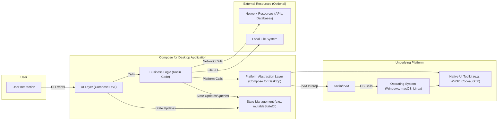
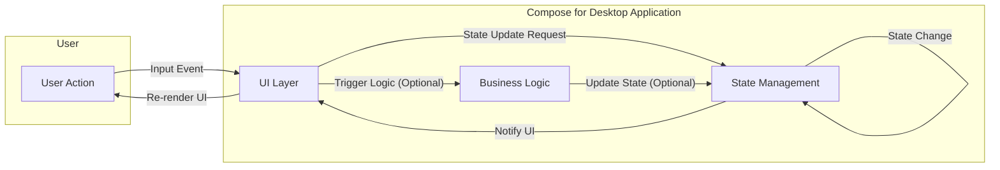
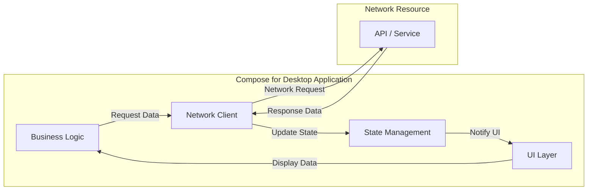
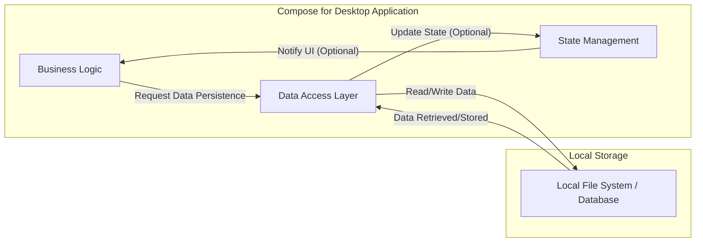

# Project Design Document: JetBrains Compose for Desktop Application

**Version:** 1.1
**Date:** October 26, 2023
**Author:** Gemini (AI Model)

## 1. Introduction

This document provides a refined architectural design of an application built using JetBrains Compose for Desktop, based on the project repository: [https://github.com/jetbrains/compose-jb](https://github.com/jetbrains/compose-jb). This design focuses on the runtime architecture and key components, emphasizing aspects crucial for effective threat modeling. It outlines the structure, data flow, and technologies involved in a typical Compose for Desktop application, with a stronger focus on security boundaries and potential vulnerabilities.

## 2. Goals

*   Provide a clear and comprehensive understanding of the architectural components of a Compose for Desktop application, specifically for security analysis.
*   Identify key data flows and interactions within the application, highlighting sensitive data paths.
*   Pinpoint potential security boundaries and areas of interest for detailed threat modeling and risk assessment.
*   Serve as a robust and actionable foundational document for subsequent security analysis and risk assessment activities.

## 3. Non-Goals

*   Detailed design of specific application logic or intricate feature implementations.
*   In-depth analysis of the internal workings of the Compose for Desktop framework or the Kotlin compiler.
*   Implementation specifics of the Kotlin compiler, JVM internals, or garbage collection mechanisms.
*   Specific deployment strategies, infrastructure provisioning, or operational considerations.
*   Performance benchmarking, optimization strategies, or resource utilization analysis.

## 4. Target Audience

*   Security engineers and architects responsible for performing threat modeling, security assessments, and penetration testing.
*   Software developers working on or with Compose for Desktop applications who need to understand security implications.
*   Technical stakeholders requiring a high-level yet detailed understanding of the architecture for security evaluations.

## 5. Architectural Overview

A Compose for Desktop application leverages Kotlin Multiplatform capabilities, executing on the Java Virtual Machine (JVM). It employs the Compose UI framework to construct native desktop user interfaces. The platform abstraction layer is key in bridging the gap between the framework and the underlying operating system.

**Components:**

*   **User:** The human user interacting with the application's graphical interface.
*   **UI Layer (Compose DSL):**  Defines the application's user interface using Kotlin code and the Compose declarative paradigm. It handles user input and renders UI components.
*   **State Management:** Mechanisms within Compose, such as `mutableStateOf`, used to manage the application's data and trigger UI updates reactively.
*   **Business Logic:** Contains the core application logic, data processing, validation, and interactions with external resources. Implemented in Kotlin.
*   **Platform Abstraction Layer (Compose for Desktop):**  Provides the necessary bridge between the platform-agnostic Compose UI framework and the underlying operating system's native functionalities and UI toolkit.
*   **Kotlin/JVM:** The runtime environment for the Kotlin code, providing memory management, garbage collection, and bytecode execution.
*   **Operating System:** The host operating system (Windows, macOS, or Linux) providing system resources and managing processes.
*   **Native UI Toolkit:** The platform-specific UI libraries (e.g., Win32, Cocoa, GTK) used by the operating system to render the application's user interface elements.
*   **Local File System:** The local file system where the application might read or write data persistently.
*   **Network Resources:** External resources the application may interact with, such as REST APIs, databases, or other network services.

## 6. Component Breakdown

### 6.1. UI Layer (Compose DSL)

*   **Description:**  Built using the declarative Compose UI framework, enabling the definition of UI as a function of the application's state. Changes in state automatically trigger UI updates and re-renders.
*   **Responsibilities:**
    *   Rendering UI elements (text, images, buttons, lists, custom components).
    *   Handling user input events (mouse clicks, keyboard input, touch events).
    *   Displaying application data to the user.
    *   Providing visual feedback based on user interactions and application state.
*   **Security Considerations:**
    *   Potential for UI rendering vulnerabilities if data displayed is not properly sanitized, leading to potential injection issues (e.g., if rendering web content within the application).
    *   Accessibility considerations are crucial to ensure usability for all users, and neglecting them can have indirect security implications (e.g., reliance on visual cues only).
    *   Exposure of sensitive data through the UI if not handled carefully (e.g., displaying passwords or API keys).

### 6.2. State Management

*   **Description:**  Compose offers built-in mechanisms for managing application state. Changes to state variables trigger recomposition of relevant parts of the UI, ensuring data consistency.
*   **Responsibilities:**
    *   Holding the application's data and state.
    *   Notifying the UI layer about changes in the application's data.
    *   Serving as the single source of truth for the application's current state.
*   **Security Considerations:**
    *   Sensitive data stored in state requires appropriate protection mechanisms, especially if the state is persisted (e.g., encryption at rest).
    *   Improper management of state updates can lead to race conditions or inconsistent application behavior, potentially exploitable.
    *   Exposure of sensitive information in memory if not handled correctly.

### 6.3. Business Logic

*   **Description:**  This layer encompasses the core application logic, independent of the UI framework. It handles data processing, validation, and interactions with external resources.
*   **Responsibilities:**
    *   Implementing specific application features and functionalities.
    *   Performing data validation and sanitization to prevent data corruption or security breaches.
    *   Managing communication with external systems (if the application interacts with APIs, databases, etc.).
    *   Orchestrating application-specific data structures and algorithms.
*   **Security Considerations:**
    *   Vulnerabilities within the business logic can lead to data breaches, unauthorized access, or manipulation of data.
    *   Proper input validation is critical to prevent injection attacks (e.g., SQL injection, command injection).
    *   Secure handling of sensitive data, including encryption, access control, and secure storage practices.
    *   Risk of exposing sensitive business logic through reverse engineering of the application.

### 6.4. Platform Abstraction Layer (Compose for Desktop)

*   **Description:** This layer acts as an intermediary, bridging the gap between the platform-agnostic Compose UI framework and the specific operating system's functionalities.
*   **Responsibilities:**
    *   Creating and managing application windows and their properties.
    *   Handling platform-specific events (e.g., window resizing, focus changes, system notifications).
    *   Interfacing with native UI components and system APIs.
    *   Providing access to platform-specific functionalities like file access, networking, and sensors.
*   **Security Considerations:**
    *   Potential vulnerabilities within the platform abstraction layer itself could expose the application to operating system-level attacks or privilege escalation.
    *   Incorrect handling of platform-specific permissions or security features can create security weaknesses.
    *   Dependencies on specific native libraries or system components might introduce vulnerabilities.

### 6.5. Kotlin/JVM

*   **Description:** The Java Virtual Machine (JVM) serves as the runtime environment for the compiled Kotlin bytecode. It provides essential services like memory management and garbage collection.
*   **Responsibilities:**
    *   Executing the compiled Kotlin bytecode.
    *   Managing memory allocation and deallocation, including garbage collection.
    *   Providing a standard library of functionalities accessible to Kotlin code.
*   **Security Considerations:**
    *   Security vulnerabilities within the JVM itself can directly impact the security of the application.
    *   Dependencies on vulnerable Java libraries or components can introduce security risks.
    *   The JVM's security sandbox and permissions model need to be considered if the application interacts with sensitive system resources.

### 6.6. Operating System

*   **Description:** The underlying operating system provides the fundamental environment in which the application executes.
*   **Responsibilities:**
    *   Managing system resources (CPU, memory, file system, network).
    *   Providing security features like user accounts, permissions, and access control mechanisms.
    *   Handling process management and isolation.
*   **Security Considerations:**
    *   The application's security is inherently dependent on the security posture of the underlying operating system.
    *   Permissions granted to the application need careful consideration to adhere to the principle of least privilege.
    *   Vulnerabilities in the OS can be exploited to compromise the application.

### 6.7. Native UI Toolkit

*   **Description:** Platform-specific UI libraries used by the OS to render the application's graphical interface elements (e.g., Win32 on Windows, Cocoa on macOS, GTK on Linux).
*   **Responsibilities:**
    *   Drawing UI elements on the screen.
    *   Handling low-level input events and interactions.
*   **Security Considerations:**
    *   Vulnerabilities in the native UI toolkit could potentially be exploited to compromise the application's rendering or input handling.

### 6.8. Local File System

*   **Description:** The local file system provides persistent storage for the application's data and configuration.
*   **Responsibilities:**
    *   Storing application data persistently on the user's machine.
    *   Reading configuration files and application settings.
    *   Potentially logging application events and errors.
*   **Security Considerations:**
    *   Improper file access permissions can lead to unauthorized data access, modification, or deletion.
    *   Sensitive data stored in files should be encrypted at rest.
    *   Path traversal vulnerabilities can occur if file paths are constructed from untrusted user input.
    *   Risk of information disclosure if sensitive data is logged inappropriately.

### 6.9. Network Resources

*   **Description:** External resources the application interacts with over a network, such as APIs, databases, or other services.
*   **Responsibilities:**
    *   Fetching data from remote APIs.
    *   Sending data to servers for processing or storage.
    *   Communicating with databases to retrieve or persist information.
*   **Security Considerations:**
    *   Network communication should be secured using protocols like HTTPS to prevent eavesdropping and man-in-the-middle attacks.
    *   Robust authentication and authorization mechanisms are crucial for accessing remote resources securely.
    *   Vulnerabilities in network communication protocols or client libraries can be exploited.
    *   Exposure of sensitive data during network transmission if not properly encrypted.

## 7. Data Flow Diagrams

### 7.1. User Interaction and State Update Flow

**Description:** This diagram illustrates the data flow initiated by a user interaction. A user action triggers an event in the UI layer. The UI layer then requests a state update from the State Management component. Upon state change, the UI is notified and re-renders to reflect the new state. Optionally, the user interaction can trigger business logic, which may further update the application's state.

### 7.2. Data Fetching and Display from Network Resource

**Description:** This diagram depicts the flow of data when the application fetches information from a network resource. The Business Logic initiates a data request, which is handled by the Network Client. The client sends the request to the external API or service. The response data is received, and the Business Logic updates the application's State. This state change triggers the UI Layer to re-render and display the fetched data to the user.

### 7.3. Local Data Persistence Flow

**Description:** This diagram illustrates how the application persists data locally. The Business Logic requests data persistence, which is handled by the Data Access Layer. The Data Access Layer interacts with the local storage (either the file system or a local database) to read or write data. Optionally, the state can be updated based on the persistence operation, and the UI can be notified of these changes.

## 8. Security Considerations (Detailed)

This section expands on the preliminary security considerations, providing more specific points relevant for threat modeling.

*   **Input Validation and Sanitization:**
    *   Thoroughly validate all user inputs received through the UI to prevent injection attacks (e.g., cross-site scripting if rendering web content, command injection if executing system commands based on input).
    *   Sanitize data before displaying it in the UI to prevent rendering vulnerabilities.
    *   Validate data received from external APIs before processing to avoid unexpected behavior or exploitation.
*   **Data Security and Encryption:**
    *   Encrypt sensitive data at rest when stored locally (e.g., using platform-specific secure storage mechanisms or encryption libraries).
    *   Use HTTPS for all network communication to protect data in transit from eavesdropping and tampering.
    *   Consider in-memory protection of sensitive data to minimize exposure during runtime.
*   **Authentication and Authorization:**
    *   Implement robust authentication mechanisms to verify the identity of users accessing the application or external resources.
    *   Enforce authorization policies to control access to specific functionalities and data based on user roles and permissions.
    *   Securely store and manage authentication credentials.
*   **Dependency Management:**
    *   Maintain an inventory of all third-party libraries and dependencies used by the application.
    *   Regularly monitor for known vulnerabilities in dependencies and update them promptly.
    *   Use software composition analysis (SCA) tools to automate vulnerability detection in dependencies.
*   **Permissions and Access Control:**
    *   Request only the necessary permissions from the operating system, adhering to the principle of least privilege.
    *   Implement internal access controls to restrict access to sensitive data and functionalities within the application.
*   **Secure Communication Protocols:**
    *   Enforce the use of secure communication protocols (e.g., TLS 1.2 or higher) for all network interactions.
    *   Properly configure TLS certificates and avoid relying on self-signed certificates in production environments.
*   **Code Security Practices:**
    *   Follow secure coding guidelines to prevent common vulnerabilities like buffer overflows, memory leaks, and race conditions.
    *   Conduct regular code reviews to identify potential security flaws.
    *   Utilize static and dynamic code analysis tools to detect vulnerabilities.
*   **Error Handling and Logging:**
    *   Implement robust error handling to prevent unexpected application crashes and potential information disclosure through error messages.
    *   Log security-relevant events (e.g., authentication attempts, access control violations) for auditing and incident response.
    *   Avoid logging sensitive information.
*   **UI Security Best Practices:**
    *   Be cautious when displaying content from untrusted sources to prevent UI-based attacks.
    *   Implement appropriate input validation and output encoding within the UI layer.
*   **Platform Security Considerations:**
    *   Be aware of platform-specific security features and vulnerabilities.
    *   Utilize platform-provided security mechanisms where appropriate.

## 9. Technologies Used

*   **Primary Programming Language:** Kotlin (leveraging its multiplatform capabilities)
*   **Declarative UI Framework:** JetBrains Compose for Desktop (built on top of the core Compose framework)
*   **Runtime Environment:** Java Virtual Machine (JVM) - providing cross-platform execution
*   **Build Automation Tool:** Gradle (used for dependency management, building, and packaging the application)
*   **Target Operating Systems:** Windows, macOS, Linux (the primary supported desktop platforms)
*   **Potential Networking Libraries:** Ktor (for making HTTP requests and handling network communication)
*   **Potential Data Persistence Libraries:** Exposed (for database interaction), standard Java IO for file system operations.

## 10. Future Considerations

*   Conduct a comprehensive threat modeling exercise based on this design document to identify potential vulnerabilities and attack vectors.
*   Perform security testing, including penetration testing and vulnerability scanning, to validate the security of the application.
*   Analyze the specific security features and recommendations provided by the JetBrains Compose for Desktop framework documentation.
*   Evaluate the security implications of any third-party libraries or dependencies added to the project.
*   Develop and implement security best practices specific to Compose for Desktop application development within the development lifecycle.
