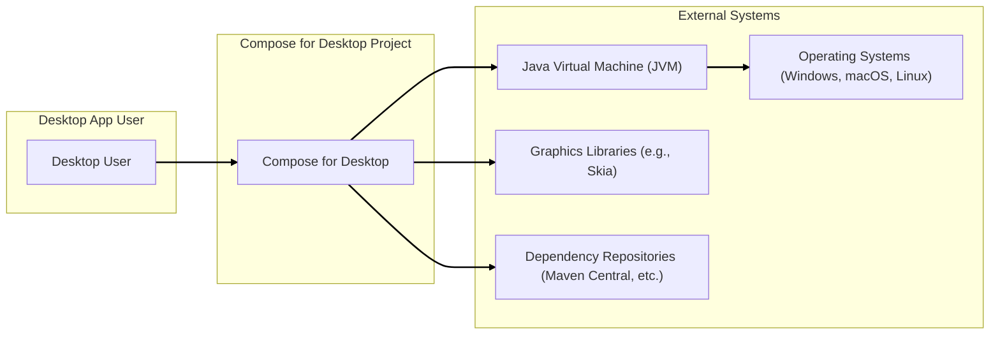
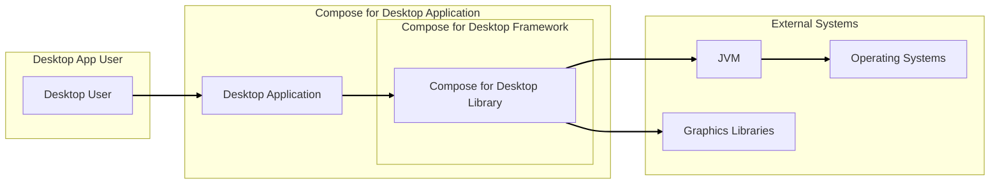
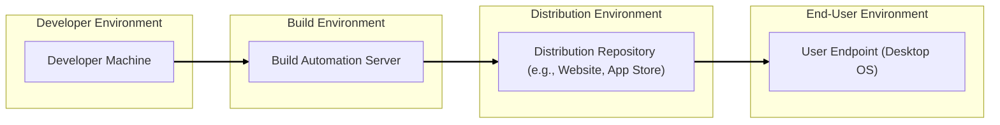

# BUSINESS POSTURE

The Compose for Desktop project aims to provide a modern, declarative UI framework for building cross-platform desktop applications using Kotlin. It leverages the existing Compose UI framework from Android, extending it to desktop environments.

Business Priorities and Goals:
- Enable developers to build rich, modern desktop applications more efficiently using Kotlin and a declarative UI paradigm.
- Provide a cross-platform solution, reducing development effort for targeting multiple desktop operating systems (Windows, macOS, Linux).
- Foster a vibrant ecosystem of desktop applications built with Kotlin and Compose.
- Enhance developer productivity and experience by offering a familiar and intuitive UI framework.

Business Risks:
- Adoption risk: Developers may not widely adopt Compose for Desktop if it lacks features, performance, or community support compared to existing desktop UI frameworks.
- Security risk: Vulnerabilities in the framework could impact the security of applications built with it, potentially leading to data breaches or system compromise.
- Dependency risk: Reliance on Kotlin, JVM, and underlying graphics libraries introduces dependencies that could pose security or compatibility challenges.
- Ecosystem risk: A lack of a strong community and supporting libraries could hinder the framework's long-term success and increase security risks due to slower vulnerability detection and patching.

# SECURITY POSTURE

Existing Security Controls:
- security control: Code Reviews - Jetbrains, as a reputable software company, likely employs code reviews for all contributions to their projects, including Compose for Desktop, although specific details are not publicly documented in the provided repository.
- security control: Static Analysis - Jetbrains likely uses internal static analysis tools to identify potential vulnerabilities and code quality issues during development.
- security control: Dependency Management - The project uses Gradle for dependency management, which allows for some level of control over included libraries and their versions. Dependency versions are specified in `build.gradle.kts` files within the repository.
- accepted risk: Open Source Nature - As an open-source project, vulnerabilities might be publicly disclosed before a fix is available. This is a common risk for open-source projects.

Recommended Security Controls:
- security control: Public Vulnerability Disclosure Policy - Establish a clear process for reporting and handling security vulnerabilities, including a security contact and expected response times. This should be documented in the project's security policy.
- security control: Regular Security Audits - Conduct periodic security audits, both internal and potentially external, to proactively identify and address potential vulnerabilities in the framework.
- security control: Security Training for Developers - Ensure developers working on the project receive adequate security training to promote secure coding practices and awareness of common vulnerabilities.
- security control: Automated Dependency Scanning - Implement automated dependency scanning tools in the build pipeline to detect known vulnerabilities in third-party libraries used by the project.

Security Requirements:
- Authentication: Not directly applicable to the framework itself, as authentication is typically handled at the application level. However, the framework should not hinder the implementation of secure authentication mechanisms in applications built with it.
- Authorization: Similar to authentication, authorization is primarily an application-level concern. The framework should provide mechanisms and guidance for developers to implement robust authorization within their applications.
- Input Validation: The framework should encourage and facilitate secure input validation practices for developers building applications. This includes providing APIs that are secure by default and guidance on how to handle user inputs safely to prevent injection vulnerabilities.
- Cryptography: While the framework itself might not directly implement cryptographic algorithms, it should not prevent or complicate the use of cryptography in applications built with it. It should be compatible with standard cryptographic libraries and best practices.

# DESIGN

## C4 CONTEXT



Context Diagram Elements:

- Element:
    - Name: Desktop User
    - Type: Person
    - Description: End-users who will use applications built with Compose for Desktop.
    - Responsibilities: Use desktop applications to perform tasks.
    - Security controls: User-managed endpoint security (antivirus, OS updates, etc.).

- Element:
    - Name: Compose for Desktop
    - Type: Software System
    - Description: A UI framework for building cross-platform desktop applications using Kotlin. This is the project in question.
    - Responsibilities: Provide APIs and runtime environment for building desktop UIs, handle UI rendering and event management, interact with underlying operating systems and graphics libraries.
    - Security controls: Input validation within the framework, secure coding practices during development, dependency management, vulnerability management process.

- Element:
    - Name: Operating Systems (Windows, macOS, Linux)
    - Type: Software System
    - Description: Target operating systems where applications built with Compose for Desktop will run.
    - Responsibilities: Provide core system functionalities, manage hardware resources, provide APIs for applications.
    - Security controls: OS-level security controls (firewall, access control, kernel security, regular updates).

- Element:
    - Name: Java Virtual Machine (JVM)
    - Type: Software System
    - Description: The runtime environment for Kotlin and Compose for Desktop applications.
    - Responsibilities: Execute Kotlin bytecode, manage memory, provide platform independence.
    - Security controls: JVM security features (sandbox, security manager - though often deprecated), regular JVM updates.

- Element:
    - Name: Graphics Libraries (e.g., Skia)
    - Type: Software System
    - Description: Libraries used for rendering graphics and UI elements in Compose for Desktop applications.
    - Responsibilities: Provide efficient and cross-platform graphics rendering capabilities.
    - Security controls: Security of the graphics library itself (vulnerability management by the library developers).

- Element:
    - Name: Dependency Repositories (Maven Central, etc.)
    - Type: Software System
    - Description: Repositories from which Compose for Desktop and applications built with it download dependencies.
    - Responsibilities: Host and provide software libraries and dependencies.
    - Security controls: Repository security (integrity of packages, malware scanning - typically managed by repository providers), dependency verification by build tools.

## C4 CONTAINER



Container Diagram Elements:

- Element:
    - Name: Desktop User
    - Type: Person
    - Description: End-users who interact with the desktop application.
    - Responsibilities: Use the desktop application to perform tasks.
    - Security controls: User-managed endpoint security.

- Element:
    - Name: Desktop Application
    - Type: Application
    - Description: A desktop application built using the Compose for Desktop framework. This is the application developed by developers using Compose for Desktop.
    - Responsibilities: Provide specific functionalities to the user, handle user interactions, manage application data, implement application-level security features (authentication, authorization, input validation specific to the application).
    - Security controls: Application-level security controls (authentication, authorization, input validation, secure data storage, secure communication), secure coding practices by application developers, dependency management for application dependencies.

- Element:
    - Name: Compose for Desktop Library
    - Type: Library
    - Description: The core Compose for Desktop framework, distributed as a library (e.g., JAR file).
    - Responsibilities: Provide UI components, layout mechanisms, event handling, and APIs for building desktop UIs, abstract platform-specific details, ensure cross-platform compatibility.
    - Security controls: Input validation within the framework, secure coding practices during framework development, dependency management for framework dependencies, vulnerability management process for the framework, public vulnerability disclosure policy, regular security audits.

- Element:
    - Name: Operating Systems
    - Type: Container
    - Description: The host operating system where the application and JVM run.
    - Responsibilities: Provide system resources, manage processes, handle OS-level security.
    - Security controls: OS-level security controls (firewall, access control, kernel security, regular updates).

- Element:
    - Name: JVM
    - Type: Container
    - Description: The Java Virtual Machine running the Compose for Desktop application.
    - Responsibilities: Execute Kotlin bytecode, manage memory, provide platform independence for the application.
    - Security controls: JVM security features, regular JVM updates.

- Element:
    - Name: Graphics Libraries
    - Type: Container
    - Description: Libraries used by Compose for Desktop for rendering UI elements.
    - Responsibilities: Provide graphics rendering capabilities.
    - Security controls: Security of the graphics library itself.

## DEPLOYMENT

Deployment Architecture: Standalone Application Distribution



Deployment Diagram Elements:

- Element:
    - Name: Developer Machine
    - Type: Environment
    - Description: Developer's local machine used for writing code, building, and testing Compose for Desktop applications.
    - Responsibilities: Code development, local testing, running development builds.
    - Security controls: Developer endpoint security (OS security, antivirus, personal firewall), access control to development tools and repositories.

- Element:
    - Name: Build Automation Server
    - Type: Environment
    - Description: A server (e.g., CI/CD system) that automates the build, test, and packaging process for Compose for Desktop applications.
    - Responsibilities: Automated build process, running tests, creating distributable packages, potentially performing security scans.
    - Security controls: Access control to build server, secure configuration of build pipelines, secrets management for build credentials, build artifact integrity checks, security scanning tools integration (SAST, dependency scanning).

- Element:
    - Name: Distribution Repository
    - Type: Environment
    - Description: A repository or platform used to distribute the packaged application to end-users (e.g., a website, application store).
    - Responsibilities: Hosting application packages, providing download or installation mechanisms to users.
    - Security controls: Secure hosting infrastructure, access control to the repository, malware scanning of uploaded packages (if applicable for app stores), secure delivery mechanisms (HTTPS).

- Element:
    - Name: User Endpoint (Desktop OS)
    - Type: Environment
    - Description: End-user's desktop computer running the target operating system (Windows, macOS, Linux) where the application is installed and executed.
    - Responsibilities: Running the application, providing user interface, accessing local resources.
    - Security controls: User endpoint security (OS security, antivirus, personal firewall, user access control), application-level security controls within the installed application.

## BUILD

Build Process Diagram:

```mermaid
flowchart LR
    subgraph "Developer"
        DEV["Developer Machine"]
    end
    subgraph "Version Control"
        VC["Version Control System (e.g., Git)"]
    end
    subgraph "Build System"
        BS["Build System (e.g., Gradle on CI)"]
    end
    subgraph "Artifact Repository"
        AR["Artifact Repository (e.g., Maven Central for library, Package Registry for app)"]
    end

    DEV --> VC
    VC --> BS
    BS --> AR

    subgraph "Build System - Security Checks"
        SC["SAST Scanner"]
        DS["Dependency Scanner"]
        L["Linters"]
    end
    BS --> SC
    BS --> DS
    BS --> L

    linkStyle 0,1,2,3,4,5,6 stroke-width:2px,stroke:black;
```

Build Process Description:

1. Developer writes code on their local Developer Machine and commits changes to a Version Control System (e.g., Git).
2. The Build System (e.g., a CI/CD pipeline using Gradle) retrieves the code from the Version Control System.
3. The Build System compiles the code, runs tests, and performs security checks:
    - SAST Scanner: Static Application Security Testing tools analyze the source code for potential vulnerabilities.
    - Dependency Scanner: Checks project dependencies for known vulnerabilities.
    - Linters: Enforce code quality and style guidelines, which can indirectly contribute to security.
4. If all checks pass, the Build System packages the build artifacts (e.g., JAR library for Compose for Desktop framework, or executable application package).
5. The build artifacts are published to an Artifact Repository (e.g., Maven Central for the Compose for Desktop library, or a package registry/distribution platform for applications).

Build Security Controls:
- security control: Secure Build Environment - Harden the build server and infrastructure, restrict access, and regularly update software.
- security control: Version Control - Use version control to track code changes, enable code reviews, and maintain code integrity.
- security control: Automated Build Process - Automate the build process to ensure consistency and repeatability, and to integrate security checks.
- security control: Static Application Security Testing (SAST) - Integrate SAST tools into the build pipeline to automatically detect potential code-level vulnerabilities.
- security control: Dependency Scanning - Use dependency scanning tools to identify and manage vulnerabilities in third-party libraries.
- security control: Code Linting - Enforce code style and quality through linters to improve code maintainability and potentially reduce security risks.
- security control: Build Artifact Integrity - Sign build artifacts to ensure their integrity and authenticity, preventing tampering during distribution.
- security control: Access Control - Implement strict access control to the build system, version control, and artifact repositories.
- security control: Secrets Management - Securely manage secrets (API keys, credentials) used in the build process, avoiding hardcoding them in code or build scripts.

# RISK ASSESSMENT

Critical Business Processes:
- Development and distribution of the Compose for Desktop framework itself.
- Development and distribution of applications built using Compose for Desktop.

Data to Protect:
- Source code of the Compose for Desktop framework (Sensitivity: High - Confidential, Integrity - Critical, Availability - Important).
- Source code of applications built with Compose for Desktop (Sensitivity: Depends on the application - potentially High, Integrity - Critical, Availability - Important).
- Build artifacts (libraries, application packages) (Sensitivity: Integrity - Critical, Availability - Important).
- Developer credentials and build system secrets (Sensitivity: High - Confidential, Integrity - Critical, Availability - Critical).
- User data processed by applications built with Compose for Desktop (Sensitivity: Depends on the application - potentially High).

Data Sensitivity:
- High: Confidential source code, credentials, sensitive user data.
- Important: Availability and integrity of the framework and applications.
- Medium/Low: Publicly available documentation, non-sensitive application data.

# QUESTIONS & ASSUMPTIONS

Questions:
- What is the intended scope of security responsibility for the Compose for Desktop framework versus applications built with it? (e.g., Does the framework aim to provide built-in security features beyond basic input handling, or is security primarily the application developer's responsibility?)
- Are there specific compliance requirements or security standards that the Compose for Desktop project or applications built with it need to adhere to?
- What is the process for reporting and fixing security vulnerabilities in the Compose for Desktop framework? Is there a public security policy?
- What are the performance considerations for incorporating additional security controls into the framework or build process?

Assumptions:
- BUSINESS POSTURE: The primary business goal is to provide a developer-friendly and efficient framework for building cross-platform desktop applications. Security is important but might be balanced with usability and development speed.
- SECURITY POSTURE: Jetbrains follows generally accepted secure development practices. The project benefits from Jetbrains' existing security infrastructure and expertise. Security controls are likely in place but might not be explicitly documented in the public repository.
- DESIGN: The framework is designed to be modular and extensible. Security considerations are taken into account in the design, but the framework relies on application developers to implement application-specific security measures. The deployment model is primarily focused on distributing standalone desktop applications. The build process is automated and includes basic security checks, but there is room for improvement in terms of more comprehensive security scanning and supply chain security measures.