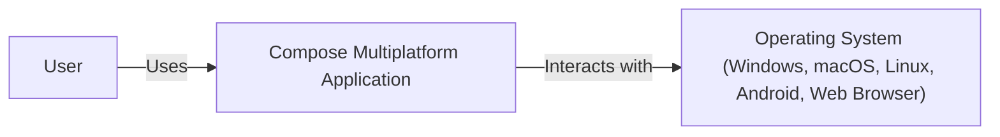
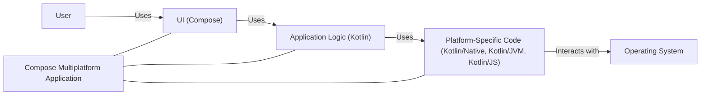
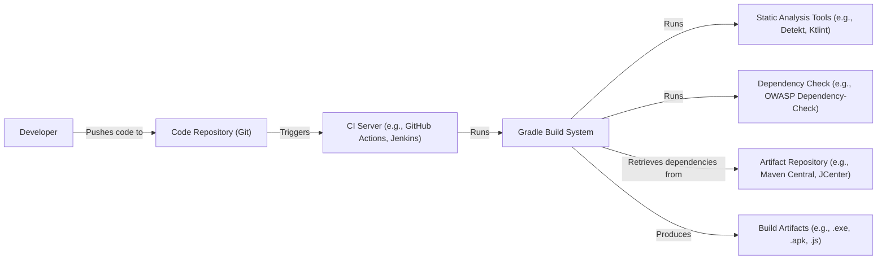

Okay, let's create a design document for the `compose-jb` project.

# BUSINESS POSTURE

Business Priorities and Goals:

*   Provide a modern, declarative UI framework for Kotlin, extending beyond Android to desktop (Windows, macOS, Linux) and web platforms.
*   Enable code reuse across different platforms, reducing development time and cost.
*   Offer a performant and responsive user experience.
*   Attract developers to the Kotlin ecosystem and promote its adoption for multiplatform development.
*   Provide a viable alternative to existing cross-platform UI frameworks.
*   Maintain compatibility with Jetpack Compose for Android, ensuring a smooth transition for existing Android developers.

Most Important Business Risks:

*   Low adoption rate due to competition from established frameworks (React, Flutter, etc.).
*   Performance issues or platform inconsistencies hindering user experience.
*   Security vulnerabilities exposing user data or compromising application integrity.
*   Inability to keep up with the rapid evolution of the Kotlin language and Jetpack Compose.
*   Lack of sufficient community support and contributions.
*   Difficulty in attracting and retaining skilled developers to maintain and enhance the framework.

# SECURITY POSTURE

Existing Security Controls (Inferred from the repository and general Kotlin/Compose practices):

*   security control: Type safety provided by the Kotlin language, reducing the risk of null pointer exceptions and type-related errors. (Kotlin Language Features)
*   security control: Use of immutable data structures by default, minimizing the risk of unintended state changes. (Kotlin Language Features, Compose Runtime)
*   security control: Declarative UI model, reducing the attack surface compared to imperative UI frameworks. (Compose Compiler and Runtime)
*   security control: Built-in support for handling user input and events in a structured way. (Compose UI)
*   security control: Integration with platform-specific security mechanisms (e.g., sandboxing on desktop, permissions on Android). (Platform-specific implementations)
*   security control: Regular updates and bug fixes from JetBrains, addressing potential security vulnerabilities. (JetBrains development process)
*   security control: Code reviews and static analysis are likely used during development. (Inferred from JetBrains development practices)
*   security control: Dependency management using Gradle, allowing for tracking and updating of third-party libraries. (build.gradle.kts files)
*   security control: Use of standard Kotlin libraries for common tasks, reducing the need for custom, potentially vulnerable code. (Kotlin Standard Library)

Accepted Risks:

*   accepted risk: Reliance on third-party libraries, which may introduce vulnerabilities if not properly vetted and updated.
*   accepted risk: Potential for cross-site scripting (XSS) vulnerabilities in web applications if user input is not properly sanitized. (Specific to Compose for Web)
*   accepted risk: Platform-specific vulnerabilities that may exist in the underlying operating systems or rendering engines.
*   accepted risk: The framework is relatively new, and undiscovered vulnerabilities may exist.

Recommended Security Controls:

*   Implement a comprehensive security testing strategy, including static analysis, dynamic analysis, and penetration testing.
*   Establish a clear vulnerability disclosure and reporting process.
*   Provide security guidelines and best practices for developers using Compose Multiplatform.
*   Consider implementing Content Security Policy (CSP) for web applications to mitigate XSS risks.
*   Regularly audit and update third-party dependencies to address known vulnerabilities.
*   Implement robust input validation and sanitization for all user inputs, especially in web applications.
*   Use secure coding practices to prevent common vulnerabilities like injection attacks, buffer overflows, and insecure data storage.

Security Requirements:

*   Authentication: Not directly handled by Compose Multiplatform. Relies on platform-specific or application-specific authentication mechanisms.
*   Authorization: Not directly handled by Compose Multiplatform. Relies on application-specific authorization logic.
*   Input Validation: Compose Multiplatform provides basic input handling, but developers must implement robust validation and sanitization to prevent vulnerabilities.
*   Cryptography: Compose Multiplatform does not provide built-in cryptographic functions. Developers should use platform-specific or Kotlin libraries for cryptography.

# DESIGN

## C4 CONTEXT

Element Descriptions:

*   Element:
    *   Name: User
    *   Type: Person
    *   Description: A person interacting with the Compose Multiplatform application.
    *   Responsibilities: Interacting with the UI, providing input, viewing output.
    *   Security controls: None directly implemented by the user. Relies on application and platform security.

*   Element:
    *   Name: Compose Multiplatform Application
    *   Type: Software System
    *   Description: The application built using Compose Multiplatform.
    *   Responsibilities: Providing the user interface, handling user input, managing application logic, interacting with the operating system.
    *   Security controls: Type safety, immutable data structures, declarative UI model, structured input handling, integration with platform security.

*   Element:
    *   Name: Operating System (Windows, macOS, Linux, Android, Web Browser)
    *   Type: Software System
    *   Description: The underlying operating system or platform on which the Compose Multiplatform application runs.
    *   Responsibilities: Providing resources (memory, CPU, etc.), managing hardware, providing platform-specific APIs.
    *   Security controls: Sandboxing, permissions, memory protection, and other platform-specific security features.

## C4 CONTAINER

Element Descriptions:

*   Element:
    *   Name: User
    *   Type: Person
    *   Description: A person interacting with the Compose Multiplatform application.
    *   Responsibilities: Interacting with the UI, providing input, viewing output.
    *   Security controls: None directly implemented by the user. Relies on application and platform security.

*   Element:
    *   Name: Compose Multiplatform Application
    *   Type: Software System
    *   Description: The application built using Compose Multiplatform.
    *   Responsibilities: Providing the user interface, handling user input, managing application logic, interacting with the operating system.
    *   Security controls: Type safety, immutable data structures, declarative UI model, structured input handling, integration with platform security.

*   Element:
    *   Name: UI (Compose)
    *   Type: Container
    *   Description: The user interface layer built using Compose.
    *   Responsibilities: Rendering the UI, handling user input events.
    *   Security controls: Declarative UI model, structured input handling.

*   Element:
    *   Name: Application Logic (Kotlin)
    *   Type: Container
    *   Description: The core application logic written in Kotlin.
    *   Responsibilities: Managing application state, handling business rules, interacting with data sources.
    *   Security controls: Type safety, immutable data structures.

*   Element:
    *   Name: Platform-Specific Code (Kotlin/Native, Kotlin/JVM, Kotlin/JS)
    *   Type: Container
    *   Description: Code that interacts directly with the underlying platform.
    *   Responsibilities: Accessing platform-specific APIs, handling platform-specific events.
    *   Security controls: Integration with platform security mechanisms.

*   Element:
    *   Name: Operating System
    *   Type: Software System
    *   Description: The underlying operating system or platform.
    *   Responsibilities: Providing resources, managing hardware, providing platform APIs.
    *   Security controls: Sandboxing, permissions, memory protection.

## DEPLOYMENT

Possible Deployment Solutions:

1.  Desktop (Windows, macOS, Linux): Packaged as native executables (e.g., .exe, .app, .deb, .rpm).
2.  Android: Packaged as an APK or AAB file.
3.  Web: Compiled to JavaScript and deployed as static files (HTML, CSS, JS) to a web server.

Chosen Solution (Desktop - Windows):

```mermaid
graph LR
    DeveloperMachine["Developer Machine"]
    Gradle["Gradle Build System"]
    NativeCompiler["Native Compiler (e.g., MinGW)"]
    Executable["Windows Executable (.exe)"]
    Installer["Installer (Optional)"]
    TargetMachine["Target Machine (Windows)"]
    WindowsOS["Windows OS"]

    DeveloperMachine -- Runs --> Gradle
    Gradle -- Uses --> NativeCompiler
    NativeCompiler -- Produces --> Executable
    Executable -- Packaged by --> Installer
    Installer -- Installs --> TargetMachine
    TargetMachine -- Runs --> WindowsOS
    Executable -- Runs on --> WindowsOS
```

Element Descriptions:

*   Element:
    *   Name: Developer Machine
    *   Type: Infrastructure Node
    *   Description: The machine used by the developer to write and build the application.
    *   Responsibilities: Running the IDE, build tools, and other development tools.
    *   Security controls: Standard developer machine security practices (e.g., antivirus, firewall).

*   Element:
    *   Name: Gradle Build System
    *   Type: Software System
    *   Description: The build system used to compile and package the application.
    *   Responsibilities: Managing dependencies, compiling code, creating the executable.
    *   Security controls: Dependency management, build script security.

*   Element:
    *   Name: Native Compiler (e.g., MinGW)
    *   Type: Software System
    *   Description: The compiler used to create the native Windows executable.
    *   Responsibilities: Compiling Kotlin/Native code to machine code.
    *   Security controls: Compiler security features (e.g., stack protection).

*   Element:
    *   Name: Windows Executable (.exe)
    *   Type: Software System
    *   Description: The compiled application executable.
    *   Responsibilities: Running the application on the target machine.
    *   Security controls: Code signing (optional), ASLR, DEP.

*   Element:
    *   Name: Installer (Optional)
    *   Type: Software System
    *   Description: An optional installer to simplify application installation.
    *   Responsibilities: Installing the executable and any required dependencies.
    *   Security controls: Installer integrity checks.

*   Element:
    *   Name: Target Machine (Windows)
    *   Type: Infrastructure Node
    *   Description: The machine on which the application will be installed and run.
    *   Responsibilities: Running the Windows operating system and the application.
    *   Security controls: Operating system security features (e.g., firewall, antivirus).

*   Element:
    *   Name: Windows OS
    *   Type: Software System
    *   Description: The Windows operating system.
    *   Responsibilities: Providing the runtime environment for the application.
    *   Security controls: Sandboxing, permissions, memory protection.

## BUILD

Build Process Description:

1.  Developer writes code and pushes it to a Git repository.
2.  A CI server (e.g., GitHub Actions, Jenkins) is triggered by the code push.
3.  The CI server runs the Gradle build system.
4.  Gradle retrieves dependencies from an artifact repository (e.g., Maven Central, JCenter).
5.  Gradle runs static analysis tools (e.g., Detekt, Ktlint) to check for code quality and potential security issues.
6.  Gradle runs a dependency check tool (e.g., OWASP Dependency-Check) to identify known vulnerabilities in dependencies.
7.  Gradle compiles the code and produces build artifacts (e.g., .exe, .apk, .js).

Security Controls:

*   Code Repository: Access control, branch protection, code review policies.
*   CI Server: Secure configuration, limited access, audit logging.
*   Gradle: Dependency management, build script security.
*   Static Analysis: Identification of potential code vulnerabilities.
*   Dependency Check: Identification of known vulnerabilities in dependencies.
*   Artifact Repository: Secure access, integrity checks.

# RISK ASSESSMENT

Critical Business Processes:

*   Application functionality: Ensuring the application performs its intended functions correctly and reliably.
*   User experience: Providing a smooth, responsive, and intuitive user interface.
*   Data integrity: Maintaining the accuracy and consistency of application data.
*   Cross-platform compatibility: Ensuring the application works correctly on all supported platforms.

Data Sensitivity:

*   Compose Multiplatform itself does not handle sensitive data directly. Data sensitivity depends on the specific application built using the framework.
*   If the application handles user data (e.g., personal information, financial data), that data should be considered sensitive and protected accordingly.
*   If the application handles no user data, and only present static information, data sensitivity is low.

# QUESTIONS & ASSUMPTIONS

Questions:

*   What specific types of applications are expected to be built with Compose Multiplatform (e.g., data-heavy, UI-focused, games)? This will influence the security requirements.
*   What are the target user demographics and their security expectations?
*   What are the specific deployment environments and their security configurations?
*   Are there any specific regulatory or compliance requirements that need to be considered?
*   What level of security testing is planned or already in place?
*   What is the process for handling security vulnerabilities discovered in the framework or in applications built with it?

Assumptions:

*   BUSINESS POSTURE: The primary goal is to create a robust and widely adopted cross-platform UI framework.
*   SECURITY POSTURE: Developers using Compose Multiplatform are responsible for implementing application-specific security controls. JetBrains will address security vulnerabilities in the framework itself.
*   DESIGN: The design will follow best practices for Kotlin and Compose development, including type safety, immutability, and declarative UI principles. The build process will include static analysis and dependency checking. Deployment will be platform-specific.