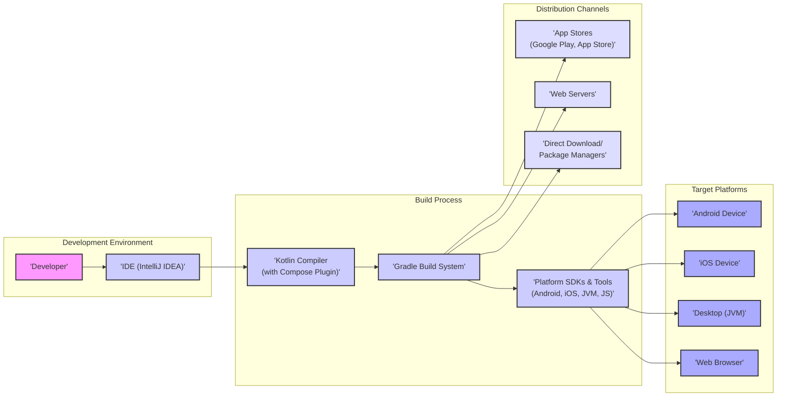

# Project Design Document: Compose Multiplatform

**Version:** 1.1
**Date:** October 26, 2023
**Author:** AI Software Architect

## 1. Introduction

This document provides an enhanced architectural design of the JetBrains Compose Multiplatform project, building upon the previous version. The primary purpose remains to offer a clear and detailed outline of the system's components, their interactions, and data flow, specifically tailored for subsequent threat modeling activities. This document is intended for security engineers, developers, and anyone involved in the security assessment of the Compose Multiplatform project. The improvements in this version aim to provide more granular detail and clearer categorization for security considerations.

## 2. Project Overview

Compose Multiplatform is a declarative UI framework leveraging Kotlin to build native applications across various platforms, including desktop, mobile (Android and iOS), and web. It utilizes the strengths of Jetpack Compose for UI construction and incorporates platform-specific implementations for seamless native integration. The core value proposition is to enable developers to write UI code once in Kotlin and deploy it across multiple targets, thereby significantly reducing development time and code redundancy. This framework promotes a shared codebase for UI and business logic, while allowing for platform-specific customizations where necessary.

## 3. System Architecture

The Compose Multiplatform architecture comprises the following key components, with more detail provided compared to the previous version:

*   **Kotlin Multiplatform (KMP):** The foundational technology enabling the sharing of Kotlin code across different platforms. KMP allows developers to write common business logic, data models, and even UI logic in Kotlin. This shared code is then compiled into platform-specific binaries:
    *   JVM bytecode for Android and Desktop environments.
    *   Native binaries for iOS (using Kotlin/Native).
    *   JavaScript for web browsers (using Kotlin/JS).
*   **Compose UI Framework:** The declarative UI framework, originally developed by Google for Android, serves as the core for building user interfaces. It provides a rich set of composable functions that describe the UI's structure, appearance, and behavior in a reactive manner.
*   **Platform Abstraction Layer (Renderers and Interop):** This crucial layer bridges the gap between the platform-agnostic Compose UI framework and the underlying operating system or browser. It consists of:
    *   **Platform-Specific Renderers:** These components are responsible for translating the Compose UI descriptions into native UI elements on each platform.
        *   **Android:** Utilizes the standard Android View system and the Jetpack Compose runtime environment.
        *   **Desktop (JVM):** Leverages either Swing or JavaFX for rendering the user interface components.
        *   **iOS:** Employs a custom-built rendering engine based on Apple's UIKit framework. This involves mapping Compose UI elements to corresponding UIKit components.
        *   **Web (JS):** Uses a custom rendering engine that translates Compose UI elements into standard HTML DOM elements and CSS styles, rendered within a web browser.
    *   **Interoperability Mechanisms:** These provide ways for the shared Kotlin code to interact with platform-specific APIs and libraries.
        *   **Android:** Seamless access to the Android SDK APIs.
        *   **iOS:** Kotlin/Native provides mechanisms for calling Objective-C and Swift code, and for exposing Kotlin code to the native environment.
        *   **Desktop:** Access to standard Java libraries and platform-specific native libraries through JNI (Java Native Interface).
        *   **Web:** JavaScript interop capabilities allowing Kotlin/JS code to interact with JavaScript libraries and browser APIs.
*   **Kotlin Compiler and Compose Compiler Plugin:** The Kotlin compiler is responsible for the core compilation process of Kotlin code. The Compose compiler plugin is a specialized component that transforms Compose UI code into an optimized form suitable for rendering on the target platforms.
*   **Gradle Build System:**  Gradle is the build automation tool used for managing project dependencies, compiling Kotlin code for different targets, linking native libraries, and packaging the final application artifacts for each platform. The `build.gradle.kts` files define the target platforms and their respective build processes, including dependency management and plugin configurations.
*   **Developer Environment (IDE):**  IntelliJ IDEA, with the Kotlin plugin and relevant platform SDKs (Android SDK, Xcode for iOS development), is the primary development environment. The IDE provides features for code editing, debugging, running tests, and building applications for the various target platforms.
*   **Distribution Channels:** The methods through which the compiled applications are delivered to end-users:
    *   **Android:** Google Play Store, direct APK or AAB (Android App Bundle) distribution.
    *   **iOS:** Apple App Store, TestFlight for beta testing, enterprise distribution.
    *   **Desktop:** Platform-specific executable files (JAR files, DMGs for macOS, EXEs for Windows), and potentially through platform-specific package managers.
    *   **Web:** Deployment to web servers, typically involving static HTML, CSS, and JavaScript files.

## 4. Data Flow

The data flow within a Compose Multiplatform application can be broken down into the following stages:

*   **Development Phase:**
    *   The developer writes Kotlin code within the IDE, defining the UI using Compose composables and implementing business logic.
    *   Project dependencies are declared and managed using the Gradle build system.
*   **Compilation and Build Phase:**
    *   The Kotlin compiler, along with the Compose compiler plugin, processes the Kotlin code.
    *   For each target platform, the compiler generates platform-specific code (JVM bytecode, native binaries, or JavaScript).
    *   Gradle orchestrates the build process, including dependency resolution, code compilation, linking of native libraries, and packaging of the application.
    *   Platform-specific SDKs and tools are utilized during the build process (e.g., Android SDK for Android builds, Xcode build tools for iOS builds).
*   **Distribution Phase:**
    *   Platform-specific application packages are created (e.g., APK, IPA, JAR, JS bundles).
    *   These packages are then distributed through the appropriate channels (app stores, web servers, direct downloads).
*   **Runtime Phase:**
    *   The application is launched on the target platform.
    *   The platform-specific rendering engine interprets the Compose UI definitions and renders the user interface using native UI components or browser elements.
    *   User interactions trigger events that update the application state.
    *   Compose's reactive nature ensures that UI updates are automatically reflected when the state changes.
    *   Business logic, written in shared Kotlin code, is executed.
    *   The application may interact with local storage, network resources, or platform-specific services through the interoperability layers.

## 5. Security Considerations

This section outlines potential security considerations, categorized for clarity:

*   **Dependency Management Security:**
    *   Vulnerabilities in third-party libraries used by the project (both Kotlin Multiplatform libraries and platform-specific dependencies).
    *   Risk of using outdated or compromised dependencies.
    *   Potential for dependency confusion attacks.
*   **Build and Distribution Security:**
    *   Tampering with the build process or build artifacts.
    *   Compromise of the developer environment or CI/CD pipeline.
    *   Man-in-the-middle attacks during dependency resolution.
    *   Security of the distribution channels (e.g., app store vetting processes, secure web server configurations).
*   **Runtime Security:**
    *   **Platform-Specific Vulnerabilities:** Exploiting vulnerabilities in the underlying operating systems or browser environments.
    *   **Interoperability Risks:** Security issues arising from the interaction between Kotlin code and platform-specific native code (e.g., memory safety issues in Kotlin/Native interop).
    *   **Data Storage Security:** Insecure storage of sensitive data on each platform (e.g., lack of encryption, storing credentials in plain text).
    *   **Network Communication Security:** Insecure communication with backend services (e.g., using HTTP instead of HTTPS, improper certificate validation, vulnerabilities in network protocols).
    *   **Code Injection Risks (Web):** Potential for cross-site scripting (XSS) or other code injection vulnerabilities in the web implementation.
    *   **UI Rendering Vulnerabilities:** Potential vulnerabilities in the platform-specific rendering engines that could lead to UI redressing or other UI-based attacks.
    *   **Permissions and Sandboxing:** Improper use or bypass of platform security mechanisms like permissions on Android and iOS, or browser sandboxing.
*   **Code Security:**
    *   Vulnerabilities introduced by developers through insecure coding practices (e.g., SQL injection if interacting with databases, insecure handling of user input).
    *   Exposure of sensitive information through logging or debugging mechanisms in production builds.
    *   Reverse engineering of the application code to extract sensitive information or logic.

## 6. Assumptions and Constraints

*   Developers are expected to use officially supported versions of IntelliJ IDEA, the Kotlin plugin, and platform SDKs.
*   The build process relies on the official Gradle tooling and recommended configurations.
*   Target platforms are assumed to have their default security features enabled and up-to-date.
*   Applications interacting with backend services are expected to utilize secure communication protocols (HTTPS).
*   Developers are expected to follow secure coding practices.

## 7. Future Considerations

*   Detailed security analysis of the platform abstraction layer and the specific implementations for each target.
*   In-depth examination of the security mechanisms and potential vulnerabilities within the Compose UI framework itself.
*   Platform-specific threat modeling exercises to identify unique security concerns for each target environment.
*   Integration of static and dynamic analysis security scanning tools into the development and CI/CD pipelines.
*   Regular security audits and penetration testing of applications built with Compose Multiplatform.

This improved design document provides a more detailed and structured understanding of the Compose Multiplatform project's architecture and data flow, with a clearer categorization of security considerations. This enhanced information will be valuable for conducting a more comprehensive threat model and identifying potential security vulnerabilities across the different platforms.