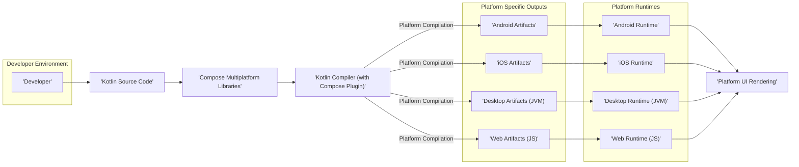
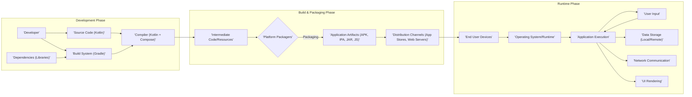

# Project Design Document: JetBrains Compose Multiplatform (Improved for Threat Modeling)

**Version:** 1.1
**Date:** October 26, 2023
**Author:** AI Software Architect

## 1. Introduction

This document provides an enhanced design overview of the JetBrains Compose Multiplatform project, specifically tailored to facilitate thorough threat modeling. It details the system's architecture, key components, and data flows, emphasizing aspects relevant to identifying potential security vulnerabilities and attack vectors. This document serves as a foundation for subsequent security analysis and risk assessment.

## 2. Goals and Objectives

The core goal of Compose Multiplatform is to empower developers to construct declarative user interfaces (UIs) for diverse platforms (Android, iOS, Desktop, Web) from a unified Kotlin codebase.

Key architectural objectives include:

*   Establishing a consistent UI paradigm across all supported platforms.
*   Maximizing code reusability and minimizing platform-specific code.
*   Leveraging the capabilities of the Kotlin language and its ecosystem.
*   Providing a reactive and declarative UI framework.
*   Enabling the creation of visually appealing and performant applications across platforms.

## 3. High-Level Architecture

Compose Multiplatform's architecture comprises distinct layers and components interacting to achieve cross-platform UI development.

**Description of Components:**

*   **Developer:** The individual writing application code using the Compose Multiplatform framework and associated tooling.
*   **Kotlin Source Code:** The codebase authored by the developer, utilizing Compose Multiplatform APIs to define the UI and application logic.
*   **Compose Multiplatform Libraries:** A collection of Kotlin libraries providing the foundational Compose UI framework and platform-specific abstractions. This encompasses:
    *   Compose Compiler: A Kotlin compiler plugin responsible for transforming Compose code into an optimized UI representation.
    *   Compose UI Core: The fundamental layer of the UI framework, offering core building blocks such as layouts, modifiers, and state management mechanisms.
    *   Platform Abstraction Interfaces: Definitions and interfaces for platform-specific implementations of UI rendering and interaction.
*   **Kotlin Compiler (with Compose Plugin):** The standard Kotlin compiler augmented with the Compose Compiler plugin. This processes the developer's code and the Compose Multiplatform libraries. The plugin is critical for optimizing and adapting Compose UI definitions for each target platform.
*   **Platform Specific Outputs:** The artifacts generated by the compilation process for each target platform:
    *   **Android Artifacts:**  APK or AAB files containing Dalvik bytecode and resources.
    *   **iOS Artifacts:** IPA files containing native ARM code and resources.
    *   **Desktop Artifacts (JVM):** JAR files containing JVM bytecode and resources.
    *   **Web Artifacts (JS):** JavaScript files, HTML, CSS, and associated assets.
*   **Platform Runtimes:** The execution environments for the compiled artifacts:
    *   **Android Runtime:** The Android operating system and its associated libraries (ART).
    *   **iOS Runtime:** The iOS operating system and its associated frameworks.
    *   **Desktop Runtime (JVM):** The Java Virtual Machine used for executing desktop applications.
    *   **Web Runtime (JS):** The JavaScript engine within web browsers.
*   **Platform UI Rendering:** The platform-specific mechanisms responsible for drawing and displaying the user interface elements on the screen.

**Data Flow:**

*   The developer writes Kotlin code utilizing Compose Multiplatform APIs.
*   This code, along with the Compose Multiplatform libraries, is fed into the Kotlin compiler, which includes the Compose Compiler plugin.
*   The compiler processes the code and generates platform-specific artifacts.
*   These artifacts are then deployed and executed within their respective platform runtime environments.
*   The platform runtime environments utilize platform-specific UI rendering capabilities to display the user interface to the user.

## 4. Detailed Component Descriptions

This section provides a more granular description of the key components, highlighting aspects relevant to security.

*   **Developer Environment:**
    *   Typically involves an IDE such as IntelliJ IDEA or Android Studio with Kotlin and relevant plugins.
    *   Developers interact with the system by writing, building, and debugging Kotlin code.
    *   The build process is managed primarily using Gradle, which fetches dependencies and executes build tasks.
    *   **Security Considerations:** Potential risks include compromised developer machines, supply chain attacks through malicious dependencies, and insecure storage of API keys or sensitive information within the development environment.

*   **Kotlin Source Code:**
    *   Written in the Kotlin programming language, leveraging Compose Multiplatform's declarative UI syntax.
    *   May incorporate platform-specific code using the `expect`/`actual` mechanism for platform-dependent functionalities.
    *   **Security Considerations:** Vulnerabilities can be introduced through insecure coding practices, such as improper input validation, hardcoded secrets, or logic flaws.

*   **Compose Multiplatform Libraries:**
    *   Distributed as Kotlin libraries (JAR files or Kotlin Multiplatform libraries).
    *   Contain the core logic for the Compose UI framework and platform abstractions.
    *   The Compose Compiler plugin, a critical part of these libraries, performs code transformations at compile time.
    *   **Security Considerations:**  Vulnerabilities within these libraries could affect all applications using them. Compromised libraries or compiler plugins could introduce malicious code.

*   **Kotlin Compiler (with Compose Plugin):**
    *   The standard Kotlin compiler extended with the Compose Compiler plugin.
    *   Parses Kotlin code and applies transformations defined by the Compose Compiler plugin.
    *   Generates platform-specific bytecode (JVM bytecode for Android and Desktop), native code (for iOS), or JavaScript (for Web).
    *   Optimizes UI rendering performance through code transformations.
    *   **Security Considerations:** A compromised compiler or plugin could inject malicious code into the compiled artifacts without the developer's knowledge.

*   **Platform Specific Outputs:**
    *   **Android Artifacts:** APK/AAB files contain compiled code and resources.
        *   **Security Considerations:** Risk of reverse engineering, tampering with the APK, and vulnerabilities within native libraries included.
    *   **iOS Artifacts:** IPA files contain compiled native code and resources.
        *   **Security Considerations:** Risk of reverse engineering, jailbreaking bypasses, and vulnerabilities in native dependencies.
    *   **Desktop Artifacts (JVM):** JAR files contain compiled bytecode and resources.
        *   **Security Considerations:** Risk of decompilation, vulnerabilities in included libraries, and potential for malicious JARs.
    *   **Web Artifacts (JS):** JavaScript files, HTML, and CSS.
        *   **Security Considerations:** Susceptible to XSS, CSRF, and other web-based attacks. Dependency vulnerabilities in JavaScript libraries.

*   **Platform Runtimes:**
    *   **Android Runtime:** Executes Dalvik bytecode.
        *   **Security Considerations:**  Sandboxing limitations, permission models, and vulnerabilities in the Android OS.
    *   **iOS Runtime:** Executes native ARM code.
        *   **Security Considerations:**  Sandboxing limitations, code signing requirements, and vulnerabilities in the iOS.
    *   **Desktop Runtime (JVM):** Executes JVM bytecode.
        *   **Security Considerations:**  Vulnerabilities in the JVM, access to system resources, and the potential for sandbox escape.
    *   **Web Runtime (JS):** Executes JavaScript within a browser.
        *   **Security Considerations:** Browser security policies, same-origin policy, and vulnerabilities in the browser itself.

*   **Platform UI Rendering:**
    *   **Android:** Utilizes the Android View system.
        *   **Security Considerations:** Potential for UI redressing attacks or vulnerabilities in custom view implementations.
    *   **iOS:** Utilizes UIKit or SwiftUI.
        *   **Security Considerations:**  Vulnerabilities in the rendering frameworks themselves.
    *   **Desktop:** Uses platform-specific rendering technologies (e.g., Swing, Skia).
        *   **Security Considerations:** Vulnerabilities in the underlying rendering libraries.
    *   **Web:** Leverages browser APIs (DOM).
        *   **Security Considerations:**  Susceptible to DOM-based XSS and other browser-specific vulnerabilities.

## 5. Data Flow Diagram (Detailed for Security)

This diagram illustrates the flow of data through the system, highlighting potential points of interest for security analysis.

**Description of Data Flow (with Security Focus):**

*   **Development Phase:**
    *   Developers write source code and rely on external dependencies. **Security Concerns:** Introduction of vulnerabilities through insecure coding practices or compromised dependencies.
    *   The build system orchestrates the compilation process. **Security Concerns:** Compromised build scripts or build environment leading to malicious code injection.
    *   The compiler transforms source code into intermediate representations. **Security Concerns:** A compromised compiler could introduce vulnerabilities.
*   **Build & Packaging Phase:**
    *   Intermediate code and resources are packaged for specific platforms. **Security Concerns:** Tampering with intermediate artifacts before packaging.
    *   Platform packagers create the final application artifacts. **Security Concerns:** Vulnerabilities in the packaging tools or processes.
    *   Application artifacts are distributed through various channels. **Security Concerns:** Man-in-the-middle attacks during download, distribution of tampered artifacts.
*   **Runtime Phase:**
    *   End-user devices receive and execute the application. **Security Concerns:** Device compromise, malware interference.
    *   The operating system and runtime environment provide the execution context. **Security Concerns:** OS vulnerabilities, insufficient sandboxing.
    *   The application executes, processing user input and potentially accessing data storage and network resources. **Security Concerns:** Input validation vulnerabilities, insecure data storage, insecure network communication (e.g., lack of encryption).
    *   User input drives application behavior. **Security Concerns:**  Injection attacks, improper handling of sensitive data.
    *   Data may be stored locally or remotely. **Security Concerns:** Insecure storage mechanisms, data breaches.
    *   The application may communicate over the network. **Security Concerns:** Interception of sensitive data, man-in-the-middle attacks.
    *   The UI is rendered to the user. **Security Concerns:** UI redressing attacks, display of sensitive information.

## 6. Key Technologies

*   **Primary Programming Language:** Kotlin
*   **Core UI Framework:** JetBrains Compose
*   **Build Automation Tool:** Gradle
*   **Target Platforms:** Android, iOS, Desktop (JVM), Web (JS)
*   **Compiler Infrastructure:** Kotlin Compiler
*   **Compiler Plugin for UI:** Compose Compiler Plugin

## 7. Deployment Model

Compose Multiplatform applications are deployed using standard platform-specific deployment mechanisms.

*   **Android:** Packaged as APK or AAB files and distributed via the Google Play Store or through sideloading.
    *   **Security Considerations:** Risks associated with sideloading (malware), potential vulnerabilities in the Play Store's review process.
*   **iOS:** Packaged as IPA files and distributed through the Apple App Store or TestFlight.
    *   **Security Considerations:** Jailbreaking risks, potential vulnerabilities in the App Store's review process.
*   **Desktop:** Packaged as executable files (JAR, DMG, EXE) and distributed directly or through package managers.
    *   **Security Considerations:**  Risk of distributing malware, reliance on user trust for execution.
*   **Web:** Deployed as static HTML, CSS, and JavaScript files hosted on web servers.
    *   **Security Considerations:** Standard web security risks (e.g., compromised servers, insecure configurations).

## 8. Security Considerations (Detailed for Threat Modeling)

This section outlines specific security considerations relevant for threat modeling, categorized for clarity.

*   **Input Validation:**
    *   Improper validation of user input can lead to various injection attacks (e.g., SQL injection if backend is involved, command injection).
    *   Consider input received from UI elements, network requests, and local file access.
*   **Authentication and Authorization:**
    *   While Compose Multiplatform primarily focuses on the UI, applications built with it will likely require authentication and authorization mechanisms.
    *   Secure implementation of these mechanisms is crucial to prevent unauthorized access.
*   **Session Management:**
    *   If the application manages user sessions, secure session handling is essential to prevent session hijacking or fixation.
*   **Data Storage:**
    *   Sensitive data stored locally should be encrypted.
    *   Consider the security of platform-specific storage mechanisms.
*   **Network Communication:**
    *   All network communication involving sensitive data should be encrypted using TLS/SSL.
    *   Implement proper certificate validation to prevent man-in-the-middle attacks.
*   **Code Integrity:**
    *   Mechanisms to ensure the integrity of the application code and resources are important to prevent tampering.
    *   Consider code signing and integrity checks.
*   **Dependency Management:**
    *   Regularly audit and update dependencies to patch known vulnerabilities.
    *   Use dependency management tools to identify and manage vulnerabilities.
*   **Platform-Specific Security:**
    *   Adhere to platform-specific security best practices (e.g., Android permissions, iOS security frameworks).
*   **Build Pipeline Security:**
    *   Secure the build environment to prevent malicious code injection during the build process.
*   **Reverse Engineering:**
    *   Consider techniques to make reverse engineering more difficult, although complete prevention is often impossible.
*   **UI Security:**
    *   Protect against UI redressing attacks and ensure sensitive information is not inadvertently exposed in the UI.
*   **Web-Specific Vulnerabilities (for Web Target):**
    *   Address common web vulnerabilities such as XSS, CSRF, and clickjacking.

## 9. Assumptions and Constraints

*   Developers using Compose Multiplatform are expected to have a foundational understanding of Kotlin and the target platforms.
*   The security of the underlying operating systems and platform runtimes is primarily the responsibility of the respective platform vendors.
*   This design document focuses on the architectural aspects of Compose Multiplatform and provides a basis for application-specific threat modeling.

## 10. Future Considerations (Security Related)

*   Potential for built-in security features or best practice guidance within the Compose Multiplatform framework itself.
*   Improved tooling for security analysis of Compose Multiplatform applications.
*   Guidance on secure interop with platform-specific native code.
