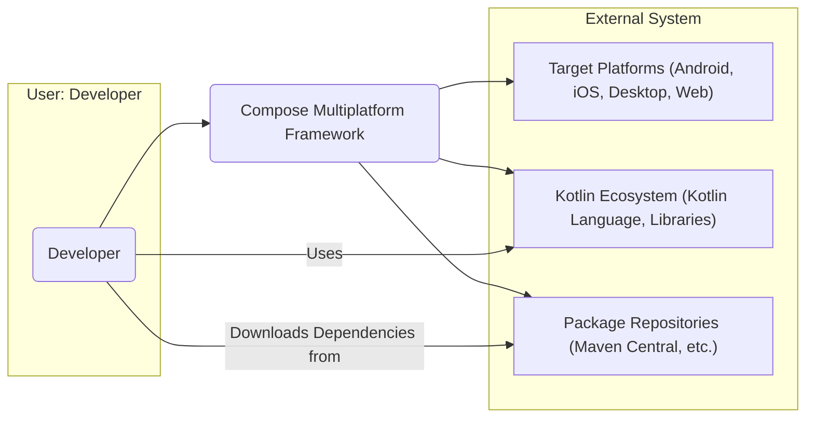
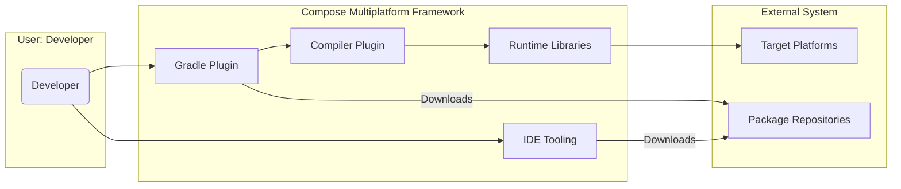
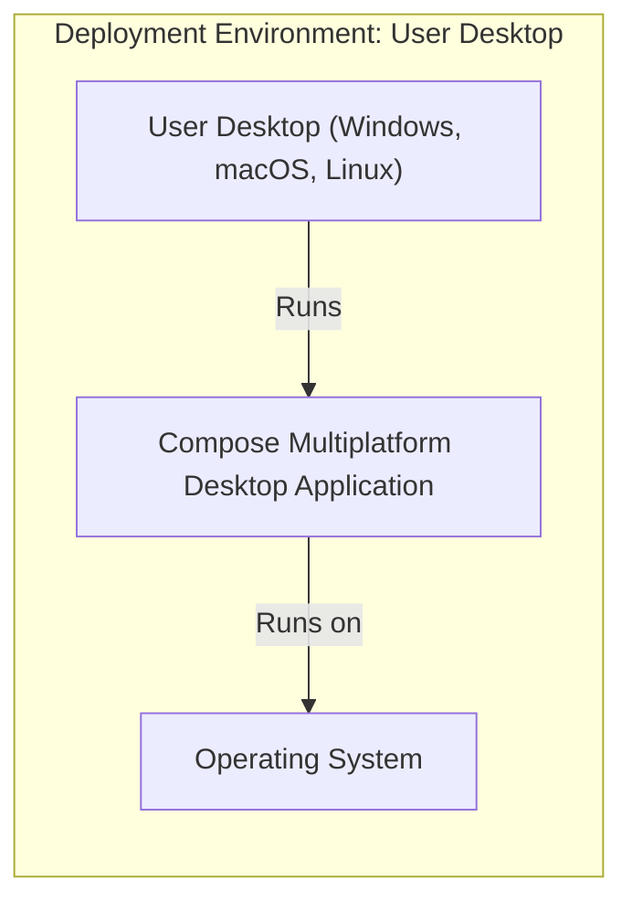
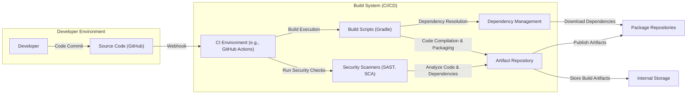

# BUSINESS POSTURE

The Compose Multiplatform project aims to provide a declarative UI framework that allows developers to share UI code across multiple platforms, including Android, iOS, desktop (JVM), and web, primarily using Kotlin.

Business Priorities and Goals:

*   Enable cross-platform UI development: Reduce development time and costs by allowing code reuse across different platforms.
*   Enhance developer productivity: Provide a modern, declarative UI framework that is easy to learn and use, improving developer efficiency.
*   Expand the Kotlin ecosystem: Attract more developers to the Kotlin ecosystem by offering a compelling cross-platform UI solution.
*   Maintain performance and native look-and-feel: Ensure applications built with Compose Multiplatform perform well and integrate seamlessly with the native UI of each target platform.
*   Foster community adoption and growth: Build a strong community around Compose Multiplatform to ensure its long-term sustainability and evolution.

Most Important Business Risks:

*   Security vulnerabilities in the framework: If vulnerabilities are discovered in Compose Multiplatform, applications built upon it could be vulnerable across all supported platforms, leading to widespread impact.
*   Performance issues: Poor performance of applications built with Compose Multiplatform could lead to negative user experiences and hinder adoption.
*   Platform compatibility issues: Inconsistencies or bugs across different target platforms could frustrate developers and limit the framework's usability.
*   Lack of community adoption: Insufficient community support and contributions could slow down development, bug fixing, and feature enhancements, potentially leading to project stagnation.
*   Supply chain compromise: If the build or distribution process of Compose Multiplatform is compromised, malicious code could be injected, affecting all users of the framework.

# SECURITY POSTURE

Existing Security Controls:

*   security control: Open Source Codebase: The source code is publicly available on GitHub, allowing for community review and scrutiny. Implemented: GitHub repository.
*   security control: Dependency Management: Uses Gradle for dependency management, allowing for control over included libraries. Implemented: build.gradle.kts files.
*   security control: Code Reviews:  Likely employs code review processes within the JetBrains development team. Implemented: Internal JetBrains development process.
*   security control: Static Analysis:  Likely uses static analysis tools as part of JetBrains' development practices. Implemented: Internal JetBrains development process.

Accepted Risks:

*   accepted risk: Reliance on Third-Party Libraries:  The project depends on various third-party libraries, which may introduce vulnerabilities. Mitigation: Dependency scanning and updates.
*   accepted risk: Community Contributions:  While beneficial, community contributions need careful review to prevent malicious code injection. Mitigation: Thorough code review process for external contributions.

Recommended Security Controls:

*   security control: Automated Dependency Scanning: Implement automated scanning of dependencies for known vulnerabilities in the CI/CD pipeline.
*   security control: Software Composition Analysis (SCA): Integrate SCA tools to identify and manage open-source components and their associated risks.
*   security control: Regular Security Audits: Conduct periodic security audits of the codebase by internal or external security experts.
*   security control: Vulnerability Disclosure Program: Establish a clear process for reporting and handling security vulnerabilities.
*   security control: Secure Build Pipeline: Harden the build pipeline to prevent tampering and ensure the integrity of build artifacts.

Security Requirements:

*   Authentication: Not directly applicable to the framework itself. Authentication is a concern for applications built using Compose Multiplatform. Applications should use secure authentication mechanisms appropriate for their target platforms and use cases.
*   Authorization: Not directly applicable to the framework itself. Authorization is a concern for applications built using Compose Multiplatform. Applications should implement robust authorization mechanisms to control access to resources and functionalities.
*   Input Validation: Compose Multiplatform framework should encourage and facilitate secure input handling in applications built with it. The framework itself should be resilient to malformed inputs where applicable (e.g., in resource loading, configuration parsing). Applications built with Compose Multiplatform must implement thorough input validation to prevent vulnerabilities like injection attacks.
*   Cryptography: Compose Multiplatform framework might utilize cryptography for secure storage or communication in specific scenarios (e.g., handling resources, network requests). Applications built with Compose Multiplatform may need to implement cryptography for data protection. The framework should not introduce cryptographic weaknesses or vulnerabilities.

# DESIGN

## C4 CONTEXT

Context Diagram Elements:

*   Element:
    *   Name: Developer
    *   Type: User
    *   Description: Software developers who use Compose Multiplatform to build cross-platform applications.
    *   Responsibilities: Develop applications using Compose Multiplatform, integrate with target platform SDKs, deploy applications.
    *   Security controls: security control: Developer workstations security (OS hardening, endpoint protection), security control: Secure coding practices training.

*   Element:
    *   Name: Compose Multiplatform Framework
    *   Type: Software System
    *   Description: The declarative UI framework that enables cross-platform UI development using Kotlin.
    *   Responsibilities: Provide APIs for UI development, compile and translate UI code for different platforms, manage UI rendering and interactions.
    *   Security controls: security control: Open source codebase, security control: Code reviews, security control: Static analysis, security control: Dependency scanning, security control: Regular security audits.

*   Element:
    *   Name: Target Platforms (Android, iOS, Desktop, Web)
    *   Type: External System
    *   Description: The various operating systems and environments where applications built with Compose Multiplatform are deployed and run.
    *   Responsibilities: Provide platform-specific APIs and functionalities, execute applications, manage system resources.
    *   Security controls: security control: Platform security features (OS hardening, sandboxing, app permissions), security control: App store security reviews (for mobile platforms).

*   Element:
    *   Name: Kotlin Ecosystem (Kotlin Language, Libraries)
    *   Type: External System
    *   Description: The Kotlin programming language and its associated libraries and tools that Compose Multiplatform is built upon and integrates with.
    *   Responsibilities: Provide the Kotlin language runtime, standard libraries, and supporting tools.
    *   Security controls: security control: Kotlin language security features, security control: Security of Kotlin standard libraries, security control: Dependency management for Kotlin libraries.

*   Element:
    *   Name: Package Repositories (Maven Central, etc.)
    *   Type: External System
    *   Description: Online repositories where Compose Multiplatform libraries and dependencies are published and from where developers download them.
    *   Responsibilities: Host and distribute software packages, ensure package integrity and availability.
    *   Security controls: security control: Repository security measures (access control, malware scanning), security control: Package signing and verification.

## C4 CONTAINER

Container Diagram Elements:

*   Element:
    *   Name: Compiler Plugin
    *   Type: Container
    *   Description: A Kotlin compiler plugin that transforms Compose UI code into platform-specific UI instructions.
    *   Responsibilities: Code transformation, platform-specific code generation, optimization.
    *   Security controls: security control: Input validation of compiler inputs, security control: Secure coding practices in plugin development, security control: Static analysis of plugin code.

*   Element:
    *   Name: Runtime Libraries
    *   Type: Container
    *   Description: Platform-specific runtime libraries that provide the necessary components to render and manage Compose UI on each target platform.
    *   Responsibilities: UI rendering, event handling, platform API integration, resource management.
    *   Security controls: security control: Secure coding practices in library development, security control: Memory safety, security control: Input validation of external data, security control: Regular updates and patching.

*   Element:
    *   Name: Gradle Plugin
    *   Type: Container
    *   Description: A Gradle plugin that simplifies the integration of Compose Multiplatform into Kotlin projects, manages dependencies, and configures the build process.
    *   Responsibilities: Dependency management, build configuration, task automation, project setup.
    *   Security controls: security control: Secure plugin distribution (signed artifacts), security control: Input validation of build configurations, security control: Dependency integrity checks.

*   Element:
    *   Name: IDE Tooling
    *   Type: Container
    *   Description: IDE plugins and extensions that provide developer support for Compose Multiplatform, such as code completion, previews, and debugging.
    *   Responsibilities: Code editing support, UI previews, debugging capabilities, project management integration.
    *   Security controls: security control: Secure plugin distribution, security control: Input validation of project data, security control: Protection against malicious project files.

## DEPLOYMENT

Deployment Architectures:

Compose Multiplatform applications can be deployed in various ways depending on the target platform:

*   Android: Deployed as APK or AAB packages to Android devices via app stores (Google Play Store) or sideloading.
*   iOS: Deployed as IPA packages to iOS devices via the App Store or TestFlight.
*   Desktop (JVM): Deployed as platform-specific executables (e.g., JAR, DMG, EXE) for Windows, macOS, and Linux.
*   Web: Deployed as web applications using technologies like WebAssembly or JavaScript, hosted on web servers.

Detailed Deployment Architecture (Example: Desktop JVM Application):

Deployment Diagram Elements (Desktop JVM Application):

*   Element:
    *   Name: User Desktop (Windows, macOS, Linux)
    *   Type: Deployment Environment
    *   Description: The end-user's personal computer running a desktop operating system.
    *   Responsibilities: Execute applications, provide user interface, manage system resources.
    *   Security controls: security control: User desktop security practices (OS updates, antivirus), security control: Endpoint protection software.

*   Element:
    *   Name: Compose Multiplatform Desktop Application
    *   Type: Software Instance
    *   Description: An instance of a desktop application built using Compose Multiplatform, deployed on the user's desktop.
    *   Responsibilities: Provide application functionality to the user, interact with the operating system, manage application data.
    *   Security controls: security control: Application-level security controls (authentication, authorization, input validation), security control: Secure storage of application data, security control: Regular application updates.

*   Element:
    *   Name: Operating System
    *   Type: Infrastructure
    *   Description: The desktop operating system (Windows, macOS, Linux) running on the user's computer.
    *   Responsibilities: Provide system services, manage hardware resources, enforce security policies.
    *   Security controls: security control: Operating system security features (access control, firewalls, kernel hardening), security control: Regular OS updates and patching.

## BUILD

Build Process Description:

1.  Developer commits code changes to the Source Code repository (GitHub).
2.  A webhook triggers the CI Environment (e.g., GitHub Actions).
3.  The CI Environment executes Build Scripts (Gradle) to build the project.
4.  Build Scripts use Dependency Management to resolve and download dependencies from Package Repositories.
5.  Security Scanners (SAST, SCA) are integrated into the CI pipeline to analyze the code and dependencies for vulnerabilities.
6.  Build Scripts compile the code, package the artifacts (libraries, plugins), and store them in the Artifact Repository.
7.  The Artifact Repository may publish release artifacts to public Package Repositories (e.g., Maven Central).
8.  Internal Storage is used to store build artifacts and logs for auditing and traceability.

Build Diagram Elements:

*   Element:
    *   Name: Developer
    *   Type: Actor
    *   Description: Software developers who write and commit code to the project.
    *   Responsibilities: Write code, commit changes, fix bugs.
    *   Security controls: security control: Developer workstation security, security control: Secure coding practices, security control: Access control to source code repository.

*   Element:
    *   Name: Source Code (GitHub)
    *   Type: Data Store
    *   Description: The Git repository hosted on GitHub that stores the source code of Compose Multiplatform.
    *   Responsibilities: Version control, code storage, collaboration.
    *   Security controls: security control: Access control (authentication and authorization), security control: Branch protection, security control: Audit logging.

*   Element:
    *   Name: CI Environment (e.g., GitHub Actions)
    *   Type: System
    *   Description: The Continuous Integration/Continuous Delivery environment used to automate the build, test, and release process.
    *   Responsibilities: Build automation, testing, security scanning, artifact publishing.
    *   Security controls: security control: Secure CI/CD configuration, security control: Access control to CI/CD system, security control: Audit logging, security control: Secret management for credentials.

*   Element:
    *   Name: Build Scripts (Gradle)
    *   Type: Application
    *   Description: Gradle build scripts that define the build process, dependencies, and tasks for Compose Multiplatform.
    *   Responsibilities: Build process definition, dependency management, task execution.
    *   Security controls: security control: Secure build script development, security control: Input validation in build scripts, security control: Dependency integrity checks.

*   Element:
    *   Name: Dependency Management
    *   Type: Application
    *   Description: The dependency management system (Gradle) used to manage external libraries and dependencies.
    *   Responsibilities: Dependency resolution, download, and management.
    *   Security controls: security control: Dependency resolution from trusted repositories, security control: Dependency verification (checksums, signatures), security control: Vulnerability scanning of dependencies.

*   Element:
    *   Name: Security Scanners (SAST, SCA)
    *   Type: Application
    *   Description: Static Application Security Testing (SAST) and Software Composition Analysis (SCA) tools integrated into the CI pipeline.
    *   Responsibilities: Static code analysis, vulnerability scanning, dependency analysis.
    *   Security controls: security control: Regular updates of scanner rules and databases, security control: Secure configuration of scanners, security control: Review and remediation of scanner findings.

*   Element:
    *   Name: Artifact Repository
    *   Type: Data Store
    *   Description: A repository to store build artifacts (libraries, plugins) before publishing or internal use.
    *   Responsibilities: Artifact storage, versioning, access control.
    *   Security controls: security control: Access control to artifact repository, security control: Artifact integrity checks, security control: Audit logging.

*   Element:
    *   Name: Package Repositories
    *   Type: External System
    *   Description: Public package repositories (e.g., Maven Central) where Compose Multiplatform artifacts are published for public consumption.
    *   Responsibilities: Public artifact distribution, package hosting.
    *   Security controls: security control: Repository security measures, security control: Package signing and verification.

*   Element:
    *   Name: Internal Storage
    *   Type: Data Store
    *   Description: Internal storage for build artifacts, logs, and other build-related data.
    *   Responsibilities: Internal artifact storage, audit logging, build history.
    *   Security controls: security control: Access control to internal storage, security control: Data encryption at rest, security control: Backup and recovery.

# RISK ASSESSMENT

Critical Business Processes:

*   Development and Release of Compose Multiplatform Framework: Ensuring the framework is developed, built, and released securely and reliably is critical for its adoption and the security of applications built with it.
*   Distribution of Compose Multiplatform Framework: Secure distribution of the framework to developers is essential to prevent supply chain attacks and ensure developers are using a legitimate and untampered version.
*   Community Engagement and Contributions: Maintaining a healthy and secure community contribution process is important for the long-term development and security of the project.

Data Sensitivity:

*   Source Code: Highly sensitive. Compromise of the source code could lead to the discovery of vulnerabilities, intellectual property theft, and malicious modifications.
*   Build Artifacts: Sensitive. Compromised build artifacts could lead to the distribution of malware to developers and end-users.
*   Developer Credentials and Secrets: Highly sensitive. Compromise could lead to unauthorized access to repositories, build systems, and publishing infrastructure.
*   Build Logs and Audit Logs: Moderately sensitive. Logs can contain information about build processes, potential errors, and security events, which could be valuable for attackers.

# QUESTIONS & ASSUMPTIONS

Questions:

*   What specific SAST and SCA tools are currently used in the build pipeline?
*   Is there a formal vulnerability disclosure program in place for Compose Multiplatform?
*   Are regular penetration tests or security audits conducted on the framework?
*   What is the process for handling and mitigating vulnerabilities discovered in dependencies?
*   What security training is provided to developers working on Compose Multiplatform?

Assumptions:

*   BUSINESS POSTURE: The primary business goal is to promote cross-platform development and expand the Kotlin ecosystem. Security is a high priority to maintain trust and prevent widespread vulnerabilities.
*   SECURITY POSTURE: JetBrains, as the developer, follows secure development practices, including code reviews and static analysis. However, specific security controls for Compose Multiplatform might need further definition and formalization.
*   DESIGN: The C4 diagrams represent a simplified but reasonable high-level architecture of Compose Multiplatform. The deployment scenario focuses on desktop applications as one representative example. The build process is assumed to be automated and include basic security checks.