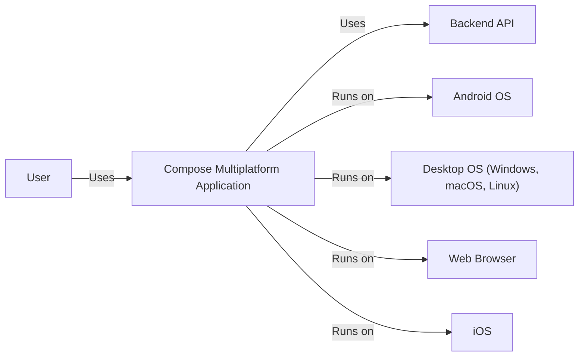
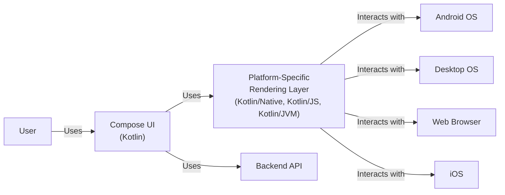
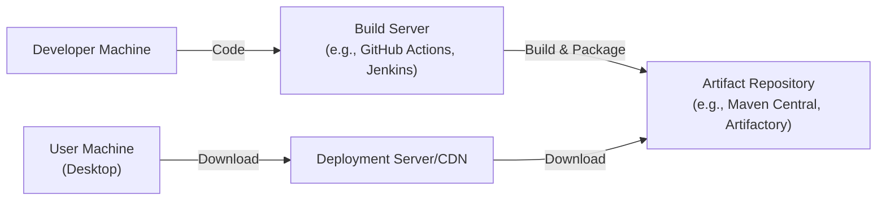
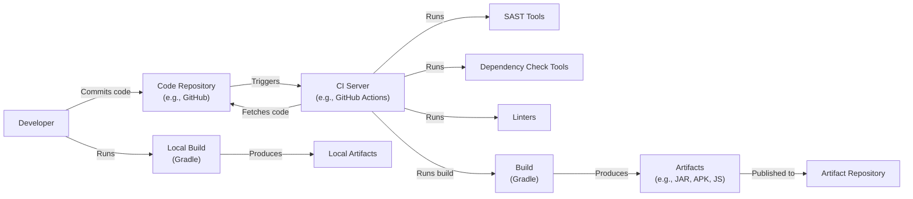

# Project Design Document: Compose Multiplatform

## BUSINESS POSTURE

Compose Multiplatform is a declarative framework for sharing UIs across multiple platforms (Android, Desktop, Web, and iOS) using Kotlin. The business priorities appear to be:

*   Reduce development time and cost by enabling code reuse for UI components across different platforms.
*   Improve developer productivity by providing a modern, declarative UI framework.
*   Maintain a consistent user experience across all supported platforms.
*   Expand the reach of Kotlin-based applications to a wider range of devices.
*   Foster a strong community around the framework.
*   Provide a competitive advantage against other cross-platform UI frameworks.

Business risks that need to be addressed:

*   Inconsistent UI rendering or behavior across different platforms, leading to a fragmented user experience.
*   Performance issues, especially on resource-constrained devices.
*   Security vulnerabilities that could expose user data or compromise application integrity.
*   Lack of adoption by the developer community.
*   Difficulty in keeping up with the rapid evolution of the underlying platforms.
*   Competition from other established cross-platform frameworks.

## SECURITY POSTURE

Existing security controls (based on the provided repository and general knowledge of Kotlin and Jetpack Compose):

*   security control: Kotlin language features: Kotlin is a statically-typed language with null safety, which helps prevent common programming errors that can lead to security vulnerabilities. Described in Kotlin documentation.
*   security control: Jetpack Compose framework: Compose encourages a declarative programming model, which can reduce the risk of certain types of UI-related vulnerabilities. Described in Compose documentation.
*   security control: Dependency management: The project likely uses Gradle for dependency management, which allows for tracking and updating dependencies to address known vulnerabilities. Described in build.gradle.kts files.
*   security control: Code reviews: JetBrains, as a reputable software company, likely has a code review process in place to identify and address potential security issues. Described in contribution guidelines.
*   security control: Testing: The project includes unit and UI tests, which can help identify and prevent regressions, including security-related ones. Described in test files.
*   accepted risk: The framework is still under active development, and there might be unknown security vulnerabilities.
*   accepted risk: The framework relies on the security of the underlying platforms (Android, JVM, Web, iOS).
*   accepted risk: The framework's cross-platform nature introduces a larger attack surface compared to single-platform applications.

Recommended security controls:

*   security control: Implement a comprehensive security testing strategy, including static analysis (SAST), dynamic analysis (DAST), and penetration testing.
*   security control: Establish a vulnerability disclosure program to encourage responsible reporting of security issues.
*   security control: Provide clear security guidelines and best practices for developers using the framework.
*   security control: Regularly audit dependencies for known vulnerabilities and update them promptly.
*   security control: Implement runtime application self-protection (RASP) mechanisms, where feasible.

Security Requirements:

*   Authentication: Not directly applicable to the UI framework itself, but applications built with Compose Multiplatform should implement secure authentication mechanisms appropriate for their use case.
*   Authorization: Similarly, authorization should be handled by the application logic, not the UI framework. Compose Multiplatform should provide mechanisms to integrate with authorization systems.
*   Input Validation: Compose Multiplatform should provide built-in mechanisms for validating user input to prevent common vulnerabilities like cross-site scripting (XSS) and injection attacks. Text fields and other input components should have appropriate sanitization and validation by default.
*   Cryptography: Compose Multiplatform should not handle cryptography directly. It should rely on platform-specific cryptographic APIs and libraries. Applications built with Compose Multiplatform should use appropriate cryptographic techniques to protect sensitive data.

## DESIGN

### C4 CONTEXT

Element Descriptions:

*   Element:
    *   Name: User
    *   Type: Person
    *   Description: A person interacting with the Compose Multiplatform Application.
    *   Responsibilities: Interacts with the application's UI.
    *   Security controls: N/A - External entity.

*   Element:
    *   Name: Compose Multiplatform Application
    *   Type: Software System
    *   Description: An application built using Compose Multiplatform.
    *   Responsibilities: Provides UI and application logic, interacts with backend services.
    *   Security controls: Input validation, secure communication with backend (HTTPS), adherence to platform-specific security best practices.

*   Element:
    *   Name: Backend API
    *   Type: Software System
    *   Description: A backend service that the Compose Multiplatform Application interacts with.
    *   Responsibilities: Provides data and business logic to the application.
    *   Security controls: Authentication, authorization, input validation, secure data storage, secure communication (HTTPS).

*   Element:
    *   Name: Android OS
    *   Type: Platform
    *   Description: The Android operating system.
    *   Responsibilities: Provides the runtime environment for the Android version of the Compose Multiplatform Application.
    *   Security controls: Android platform security features (sandboxing, permissions, etc.).

*   Element:
    *   Name: Desktop OS (Windows, macOS, Linux)
    *   Type: Platform
    *   Description: Desktop operating systems (Windows, macOS, Linux).
    *   Responsibilities: Provides the runtime environment for the desktop version of the Compose Multiplatform Application.
    *   Security controls: OS-level security features (sandboxing, user permissions, etc.).

*   Element:
    *   Name: Web Browser
    *   Type: Platform
    *   Description: A web browser (e.g., Chrome, Firefox, Safari).
    *   Responsibilities: Provides the runtime environment for the web version of the Compose Multiplatform Application.
    *   Security controls: Browser security features (sandboxing, same-origin policy, etc.).

*   Element:
    *   Name: IOS
    *   Type: Platform
    *   Description: The iOS operating system.
    *   Responsibilities: Provides the runtime environment for the iOS version of the Compose Multiplatform Application.
    *   Security controls: iOS platform security features.

### C4 CONTAINER

Element Descriptions:

*   Element:
    *   Name: User
    *   Type: Person
    *   Description: A person interacting with the Compose Multiplatform Application.
    *   Responsibilities: Interacts with the application's UI.
    *   Security controls: N/A - External entity.

*   Element:
    *   Name: Compose UI (Kotlin)
    *   Type: Container (Code)
    *   Description: The shared UI code written in Kotlin using the Compose declarative UI framework.
    *   Responsibilities: Defines the UI structure and behavior, handles user input, interacts with the platform-specific rendering layer.
    *   Security controls: Input validation, secure handling of user data.

*   Element:
    *   Name: Platform-Specific Rendering Layer (Kotlin/Native, Kotlin/JS, Kotlin/JVM)
    *   Type: Container (Code)
    *   Description: The layer that adapts the Compose UI to the specific target platform (Android, Desktop, Web, iOS).
    *   Responsibilities: Translates Compose UI elements into native UI elements, handles platform-specific events.
    *   Security controls: Adherence to platform-specific security best practices.

*   Element:
    *   Name: Backend API
    *   Type: Software System
    *   Description: A backend service that the Compose Multiplatform Application interacts with.
    *   Responsibilities: Provides data and business logic to the application.
    *   Security controls: Authentication, authorization, input validation, secure data storage, secure communication (HTTPS).

*   Element:
    *   Name: Android OS
    *   Type: Platform
    *   Description: The Android operating system.
    *   Responsibilities: Provides the runtime environment for the Android version of the Compose Multiplatform Application.
    *   Security controls: Android platform security features (sandboxing, permissions, etc.).

*   Element:
    *   Name: Desktop OS
    *   Type: Platform
    *   Description: Desktop operating systems (Windows, macOS, Linux).
    *   Responsibilities: Provides the runtime environment for the desktop version of the Compose Multiplatform Application.
    *   Security controls: OS-level security features (sandboxing, user permissions, etc.).

*   Element:
    *   Name: Web Browser
    *   Type: Platform
    *   Description: A web browser (e.g., Chrome, Firefox, Safari).
    *   Responsibilities: Provides the runtime environment for the web version of the Compose Multiplatform Application.
    *   Security controls: Browser security features (sandboxing, same-origin policy, etc.).

*   Element:
    *   Name: IOS
    *   Type: Platform
    *   Description: The iOS operating system.
    *   Responsibilities: Provides the runtime environment for the iOS version of the Compose Multiplatform Application.
    *   Security controls: iOS platform security features.

### DEPLOYMENT

Possible deployment solutions:

1.  Android: Standard Android application deployment (APK/AAB) via Google Play Store or sideloading.
2.  Desktop:
    *   JVM-based application packaged as an executable JAR or using platform-specific packaging tools (e.g., jpackage for Windows, dmg for macOS, deb/rpm for Linux).
    *   Native executables using Kotlin/Native and GraalVM.
3.  Web: JavaScript application deployed to a web server (e.g., Apache, Nginx, Netlify, Vercel).
4.  iOS: Standard iOS application deployment (IPA) via the Apple App Store or TestFlight.

Chosen deployment solution (example: Desktop - JVM-based application):

Element Descriptions:

*   Element:
    *   Name: Developer Machine
    *   Type: Machine
    *   Description: The developer's workstation.
    *   Responsibilities: Code development, testing, and committing changes.
    *   Security controls: Secure coding practices, code reviews, local security tools.

*   Element:
    *   Name: Build Server (e.g., GitHub Actions, Jenkins)
    *   Type: Machine
    *   Description: A server that automates the build process.
    *   Responsibilities: Compiling code, running tests, packaging the application.
    *   Security controls: Secure build environment, dependency scanning, SAST.

*   Element:
    *   Name: Artifact Repository (e.g., Maven Central, Artifactory)
    *   Type: Machine
    *   Description: A repository for storing build artifacts.
    *   Responsibilities: Storing and managing application packages.
    *   Security controls: Access control, integrity checks.

*   Element:
    *   Name: Deployment Server/CDN
    *   Type: Machine
    *   Description: Server that hosts application for download.
    *   Responsibilities: Serving the application to users.
    *   Security controls: HTTPS, access control, regular security updates.

*   Element:
    *   Name: User Machine (Desktop)
    *   Type: Machine
    *   Description: The user's desktop computer.
    *   Responsibilities: Running the downloaded application.
    *   Security controls: OS-level security features, antivirus software.

### BUILD

The build process for Compose Multiplatform projects typically involves Gradle and Kotlin Multiplatform tooling.

Security Controls in Build Process:

*   security control: Code Repository (e.g., GitHub): Provides version control and access control to the source code.
*   security control: CI Server (e.g., GitHub Actions): Automates the build process and enforces security checks.
*   security control: Linters: Enforce code style and identify potential code quality issues.
*   security control: SAST Tools: Static Application Security Testing tools analyze the source code for potential security vulnerabilities.
*   security control: Dependency Check Tools: Scan project dependencies for known vulnerabilities.
*   security control: Build (Gradle): The build system manages dependencies and compiles the code.
*   security control: Artifact Repository: Securely stores build artifacts.

## RISK ASSESSMENT

*   Critical business process we are trying to protect: The ability to efficiently develop and deploy cross-platform applications with a consistent user experience.
*   Data we are trying to protect and their sensitivity:
    *   Source code: Confidential, as it represents the intellectual property of the project.
    *   Application data: Sensitivity depends on the specific application built using Compose Multiplatform. Applications should handle sensitive data (e.g., user credentials, personal information) with appropriate security measures.
    *   Build artifacts: Moderately sensitive, as they could be reverse-engineered to reveal information about the application's code.

## QUESTIONS & ASSUMPTIONS

*   Questions:
    *   What specific security testing tools and processes are currently used in the Compose Multiplatform project?
    *   What are the plans for addressing potential security vulnerabilities in the framework?
    *   What level of support is provided for integrating with platform-specific security features?
    *   Are there any specific security certifications or compliance requirements that the framework aims to meet?
    *   How are Compose updates handled across different platforms to ensure security patches are applied promptly?

*   Assumptions:
    *   BUSINESS POSTURE: The project prioritizes developer productivity and cross-platform compatibility.
    *   SECURITY POSTURE: The project follows basic secure development practices, but there is room for improvement in terms of security testing and documentation.
    *   DESIGN: The design is modular and allows for platform-specific customization, which can be leveraged for security enhancements. The project relies on the underlying platform security.