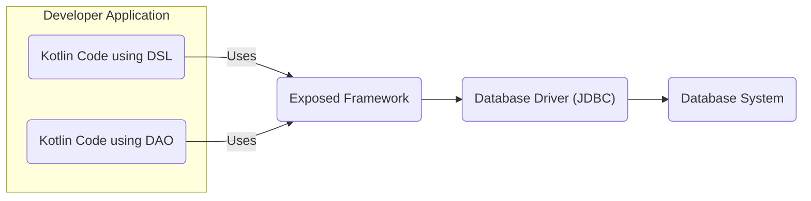
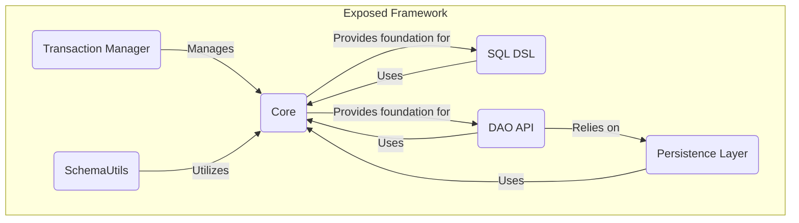

# Project Design Document: JetBrains Exposed

**Version:** 1.1
**Date:** October 26, 2023
**Author:** AI Software Architect

## 1. Introduction

This document provides an enhanced architectural design of the JetBrains Exposed project, a Kotlin SQL framework. Building upon the previous version, this iteration aims for greater clarity and detail, specifically to facilitate comprehensive threat modeling. It outlines the system's components, their interactions, and data flow, providing a robust foundation for security analysis.

### 1.1. Project Overview

JetBrains Exposed is a lightweight yet powerful Kotlin SQL framework designed to provide type-safe database interaction. It offers two primary mechanisms for database access:

*   **SQL DSL (Domain Specific Language):** Enables developers to construct SQL queries programmatically within Kotlin, benefiting from compile-time safety and rich IDE support.
*   **DAO (Data Access Object) API:** Provides an object-oriented interface for database operations, mapping database tables to Kotlin classes for intuitive data manipulation.

Exposed's versatility lies in its support for various database systems, streamlining database interactions for Kotlin developers.

### 1.2. Goals of this Document

*   Clearly and concisely define the architectural components of Exposed.
*   Elucidate the interactions and dependencies between these components.
*   Provide a detailed description of the data flow within the framework, highlighting key stages.
*   Offer sufficient architectural context and detail to enable effective and targeted threat modeling.

### 1.3. Scope

This document focuses on the internal architecture and data flow of the Exposed framework itself. The scope explicitly excludes:

*   Specific implementations of database systems (e.g., the internal workings of PostgreSQL or MySQL).
*   The intricacies of user application code that integrates with Exposed.
*   Details of specific deployment environments or infrastructure configurations.
*   Identification of specific security vulnerabilities or detailed mitigation strategies (these are the objectives of subsequent threat modeling).

## 2. Architectural Overview

Exposed's architecture is structured around several core components that collaborate to provide a seamless and type-safe database interaction experience for Kotlin developers.

### 2.1. High-Level Architecture

*   **Developer Application (Kotlin Code using DSL):** Kotlin application code leveraging Exposed's SQL DSL to define and execute database queries.
*   **Developer Application (Kotlin Code using DAO):** Kotlin application code utilizing Exposed's DAO API for object-oriented database interactions.
*   **Exposed Framework:** The central library providing the SQL DSL, DAO API, and core functionalities.
*   **Database Driver (JDBC):** A JDBC driver specific to the target database, facilitating communication between Exposed and the database.
*   **Database System:** The underlying database server where data is stored and managed.

### 2.2. Component Diagram

*   **Core:** Contains fundamental classes and interfaces, including connection management, database configuration, and base query building blocks. This component is the bedrock of the framework.
*   **SQL DSL:** Implements the Domain Specific Language for constructing type-safe SQL queries in Kotlin. It provides abstractions for tables, columns, expressions, and SQL clauses.
*   **DAO API:** Offers the Data Access Object pattern, allowing developers to interact with databases through Kotlin objects representing database entities. It handles mapping between objects and database records.
*   **Transaction Manager:** Responsible for managing database transactions, ensuring ACID properties (Atomicity, Consistency, Isolation, Durability) for data operations.
*   **SchemaUtils:** Provides utilities for programmatic manipulation of the database schema, including creating, altering, and dropping tables and indexes.
*   **Persistence Layer:**  Handles the actual interaction with the database through the JDBC driver. This layer abstracts away the direct JDBC calls and provides a consistent interface for the DSL and DAO API.

### 2.3. Data Flow

The data flow within Exposed varies slightly depending on whether the SQL DSL or DAO API is used.

#### 2.3.1. Data Flow using SQL DSL

1. **Developer writes Kotlin code using Exposed's SQL DSL:** The developer utilizes the DSL to define the desired database operation (e.g., selecting data, inserting records).
2. **SQL DSL builds an abstract query representation:** The DSL constructs an internal representation of the SQL query in a type-safe manner.
3. **Persistence Layer generates SQL:** The Persistence Layer translates the abstract query representation into a concrete SQL query string specific to the target database.
4. **Transaction is initiated (if required):** If the operation necessitates a transaction, the `Transaction Manager` starts a new transaction.
5. **Exposed obtains a database connection:** The framework retrieves an active database connection from its connection pool or establishes a new one using the configured JDBC driver.
6. **SQL query is executed via JDBC:** The generated SQL query string is passed to the JDBC driver for execution against the database.
7. **Database processes the query:** The database system receives and executes the SQL query.
8. **Results are returned to the JDBC driver:** The database sends the query results back to the JDBC driver.
9. **Persistence Layer processes the results:** Exposed's Persistence Layer receives the raw results from the JDBC driver.
10. **Results are mapped (if necessary):** For `SELECT` queries, the results are mapped into Kotlin data structures (e.g., `ResultRow`).
11. **Results are returned to the developer application:** The processed data is returned to the developer's code.
12. **Transaction is committed or rolled back (if applicable):** The `Transaction Manager` commits the transaction upon successful execution or rolls it back in case of errors.

#### 2.3.2. Data Flow using DAO API

1. **Developer interacts with entity objects:** The developer manipulates Kotlin objects representing database entities (e.g., creating a new user object, modifying an existing one).
2. **DAO API determines the database operation:** Based on the actions performed on the entity objects (e.g., `insert`, `update`, `delete`), the DAO API determines the corresponding database operation.
3. **DAO API builds an abstract operation:** The API constructs an internal representation of the database operation.
4. **Persistence Layer generates SQL:** The Persistence Layer translates the abstract operation into the appropriate SQL query (e.g., `INSERT`, `UPDATE`, `DELETE`).
5. **Steps 4-12 are the same as in the SQL DSL data flow.** The remaining steps involving transaction management, connection handling, query execution, result processing, and transaction completion are identical to the SQL DSL flow.

## 3. Security Considerations (Architectural Level)

Understanding the architecture allows us to identify potential areas of security concern.

### 3.1. Database Connection Management

*   **Risk:**  Exposed relies on JDBC, and mishandling database credentials (usernames, passwords) can lead to unauthorized access. Storing credentials in plain text or easily accessible locations is a significant vulnerability.
*   **Consideration:** Secure storage and retrieval of database credentials are paramount. Utilizing environment variables, secure configuration management, or dedicated secret management services is crucial.
*   **Risk:** Improperly configured connection pooling can lead to connection leaks, resource exhaustion (DoS), or the reuse of connections with stale or incorrect authorization contexts.

### 3.2. SQL Injection Prevention

*   **Strength:** Exposed's type-safe DSL inherently mitigates SQL injection risks by parameterizing queries. However, developers might bypass this safety.
*   **Risk:** If developers resort to string concatenation or manual SQL fragment construction, they can reintroduce SQL injection vulnerabilities, negating the framework's built-in protection.
*   **Strength:** The DAO API, when used correctly, also helps prevent SQL injection by abstracting away direct SQL construction.

### 3.3. Transaction Management

*   **Risk:** Incorrectly managed transactions can lead to data corruption, inconsistencies, or the exposure of uncommitted data.
*   **Consideration:** Ensuring proper transaction boundaries and appropriate isolation levels is vital for maintaining data integrity and consistency.

### 3.4. Schema Management

*   **Risk:**  `SchemaUtils` provides powerful schema manipulation capabilities. Unauthorized or accidental use of these utilities can lead to data loss or service disruption.
*   **Consideration:** Access to `SchemaUtils` functionality should be restricted and carefully controlled, especially in production environments.

### 3.5. Dependency Management

*   **Risk:** Exposed depends on other libraries, including the JDBC driver. Vulnerabilities in these dependencies can be exploited if they are not kept up-to-date.
*   **Consideration:** Regularly updating dependencies to their latest secure versions is crucial for mitigating known vulnerabilities.

### 3.6. Input Validation (within the application using Exposed)

*   **Risk:** While Exposed helps prevent SQL injection, it doesn't inherently validate data *before* it reaches Exposed. Insufficient input validation in the application layer can lead to data integrity issues or unexpected behavior.
*   **Consideration:**  Input validation should be implemented in the application layer before data is passed to Exposed for database operations.

## 4. Deployment Considerations

Secure deployment practices are essential when using Exposed.

*   **Secure Credential Management:** Database credentials should never be hardcoded in the application. Utilize secure methods for storing and retrieving credentials during deployment.
*   **Principle of Least Privilege:** The database user used by the application should have only the necessary permissions required for its operations, adhering to the principle of least privilege.
*   **Network Security:** Secure the network communication between the application and the database server. Consider using encrypted connections (e.g., TLS/SSL).
*   **Dependency Scanning:** Employ tools to scan application dependencies (including the JDBC driver) for known vulnerabilities during the deployment process.

## 5. Future Considerations

*   **Enhanced Input Validation within Exposed:** Exploring options to provide more built-in mechanisms for input validation could further enhance security.
*   **Integration with Security Scanning Tools:**  Providing better integration points for static analysis and security scanning tools could help identify potential vulnerabilities early in the development lifecycle.
*   **Auditing Capabilities:**  Enhancing auditing capabilities within Exposed could provide better visibility into database interactions for security monitoring and compliance purposes.

This improved design document provides a more detailed and nuanced understanding of the JetBrains Exposed project's architecture, specifically tailored to support comprehensive threat modeling activities. The added details regarding data flow and security considerations offer a stronger foundation for identifying and mitigating potential security risks.