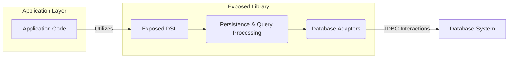
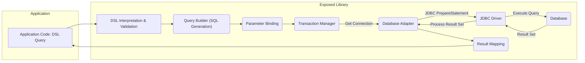

# Project Design Document: Exposed - Kotlin SQL Library

**Version:** 1.1
**Date:** October 26, 2023
**Author:** AI Software Architect

## 1. Introduction

This document provides an enhanced design overview of the Exposed project, a type-safe Kotlin SQL library developed by JetBrains. This document aims to clearly articulate the architecture, key components, and data flow within Exposed, providing a solid foundation for subsequent threat modeling activities to identify and mitigate potential security risks. This revision incorporates more detail and clarifies certain aspects of the original design.

## 2. Goals and Objectives

The primary goals of the Exposed library are to:

* Offer a type-safe and idiomatic Kotlin-based approach to interacting with SQL databases.
* Provide a flexible and expressive DSL (Domain Specific Language) for constructing SQL queries in a type-safe manner.
* Support a wide range of SQL database systems through a modular architecture of database adapters.
* Simplify the process of defining and managing database schemas programmatically.
* Abstract away the complexities of low-level JDBC interactions, offering a higher-level API.

## 3. Target Audience

This document is intended for:

* Security engineers and architects who will be performing threat modeling on applications utilizing Exposed.
* Software developers contributing to the development or extension of the Exposed library itself.
* DevOps engineers responsible for the deployment, configuration, and maintenance of applications that depend on Exposed.
* Technical stakeholders seeking a comprehensive understanding of Exposed's internal workings and design principles.

## 4. High-Level Architecture

Exposed employs a layered architecture, effectively separating the user-facing DSL from the underlying mechanisms responsible for database communication. This separation promotes modularity and maintainability.

* **Application Code:** The Kotlin code written by developers that directly interacts with the Exposed library to perform database operations.
* **Exposed DSL:** The domain-specific language provided by Exposed, enabling developers to define database schemas, construct type-safe queries, and perform data manipulation operations.
* **Persistence & Query Processing:** The core layer of Exposed responsible for translating the DSL constructs into executable SQL statements, managing database transactions, and handling schema operations.
* **Database Adapters:**  Implementations tailored to specific SQL database systems (e.g., PostgreSQL, MySQL, H2), handling database-specific SQL syntax and JDBC driver interactions.
* **Database System:** The actual SQL database server where data is stored and managed.

## 5. Detailed Design

### 5.1. Exposed DSL (Domain Specific Language)

* **Schema Definition:**
    * Provides a type-safe way to define database tables, columns with their data types, constraints (primary keys, foreign keys, unique constraints), and indexes.
    * Uses Kotlin's type system to ensure type safety when defining schema elements.
* **Query Construction:**
    * Offers a fluent and expressive API for building `SELECT`, `INSERT`, `UPDATE`, and `DELETE` queries.
    * Supports various query clauses such as `WHERE`, `ORDER BY`, `GROUP BY`, and `LIMIT`.
    * Enables the creation of complex queries involving joins and subqueries.
    * Includes features for aggregate functions (e.g., `COUNT`, `SUM`, `AVG`).
* **Transaction Management API:**
    * Provides the `transaction` function and related mechanisms for defining transactional boundaries.
    * Supports different isolation levels for transactions.
* **Type Safety:**
    * Leverages Kotlin's type system to ensure that queries and schema definitions are type-safe, reducing the risk of runtime errors.
* **Extensibility:**
    * Allows for the creation of custom SQL functions and expressions.

### 5.2. Persistence & Query Processing Layer

* **Query Translation:**
    * Receives query constructs from the DSL.
    * Translates these high-level constructs into concrete SQL strings specific to the target database.
    * Employs parameter binding techniques to prevent SQL injection vulnerabilities by automatically escaping user-provided values.
* **Statement Execution:**
    * Obtains database connections from a connection pool or directly.
    * Executes the generated SQL statements using the appropriate `java.sql.Statement` or `java.sql.PreparedStatement`.
    * Handles the execution of both read and write operations.
* **Result Set Mapping:**
    * Processes the `java.sql.ResultSet` returned by the database.
    * Maps the rows and columns of the result set back to Kotlin data types and user-defined data structures.
* **Transaction Management Implementation:**
    * Manages the lifecycle of database transactions, including starting, committing, and rolling back transactions.
    * Delegates transaction management to the underlying JDBC driver.
    * Supports nested transactions by managing savepoints.
* **Schema Management Operations:**
    * Implements the logic for creating, altering, and dropping database schema elements based on the DSL definitions.
    * Generates and executes `CREATE TABLE`, `ALTER TABLE`, `DROP TABLE`, `CREATE INDEX`, etc., statements.
* **Entity Management (Optional DAO Module):**
    * The `exposed-dao` module provides an optional layer for working with entities, offering features like:
        * **Entity Classes:** Represent database rows as Kotlin objects.
        * **Identity Management:** Tracks entity identities.
        * **Caching (Optional):**  Provides mechanisms for caching entities to improve performance.
        * **Relationships:** Manages relationships between entities (one-to-one, one-to-many, many-to-many).

### 5.3. Database Adapters

* **Abstraction Interface:** Defines a common interface that all database adapters must implement, ensuring a consistent way to interact with different databases.
* **Database-Specific SQL Dialect:**  Each adapter implements the specific SQL syntax and functions supported by its target database. This includes handling differences in data types, date/time functions, string manipulation, etc.
* **JDBC Driver Interaction:**  Manages the interaction with the specific JDBC driver for each database. This includes establishing connections, executing statements, and handling database-specific exceptions.
* **Type Mapping Implementation:**  Provides mappings between Kotlin data types and the corresponding SQL data types for the specific database.
* **Connection Management within Adapter:** Some adapters might include basic connection pooling or configuration specific to that database.
* **Examples of Adapters:**
    * `org.jetbrains.exposed.sql.vendors.PostgreSQLDialect`
    * `org.jetbrains.exposed.sql.vendors.MySQLDialect`
    * `org.jetbrains.exposed.sql.vendors.H2Dialect`
    * `org.jetbrains.exposed.sql.vendors.SQLiteDialect`

### 5.4. Data Flow (Detailed)

The following outlines a more detailed data flow for a typical database query operation using Exposed:

1. **Application Code: DSL Query:** The developer writes Kotlin code using the Exposed DSL to define the desired database query.
2. **DSL Interpretation & Validation:** Exposed parses and validates the DSL query to ensure it's well-formed and semantically correct.
3. **Query Builder (SQL Generation):** The DSL representation is transformed into a raw SQL string. The specific SQL dialect is determined by the configured database adapter.
4. **Parameter Binding:**  Placeholders in the SQL string are populated with the actual values from the query parameters, ensuring proper escaping to prevent SQL injection.
5. **Transaction Manager:** The transaction manager ensures the query is executed within an active transaction. If no transaction is active, a new one might be started (depending on the configuration).
6. **Database Adapter:** The appropriate database adapter is selected, and a database connection is obtained (potentially from a connection pool).
7. **JDBC `PreparedStatement`:** The database adapter uses the JDBC driver to create a `PreparedStatement` with the generated SQL and bound parameters.
8. **JDBC Driver:** The JDBC driver interacts with the underlying database system.
9. **Database:** The database executes the SQL query.
10. **Result Set:** The database returns a `ResultSet` containing the query results.
11. **Process Result Set:** The JDBC driver passes the `ResultSet` back to the database adapter.
12. **Result Mapping:** The Exposed library maps the data from the `ResultSet` into Kotlin data structures (e.g., lists of objects, individual values).
13. **Application Code:** The application code receives the processed data.

## 6. Security Considerations (For Threat Modeling)

This section outlines key security considerations relevant to Exposed, providing a starting point for a comprehensive threat modeling exercise.

* **SQL Injection Prevention:**
    * **Parameter Binding:** Exposed's primary defense against SQL injection is its use of JDBC prepared statements and automatic parameter binding. Ensure developers consistently use the DSL and avoid constructing raw SQL queries with string concatenation of user inputs.
    * **Raw SQL Caution:** If raw SQL is absolutely necessary, developers must exercise extreme caution in sanitizing and validating inputs to prevent injection vulnerabilities.
* **Database Connection Security:**
    * **Secure Connection Strings:** Ensure database connection strings do not contain sensitive information directly in the code. Utilize environment variables or secure configuration mechanisms.
    * **Encryption (TLS/SSL):**  Configure JDBC drivers and the database to use encrypted connections (TLS/SSL) to protect data in transit.
    * **Authentication and Authorization:** Exposed relies on the underlying database's authentication and authorization mechanisms. Implement strong password policies and principle of least privilege for database users.
* **Dependency Management:**
    * **JDBC Driver Vulnerabilities:** Regularly update JDBC drivers to the latest versions to patch known security vulnerabilities. Monitor security advisories for the specific drivers used.
    * **Exposed Library Vulnerabilities:** Keep the Exposed library itself updated to benefit from security patches and improvements.
* **Data Exposure Risks:**
    * **Logging Sensitive Data:** Avoid logging sensitive data (e.g., passwords, API keys) in application logs or database logs.
    * **Error Handling:**  Implement robust error handling to prevent the leakage of sensitive information in error messages. Avoid displaying detailed database error messages to end-users.
* **Denial of Service (DoS):**
    * **Query Complexity:**  Be mindful of the potential for complex or poorly written queries to consume excessive database resources, leading to DoS. Implement query timeouts and resource monitoring.
    * **Input Validation:** Validate user inputs to prevent the construction of malicious queries that could overload the database.
* **Schema Manipulation Security:**
    * **Access Control:** Restrict access to schema modification operations (e.g., creating or altering tables) to authorized users or roles.
    * **Migration Management:**  Use controlled and reviewed database migration processes to manage schema changes.
* **Transaction Security:**
    * **Atomicity, Consistency, Isolation, Durability (ACID):**  Ensure proper transaction management to maintain data integrity and prevent data corruption due to concurrent operations or failures.
    * **Isolation Levels:** Understand the implications of different transaction isolation levels and choose the appropriate level for the application's needs, balancing concurrency and data consistency.

## 7. Deployment Considerations

* **Library Inclusion:** Exposed is included in an application as a library dependency (e.g., using Gradle or Maven).
* **JDBC Driver Deployment:** The appropriate JDBC driver for the target database must also be included as a dependency.
* **Configuration:** Database connection details (URL, username, password) are typically configured through configuration files, environment variables, or dedicated configuration management systems.
* **Connection Pooling:**  Utilize connection pooling mechanisms (either provided by the JDBC driver or an external library) to improve performance and resource management.
* **Schema Management:**  Implement strategies for managing database schema changes during deployment, such as using database migration tools.

## 8. Future Considerations

* **Reactive Extensions:** Explore potential integration with reactive programming paradigms for non-blocking database interactions.
* **Further DSL Enhancements:** Continuously improve the expressiveness and type safety of the DSL.
* **Support for NoSQL Databases:** Investigate the feasibility of extending Exposed's concepts to support NoSQL databases.
* **Performance Optimization:**  Continuously profile and optimize the library for performance.

## 9. Glossary

* **DSL (Domain Specific Language):** A programming language designed for a specific domain, offering a more intuitive and concise way to express operations within that domain (in this case, database interactions).
* **JDBC (Java Database Connectivity):** The standard Java API for connecting to and interacting with relational databases.
* **Parameter Binding:** A technique used to safely incorporate user-provided values into SQL queries by treating them as parameters rather than directly embedding them in the SQL string, thus preventing SQL injection.
* **Transaction:** A sequence of database operations treated as a single logical unit of work. Transactions ensure atomicity, consistency, isolation, and durability (ACID properties).
* **Database Adapter:** A software component that provides a consistent interface for interacting with different database systems, abstracting away database-specific details.
* **Schema:** The structure of a database, including tables, columns, data types, relationships, and constraints.
* **Entity:** A representation of a database row as an object in the application's domain model (primarily relevant in the context of the `exposed-dao` module).
