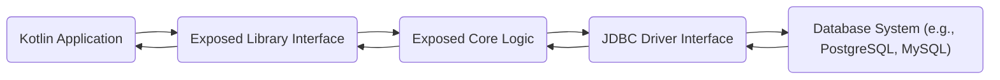
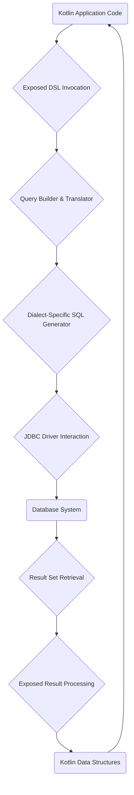

# Project Design Document: JetBrains Exposed

**Version:** 1.1
**Date:** October 26, 2023
**Author:** AI Software Architect

## 1. Introduction

This document provides an enhanced design overview of the JetBrains Exposed project, a lightweight Kotlin SQL framework. It aims to provide a clear and detailed articulation of the architecture, components, and data flow within Exposed, specifically tailored for subsequent threat modeling activities. This document outlines the key elements of the framework, their interactions, and potential security implications, serving as a foundation for identifying and mitigating potential vulnerabilities.

## 2. Goals and Objectives

The primary goals of the Exposed project are to:

* Offer a type-safe and Kotlin-idiomatic approach to interacting with SQL databases.
* Provide a less complex and more flexible alternative to traditional, heavyweight Object-Relational Mapping (ORM) frameworks.
* Simplify common database operations through an intuitive Domain-Specific Language (DSL).
* Maintain compatibility and support for a wide range of SQL database systems.

This design document aims to:

* Clearly define the architectural components of Exposed with greater detail.
* Accurately describe the data flow during various database operations, including error scenarios.
* Explicitly identify key areas relevant for security considerations and comprehensive threat modeling.

## 3. High-Level Architecture

Exposed functions as a library directly integrated into Kotlin applications. It does not operate as a standalone service or require a separate deployment. The fundamental interaction involves Kotlin application code leveraging the Exposed DSL to communicate with a database.

* **Kotlin Application:** The application code, written in Kotlin, that utilizes the Exposed library to perform database interactions. This is the entry point for any database operation using Exposed.
* **Exposed Library Interface:** The public API of the Exposed library that the Kotlin application directly interacts with. This includes the DSL elements for defining schemas and building queries.
* **Exposed Core Logic:** The internal components of the Exposed library responsible for processing DSL commands, generating SQL, managing transactions, and handling database connections.
* **JDBC Driver Interface:** The abstraction layer within Exposed that interacts with the specific JDBC driver for the target database. This isolates the core logic from database-specific implementations.
* **Database System:** The underlying SQL database system where data is persistently stored and retrieved. Examples include PostgreSQL, MySQL, SQLite, etc.

## 4. Component Details

Exposed comprises several interconnected components, each with a specific responsibility:

* **Core DSL (Domain-Specific Language):**
    * Provides a type-safe and expressive Kotlin API for defining database schemas (tables, columns, constraints, indexes).
    * Enables the construction of SQL queries programmatically using Kotlin code, significantly reducing the likelihood of syntax errors and improving code maintainability.
    * Supports a wide range of query types, including SELECT, INSERT, UPDATE, DELETE, and DDL operations.
* **Transaction Management:**
    * Offers robust mechanisms for managing database transactions, ensuring atomicity, consistency, isolation, and durability (ACID properties).
    * Provides functions for committing or rolling back transactions based on the success or failure of operations.
    * Supports different transaction isolation levels to control concurrency and prevent data corruption.
* **Database Connectivity & Connection Pooling:**
    * Handles the establishment and management of connections to various SQL databases through JDBC drivers.
    * Implements connection pooling to optimize performance by reusing database connections, reducing the overhead of creating new connections for each operation.
    * Allows configuration of connection parameters, including credentials, URL, and driver class.
* **Schema Definition API:**
    * Allows developers to define database schemas programmatically using Kotlin code, making schema management versionable and repeatable.
    * Supports defining tables, columns with specific data types, primary and foreign keys, unique constraints, and indexes.
    * Facilitates database schema evolution and migrations.
* **Query Building API:**
    * Provides a fluent and type-safe API for constructing SQL queries without writing raw SQL strings.
    * Offers features for filtering, sorting, joining tables, and performing aggregations.
    * Crucially, it uses parameterized queries by default, significantly mitigating the risk of SQL injection vulnerabilities.
* **Entity Support (Optional):**
    * Provides an optional layer for mapping database rows to Kotlin data classes (entities), simplifying data access and manipulation for common use cases.
    * Offers features like change tracking and relationship management.
    * Can introduce performance overhead if not used carefully.
* **Dialects:**
    * An abstraction layer that handles the subtle differences in SQL syntax and features between various database systems (e.g., PostgreSQL, MySQL, H2, Oracle).
    * Ensures that the SQL generated by Exposed is compatible with the specific target database.
    * Requires careful maintenance to keep up with database-specific changes.
* **Logging and Interception:**
    * Provides mechanisms for logging generated SQL queries and database interactions, aiding in debugging and performance analysis.
    * Offers interception points to allow developers to hook into the query execution process for custom logic (e.g., auditing, performance monitoring).

## 5. Data Flow

The typical data flow for a database operation initiated by a Kotlin application using Exposed involves the following steps:

1. **Kotlin Application Code:** The application code initiates a database operation by interacting with the Exposed DSL (e.g., performing a query, inserting data).
2. **Exposed DSL Invocation:** The application code calls methods provided by the Exposed DSL to define the desired database operation.
3. **Query Builder & Translator:** Exposed's query builder component takes the DSL invocation and translates it into an internal representation of the SQL query.
4. **Dialect-Specific SQL Generator:** Based on the configured database dialect, the appropriate component generates the final SQL query string tailored to the target database system. This includes parameterization for security.
5. **JDBC Driver Interaction:** Exposed uses the configured JDBC driver to execute the generated SQL query against the database. This involves sending the query and handling the communication protocol.
6. **Database System:** The target SQL database receives the query, processes it, and performs the requested operation.
7. **Result Set Retrieval:** The database returns a result set (if applicable) to the JDBC driver.
8. **Exposed Result Processing:** Exposed processes the raw result set from the JDBC driver, converting database-specific data types into Kotlin types.
9. **Kotlin Data Structures:** The processed data is then made available to the application code in the form of Kotlin data structures (e.g., `ResultRow` objects, entities).

## 6. Security Considerations

Several security aspects are critical when developing applications using Exposed:

* **SQL Injection Prevention:**
    * **Parameterized Queries by Default:** Exposed's core design relies on parameterized queries when using the DSL, effectively preventing SQL injection vulnerabilities in most common scenarios. Developers should primarily use the DSL and avoid raw SQL fragments.
    * **Care with Raw SQL:** If developers resort to using raw SQL fragments (e.g., with `SqlExpressionBuilder.raw`), they become responsible for proper sanitization and parameterization to avoid SQL injection. This is a potential risk area.
* **Database Credentials Management:**
    * **Secure Storage is External:** Exposed itself does not manage the secure storage of database credentials. This responsibility lies with the application developer and the deployment environment.
    * **Best Practices:** Developers should utilize environment variables, secure configuration files, or dedicated secrets management solutions (e.g., HashiCorp Vault, AWS Secrets Manager) to store and retrieve database credentials. Hardcoding credentials is a significant security risk.
* **Connection Security (TLS/SSL):**
    * **JDBC Driver Configuration:** Ensuring secure connections (using TLS/SSL) is primarily configured at the JDBC driver level. Exposed relies on the underlying JDBC driver's capabilities for secure communication.
    * **Configuration Importance:** Developers must configure the JDBC connection URL and driver properties correctly to enforce TLS/SSL encryption for data in transit between the application and the database.
* **Data Validation and Sanitization:**
    * **Application Layer Responsibility:** While Exposed provides type safety at the database interaction level, input validation and sanitization are primarily the responsibility of the application layer *before* data reaches Exposed.
    * **Preventing Data Integrity Issues:** Proper validation prevents invalid or malicious data from being persisted, which can lead to application errors or security vulnerabilities.
* **Logging of Sensitive Data:**
    * **Configuration is Key:** Exposed's logging features can inadvertently log sensitive data if not configured carefully. Generated SQL queries might contain sensitive information.
    * **Best Practices:** Implement logging configurations that filter out sensitive data or use secure logging mechanisms that protect logged information.
* **Dependency Management:**
    * **Regular Updates:** Keeping the Exposed library and its dependencies (especially the JDBC driver) up-to-date is crucial to patch known security vulnerabilities.
    * **Vulnerability Scanning:** Regularly scan project dependencies for known vulnerabilities using appropriate tools.
* **Database Permissions and Least Privilege:**
    * **External Configuration:** Exposed does not manage database user permissions. This must be configured directly within the database system.
    * **Principle of Least Privilege:**  Applications should connect to the database using accounts with the minimum necessary privileges to perform their intended operations. Avoid using overly permissive database accounts.
* **Error Handling and Information Disclosure:**
    * **Avoid Verbose Errors:**  Carefully handle database exceptions and avoid exposing detailed database error messages to end-users, as these can reveal sensitive information about the database structure or data.
    * **Generic Error Responses:** Implement generic error responses and log detailed errors securely for debugging purposes.
* **Denial of Service (DoS):**
    * **Query Complexity:**  Poorly written or excessively complex queries generated by Exposed (or raw SQL) can potentially lead to database performance issues or DoS.
    * **Rate Limiting and Throttling:** Implement appropriate rate limiting and throttling mechanisms at the application level to protect against malicious or unintentional resource exhaustion.

## 7. Deployment Considerations

As Exposed is a library embedded within the application, deployment considerations are primarily focused on the application's deployment environment and its interaction with the database:

* **Application Deployment Environment Security:** The security posture of the environment where the application is deployed (e.g., cloud infrastructure, containers, on-premise servers) significantly impacts the overall security. Secure configurations, network segmentation, and access controls are essential.
* **Database Deployment and Security:** The security configuration of the database server itself is critical. This includes firewall rules, access controls, regular security updates, and secure storage of database files.
* **JDBC Driver Deployment and Integrity:** Ensure that the JDBC driver used by the application is obtained from a trusted source and is included securely within the application's deployment package. Verify the integrity of the driver to prevent the use of compromised versions.

## 8. Future Considerations

Potential future developments or considerations related to security in Exposed could include:

* **Built-in Mechanisms for Data Masking/Anonymization:**  Providing features within the framework to facilitate the masking or anonymization of sensitive data during queries or logging.
* **Enhanced Security Auditing Capabilities:**  More granular logging and auditing features within Exposed to track database interactions and potential security events.
* **Integration with Security Scanning Tools:**  Improving integration with static and dynamic application security testing (SAST/DAST) tools to facilitate automated security analysis of applications using Exposed.
* **Standardized Credential Management Integration:**  Providing more opinionated or integrated ways to manage database credentials securely, potentially through integration with common secrets management libraries.

This enhanced document provides a more detailed and security-focused overview of the JetBrains Exposed project's design. By understanding the components, data flow, and specific security considerations outlined here, security professionals can conduct more effective threat modeling and implement appropriate security measures to protect applications utilizing this framework.