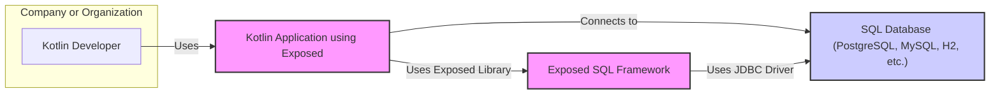
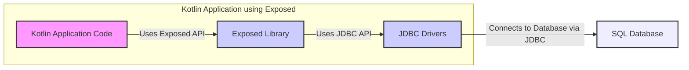
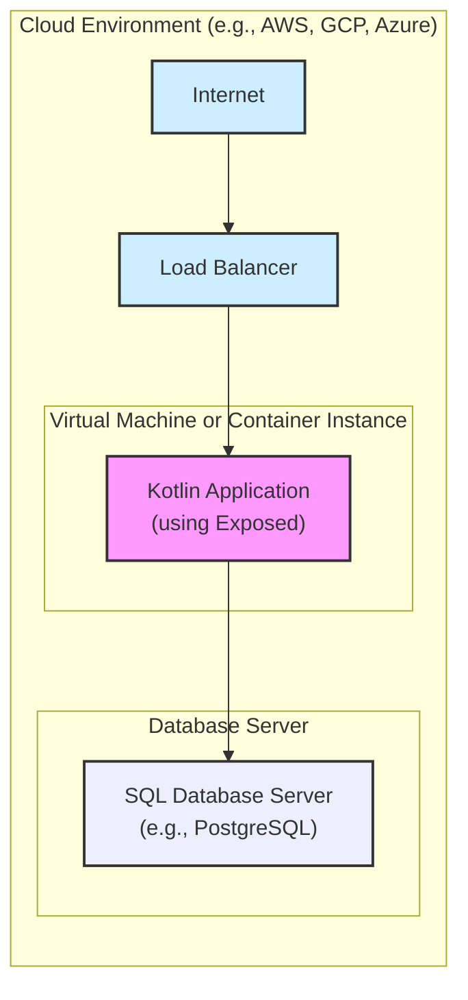

# BUSINESS POSTURE

This project, Exposed, is a Kotlin SQL Framework designed to provide a more Kotlin-idiomatic way to interact with databases. It aims to simplify database access for Kotlin developers, offering type-safe query construction and reducing boilerplate code compared to traditional JDBC or other ORM solutions.

Business Priorities and Goals:

- Goal: Enhance Kotlin developer experience by providing a user-friendly and efficient SQL framework.
- Goal: Increase adoption of Kotlin in backend development by addressing database interaction needs.
- Goal: Offer a robust and reliable SQL framework that can be used in various Kotlin projects, from small applications to large enterprise systems.
- Priority: Developer productivity and ease of use.
- Priority: Performance and efficiency of database interactions.
- Priority: Compatibility with various SQL databases.
- Priority: Maintainability and long-term support of the framework.

Business Risks:

- Risk: Security vulnerabilities in the framework could lead to data breaches in applications using Exposed.
- Risk: Performance bottlenecks in Exposed could negatively impact application performance.
- Risk: Incompatibility issues with certain databases or database versions could limit adoption.
- Risk: Lack of community support or slow response to bug fixes and feature requests could deter users.
- Risk: Complex or poorly documented API could hinder developer adoption and productivity.

# SECURITY POSTURE

Existing Security Controls:

- security control: Code review process within JetBrains during development. (Location: Internal JetBrains development process)
- security control: Public GitHub repository allowing community review and contributions. (Location: GitHub repository)
- security control: Unit and integration tests to ensure code correctness and prevent regressions. (Location: Test suite within the GitHub repository)
- security control: Use of Kotlin language features that promote type safety and reduce certain classes of errors. (Location: Kotlin language and compiler)

Accepted Risks:

- accepted risk: Open-source nature implies potential for public vulnerability disclosure before a patch is available.
- accepted risk: Reliance on the security of underlying database drivers and database systems.
- accepted risk: Potential for misuse of the framework by developers leading to insecure application code.

Recommended Security Controls:

- security control: Implement Static Application Security Testing (SAST) tools in the development pipeline to automatically detect potential vulnerabilities in the codebase.
- security control: Integrate Dependency Scanning tools to identify and manage vulnerable dependencies used by Exposed.
- security control: Conduct regular security audits and penetration testing of Exposed to proactively identify and address security weaknesses.
- security control: Provide security guidelines and best practices for developers using Exposed to build secure applications, focusing on topics like input validation and secure query construction.
- security control: Establish a clear vulnerability reporting and response process for security issues identified in Exposed.

Security Requirements:

- Authentication:
    - Requirement: Exposed itself does not handle application-level authentication. Applications using Exposed are responsible for implementing their own authentication mechanisms.
    - Requirement: Database connections should be authenticated using strong credentials and secure connection protocols (e.g., TLS/SSL).
- Authorization:
    - Requirement: Exposed does not enforce application-level authorization. Applications must implement authorization logic to control access to data based on user roles and permissions.
    - Requirement: Database user accounts used by applications should have least privilege access, limited to the necessary operations on the database.
- Input Validation:
    - Requirement: Exposed should encourage and facilitate parameterized queries to prevent SQL injection vulnerabilities.
    - Requirement: Developers using Exposed should be educated on the importance of input validation and sanitization in their application code.
    - Requirement: Exposed should provide mechanisms to easily validate and sanitize user inputs before they are used in database queries.
- Cryptography:
    - Requirement: Exposed should support secure communication protocols (e.g., TLS/SSL) for database connections to protect data in transit.
    - Requirement: If Exposed handles sensitive data in memory or logs, consider encryption at rest and in transit for these elements. (Note: As a framework, direct data handling is minimal, but applications using it will handle data).
    - Requirement: Exposed should not implement custom cryptography but rely on well-established and vetted cryptographic libraries provided by the underlying platform or database drivers.

# DESIGN

## C4 CONTEXT



Context Diagram Elements:

- Element:
    - Name: Kotlin Developer
    - Type: Person
    - Description: Software developers who use the Exposed SQL Framework to build Kotlin applications that interact with databases.
    - Responsibilities: Develops and maintains Kotlin applications using Exposed, writes database queries using Exposed API.
    - Security controls: Responsible for writing secure application code, including proper input validation and authorization logic within their applications that utilize Exposed.

- Element:
    - Name: Exposed SQL Framework
    - Type: Software System
    - Description: A Kotlin library that provides a type-safe and idiomatic way to interact with SQL databases. It simplifies database operations and reduces boilerplate code for Kotlin developers.
    - Responsibilities: Provides an API for defining database schemas, performing CRUD operations, and executing queries in a type-safe manner. Translates Kotlin code into SQL queries for various supported databases.
    - Security controls: Implements parameterized query generation to prevent SQL injection, relies on underlying database driver security for connection security, undergoes code review and testing.

- Element:
    - Name: SQL Database (PostgreSQL, MySQL, H2, etc.)
    - Type: External System
    - Description: Relational database systems that store and manage data. Exposed supports various databases including PostgreSQL, MySQL, H2, and others.
    - Responsibilities: Stores and retrieves data, enforces database-level security controls (authentication, authorization, data encryption), executes SQL queries provided by Exposed.
    - Security controls: Database access control lists (ACLs), user authentication and authorization, data encryption at rest and in transit, database auditing and logging.

- Element:
    - Name: Kotlin Application using Exposed
    - Type: Software System
    - Description: A Kotlin application developed by Kotlin Developers that utilizes the Exposed SQL Framework to interact with a SQL database. This application represents the end product that benefits from Exposed.
    - Responsibilities: Implements business logic, handles user requests, uses Exposed to interact with the database for data persistence and retrieval, enforces application-level security controls.
    - Security controls: Authentication and authorization mechanisms, input validation, secure session management, protection of sensitive data, application logging and monitoring.

## C4 CONTAINER



Container Diagram Elements:

- Element:
    - Name: Kotlin Application Code
    - Type: Application
    - Description: The Kotlin code written by developers that implements the specific business logic of the application and utilizes the Exposed Library for database interactions.
    - Responsibilities: Implements application features, handles user requests, orchestrates data flow, uses Exposed API to perform database operations.
    - Security controls: Application-level authentication and authorization, input validation, secure coding practices, session management, logging and monitoring.

- Element:
    - Name: Exposed Library
    - Type: Library
    - Description: The core Exposed SQL Framework library. It provides the Kotlin API for database interaction, query building, and schema definition.
    - Responsibilities: Exposes Kotlin DSL for database operations, translates Kotlin code into SQL queries, manages database connections, provides transaction management.
    - Security controls: Parameterized query generation to prevent SQL injection, secure handling of database credentials (indirectly, through application configuration), code review and testing.

- Element:
    - Name: JDBC Drivers
    - Type: Library
    - Description: Java Database Connectivity (JDBC) drivers specific to the target SQL database (e.g., PostgreSQL JDBC driver, MySQL Connector/J). These drivers are used by Exposed to communicate with the database.
    - Responsibilities: Establish connections to the database, send SQL queries to the database, receive query results, handle database-specific communication protocols.
    - Security controls: Secure connection protocols (TLS/SSL), database authentication mechanisms, driver updates and patching for security vulnerabilities.

- Element:
    - Name: SQL Database
    - Type: Database
    - Description: The actual SQL database instance (e.g., PostgreSQL server, MySQL server) where data is stored and managed.
    - Responsibilities: Stores and retrieves data, executes SQL queries, enforces database-level security policies, manages data integrity and consistency.
    - Security controls: Database access control lists (ACLs), user authentication and authorization, data encryption at rest and in transit, database auditing and logging, regular security patching and updates.

## DEPLOYMENT

Deployment of Exposed itself is not applicable as it's a library. The deployment diagram below illustrates a typical deployment scenario for a Kotlin Application that *uses* Exposed.



Deployment Diagram Elements:

- Element:
    - Name: Kotlin Application (using Exposed)
    - Type: Software Instance
    - Description: An instance of the Kotlin application that utilizes the Exposed library, deployed within a virtual machine or container instance in a cloud environment.
    - Responsibilities: Runs the application code, handles user requests, uses Exposed to interact with the database, performs application-level security functions.
    - Security controls: Operating system security hardening, application firewalls, intrusion detection systems (IDS), application-level logging and monitoring, secure configuration management.

- Element:
    - Name: SQL Database Server (e.g., PostgreSQL)
    - Type: Database Instance
    - Description: An instance of the SQL database server, deployed in the cloud environment, responsible for storing and managing the application's data.
    - Responsibilities: Stores and retrieves data, executes SQL queries, enforces database security policies, manages database backups and recovery.
    - Security controls: Database access control lists (ACLs), database user authentication and authorization, data encryption at rest and in transit, database firewalls, database auditing and logging, regular security patching and updates.

- Element:
    - Name: Load Balancer
    - Type: Network Device
    - Description: Distributes incoming internet traffic across multiple instances of the Kotlin Application for scalability and high availability.
    - Responsibilities: Traffic distribution, load balancing, SSL termination (optional), routing requests to healthy application instances.
    - Security controls: DDoS protection, web application firewall (WAF) (optional), SSL/TLS encryption, access control lists (ACLs).

- Element:
    - Name: Internet
    - Type: Network
    - Description: The public internet, representing external users accessing the Kotlin Application.
    - Responsibilities: Provides connectivity for users to access the application.
    - Security controls: N/A - external network, security is managed at the application and infrastructure level.

## BUILD

```mermaid
flowchart LR
    A["Developer"] --> B{Code Changes\n(Kotlin, Gradle)};
    B --> C["Version Control\n(e.g., GitHub)"];
    C --> D["CI/CD System\n(e.g., GitHub Actions, Jenkins)"];
    D --> E["Build Process\n(Compilation,\nTesting,\nPackaging)"];
    E --> F["Security Checks\n(SAST, Dependency\nScanning, Linting)"];
    F --> G["Artifact Repository\n(e.g., Maven Central,\nNexus)"];

    style B fill:#ccf,stroke:#333,stroke-width:2px
    style C fill:#eef,stroke:#333,stroke-width:2px
    style D fill:#f9f,stroke:#333,stroke-width:2px
    style E fill:#ccf,stroke:#333,stroke-width:2px
    style F fill:#eef,stroke:#333,stroke-width:2px
    style G fill:#f9f,stroke:#333,stroke-width:2px
```

Build Process Description:

1. Developer: A software developer writes and modifies the Kotlin and Gradle build files for the Exposed project.
2. Code Changes (Kotlin, Gradle): The developer commits code changes, including Kotlin source code and Gradle build configurations.
3. Version Control (e.g., GitHub): Code changes are pushed to a version control system like GitHub, triggering the CI/CD pipeline.
4. CI/CD System (e.g., GitHub Actions, Jenkins): A CI/CD system automatically detects code changes and initiates the build process.
5. Build Process (Compilation, Testing, Packaging): The build process involves:
    - Compilation: Compiling Kotlin source code into bytecode.
    - Testing: Running unit tests and integration tests to ensure code quality and functionality.
    - Packaging: Packaging the compiled code and resources into distributable artifacts (e.g., JAR files).
6. Security Checks (SAST, Dependency Scanning, Linting): Automated security checks are performed:
    - Static Application Security Testing (SAST): Scans the source code for potential security vulnerabilities.
    - Dependency Scanning: Analyzes project dependencies to identify known vulnerabilities in third-party libraries.
    - Linting: Code linters check for code style issues and potential code quality problems.
7. Artifact Repository (e.g., Maven Central, Nexus): If all checks pass, the build artifacts (Exposed library JAR files) are published to an artifact repository like Maven Central or a private repository (e.g., Nexus).

Build Process Security Controls:

- security control: Version Control (GitHub): Code changes are tracked and auditable, enabling review and rollback if necessary. Access control to the repository limits who can contribute code.
- security control: CI/CD System (GitHub Actions, Jenkins): Automates the build and test process, ensuring consistent and repeatable builds. Provides a centralized and auditable build environment.
- security control: Automated Testing (Unit and Integration Tests): Ensures code quality and reduces the likelihood of bugs, including security-related bugs.
- security control: Static Application Security Testing (SAST): Proactively identifies potential security vulnerabilities in the codebase early in the development lifecycle.
- security control: Dependency Scanning: Helps manage supply chain security risks by identifying and alerting on vulnerable dependencies.
- security control: Code Linting: Improves code quality and consistency, indirectly contributing to security by reducing potential for errors.
- security control: Artifact Repository (Maven Central, Nexus): Provides a secure and reliable location for storing and distributing build artifacts. Access control to the repository can limit who can publish and consume artifacts.
- security control: Code Signing (Optional): Signing build artifacts can provide integrity and authenticity verification for consumers of the library.

# RISK ASSESSMENT

Critical Business Processes We Are Trying to Protect:

- For users of Exposed: The critical business process is reliable and secure data access and manipulation within their Kotlin applications. This includes ensuring data integrity, confidentiality, and availability.
- For JetBrains (Exposed maintainers): The critical business process is maintaining the reputation and trustworthiness of the Exposed framework as a high-quality, secure, and reliable open-source project within the Kotlin ecosystem.

Data We Are Trying to Protect and Their Sensitivity:

- Data handled by applications using Exposed: This data can vary widely depending on the application. It can include highly sensitive data such as:
    - Personally Identifiable Information (PII): User names, addresses, emails, phone numbers, etc.
    - Financial Data: Credit card numbers, bank account details, transaction history.
    - Healthcare Data: Patient records, medical history, diagnoses.
    - Intellectual Property: Proprietary algorithms, trade secrets, confidential business data.
    - Authentication Credentials: Passwords, API keys, tokens.

- Sensitivity Level: The sensitivity of the data depends entirely on the application using Exposed. In many cases, the data handled can be highly sensitive and require strong security measures to protect confidentiality, integrity, and availability. Exposed as a framework must be designed to facilitate secure data handling by applications, even though it does not directly manage the data itself in a business context.

# QUESTIONS & ASSUMPTIONS

Questions:

- What is the intended audience for this design document? (e.g., developers, security team, project managers)
- What are the specific security compliance requirements or industry regulations that applications using Exposed might need to adhere to? (e.g., GDPR, HIPAA, PCI DSS)
- Are there any specific threat models or attack vectors that are of particular concern for applications using Exposed? (e.g., SQL injection, data breaches, denial of service)
- What is the expected level of security expertise among developers who will be using Exposed?
- Are there any specific performance requirements or constraints that need to be considered in the design and security controls for Exposed?

Assumptions:

- BUSINESS POSTURE Assumptions:
    - The primary goal of Exposed is to improve Kotlin developer productivity and simplify database interactions.
    - Security is a significant concern for users of Exposed, especially when handling sensitive data.
    - Exposed is intended to be used in a wide range of Kotlin applications, including those with stringent security requirements.

- SECURITY POSTURE Assumptions:
    - Developers using Exposed are responsible for implementing application-level security controls.
    - Exposed aims to provide secure defaults and mechanisms to help developers build secure applications, particularly in preventing SQL injection.
    - Security vulnerabilities in Exposed could have significant impact on applications using it.

- DESIGN Assumptions:
    - Exposed is designed to be a lightweight and performant framework.
    - Exposed relies on standard JDBC drivers for database connectivity.
    - The build process for Exposed includes automated testing and security checks.
    - Deployment of applications using Exposed will vary, but cloud deployments are a common scenario.