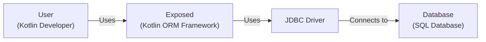
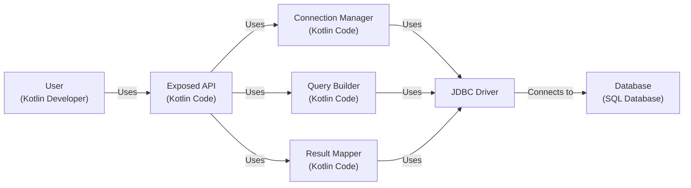
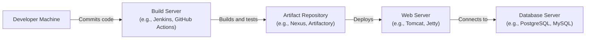
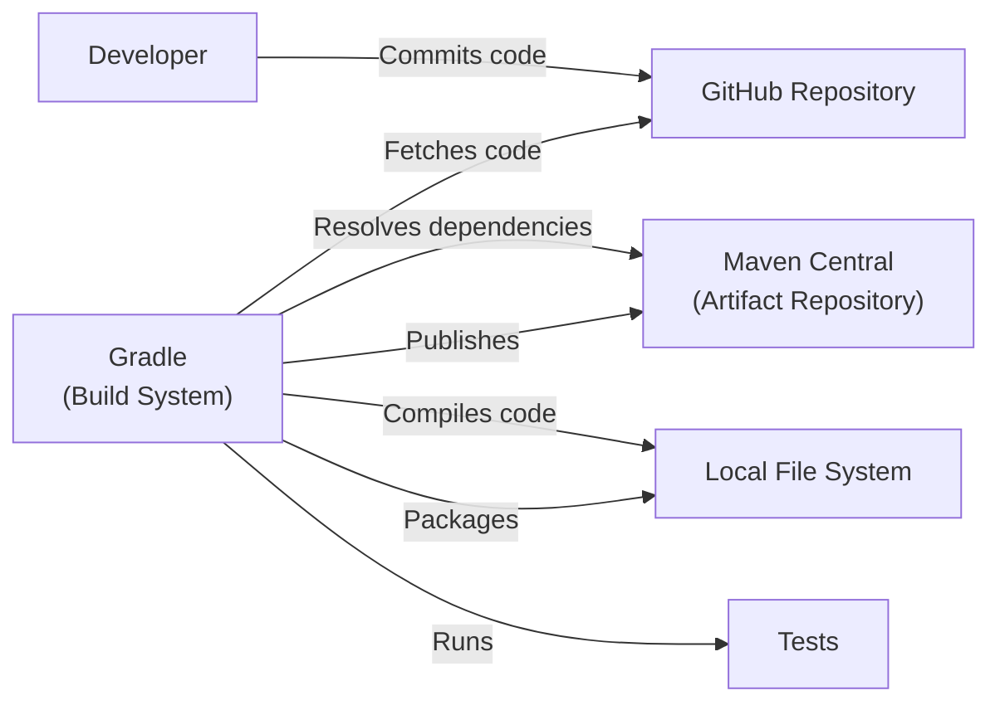

# BUSINESS POSTURE

Exposed is a Kotlin-based Object-Relational Mapping (ORM) framework developed by JetBrains. It simplifies database interactions for Kotlin developers by providing a higher-level, more idiomatic way to work with SQL databases. The primary business goals and priorities are:

*   Developer Productivity: Reduce the amount of boilerplate code required for database operations, making development faster and more efficient.
*   Kotlin Integration: Provide a seamless and natural experience for Kotlin developers, leveraging language features for type safety and conciseness.
*   Database Abstraction: Allow developers to work with different SQL databases using a consistent API, reducing the need to learn database-specific dialects.
*   Maintainability: Improve code readability and maintainability by abstracting away low-level SQL details.
*   Open Source Community: Foster a community around the project, encouraging contributions and feedback.

Based on these priorities, the most important business risks that need to be addressed are:

*   Data Integrity: Ensuring that data stored and retrieved through Exposed is accurate and consistent.
*   Security Vulnerabilities: Protecting against SQL injection and other database-related security threats.
*   Performance Bottlenecks: Avoiding performance issues that could impact the applications using Exposed.
*   Compatibility Issues: Maintaining compatibility with different Kotlin versions, database systems, and other libraries.
*   Community Adoption: Ensuring that the framework is adopted and maintained by the community.

# SECURITY POSTURE

*   security control: The project uses GitHub for version control and issue tracking, which provides some level of access control and auditability.
*   security control: The project is open source, allowing for community review and contributions, which can help identify and address security vulnerabilities.
*   security control: The project uses a build system (Gradle) that can be configured to include security checks.
*   accepted risk: The project relies on the security of underlying database drivers and systems.
*   accepted risk: The project does not appear to have a formal secure software development lifecycle (SSDLC) process documented.
*   accepted risk: The project does not appear to have dedicated security personnel.

Recommended Security Controls:

*   Implement a formal SSDLC process, including security requirements, threat modeling, code reviews, and security testing.
*   Integrate static application security testing (SAST) tools into the build process to identify potential vulnerabilities.
*   Perform regular dynamic application security testing (DAST) to identify runtime vulnerabilities.
*   Establish a vulnerability disclosure program to encourage responsible reporting of security issues.
*   Provide security training for developers contributing to the project.
*   Implement a dependency management system to track and update third-party libraries, addressing known vulnerabilities.

Security Requirements:

*   Authentication: Not directly applicable to the ORM itself, but applications using Exposed should implement proper authentication mechanisms to control access to data.
*   Authorization: Applications using Exposed should implement proper authorization mechanisms to ensure that users can only access data they are permitted to. Exposed provides mechanisms to build queries, and authorization should be implemented at the application level using these mechanisms.
*   Input Validation: Exposed helps prevent SQL injection by using parameterized queries. However, applications should still validate user input to prevent other types of attacks and data integrity issues.
*   Cryptography: Not directly applicable to the ORM itself, but applications using Exposed should use appropriate cryptographic techniques to protect sensitive data at rest and in transit.

# DESIGN

## C4 CONTEXT

*   Element List:
    *   Name: User
        *   Type: Person
        *   Description: A Kotlin developer who uses the Exposed framework to interact with a database.
        *   Responsibilities: Writes application code that uses Exposed to perform database operations.
        *   Security controls: Implements application-level security controls, such as authentication and authorization.
    *   Name: Exposed
        *   Type: Software System
        *   Description: The Kotlin ORM framework that provides a higher-level API for interacting with SQL databases.
        *   Responsibilities: Translates Kotlin code into SQL queries, manages database connections, and maps data between objects and database tables.
        *   Security controls: Uses parameterized queries to prevent SQL injection.
    *   Name: JDBC Driver
        *   Type: Software System
        *   Description: The JDBC driver that provides a low-level interface for connecting to and interacting with a specific database system.
        *   Responsibilities: Handles communication with the database server, executes SQL queries, and returns results.
        *   Security controls: Relies on the security features of the underlying database system and network protocols.
    *   Name: Database
        *   Type: Software System
        *   Description: The SQL database system that stores and manages the application's data.
        *   Responsibilities: Stores data, enforces data integrity constraints, and processes SQL queries.
        *   Security controls: Implements database-level security controls, such as access control, encryption, and auditing.

## C4 CONTAINER

*   Element List:

    *   Name: User
        *   Type: Person
        *   Description: A Kotlin developer who uses the Exposed framework to interact with a database.
        *   Responsibilities: Writes application code that uses Exposed to perform database operations.
        *   Security controls: Implements application-level security controls, such as authentication and authorization.
    *   Name: Exposed API
        *   Type: Container (Kotlin Code)
        *   Description: The public API of the Exposed framework that developers interact with.
        *   Responsibilities: Provides a high-level interface for defining database tables, creating queries, and managing transactions.
        *   Security controls: Uses parameterized queries to prevent SQL injection.
    *   Name: Connection Manager
        *   Type: Container (Kotlin Code)
        *   Description: Manages database connections and connection pooling.
        *   Responsibilities: Establishes and maintains connections to the database, handles connection pooling, and manages transactions.
        *   Security controls: Configures connection parameters securely, such as using secure protocols and authentication credentials.
    *   Name: Query Builder
        *   Type: Container (Kotlin Code)
        *   Description: Constructs SQL queries based on the developer's code.
        *   Responsibilities: Translates Kotlin code into SQL queries, handles different SQL dialects, and optimizes queries for performance.
        *   Security controls: Uses parameterized queries to prevent SQL injection.
    *   Name: Result Mapper
        *   Type: Container (Kotlin Code)
        *   Description: Maps data retrieved from the database to Kotlin objects.
        *   Responsibilities: Converts database rows into Kotlin objects and vice versa.
        *   Security controls: Handles data type conversions securely.
    *   Name: JDBC Driver
        *   Type: Software System
        *   Description: The JDBC driver that provides a low-level interface for connecting to and interacting with a specific database system.
        *   Responsibilities: Handles communication with the database server, executes SQL queries, and returns results.
        *   Security controls: Relies on the security features of the underlying database system and network protocols.
    *   Name: Database
        *   Type: Software System
        *   Description: The SQL database system that stores and manages the application's data.
        *   Responsibilities: Stores data, enforces data integrity constraints, and processes SQL queries.
        *   Security controls: Implements database-level security controls, such as access control, encryption, and auditing.

## DEPLOYMENT

Exposed is a library, not a standalone application. Therefore, its deployment is tied to the deployment of the application that uses it. Here are a few possible deployment scenarios, with one described in detail:

1.  **Standalone Application (e.g., Desktop Application):** The application and Exposed library are packaged together and deployed as a single executable or installer.
2.  **Web Application (e.g., Server-side Application):** The application and Exposed library are packaged as a WAR or JAR file and deployed to a web server or application server (e.g., Tomcat, Jetty, Ktor).
3.  **Cloud-based Application (e.g., Serverless Function):** The application and Exposed library are packaged and deployed to a cloud platform (e.g., AWS Lambda, Google Cloud Functions, Azure Functions).

We'll describe the **Web Application** scenario in detail:

*   Element List:

    *   Name: Developer Machine
        *   Type: Infrastructure Node
        *   Description: The developer's local machine where the application code is written and tested.
        *   Responsibilities: Code development, unit testing, and local deployment.
        *   Security controls: Local security measures, such as firewall and antivirus software.
    *   Name: Build Server
        *   Type: Infrastructure Node
        *   Description: A server that automates the build, test, and packaging process.
        *   Responsibilities: Compiles code, runs tests, creates deployment artifacts, and potentially deploys to staging environments.
        *   Security controls: Access control, secure build environment, and vulnerability scanning.
    *   Name: Artifact Repository
        *   Type: Infrastructure Node
        *   Description: A repository that stores the built application artifacts (e.g., WAR or JAR files).
        *   Responsibilities: Stores and manages deployment artifacts, providing version control and access control.
        *   Security controls: Access control, authentication, and encryption.
    *   Name: Web Server
        *   Type: Infrastructure Node
        *   Description: A server that hosts the web application and handles incoming requests.
        *   Responsibilities: Serves web content, executes application logic, and manages user sessions.
        *   Security controls: Web application firewall (WAF), intrusion detection system (IDS), and secure configuration.
    *   Name: Database Server
        *   Type: Infrastructure Node
        *   Description: A server that hosts the database system.
        *   Responsibilities: Stores and manages application data, processes SQL queries, and enforces data integrity.
        *   Security controls: Database firewall, access control, encryption, and auditing.

## BUILD

The Exposed project uses Gradle as its build system. The build process typically involves the following steps:

1.  **Code Checkout:** The developer checks out the code from the GitHub repository.
2.  **Dependency Resolution:** Gradle resolves and downloads the project's dependencies (including Exposed itself if it's being used in another project).
3.  **Compilation:** Gradle compiles the Kotlin code into bytecode.
4.  **Testing:** Gradle runs unit tests and integration tests.
5.  **Packaging:** Gradle packages the compiled code and resources into a JAR file.
6.  **Publishing:** (If building Exposed itself) Gradle publishes the JAR file to a repository (e.g., Maven Central).

Security Controls in the Build Process:

*   **Dependency Management:** Gradle manages dependencies, but it's crucial to use a dependency vulnerability scanner (e.g., OWASP Dependency-Check) to identify and address known vulnerabilities in third-party libraries.
*   **Static Analysis:** Integrate SAST tools (e.g., Detekt, SpotBugs with Find Security Bugs plugin) into the Gradle build process to automatically scan for potential security vulnerabilities in the code.
*   **Code Signing:** The published JAR file can be digitally signed to ensure its authenticity and integrity.
*   **Build Environment Security:** The build server should be secured with appropriate access controls and security measures.

# RISK ASSESSMENT

*   **Critical Business Processes:**
    *   Data persistence and retrieval for applications using Exposed.
    *   Reliable and efficient database operations.
    *   Maintaining the integrity and consistency of application data.

*   **Data Sensitivity:**
    *   The sensitivity of the data handled by Exposed depends entirely on the application using it. Exposed itself does not inherently handle sensitive data, but it provides the mechanism for applications to interact with databases that may contain sensitive data.
    *   Data sensitivity levels can range from non-sensitive (e.g., public website content) to highly sensitive (e.g., personally identifiable information (PII), financial data, health information).

# QUESTIONS & ASSUMPTIONS

*   **Questions:**
    *   Are there any specific compliance requirements (e.g., GDPR, HIPAA, PCI DSS) that applications using Exposed need to adhere to?
    *   What are the expected performance requirements for applications using Exposed?
    *   What are the specific database systems that Exposed is intended to support?
    *   Is there a formal process for handling security vulnerabilities reported in Exposed?
    *   Are there any plans to integrate with security frameworks or libraries (e.g., Spring Security)?

*   **Assumptions:**
    *   **Business Posture:** We assume that the primary goal is to provide a robust and efficient ORM for Kotlin developers, prioritizing developer productivity and ease of use.
    *   **Security Posture:** We assume that security is a concern, but there may not be a dedicated security team or formal SSDLC process in place. We assume reliance on community contributions and best practices for security.
    *   **Design:** We assume that Exposed is designed to be used with various SQL databases and that it relies on JDBC drivers for database connectivity. We assume that applications using Exposed are responsible for implementing their own authentication and authorization mechanisms.