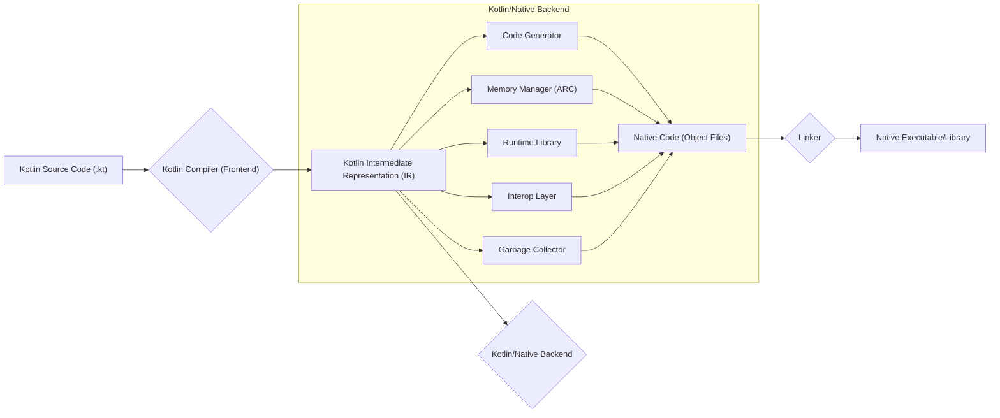

# Project Design Document: Kotlin/Native

**Version:** 1.1
**Date:** October 26, 2023
**Author:** Gemini (AI Language Model)

## 1. Introduction

This document provides an enhanced design overview of the Kotlin/Native project, with a specific focus on aspects relevant to threat modeling. Kotlin/Native enables the compilation of Kotlin code into platform-specific native binaries, eliminating the need for a virtual machine. This revised design document aims to provide a more granular view of the architectural components, data flows, and interactions within the system, particularly highlighting potential security considerations. This document will serve as a refined foundation for subsequent threat modeling activities.

## 2. Goals and Objectives

The primary goals of Kotlin/Native are:

*   Enable the compilation of Kotlin code to platform-specific native executables and libraries.
*   Provide seamless interoperability with native code written in languages like C, Objective-C, and Swift.
*   Offer a memory management model suitable for native environments, primarily leveraging automatic reference counting with cycle detection.
*   Support a wide range of target platforms, including macOS, Windows, Linux, iOS, Android, and WebAssembly.
*   Maintain a high degree of compatibility with the core Kotlin language specification and standard libraries.

## 3. High-Level Architecture

The Kotlin/Native compilation process can be broadly divided into the following stages:

## 4. Detailed Architecture

The Kotlin/Native architecture comprises several key components that interact to transform Kotlin source code into native binaries:

*   **Kotlin Compiler (Frontend):**
    *   **Functionality:** Parses Kotlin source code, performs lexical and syntactic analysis, resolves symbols, and performs type checking.
    *   **Output:** Generates a platform-independent Intermediate Representation (IR) of the Kotlin code.
*   **Intermediate Representation (IR):**
    *   **Description:** A structured representation of the Kotlin code after compilation by the frontend. It serves as the input for the Kotlin/Native backend.
    *   **Key Feature:** Designed to be platform-agnostic, allowing the same IR to be used for different target architectures.
*   **Kotlin/Native Backend:** This component is further broken down into sub-components:
    *   **Code Generator:**
        *   **Functionality:** Translates the Kotlin IR into platform-specific native assembly code or LLVM Intermediate Representation (LLVM IR).
        *   **Target:**  Generates code optimized for the specific target architecture.
    *   **Memory Manager (Automatic Reference Counting with Cycle Detection):**
        *   **Functionality:** Implements the automatic reference counting mechanism for managing object lifetimes in the native environment. Includes cycle detection to prevent memory leaks caused by circular references.
        *   **Responsibility:** Handles allocation and deallocation of memory for Kotlin objects.
    *   **Runtime Library:**
        *   **Functionality:** Provides essential runtime functionalities required for executing Kotlin code in the native environment. This includes core data structures (collections), coroutine support, exception handling, and basic I/O operations.
        *   **Importance:**  Provides the foundation upon which Kotlin code runs natively.
    *   **Interop Layer:**
        *   **Functionality:** Facilitates communication and data exchange between Kotlin code and native libraries or frameworks written in languages like C, Objective-C, and Swift.
        *   **Key Feature:** Handles marshalling of data between the Kotlin and native memory models.
    *   **Garbage Collector (Concurrent Mark-Sweep):**
        *   **Functionality:**  While the primary memory management is ARC, a concurrent mark-sweep garbage collector handles memory associated with global objects and other specific scenarios.
        *   **Purpose:**  Ensures that memory not managed by ARC is eventually reclaimed.
*   **Native Code (Object Files):**
    *   **Description:** Platform-specific object files generated by the Kotlin/Native backend's code generator. These files contain the compiled native code.
*   **Linker:**
    *   **Functionality:** Combines the generated object files with necessary libraries, including the Kotlin/Native runtime library and any external native dependencies.
    *   **Output:** Produces the final native executable or shared library for the target platform.

## 5. Key Components and Their Interactions

Here's a more detailed breakdown of the key components and their interactions, emphasizing data flow:

*   **Kotlin Compiler (Frontend):**
    *   **Input:** Kotlin source files (`.kt`).
    *   **Processing:** Lexical analysis, parsing, semantic analysis, type checking, and IR generation.
    *   **Output:** Kotlin Intermediate Representation (IR).
*   **Kotlin IR:**
    *   **Input:** Output from the Kotlin Compiler (Frontend).
    *   **Transformation:**  Undergoes various optimizations and transformations within the backend.
    *   **Output:** Input for the Kotlin/Native Backend's code generator.
*   **Kotlin/Native Backend:**
    *   **Code Generator:**
        *   **Input:** Kotlin IR.
        *   **Processing:** Translation of IR into native assembly or LLVM IR, register allocation, instruction scheduling.
        *   **Output:** Native code in the form of object files.
    *   **Memory Manager (ARC):**
        *   **Input:** Information about object lifetimes and references from the compiler and runtime.
        *   **Processing:** Incrementing and decrementing reference counts, detecting and breaking reference cycles.
        *   **Output:** Management of object allocation and deallocation in native memory.
    *   **Runtime Library:**
        *   **Input:** Requests from the generated native code for core functionalities.
        *   **Processing:** Execution of core library functions, management of coroutines, handling exceptions.
        *   **Output:** Provides essential services for the execution of Kotlin code.
    *   **Interop Layer:**
        *   **Input:** Kotlin code invoking native functions or accessing native libraries, and vice-versa.
        *   **Processing:** Marshalling of data types between Kotlin and native representations, function call bridging.
        *   **Output:** Enables seamless communication with external native code.
    *   **Garbage Collector:**
        *   **Input:** Information about potentially unreachable global objects and other specific memory regions.
        *   **Processing:** Marking live objects and sweeping away unreachable ones.
        *   **Output:** Reclamation of memory not managed by ARC.
*   **Linker:**
    *   **Input:** Object files generated by the Kotlin/Native backend, Kotlin/Native runtime libraries, and other native dependencies.
    *   **Processing:** Resolving symbols, linking object files, and creating the final executable or library.
    *   **Output:** Executable binary or shared library for the target platform.

## 6. Data Flow

The following diagram illustrates the data flow through the Kotlin/Native compilation process, highlighting key stages:

## 7. Security Considerations

Several security aspects are crucial to consider within the Kotlin/Native ecosystem:

*   **Kotlin Compiler (Frontend) Security:**
    *   **Threats:** Maliciously crafted Kotlin source code could exploit vulnerabilities in the compiler, leading to crashes, unexpected behavior, or the generation of insecure code.
    *   **Considerations:** Robust input validation and sanitization are necessary to prevent denial-of-service attacks or other exploits targeting the compiler.
*   **Kotlin/Native Backend Security:**
    *   **Code Generator:**
        *   **Threats:** Bugs in the code generator could lead to the generation of native code with vulnerabilities like buffer overflows or incorrect memory access.
        *   **Considerations:** Rigorous testing and formal verification techniques can help ensure the correctness and security of the generated code.
    *   **Memory Manager (ARC) Security:**
        *   **Threats:** Flaws in the ARC implementation could lead to memory leaks, use-after-free errors, or double-free vulnerabilities, potentially exploitable for arbitrary code execution.
        *   **Considerations:** Careful design and thorough testing are essential to ensure the robustness of the memory management system.
    *   **Runtime Library Security:**
        *   **Threats:** Vulnerabilities in the runtime library could be exploited by malicious code running within the Kotlin/Native application.
        *   **Considerations:** Regular security audits and updates are necessary to address potential vulnerabilities in the runtime library.
    *   **Interop Layer Security:**
        *   **Threats:** Incorrect handling of data marshalling between Kotlin and native code can introduce vulnerabilities like buffer overflows or type confusion. Calling into untrusted native libraries can expose the application to their vulnerabilities.
        *   **Considerations:** Secure coding practices and careful validation of data passed across the interop boundary are crucial. Sandboxing or other isolation techniques might be necessary when interacting with untrusted native code.
    *   **Garbage Collector Security:**
        *   **Threats:** While primarily for global objects, vulnerabilities in the garbage collector could lead to memory corruption.
        *   **Considerations:**  Ensuring the garbage collector operates correctly and securely is important for overall memory safety.
*   **Linker Security:**
    *   **Threats:**  Compromised or malicious libraries could be linked into the final executable, introducing vulnerabilities.
    *   **Considerations:**  Verifying the integrity and authenticity of linked libraries is essential. Secure build pipelines and dependency management practices are important.
*   **Generated Native Code Security:**
    *   **Threats:** The generated native code inherits the security challenges of native applications, such as buffer overflows, format string bugs, and other common vulnerabilities.
    *   **Considerations:** Developers need to be aware of these risks and employ secure coding practices in their Kotlin code to mitigate them. Static analysis tools can help identify potential vulnerabilities in the generated native code.
*   **Supply Chain Security:**
    *   **Threats:** Dependencies of the Kotlin/Native toolchain (e.g., LLVM) could contain vulnerabilities that could be exploited.
    *   **Considerations:**  Regularly updating dependencies and using trusted sources for the toolchain are important security measures.

## 8. Deployment Security

Security considerations during the deployment of Kotlin/Native applications include:

*   **Protection of Executables:** Ensuring the integrity and authenticity of the deployed native executables to prevent tampering. Code signing is a crucial technique here.
*   **Secure Distribution Channels:** Using secure channels for distributing the application to prevent man-in-the-middle attacks or the introduction of malicious software.
*   **Runtime Environment Security:** The security of the environment where the application is deployed (operating system, permissions, etc.) plays a significant role in the overall security posture.
*   **Dependency Management:** Ensuring that any native dependencies bundled with the application are up-to-date and free of known vulnerabilities.
*   **Updates and Patching:** Having a mechanism for securely updating the application to address any discovered vulnerabilities.

## 9. Future Considerations

Future development and security considerations for Kotlin/Native include:

*   Further hardening of the compiler and runtime against potential exploits.
*   Enhanced static analysis capabilities to detect potential vulnerabilities in Kotlin code that could lead to issues in the generated native code.
*   Improved support for secure enclaves and other hardware-based security features.
*   Ongoing monitoring and addressing of security vulnerabilities in dependencies like LLVM.
*   Development of best practices and guidelines for writing secure Kotlin/Native applications.

This enhanced document provides a more detailed and security-focused overview of the Kotlin/Native project architecture. The granular breakdown of components, detailed data flow, and expanded security considerations will be valuable for conducting thorough threat modeling exercises.