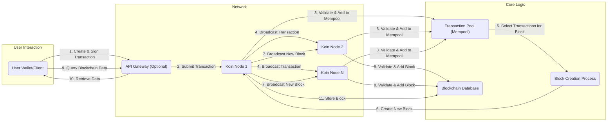

## Project Design Document: Koin Cryptocurrency (Improved)

**1. Project Overview**

This document provides an enhanced design overview of the Koin cryptocurrency project, based on the repository found at [https://github.com/insertkoinio/koin](https://github.com/insertkoinio/koin). This detailed design serves as a crucial artifact for understanding the system's architecture, individual components, and the flow of data within it. The primary purpose of this document is to facilitate comprehensive threat modeling activities.

**2. Goals and Objectives**

The core objectives of the Koin project, as inferred from its nature as a cryptocurrency, are to:

*   Establish a fully functional and operational cryptocurrency system.
*   Empower users with the ability to securely create and manage their cryptocurrency wallets.
*   Enable seamless and secure sending and receiving of Koin transactions between users.
*   Maintain a decentralized, immutable, and transparent record of all transactions through a blockchain.
*   Implement a robust consensus mechanism to validate new blocks and ensure network integrity.

**3. Target Audience**

This design document is specifically tailored for the following individuals and teams:

*   Security Engineers and Architects: To conduct thorough threat modeling and identify potential security vulnerabilities.
*   Software Developers: To provide a clear understanding of the system architecture for development and maintenance purposes.
*   Operations and Infrastructure Teams: To guide deployment, monitoring, and maintenance of the Koin network infrastructure.
*   Project Stakeholders: To offer a comprehensive view of the system's design and functionality.
*   Anyone seeking a deep technical understanding of the Koin system's architecture and operational principles.

**4. System Architecture**

The Koin system is architected as a distributed network comprising several interconnected components, each with specific responsibilities.

*   **User Interface (Wallet/Client):** This component serves as the primary point of interaction for users with the Koin network.
    *   Functionality:
        *   Generation and secure management of cryptographic key pairs (private and public keys).
        *   Derivation and display of Koin addresses from public keys.
        *   Construction of transaction payloads, including specifying recipients and amounts.
        *   Digitally signing transactions using the user's private key.
        *   Displaying transaction history associated with the user's addresses.
        *   Presenting the current Koin balance for the user's addresses.
        *   Establishing connections with Koin network nodes to broadcast transactions and query blockchain data.
    *   Potential Implementations:
        *   Standalone desktop applications (e.g., for Windows, macOS, Linux).
        *   Command-line interface (CLI) tools for advanced users and scripting.
        *   Web-based applications accessible through standard web browsers.
        *   Mobile applications for iOS and Android platforms.

*   **API Gateway:** This optional but highly probable component acts as a controlled entry point for external interactions with the Koin network's core functionality.
    *   Functionality:
        *   Receiving transaction submission requests from user interfaces and potentially other applications.
        *   Providing endpoints for querying blockchain data, such as block information, transaction details, and account balances.
        *   Abstracting the complexities of direct node interaction from client applications.
        *   Implementing security measures like authentication and authorization to control access.
        *   Enforcing rate limiting to prevent abuse and ensure network stability.
        *   Potentially managing connections to a pool of backend Koin nodes for load balancing.

*   **Core Blockchain Logic (Node):** This is the fundamental building block of the Koin network, responsible for maintaining the integrity and consistency of the blockchain.
    *   Functionality:
        *   Receiving newly broadcast transactions from other nodes.
        *   Validating the authenticity and validity of incoming transactions (e.g., signature verification, sufficient balance).
        *   Maintaining a local mempool (memory pool) of valid, unconfirmed transactions.
        *   Participating in the network's consensus mechanism (e.g., Proof-of-Work, Proof-of-Stake) to agree on the next block.
        *   Constructing new blocks containing a set of validated transactions.
        *   Broadcasting newly created blocks to the network.
        *   Storing and synchronizing the entire blockchain history.
        *   Relaying transactions and blocks to other peer nodes in the network.

*   **Data Storage (Blockchain Database):** This component provides persistent storage for the blockchain's data.
    *   Functionality:
        *   Storing validated blocks and the transactions they contain.
        *   Indexing blockchain data to enable efficient querying and retrieval of information.
        *   Potentially storing node-specific configuration settings and operational state.
    *   Potential Implementations:
        *   Embedded key-value stores like LevelDB or RocksDB, commonly used in blockchain implementations.
        *   Custom file-based storage solutions optimized for blockchain data structures.

*   **Networking Layer (Peer-to-Peer Network):** This component facilitates communication and data exchange between different Koin nodes, forming the distributed network.
    *   Functionality:
        *   Discovering other available nodes on the network.
        *   Establishing and maintaining connections with peer nodes.
        *   Broadcasting new transactions and blocks to the network.
        *   Receiving and processing transactions and blocks from other nodes.
        *   Implementing mechanisms for handling network topology and node churn.
    *   Potential Implementations:
        *   Standard TCP/IP based communication protocols.
        *   Specialized P2P networking libraries like libp2p, designed for building decentralized applications.

*   **Key Management System:** This critical component is responsible for the secure generation, storage, and management of cryptographic keys.
    *   Functionality:
        *   Generating secure private and public key pairs for users and potentially for internal system components.
        *   Providing mechanisms for securely storing private keys, potentially using encryption or hardware security modules (HSMs).
        *   Facilitating the signing of transactions using stored private keys.

**5. Data Flow**

The following diagram illustrates the typical flow of data during a Koin transaction.

**Data Flow Description:**

*   **1. Create & Sign Transaction:** A user initiates a transaction using their wallet, specifying the recipient and amount. The wallet then cryptographically signs the transaction using the user's private key.
*   **2. Submit Transaction:** The signed transaction is submitted to the Koin network. This may occur directly to a Koin node or through an intermediary API Gateway.
*   **3. Validate & Add to Mempool:** A Koin node receives the transaction and performs validation checks, such as verifying the digital signature and ensuring the sender has sufficient funds. If valid, the transaction is added to the node's local transaction pool (mempool).
*   **4. Broadcast Transaction:** The receiving node broadcasts the newly validated transaction to other nodes in the Koin network to propagate it.
*   **5. Select Transactions for Block:** A node participating in block creation (e.g., a miner in a Proof-of-Work system) selects a set of pending transactions from its mempool to include in a new block.
*   **6. Create New Block:** The selected node constructs a new block. This involves including the chosen transactions, a reference to the previous block in the chain, a timestamp, and potentially a proof-of-work or other consensus-related data.
*   **7. Broadcast New Block:** The newly created block is broadcast to the rest of the Koin network.
*   **8. Validate & Add Block:** Other nodes in the network receive the newly broadcast block. They validate the block's contents, including the transactions and the consensus mechanism's requirements. If valid, the block is added to their local copy of the blockchain.
*   **9. Query Blockchain Data:** A user (or application) can query the blockchain for information, such as transaction details, account balances, or block information.
*   **10. Retrieve Data:** The API Gateway or a directly connected node retrieves the requested data from the blockchain database.
*   **11. Store Block:**  Koin nodes permanently store the validated and accepted block in their local blockchain database, extending the chain.

**6. Security Considerations (Pre-Threat Modeling)**

Identifying potential security vulnerabilities is crucial for a robust cryptocurrency system. Here are some key considerations for the Koin project:

*   **User Interface (Wallet/Client):**
    *   Threats: Private key compromise due to malware or insecure storage, phishing attacks targeting user credentials, vulnerabilities in the wallet software itself.
    *   Considerations: Secure key generation and storage mechanisms, protection against cross-site scripting (XSS) and other web vulnerabilities (for web wallets), secure communication channels.
*   **API Gateway:**
    *   Threats: Unauthorized access, API abuse, injection attacks, denial-of-service attacks.
    *   Considerations: Robust authentication and authorization mechanisms, input validation, rate limiting, protection against common web application vulnerabilities.
*   **Core Blockchain Logic (Node):**
    *   Threats: Consensus mechanism vulnerabilities (e.g., 51% attacks), denial-of-service attacks targeting node resources, vulnerabilities in the node software leading to crashes or data corruption, eclipse attacks isolating nodes from the network.
    *   Considerations: Secure implementation of the consensus algorithm, robust peer discovery and management, input validation, regular security audits of the codebase.
*   **Data Storage (Blockchain Database):**
    *   Threats: Data corruption, unauthorized access to sensitive blockchain data (though generally public), potential for database vulnerabilities.
    *   Considerations: Data integrity checks, secure file permissions, regular backups.
*   **Networking Layer (Peer-to-Peer Network):**
    *   Threats: Man-in-the-middle attacks, network partitioning, Sybil attacks (where an attacker controls a large number of nodes), eclipse attacks.
    *   Considerations: Encrypted communication between nodes, robust peer authentication, mechanisms to limit the influence of any single entity.
*   **Key Management System:**
    *   Threats: Private key theft or loss, insecure key generation, vulnerabilities in key storage mechanisms.
    *   Considerations: Secure key generation practices, encryption of private keys at rest, potentially using hardware security modules (HSMs) for sensitive keys.
*   **Transaction Processing:**
    *   Threats: Double-spending attempts, transaction malleability, replay attacks.
    *   Considerations: Robust transaction validation rules, unique transaction identifiers, secure signing algorithms.

**7. Deployment Architecture**

The Koin network is inherently designed for distributed deployment. Nodes can be deployed in various environments, contributing to the network's decentralization and resilience.

*   **Cloud Environments:** Nodes can be deployed as virtual machines or containers on cloud platforms like AWS, Azure, or GCP, leveraging their scalability and availability.
*   **On-Premise Servers:** Organizations or individuals can operate Koin nodes on their own physical or virtual servers within their infrastructure.
*   **Personal Computers:** Users can run lightweight wallet clients or even full nodes on their desktop or laptop computers, contributing to network participation.
*   **Containerized Deployments:** Using containerization technologies like Docker and orchestration platforms like Kubernetes allows for easier deployment, management, and scaling of Koin nodes.

**8. Technology Stack (Inferred and Requires Verification)**

Based on common practices in cryptocurrency development, the Koin project likely utilizes the following technologies. **Note:** This is based on inference and requires verification by examining the project's repository.

*   **Core Programming Language:**  Likely Go, Rust, or C++, known for their performance and suitability for system-level programming.
*   **Cryptography Libraries:** Libraries providing cryptographic primitives for hashing, digital signatures, and key generation (e.g., OpenSSL, libsodium, or language-specific libraries).
*   **Networking Libraries:** Libraries for handling peer-to-peer communication and network protocols (e.g., libp2p, or standard networking libraries within the chosen programming language).
*   **Database for Blockchain Storage:**  Likely a key-value store optimized for performance and storage efficiency, such as LevelDB or RocksDB.
*   **Build Tools and Dependency Management:** Tools specific to the chosen programming language for building, testing, and managing project dependencies (e.g., Go modules, Cargo for Rust).

**9. Assumptions and Constraints**

*   This design document is based on an analysis of the project's general nature as a cryptocurrency and common architectural patterns, without direct access to the complete and up-to-date codebase during its creation.
*   The specific implementation details and choices made by the Koin project developers may differ from the descriptions provided here.
*   The project is assumed to be under active development, and the architecture and features may evolve over time.
*   The primary focus of this document is on the core architectural components and data flow relevant for security threat modeling.

**10. Future Considerations**

The Koin project, like many cryptocurrencies, may evolve to incorporate additional features and improvements:

*   Implementation of a specific consensus mechanism (if not already present), such as Proof-of-Work (PoW) or Proof-of-Stake (PoS).
*   Development of more user-friendly and feature-rich wallet applications.
*   Integration with other blockchain networks or decentralized applications (dApps).
*   Implementation of smart contract functionality to enable more complex and automated transactions.
*   Exploration of layer-2 scaling solutions to improve transaction throughput and reduce fees.
*   Enhancements to privacy features and transaction anonymity.

This improved design document provides a more detailed and comprehensive understanding of the Koin cryptocurrency project's architecture, serving as a valuable resource for subsequent threat modeling and security analysis.