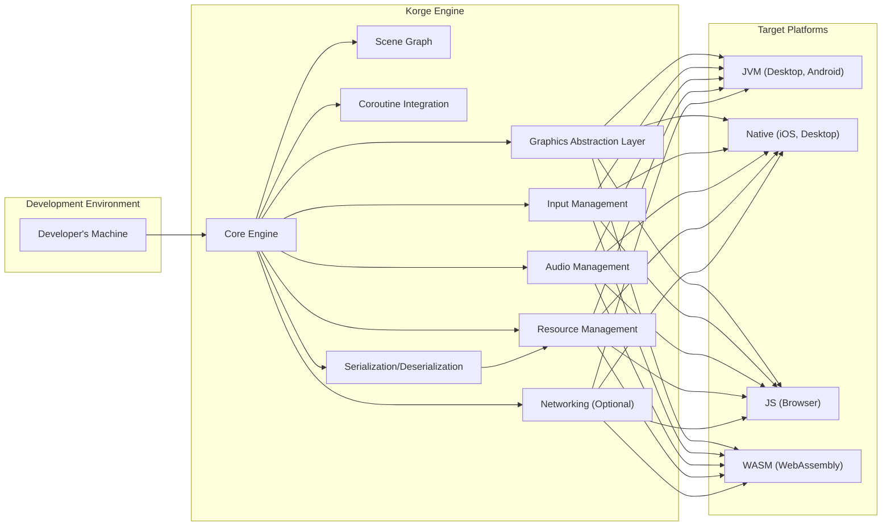
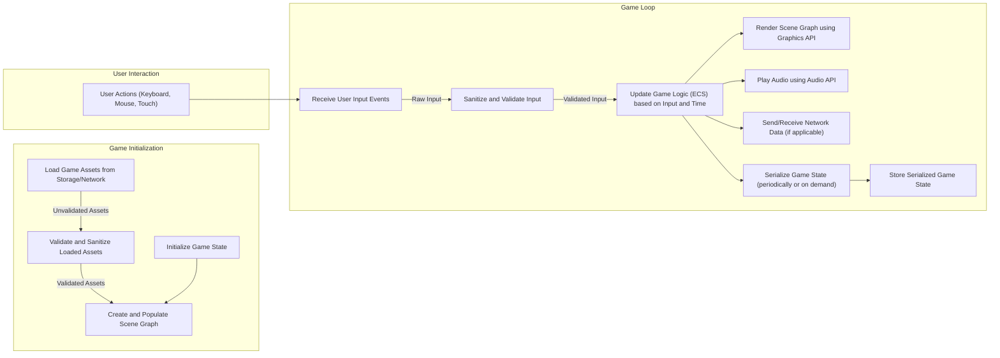

# Project Design Document: Korge - Kotlin Multiplatform Game Engine

**Version:** 1.1
**Date:** October 26, 2023
**Author:** AI Software Architect

## 1. Introduction

This document provides an enhanced architectural design of the Korge game engine, an open-source Kotlin Multiplatform library for creating 2D games. This revised document offers a more detailed understanding of the system's components, interactions, and data flow, with a stronger emphasis on aspects relevant to threat modeling. The design focuses on the core engine functionalities, its interaction with the development environment, and target platforms, highlighting potential security considerations.

This document is based on the information available in the Korge GitHub repository: [https://github.com/korlibs/korge](https://github.com/korlibs/korge).

## 2. Goals and Objectives

The primary goals of Korge are:

* **Multiplatform Game Development:** Enable developers to write game logic once and deploy it across various platforms (JVM, Native, JS, WASM).
* **Ease of Use:** Provide a user-friendly API for common game development tasks, abstracting away platform complexities.
* **Performance:** Offer good performance across target platforms by leveraging platform-specific capabilities where necessary.
* **Extensibility:** Allow developers to extend the engine's functionality through custom code and libraries.

The objective of this design document is to provide a clear, comprehensive, and security-focused overview of Korge's architecture to facilitate thorough threat identification and the development of effective mitigation strategies.

## 3. High-Level Architecture

Korge employs a layered and modular architecture, clearly separating core, platform-agnostic engine functionalities from platform-specific implementations. This separation is crucial for maintainability and security. The core engine provides the fundamental building blocks, while platform-specific layers handle sensitive operations like rendering and input.

## 4. Detailed Component Design

This section provides a more detailed description of the key components of the Korge engine, highlighting security-relevant aspects:

* **Core Engine:**
    * Contains the fundamental, platform-independent game logic structures:
        * **Game Loop Management:** Controls the execution flow of the game, potentially vulnerable to timing attacks or resource exhaustion if not handled carefully.
        * **Entity-Component-System (ECS) Implementation:** Manages game entities and their components. Improperly designed components or data handling within the ECS could introduce vulnerabilities.
        * **Basic Math and Utility Functions:** Provides essential mathematical operations. While generally safe, vulnerabilities in underlying math libraries could be a concern.
        * **Event Handling Mechanisms:** Manages events within the game. Unvalidated event data or improper handling could lead to unexpected behavior.
    * Responsible for orchestrating the interactions between other components.

* **Graphics Abstraction Layer:**
    * Provides an abstract interface for rendering operations, shielding the core engine from platform-specific graphics APIs.
    * Different implementations exist for each target platform (e.g., OpenGL for Native, Canvas/WebGL for JS).
    * **Security Relevance:** Vulnerabilities in the underlying graphics drivers or APIs could be exploited through this layer. Improper handling of textures or rendering commands could lead to crashes or information disclosure.

* **Input Management:**
    * Manages user input from various sources (keyboard, mouse, touch, gamepads).
    * Provides a unified input event model across platforms.
    * **Security Relevance:**  Crucial for preventing input injection attacks. Proper validation and sanitization of input data are essential.

* **Audio Management:**
    * Provides an abstraction for audio playback and manipulation.
    * Supports different audio formats and playback controls.
    * **Security Relevance:** Potential vulnerabilities in audio decoding libraries could be exploited by malicious audio files.

* **Resource Management:**
    * Handles loading and managing game assets (images, sounds, fonts, data files, etc.).
    * Provides mechanisms for asynchronous loading and caching.
    * **Security Relevance:**  A critical component for security. Must implement robust validation to prevent loading of malicious assets. Path traversal vulnerabilities are a significant concern here.

* **Scene Graph:**
    * Organizes game objects in a hierarchical structure, facilitating efficient rendering and management.
    * **Security Relevance:** While generally not a direct attack vector, vulnerabilities in how the scene graph is updated or rendered could lead to unexpected visual glitches or denial-of-service scenarios.

* **Coroutine Integration:**
    * Leverages Kotlin coroutines for asynchronous operations and managing game logic flow.
    * **Security Relevance:** Improper use of coroutines could lead to race conditions or deadlocks, potentially exploitable for denial of service.

* **Networking (Optional):**
    * Provides optional networking capabilities for multiplayer games or online features.
    * May include support for sockets, HTTP requests, and custom protocols.
    * **Security Relevance:**  A major area of concern. Requires careful implementation to prevent various network-based attacks (see dedicated section below).

* **Serialization/Deserialization:**
    * Handles the process of converting game state or data structures into a format that can be stored or transmitted, and vice versa.
    * **Security Relevance:** Vulnerabilities in serialization libraries can lead to remote code execution if untrusted data is deserialized. Careful selection and configuration of serialization mechanisms are crucial.

## 5. Data Flow

The following outlines a more detailed data flow within a Korge application, highlighting potential security touchpoints:

Detailed data flow considerations with security implications:

* **Asset Loading:** Assets are loaded from the file system or network. **Crucially, validation and sanitization (B) must occur before assets are used.** Failure to do so can lead to vulnerabilities.
* **Input Processing:** User input events (M) are captured (E) and **must be sanitized and validated (F)** before being used to update the game state.
* **Game Logic Updates:** The Core Engine (G) processes game logic, potentially modifying sensitive game state. Secure coding practices are essential here.
* **Rendering:** The Scene Graph is rendered (H) using the Graphics Abstraction Layer. Vulnerabilities in the graphics drivers or APIs could be exploited.
* **Audio Playback:** Audio is played (I) using the Audio Management component. Malicious audio files could exploit vulnerabilities.
* **Networking (if used):** Network data is sent and received (J). **All network communication should be secured (e.g., using TLS) and data should be validated.**
* **Serialization/Deserialization:** Game state is serialized (K) for saving or transmission. **Only trust data from trusted sources during deserialization to prevent code execution vulnerabilities.** The serialized data needs protection during storage (L).

## 6. Security Considerations (For Threat Modeling)

This section expands on potential areas of security concern for threat modeling, providing more specific examples:

* **Asset Loading:**
    * **Malicious Assets:** Loading images with crafted headers to exploit image decoding libraries, audio files with embedded malicious code, or font files designed to trigger buffer overflows.
    * **Path Traversal:** Using filenames like `../../../../sensitive_data.txt` to access files outside the intended asset directory. Implement strict path validation and sanitization.

* **Input Handling:**
    * **Input Injection:** Sending specially crafted keyboard inputs to trigger unintended game actions or exploit command injection vulnerabilities if input is used in system calls.
    * **Denial of Service:** Rapidly sending a large number of input events to overwhelm the game's processing capabilities. Implement input throttling and rate limiting.

* **Networking (If Implemented):**
    * **Man-in-the-Middle Attacks:** Intercepting communication between the client and server to steal credentials or game data if HTTPS is not used. Enforce TLS/SSL for all network communication.
    * **Data Injection:** Sending malicious data packets to the server to corrupt game state, cheat, or disrupt other players. Implement robust server-side validation and sanitization.
    * **Denial of Service:** Flooding the server with connection requests or data packets to make it unavailable. Implement rate limiting, connection limits, and potentially DDoS mitigation techniques.
    * **Authentication and Authorization:** Weak password policies, insecure storage of credentials, or vulnerabilities in the authentication logic could allow unauthorized access to accounts. Implement strong authentication mechanisms (e.g., multi-factor authentication) and secure password hashing.

* **Platform-Specific Vulnerabilities:**
    * Exploiting known vulnerabilities in specific operating systems or graphics drivers. Keep dependencies updated and be aware of platform-specific security advisories.
    * Bypassing platform sandboxing mechanisms to gain unauthorized access to system resources. Adhere to platform security guidelines and best practices.

* **Dependency Management:**
    * Using outdated libraries with known vulnerabilities. Implement a process for regularly updating dependencies and scanning for vulnerabilities.

* **Code Injection (Less likely in typical Korge usage but possible with custom scripting or plugins):**
    * Allowing execution of arbitrary code through scripting languages or plugins with insufficient security controls. Implement secure coding practices for plugin development and restrict access to sensitive APIs.

* **Local Data Storage:**
    * Storing sensitive data (e.g., save games containing player progress or credentials) in plaintext or with weak encryption. Implement proper encryption for locally stored data.

* **Serialization/Deserialization:**
    * Deserializing data from untrusted sources without proper validation, potentially leading to remote code execution vulnerabilities if the serialization library is vulnerable. Use secure serialization libraries and avoid deserializing untrusted data directly.

## 7. Assumptions and Constraints

* **Secure Development Practices:** It is assumed that developers using Korge follow secure coding practices and are aware of common security vulnerabilities.
* **Platform Security:** The inherent security features and limitations of each target platform are considered constraints. Korge relies on the underlying platform for certain security aspects.
* **Open Source Transparency:** The open-source nature of Korge allows for community scrutiny, which can aid in identifying potential vulnerabilities, but also means that vulnerabilities are publicly known once discovered.
* **Focus on Game Logic Security:** This design document primarily focuses on the security of the game engine and its interaction with game logic. Security considerations for external services (e.g., backend servers) are outside the scope of this document.

## 8. Future Considerations

* **Enhanced Networking Security:** As Korge's networking capabilities evolve, incorporating more advanced security features like end-to-end encryption and robust authentication protocols will be crucial.
* **Plugin System Security:** If a plugin system is introduced, implementing a secure plugin architecture with sandboxing and permission management will be essential to prevent malicious plugins from compromising the engine or the user's system.
* **WebAssembly Security Hardening:** Continuously monitoring and adapting to the evolving security landscape of WebAssembly to mitigate potential vulnerabilities in the browser environment.
* **Formal Security Audits:** Conducting regular security audits by external experts to identify and address potential vulnerabilities in the codebase.

This enhanced document provides a more detailed and security-focused understanding of the Korge architecture, serving as a stronger foundation for comprehensive threat modeling activities. By considering the potential threats and vulnerabilities outlined here, developers can build more secure and resilient games using the Korge engine.