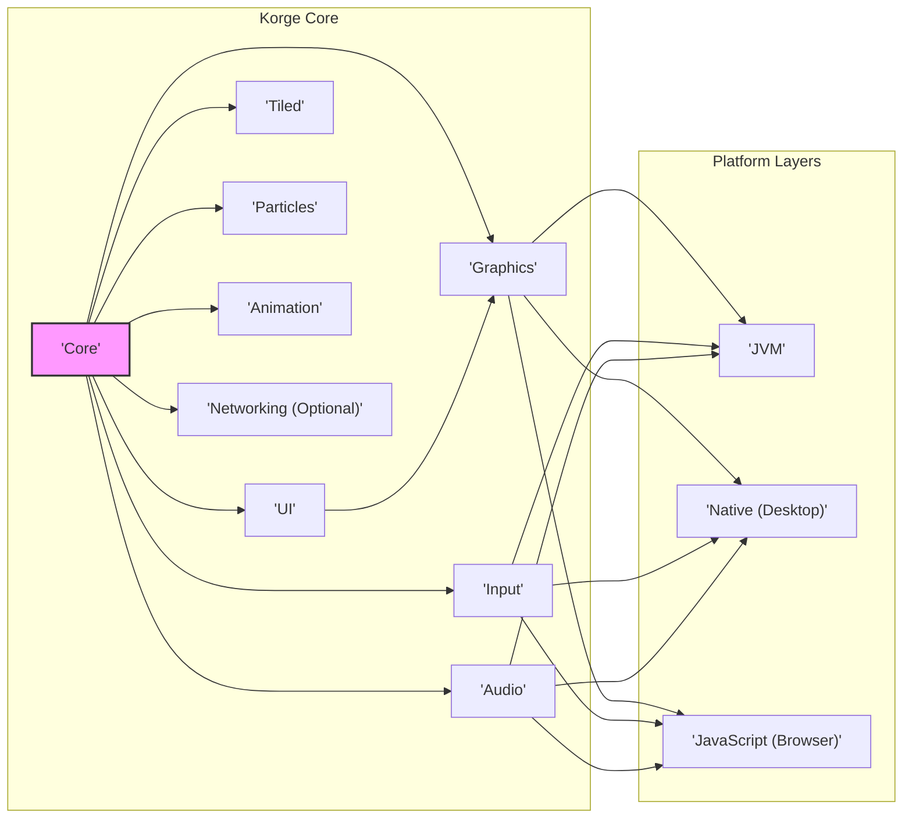
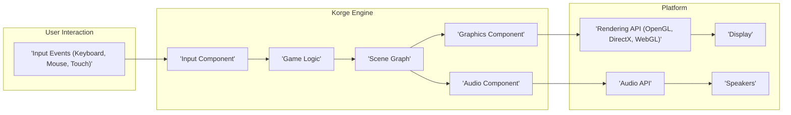

# Project Design Document: Korge - Kotlin Multiplatform Game Engine

**Version:** 1.1
**Date:** October 26, 2023
**Author:** AI Expert

## 1. Introduction

This document provides a detailed architectural design of Korge, a Kotlin Multiplatform game engine. It outlines the core components, their interactions, data flow, and deployment model. This document serves as a foundation for understanding the system's structure and will be used as input for subsequent threat modeling activities. This revision aims to provide more clarity and detail based on initial feedback.

## 2. Goals and Objectives

The primary goal of Korge is to provide a comprehensive and efficient framework for developing 2D games that can run on multiple platforms, including JVM, Native (desktop), and JavaScript (browser). Key objectives include:

* **Cross-Platform Compatibility:** Enable developers to write game logic once and deploy it across various platforms without significant platform-specific code.
* **Performance:** Offer high performance for smooth and responsive game experiences by leveraging platform-specific optimizations where necessary.
* **Ease of Use:** Provide a clear, intuitive, and well-documented API that simplifies common game development tasks.
* **Extensibility:** Allow developers to extend the engine's functionality with custom components, plugins, and integrations.
* **Rich Feature Set:** Include essential game development features like a robust rendering system, input handling, audio management, scene management, and UI tools.

## 3. Target Audience

This document is intended for the following audiences:

* **Software Developers:** Those who will be working with the Korge codebase, contributing to its development, extending its functionality, or building games using it.
* **Security Engineers:** Individuals responsible for identifying and mitigating potential security vulnerabilities within the Korge engine and games built with it.
* **System Architects:** Those who need a high-level understanding of Korge's architecture, its design principles, and its place within a larger software ecosystem.

## 4. High-Level Architecture

Korge employs a modular architecture, carefully separating concerns into distinct, cohesive components. This design promotes maintainability, testability, and the ability to extend the engine's capabilities. The "Korge Core" provides platform-agnostic functionalities, while "Platform Layers" implement the platform-specific details.

**Components:**

* **Core:** Provides foundational services and utilities. This includes coroutine management for asynchronous operations, resource management (loading and caching assets), dependency injection, and a central event management system.
* **Graphics:** Responsible for all aspects of 2D rendering. It abstracts platform-specific graphics APIs, providing a unified interface for drawing sprites, textures, shapes, and text using shaders and defined rendering pipelines.
* **Input:** Manages user input from various sources. It normalizes input events from keyboards, mice, touchscreens, and gamepads, providing a consistent cross-platform API for accessing input data.
* **Audio:** Handles audio playback and manipulation. It supports various audio formats, sound effects, and background music, abstracting the underlying platform's audio capabilities.
* **UI:** Offers a set of pre-built UI components and layout management tools. This allows developers to create interactive in-game user interfaces without needing to implement common UI elements from scratch.
* **Tiled:** Integrates support for the popular Tiled map editor. It enables loading and rendering of tile-based game levels created with Tiled, simplifying level design.
* **Particles:** Provides a particle system for creating dynamic visual effects. Developers can configure particle emitters to generate effects like explosions, smoke, and fire.
* **Animation:** Manages various animation techniques. This includes sprite animation (frame-by-frame), tweening animations for smooth property transitions, and potentially skeletal animation through extensions or integrations.
* **Networking (Optional):** Offers optional networking capabilities for implementing multiplayer games or online features. This component might provide basic networking primitives or rely on platform-specific libraries and external integrations.
* **Platform Layers (JVM, Native, JavaScript):** These layers provide the concrete implementations for the abstract interfaces defined in the core components. They adapt the core functionalities to the specifics of each target platform, enabling Korge to run seamlessly across different environments.

## 5. Component Design

This section provides a more detailed look at the key components of Korge, outlining their specific responsibilities and functionalities.

### 5.1 Core

* **Responsibilities:**
    * **Engine Lifecycle:**  Manages the initialization, update loop, and shutdown of the game engine.
    * **Coroutine Management:** Provides utilities for launching and managing asynchronous tasks using Kotlin coroutines.
    * **Resource Management:** Handles loading, caching, and unloading of game assets like images, audio files, fonts, and data files.
    * **Dependency Injection:** Implements a mechanism for managing dependencies between components, promoting loose coupling and testability.
    * **Event Management:**  Offers a system for components to communicate with each other by emitting and subscribing to events.
    * **Time Management:** Provides accurate time tracking and frame rate control for consistent game updates.

### 5.2 Graphics

* **Responsibilities:**
    * **Rendering Abstraction:**  Provides an abstraction layer over platform-specific graphics APIs (e.g., OpenGL on desktop, WebGL in browsers).
    * **Primitive Rendering:** Offers methods for drawing basic shapes, sprites, and text.
    * **Texture Management:** Handles loading, uploading, and managing textures in GPU memory.
    * **Shader Management:**  Allows developers to load and use custom shaders for advanced visual effects.
    * **Rendering Pipelines:** Defines the steps involved in rendering a frame, allowing for customization and optimization.
    * **Camera and Viewport Management:**  Provides tools for controlling the camera's perspective and the visible area on the screen.
    * **Blend Modes:** Supports various blend modes for compositing graphical elements.

### 5.3 Input

* **Responsibilities:**
    * **Keyboard Input:**  Detects and processes key presses and releases.
    * **Mouse Input:** Tracks mouse movement, button clicks, and scroll wheel events.
    * **Touch Input:** Handles touch events on touchscreens, including taps, swipes, and multi-touch gestures.
    * **Gamepad Input:**  Supports input from gamepads and joysticks.
    * **Input Normalization:**  Converts platform-specific input events into a consistent, cross-platform representation.
    * **Input Mapping:** Allows developers to map input events to specific game actions.

### 5.4 Audio

* **Responsibilities:**
    * **Audio Loading:** Loads audio files in various formats (e.g., MP3, WAV, OGG).
    * **Audio Playback:**  Provides controls for playing, pausing, stopping, and looping audio.
    * **Volume and Panning Control:** Allows adjusting the volume and stereo panning of audio sources.
    * **Sound Effects:**  Manages the playback of short audio clips for in-game effects.
    * **Background Music:**  Supports continuous playback of background music tracks.
    * **Spatial Audio (Optional):** May offer features for creating positional audio effects.

### 5.5 UI

* **Responsibilities:**
    * **UI Component Library:** Provides a set of reusable UI components like buttons, labels, text fields, and sliders.
    * **Layout Management:** Offers tools for arranging UI components on the screen (e.g., using layouts like vertical boxes, horizontal boxes, grids).
    * **Event Handling:**  Manages user interactions with UI components (e.g., button clicks, text input).
    * **Theming and Styling:** Allows customization of the visual appearance of UI components.

### 5.6 Tiled

* **Responsibilities:**
    * **Map Loading and Parsing:** Loads and parses map data from Tiled map files (e.g., `.tmx`).
    * **Tile Layer Rendering:** Renders the different tile layers of a Tiled map.
    * **Object Layer Handling:** Provides access to objects placed within the Tiled map, including their properties.
    * **Image Layer Rendering:**  Renders image layers included in the Tiled map.

### 5.7 Particles

* **Responsibilities:**
    * **Particle Emitter Management:** Creates and manages particle emitters.
    * **Particle Configuration:** Allows setting properties for particles, such as size, color, velocity, acceleration, lifespan, and blending modes.
    * **Particle Simulation:** Updates the position and state of particles over time.
    * **Efficient Rendering:** Renders large numbers of particles efficiently.

### 5.8 Animation

* **Responsibilities:**
    * **Sprite Animation Playback:** Plays back sequences of images (frames) to create animated sprites.
    * **Tweening:** Provides functions for smoothly animating properties of objects over time (e.g., position, rotation, scale, alpha).
    * **Skeletal Animation (Potentially via Extensions):** May support or provide integration points for skeletal animation, where characters or objects are animated using a bone-based system.

### 5.9 Networking (Optional)

* **Responsibilities:**
    * **Socket Communication:**  Provides basic functionality for establishing and managing network connections using sockets (TCP or UDP).
    * **HTTP Requests:** May offer capabilities for making HTTP requests to external servers.
    * **Data Serialization/Deserialization:**  Includes mechanisms for converting game data into a format suitable for network transmission and vice versa.
    * **Multiplayer Support:**  Provides foundational elements for implementing real-time or turn-based multiplayer gameplay.

### 5.10 Platform Layers

* **Responsibilities:**
    * **Graphics API Implementation:**  Provides the concrete implementation of the Graphics component using platform-specific graphics libraries (e.g., LWJGL for JVM, native APIs for desktop, WebGL for browsers).
    * **Input Handling Implementation:**  Implements the Input component by interacting with the platform's input mechanisms.
    * **Audio API Implementation:**  Provides the concrete implementation of the Audio component using platform-specific audio libraries.
    * **Window Management:** Creates and manages the game window or canvas on each platform.
    * **Game Loop Implementation:**  Implements the main game loop, handling frame updates and rendering on the specific platform.

## 6. Data Flow

The typical data flow within a Korge game can be visualized as follows:

**Data Flow Description:**

1. **Input Events:** User interactions, such as keyboard presses, mouse movements, and touch events, are initially captured by the underlying operating system or browser.
2. **Input Component:** The Korge Input component receives these platform-specific raw input events.
3. **Game Logic:** The Input component normalizes these events and makes them available to the game's core logic. The game logic processes the input, updates the game state based on user actions, and determines necessary changes to the game world.
4. **Scene Graph:** Changes to the game world, such as object positions, animations, or visibility, are reflected in the Scene Graph. The Scene Graph represents the hierarchical structure of all visible and interactive elements in the game.
5. **Graphics Component:** The Graphics component traverses the Scene Graph to determine what needs to be rendered. It uses the appropriate platform-specific Rendering API to draw the game objects on the screen.
6. **Audio Component:** The game logic can trigger audio events (e.g., playing a sound effect). The Audio component uses the platform's Audio API to play the corresponding sounds through the speakers.
7. **Rendering API:** The platform's Rendering API (like OpenGL, DirectX, or WebGL) handles the low-level details of drawing graphics primitives to the display.
8. **Audio API:** The platform's Audio API manages the playback of audio data through the system's audio output devices.

## 7. Deployment Model

Korge's multiplatform nature allows for deployment to various target environments:

* **JVM:** Games can be packaged as standard JAR files. This allows them to run on any system with a compatible Java Virtual Machine installed, including Windows, macOS, and Linux.
* **Native (Desktop):** Utilizing Kotlin/Native, games can be compiled into platform-specific native executables for desktop operating systems like Windows, macOS, and Linux. This can offer performance advantages and closer integration with the operating system.
* **JavaScript (Browser):** Using Kotlin/JS, games can be compiled into JavaScript code that runs directly within modern web browsers. This enables web-based distribution and accessibility without requiring users to install additional software.

The typical deployment process involves:

* **Compilation:** Compiling the Kotlin source code using the appropriate Kotlin compiler (JVM, Native, or JS) for the target platform.
* **Packaging:** Bundling the compiled code, game assets (images, audio, fonts), and any necessary dependencies into a distributable package. This might be a JAR file for JVM, an executable for Native, or a set of HTML, CSS, and JavaScript files for the browser.
* **Distribution:**  Distributing the packaged game to end-users through various channels, such as direct downloads, application stores, or web servers.

## 8. Security Considerations (Preliminary)

This section outlines preliminary security considerations. A dedicated threat modeling exercise will provide a more in-depth analysis.

* **Resource Exhaustion:**
    * **Memory Leaks:**  Ensure proper memory management to prevent the game from consuming excessive memory over time.
    * **CPU Hogging:**  Avoid computationally intensive operations that could freeze or slow down the game.
    * **GPU Overload:**  Optimize rendering processes to prevent the game from overwhelming the GPU.
* **Input Handling Vulnerabilities:**
    * **Injection Attacks:**  Sanitize user input to prevent malicious code injection, especially if the game involves any form of user-generated content or network communication.
    * **Unexpected Input:**  Handle unexpected or malformed input gracefully to avoid crashes or unexpected behavior.
* **Third-Party Dependencies:**
    * **Vulnerable Libraries:** Regularly update and audit third-party libraries for known security vulnerabilities.
    * **Supply Chain Attacks:**  Be aware of the risks associated with dependencies and ensure they come from trusted sources.
* **Code Execution Risks:**
    * **Arbitrary Code Execution:**  Prevent the execution of untrusted code within the game engine or the game itself.
    * **Scripting Vulnerabilities:** If a scripting language is used, ensure it is sandboxed and secure.
* **Data Security:**
    * **Save Data Tampering:**  Protect saved game data from unauthorized modification.
    * **Network Data Interception:** If the game uses networking, secure communication channels to prevent data interception or manipulation.
* **Platform-Specific Security:**
    * **Sandbox Escapes:** Be aware of potential vulnerabilities that could allow the game to escape the platform's security sandbox.
    * **Permissions:**  Request only the necessary permissions on each platform.

## 9. Future Considerations

This section outlines potential future enhancements and directions for Korge.

* **Enhanced Rendering Features:**
    * **3D Rendering Support:** Explore the feasibility of adding support for rendering 3D graphics.
    * **Advanced Shading Techniques:** Implement more sophisticated shading models and effects.
    * **Post-Processing Effects:**  Add support for common post-processing effects like bloom, depth of field, and color grading.
* **Improved Tooling and Editor Support:**
    * **Integrated Scene Editor:** Develop a visual editor for creating and managing game scenes.
    * **Asset Pipeline Improvements:** Streamline the process of importing and managing game assets.
* **Expanded Networking Capabilities:**
    * **Robust Networking Library:**  Develop a more comprehensive and feature-rich networking library.
    * **Multiplayer Framework:**  Provide higher-level abstractions and tools for building multiplayer games.
* **Scripting Language Integration:**
    * **Lua or Similar Integration:** Integrate a scripting language like Lua for more dynamic game logic and rapid prototyping.
* **Community and Ecosystem Growth:**
    * **Plugin System:**  Develop a robust plugin system to allow for community contributions and extensions.
    * **More Tutorials and Examples:**  Create more comprehensive documentation, tutorials, and example projects.

## 10. Glossary

* **API:** Application Programming Interface - a set of defined rules and protocols that allow different software components to communicate with each other.
* **Coroutine:** A concurrency construct that allows for suspending and resuming the execution of code blocks, enabling asynchronous operations to be written in a more sequential style.
* **Dependency Injection:** A design pattern where an object receives its dependencies from external sources rather than creating them itself, promoting loose coupling and testability.
* **JVM:** Java Virtual Machine - a runtime environment that executes Java bytecode, enabling cross-platform compatibility for Java-based applications.
* **Kotlin/Native:** A Kotlin compiler that produces platform-specific native binaries.
* **Kotlin/JS:** A Kotlin compiler that produces JavaScript code.
* **OpenGL:** Open Graphics Library - a cross-language, cross-platform API for rendering 2D and 3D vector graphics.
* **DirectX:** A collection of multimedia APIs developed by Microsoft, commonly used for game development on Windows platforms.
* **WebGL:** Web Graphics Library - a JavaScript API for rendering interactive 2D and 3D graphics within web browsers.
* **Scene Graph:** A hierarchical data structure that organizes the objects in a graphical scene, defining their relationships and transformations.
* **Shader:** A program that runs on the GPU and is responsible for calculating the rendering attributes of objects, such as color, lighting, and shadows.
* **Tweening:** An animation technique that generates intermediate frames between two keyframes to create smooth transitions between different states of an object.
