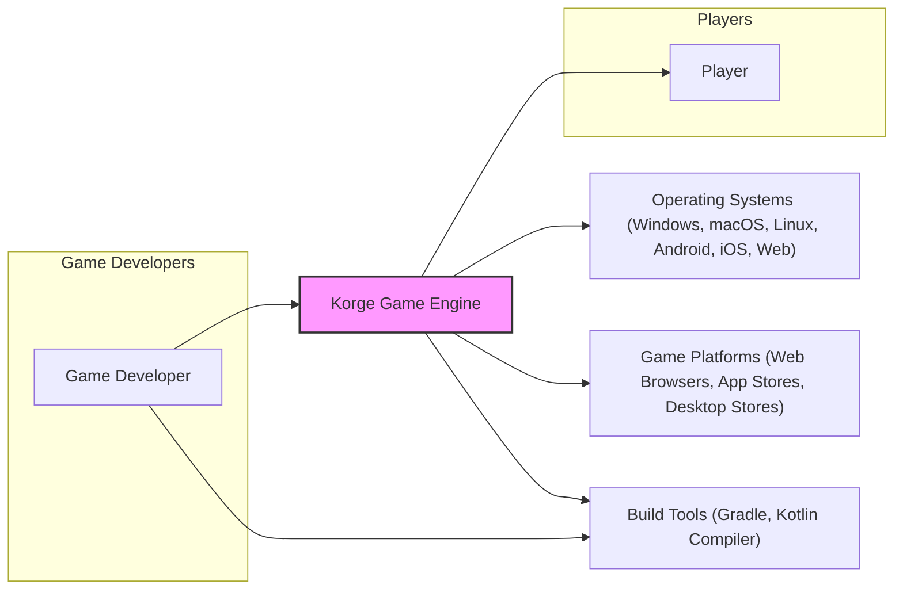
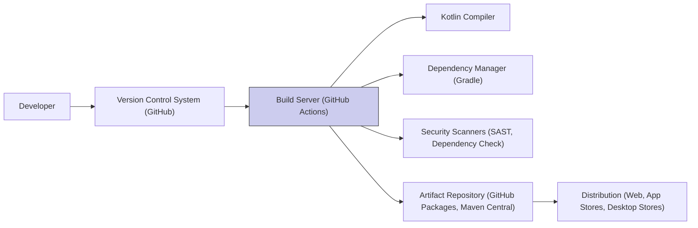

# BUSINESS POSTURE

The Korge project is an open-source multiplatform Kotlin game engine. Its primary business goal is to provide a comprehensive and user-friendly framework for developers to create 2D games that can run on various platforms, including desktop, web, and mobile.

Business Priorities and Goals:
- Provide a robust and feature-rich game engine.
- Support multiple target platforms.
- Maintain an active and supportive community.
- Encourage adoption and usage of the engine.
- Ensure the long-term sustainability of the project (primarily through open-source community contributions and potentially sponsorships).

Business Risks:
- Lack of community adoption and contribution, leading to stagnation.
- Technical debt accumulation and difficulty in maintaining and evolving the engine.
- Security vulnerabilities in the engine or games built with it, damaging reputation and user trust.
- Competition from other game engines.
- Platform compatibility issues and the need for continuous adaptation to platform changes.

# SECURITY POSTURE

Existing Security Controls:
- security control: Open-source development model with community review (location: GitHub repository - implicit through public access and contribution model).
- security control: Dependency management using Gradle and Kotlin libraries (location: build.gradle.kts files - standard Kotlin/Gradle project setup).
- accepted risk: Reliance on community contributions for security vulnerability identification and patching.
- accepted risk: Potential vulnerabilities in third-party Kotlin libraries used by Korge.

Recommended Security Controls:
- security control: Implement automated security scanning (SAST/DAST) in the CI/CD pipeline for Korge engine code.
- security control: Establish a clear process for reporting and handling security vulnerabilities.
- security control: Conduct regular security audits of the Korge engine codebase.
- security control: Provide security guidelines and best practices for game developers using Korge to build games.

Security Requirements:

Authentication:
- Not directly applicable to the core game engine itself. Authentication would be relevant for services built on top of Korge or within games developed using Korge (e.g., user accounts in a multiplayer game).

Authorization:
- Not directly applicable to the core game engine itself. Authorization would be relevant for services built on top of Korge or within games developed using Korge (e.g., access control to game features or administrative panels).

Input Validation:
- security requirement: Korge engine should handle various input types (keyboard, mouse, touch, gamepad) safely and prevent vulnerabilities like buffer overflows or injection attacks when processing input data within games.
- security requirement: Games built with Korge should implement robust input validation to protect against game-specific vulnerabilities (e.g., cheating through manipulated input).

Cryptography:
- security requirement: Korge engine should provide secure cryptographic functionalities for games that require encryption, hashing, or secure random number generation (e.g., for secure storage of game data or network communication in multiplayer games).
- security requirement: Ensure proper usage of cryptographic libraries and avoid common cryptographic pitfalls within the engine and provide guidance for developers.

# DESIGN

## C4 CONTEXT



Context Diagram Elements:

- Name: Korge Game Engine
  - Type: Software System
  - Description: A multiplatform Kotlin game engine for creating 2D games.
  - Responsibilities: Provides APIs and functionalities for game development, including rendering, input handling, audio, scene management, and more. Enables game developers to create games that can run on multiple platforms.
  - Security controls: Input validation within the engine, secure cryptographic functionalities (if provided), open-source code review.

- Name: Game Developer
  - Type: Person
  - Description: Software developers who use Korge to create games.
  - Responsibilities: Develop games using the Korge engine, utilize Korge APIs, and package and distribute games. Responsible for implementing game-specific security measures.
  - Security controls: Secure development practices, input validation in game code, secure handling of user data within games.

- Name: Player
  - Type: Person
  - Description: End-users who play games created with Korge.
  - Responsibilities: Play games, provide feedback, and interact with game content.
  - Security controls: Rely on game developers and platform providers for game security.

- Name: Operating Systems (Windows, macOS, Linux, Android, iOS, Web)
  - Type: Software System
  - Description: Target operating systems where games built with Korge are executed.
  - Responsibilities: Provide runtime environment for games, manage system resources, and handle hardware interactions.
  - Security controls: OS-level security features, sandboxing, and permission management.

- Name: Game Platforms (Web Browsers, App Stores, Desktop Stores)
  - Type: Software System
  - Description: Platforms for distributing and running games built with Korge.
  - Responsibilities: Distribute games to players, provide platform-specific APIs, and manage game installations and updates.
  - Security controls: Platform security measures, app store review processes, and sandboxing.

- Name: Build Tools (Gradle, Kotlin Compiler)
  - Type: Software System
  - Description: Tools used to build and compile the Korge engine and games built with it.
  - Responsibilities: Compile Kotlin code, manage dependencies, and package applications for different platforms.
  - Security controls: Dependency vulnerability scanning, secure build pipelines, and code signing.

## C4 CONTAINER

```mermaid
graph LR
    subgraph "Korge Game Engine"
        Core["Core Engine"]
        Render["Rendering Engine"]
        Input["Input Handling"]
        Audio["Audio Engine"]
        UI["UI System"]
        Tools["Development Tools"]
        subgraph "Libraries"
            KorGE_Core["korge-core"]
            KorGE_Render["korge-render"]
            KorGE_Input["korge-input"]
            KorGE_Audio["korge-audio"]
            KorGE_UI["korge-ui"]
            KorGE_Tools["korge-tools"]
            KorLIBS["korlibs"]
        end
    end
    Developer["Game Developer"]

    Developer --> Core
    Developer --> Render
    Developer --> Input
    Developer --> Audio
    Developer --> UI
    Developer --> Tools

    Core --> KorGE_Core
    Render --> KorGE_Render
    Input --> KorGE_Input
    Audio --> KorGE_Audio
    UI --> KorGE_UI
    Tools --> KorGE_Tools
    KorGE_Core --> KorLIBS
    KorGE_Render --> KorLIBS
    KorGE_Input --> KorLIBS
    KorGE_Audio --> KorLIBS
    KorGE_UI --> KorLIBS
    KorGE_Tools --> KorLIBS

    style "Korge Game Engine" fill:#ccf,stroke:#333,stroke-width:2px
```

Container Diagram Elements:

- Name: Core Engine
  - Type: Software Container
  - Description: The central component of Korge, providing core functionalities like scene management, game loop, resource loading, and general game logic.
  - Responsibilities: Manages the game lifecycle, coordinates other engine components, and provides base APIs for game development.
  - Security controls: Input validation, secure resource handling, and core engine code security.

- Name: Rendering Engine
  - Type: Software Container
  - Description: Handles graphics rendering, including 2D graphics, sprite management, and visual effects.
  - Responsibilities: Renders game visuals efficiently and supports various rendering techniques.
  - Security controls: Secure rendering pipeline, protection against rendering-related vulnerabilities (e.g., shader exploits).

- Name: Input Handling
  - Type: Software Container
  - Description: Manages user input from various devices like keyboard, mouse, touch, and gamepads.
  - Responsibilities: Captures and processes user input events and provides APIs for game developers to access input data.
  - Security controls: Input validation, sanitization of input data to prevent injection attacks.

- Name: Audio Engine
  - Type: Software Container
  - Description: Handles audio playback, sound effects, and music within games.
  - Responsibilities: Plays audio files, manages audio channels, and provides audio effects.
  - Security controls: Secure audio processing, protection against audio-related vulnerabilities (e.g., buffer overflows in audio decoding).

- Name: UI System
  - Type: Software Container
  - Description: Provides components and functionalities for creating user interfaces within games.
  - Responsibilities: Enables developers to build in-game menus, dialogs, and other UI elements.
  - Security controls: Input validation in UI components, protection against UI-related vulnerabilities (e.g., XSS in UI rendering if web-based UI is used).

- Name: Development Tools
  - Type: Software Container
  - Description: Tools and utilities provided to assist game developers in creating and debugging games (e.g., scene editor, debugging tools).
  - Responsibilities: Enhance developer productivity and simplify game development workflows.
  - Security controls: Secure development tools, protection against vulnerabilities in development tools that could compromise game projects.

- Name: korlibs Libraries
  - Type: Software Container
  - Description: A collection of Kotlin libraries that Korge depends on, providing low-level functionalities and utilities.
  - Responsibilities: Provide foundational libraries for Korge, including I/O, networking, and other common functionalities.
  - Security controls: Security of underlying libraries, dependency management, and vulnerability scanning of libraries.

## DEPLOYMENT

Deployment Architecture for Web Games (Example):

```mermaid
graph LR
    subgraph "Player's Browser"
        Browser["Web Browser"]
        Game["Korge Web Game"]
    end
    CDN["Content Delivery Network (CDN)"]
    WebServer["Web Server"]

    Player --> Browser
    Browser --> Game
    Game --> CDN
    CDN --> WebServer

    style "Player's Browser" fill:#eee,stroke:#333,stroke-width:1px
```

Deployment Diagram Elements (Web Deployment):

- Name: Web Browser
  - Type: Software Environment
  - Description: Player's web browser where the Korge web game is executed.
  - Responsibilities: Executes JavaScript/WASM code, renders game graphics, and handles user input.
  - Security controls: Browser security features, sandboxing, and web security policies.

- Name: Korge Web Game
  - Type: Software Component
  - Description: The compiled web version of the game built with Korge (typically JavaScript or WebAssembly).
  - Responsibilities: Game logic execution, rendering, and interaction with the browser environment.
  - Security controls: Input validation, secure game logic, and adherence to web security best practices.

- Name: Content Delivery Network (CDN)
  - Type: Infrastructure
  - Description: A network of servers that caches and delivers game assets (JavaScript, images, audio, etc.) to players.
  - Responsibilities: Provides fast and reliable delivery of game assets, reduces server load, and improves game loading times.
  - Security controls: CDN security features, DDoS protection, and secure content delivery.

- Name: Web Server
  - Type: Infrastructure
  - Description: Server hosting the game files and serving them to players via the CDN.
  - Responsibilities: Stores game files, serves content to the CDN, and potentially handles game backend services (if any).
  - Security controls: Web server security hardening, access control, and regular security updates.

## BUILD



Build Process Diagram Elements:

- Name: Developer
  - Type: Person
  - Description: Game developer writing and committing code.
  - Responsibilities: Writes game code, commits code to VCS, and initiates build process.
  - Security controls: Secure coding practices, code review, and access control to VCS.

- Name: Version Control System (GitHub)
  - Type: Software System
  - Description: Stores and manages the source code of Korge and games.
  - Responsibilities: Version control, code collaboration, and trigger build pipelines.
  - Security controls: Access control, branch protection, and audit logging.

- Name: Build Server (GitHub Actions)
  - Type: Software System
  - Description: Automated build system used to compile, test, and package Korge and games.
  - Responsibilities: Automates build process, runs tests, performs security scans, and publishes build artifacts.
  - Security controls: Secure build environment, access control, and build pipeline security.

- Name: Kotlin Compiler
  - Type: Software Tool
  - Description: Compiles Kotlin code into bytecode or JavaScript/WASM.
  - Responsibilities: Compiles Kotlin source code.
  - Security controls: Compiler security, ensuring no vulnerabilities in the compiler itself.

- Name: Dependency Manager (Gradle)
  - Type: Software Tool
  - Description: Manages project dependencies and build configurations.
  - Responsibilities: Resolves and downloads dependencies, manages build scripts.
  - Security controls: Dependency vulnerability scanning, secure dependency resolution, and integrity checks.

- Name: Security Scanners (SAST, Dependency Check)
  - Type: Software Tool
  - Description: Tools used to perform static analysis security testing (SAST) and dependency vulnerability checks.
  - Responsibilities: Identifies potential security vulnerabilities in code and dependencies during the build process.
  - Security controls: Configuration and maintenance of security scanners, integration into build pipeline.

- Name: Artifact Repository (GitHub Packages, Maven Central)
  - Type: Software System
  - Description: Stores and manages build artifacts (libraries, executables, web assets).
  - Responsibilities: Stores and distributes build artifacts, manages versions, and provides access control.
  - Security controls: Access control, artifact integrity checks, and vulnerability scanning of published artifacts.

- Name: Distribution (Web, App Stores, Desktop Stores)
  - Type: Process
  - Description: Process of distributing games to players through various channels.
  - Responsibilities: Packaging and publishing games to target platforms.
  - Security controls: Code signing, platform-specific security requirements, and app store review processes.

# RISK ASSESSMENT

Critical Business Processes:
- Core engine development and maintenance: Ensuring the engine remains functional, secure, and feature-rich is critical for its adoption and usage.
- Community engagement and support: A healthy community is vital for the long-term success of an open-source project like Korge.
- Build and release process: Secure and reliable build and release processes are essential to deliver updates and prevent supply chain attacks.

Data Sensitivity:
- Korge engine source code: High sensitivity. Compromise could lead to vulnerabilities, intellectual property theft, and reputational damage.
- Build artifacts (compiled engine, libraries): Medium sensitivity. Compromise could lead to distribution of malware or vulnerable versions of the engine.
- Community data (forum posts, issue reports): Low sensitivity. Publicly available information, but data breaches could impact user trust.
- Game developer data (if any, e.g., in a hypothetical Korge game store or service): Medium to High sensitivity depending on the data type (e.g., account information, payment details).

# QUESTIONS & ASSUMPTIONS

Questions:
- Are there any specific security incidents or concerns that are driving this design document request?
- What is the target risk appetite for this project? Is it for a startup or a more risk-averse organization?
- Are there any specific compliance requirements that need to be considered (e.g., GDPR, HIPAA, PCI DSS)?
- Are there any plans to monetize Korge or build commercial services around it?
- What is the expected scale and usage of Korge and games built with it?

Assumptions:
- Korge is primarily an open-source project with a focus on community contribution and adoption.
- Security is important for the project's reputation and the trust of game developers and players.
- The primary security concerns are related to software vulnerabilities in the engine and supply chain security in the build process.
- The deployment model is flexible, and games built with Korge can be deployed on various platforms, including web, desktop, and mobile.
- The build process is automated using CI/CD pipelines, likely GitHub Actions, given it's a GitHub repository.