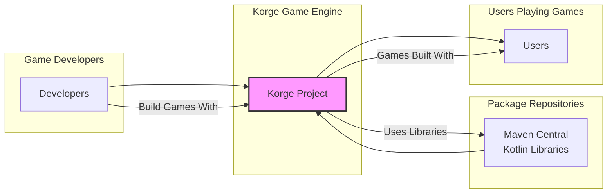

# BUSINESS POSTURE

- Business Priorities and Goals:
 - Provide a cross-platform game development engine: Korge aims to provide a comprehensive and user-friendly engine for creating games that can run on multiple platforms (desktop, web, mobile).
 - Foster a strong community: As an open-source project, building a vibrant community of developers and users is crucial for its long-term success, contribution, and adoption.
 - Offer a feature-rich and performant engine: Korge strives to provide a wide range of features and maintain high performance to meet the needs of game developers.
 - Promote Kotlin Multiplatform: Korge serves as a showcase for Kotlin Multiplatform capabilities in game development, encouraging its adoption.

- Business Risks:
 - Limited adoption: If the engine fails to attract a significant user base, its long-term viability and community support may be at risk.
 - Security vulnerabilities in the engine: Security flaws in Korge could lead to vulnerabilities in games built with it, damaging the reputation of both Korge and the developers using it.
 - Lack of community contributions: Insufficient contributions from the community could slow down development, feature additions, and bug fixes.
 - Dependency on core developers: Over-reliance on a small group of core developers could create a bottleneck and risk project continuity if they become unavailable.

# SECURITY POSTURE

- Existing Security Controls:
 - security control: GitHub repository with public visibility. Implemented in: GitHub platform.
 - security control: Issue tracking on GitHub. Implemented in: GitHub platform.
 - security control: Pull Request review process. Implemented in: Project's development workflow.
 - accepted risk: Reliance on community contributions for security vulnerability identification and patching.
 - accepted risk: Limited formal security audits or penetration testing.

- Recommended Security Controls:
 - security control: Implement automated security scanning tools (SAST/DAST) in the CI/CD pipeline to detect potential vulnerabilities early in the development process.
 - security control: Establish a clear vulnerability disclosure policy to guide security researchers and users on how to report security issues responsibly.
 - security control: Conduct periodic security code reviews, focusing on critical components and areas prone to vulnerabilities.
 - security control: Provide security guidelines and best practices for developers using Korge to build games, addressing common security pitfalls in game development.

- Security Requirements:
 - Authentication:
  - Not applicable to the Korge engine itself. Authentication might be relevant for games built using Korge if they incorporate online features, but this is outside the scope of the engine's security requirements.
 - Authorization:
  - Not applicable to the Korge engine itself. Authorization concerns are relevant to games built with Korge, depending on their features.
 - Input Validation:
  - security requirement: Korge engine should handle various input types (keyboard, mouse, touch, gamepad) securely, preventing crashes or unexpected behavior due to malformed or malicious input. Input validation should be implemented in: Input handling modules of Korge engine.
  - security requirement: When loading external resources (images, audio, fonts, game assets), Korge should validate file formats and content to prevent vulnerabilities like path traversal or arbitrary code execution. Input validation should be implemented in: Resource loading modules of Korge engine.
 - Cryptography:
  - security requirement: If Korge provides any cryptographic functionalities (e.g., for secure networking or data storage in games), these should be implemented using well-vetted and secure cryptographic libraries and algorithms. Cryptography should be implemented in: Networking and data storage modules of Korge engine if applicable.

# DESIGN

## C4 CONTEXT



- Context Diagram Elements:
 - - Name: Developers
   - Type: Person
   - Description: Game developers who use Korge to create games.
   - Responsibilities: Develop games using the Korge engine, contribute to the Korge project.
   - Security controls: Secure development practices, code review contributions.
 - - Name: Maven Central / Kotlin Libraries
   - Type: External System
   - Description: Repositories providing Kotlin libraries and dependencies used by Korge.
   - Responsibilities: Provide necessary libraries for Korge to function.
   - Security controls: Library dependency management, vulnerability scanning of dependencies (external to Korge project).
 - - Name: Users
   - Type: Person
   - Description: Players who play games built using the Korge engine.
   - Responsibilities: Play games.
   - Security controls: Rely on game developers and Korge engine security for a safe gaming experience.
 - - Name: Korge Project
   - Type: Software System
   - Description: The Korge Kotlin Multiplatform Game Engine.
   - Responsibilities: Provide a platform for game development, handle game logic, rendering, input, and other game engine functionalities.
   - Security controls: Secure coding practices, input validation, dependency management, vulnerability management, build process security.

## C4 CONTAINER

```mermaid
flowchart LR
    subgraph "Korge Game Engine"
        subgraph "Core Engine"
            CE[Core Engine Container\nKotlin]
        end
        subgraph "Graphics Engine"
            GE[Graphics Engine Container\nKotlin/OpenGL/WebGL/AGSL]
        end
        subgraph "Audio Engine"
            AE[Audio Engine Container\nKotlin/OpenAL/WebAudio]
        end
        subgraph "Input Handling"
            IH[Input Handling Container\nKotlin]
        end
        subgraph "Resource Management"
            RM[Resource Management Container\nKotlin]
        end
        subgraph "Tools & Libraries"
            TL[Tools & Libraries Container\nKotlin]
        end
    end
    CE --> GE
    CE --> AE
    CE --> IH
    CE --> RM
    TL --> CE
    style "Korge Game Engine" fill:#ccf,stroke:#333,stroke-width:2px
```

- Container Diagram Elements:
 - - Name: Core Engine Container
   - Type: Container - Kotlin Application
   - Description: The central part of Korge, responsible for game loop management, scene management, entity-component system, and overall engine orchestration.
   - Responsibilities: Game logic execution, scene management, event handling, integration of other engine components.
   - Security controls: Secure coding practices, input validation for internal APIs, resource management security.
 - - Name: Graphics Engine Container
   - Type: Container - Kotlin Application (using platform-specific graphics APIs)
   - Description: Handles rendering of 2D and 3D graphics, using OpenGL, WebGL, AGSL, or other platform-specific graphics APIs.
   - Responsibilities: Rendering game scenes, managing shaders, textures, and other graphical resources.
   - Security controls: Secure handling of graphics APIs, prevention of shader vulnerabilities, resource management security for graphical assets.
 - - Name: Audio Engine Container
   - Type: Container - Kotlin Application (using platform-specific audio APIs)
   - Description: Manages audio playback, sound effects, and music, using OpenAL, WebAudio, or other platform-specific audio APIs.
   - Responsibilities: Playing audio, managing audio resources, audio mixing and effects.
   - Security controls: Secure handling of audio APIs, prevention of audio processing vulnerabilities, resource management security for audio assets.
 - - Name: Input Handling Container
   - Type: Container - Kotlin Application
   - Description: Captures and processes user input from various sources like keyboard, mouse, touch, and gamepads.
   - Responsibilities: Input event processing, input mapping, providing input data to the Core Engine.
   - Security controls: Input validation, sanitization of input data to prevent injection attacks or unexpected behavior.
 - - Name: Resource Management Container
   - Type: Container - Kotlin Application
   - Description: Manages loading, caching, and unloading of game resources like images, audio, fonts, and other assets.
   - Responsibilities: Resource loading, caching, asset management, providing resources to other engine components.
   - Security controls: Secure resource loading, validation of resource formats, prevention of path traversal vulnerabilities, protection against malicious assets.
 - - Name: Tools & Libraries Container
   - Type: Container - Kotlin Libraries
   - Description: Collection of utility libraries and tools provided with Korge, such as UI components, math libraries, and helper functions.
   - Responsibilities: Provide reusable components and utilities for game development.
   - Security controls: Secure coding practices for library components, input validation in utility functions.

## DEPLOYMENT

- Deployment Options:
 - Desktop Deployment (Windows, macOS, Linux): Games built with Korge can be packaged as standalone executables for desktop platforms.
 - Web Deployment (HTML5/WebGL): Games can be compiled to JavaScript and deployed on web browsers.
 - Mobile Deployment (Android, iOS): Games can be packaged as mobile applications for Android and iOS devices.

- Detailed Deployment (Web Deployment - HTML5/WebGL):

```mermaid
flowchart LR
    subgraph "User Browser"
        UB[User Browser\n(Chrome, Firefox, Safari)]
    end
    subgraph "Web Server"
        WS[Web Server\n(Nginx, Apache)]
        subgraph "Korge Game Application"
            KG[Korge Game\n(JavaScript, WebGL Assets)]
        end
        WS --> KG
    end
    UB -- "HTTP/HTTPS Request" --> WS
    WS -- "HTTP/HTTPS Response\n(Game Files)" --> UB
    UB -- "Runs Game" --> KG
    style "Web Server" fill:#efe,stroke:#333,stroke-width:2px
```

- Deployment Diagram Elements (Web Deployment):
 - - Name: User Browser
   - Type: Environment - Web Browser
   - Description: User's web browser (e.g., Chrome, Firefox, Safari) where the Korge game is executed.
   - Responsibilities: Executes JavaScript code, renders WebGL graphics, plays audio, handles user input within the browser environment.
   - Security controls: Browser security features (sandboxing, content security policy), user-side security practices (keeping browser updated).
 - - Name: Web Server
   - Type: Environment - Web Server (Nginx, Apache)
   - Description: Web server hosting the Korge game files (HTML, JavaScript, WebGL assets).
   - Responsibilities: Serving game files to user browsers, handling HTTP/HTTPS requests.
   - Security controls: Web server security configuration (HTTPS, access controls, security updates), secure file storage, protection against web attacks (e.g., DDoS, XSS - though XSS risk is lower for static game files).
 - - Name: Korge Game Application
   - Type: Software - JavaScript/WebGL Application
   - Description: The compiled Korge game, consisting of JavaScript code and WebGL assets, running within the user's browser.
   - Responsibilities: Game logic execution, rendering, input handling within the browser environment.
   - Security controls: Security controls inherited from Korge engine and game development practices, browser security sandbox.

## BUILD

```mermaid
flowchart LR
    subgraph "Developer Workstation"
        DEV[Developer] --> CODE[Code Changes\n(Kotlin Source)]
    end
    subgraph "GitHub Repository"
        CODE --> VCS[Version Control\n(GitHub)]
    end
    subgraph "CI/CD System\n(GitHub Actions)"
        VCS --> BUILD_TRIGGER[Build Trigger\n(Push/PR)]
        BUILD_TRIGGER --> BUILD_AUTOMATION[Build Automation\n(Gradle Build Script)]
        BUILD_AUTOMATION --> COMPILE[Compile Kotlin Code]
        COMPILE --> TEST[Unit & Integration Tests]
        TEST --> SAST[SAST Scanning]
        SAST --> ARTIFACTS[Build Artifacts\n(JARs, JS, Native Binaries)]
        ARTIFACTS --> PUBLISH[Publish Artifacts\n(Maven Central, GitHub Releases, Web Server)]
    end
    style "CI/CD System\n(GitHub Actions)" fill:#cce,stroke:#333,stroke-width:2px
```

- Build Process Elements:
 - - Name: Developer
   - Type: Person
   - Description: Software developer working on the Korge project.
   - Responsibilities: Writing code, committing changes, creating pull requests.
   - Security controls: Secure coding practices, workstation security, code review participation.
 - - Name: Code Changes
   - Type: Data - Kotlin Source Code
   - Description: Modifications to the Korge codebase written in Kotlin.
   - Responsibilities: Representing the source code of the project.
   - Security controls: Version control, code review.
 - - Name: Version Control (GitHub)
   - Type: System - GitHub Repository
   - Description: GitHub repository hosting the Korge source code and managing version history.
   - Responsibilities: Source code management, access control, change tracking.
   - Security controls: GitHub access controls, branch protection, audit logs.
 - - Name: Build Trigger (Push/PR)
   - Type: Process - CI Trigger
   - Description: Automated trigger in the CI/CD system that starts the build process upon code push or pull request.
   - Responsibilities: Initiating the build pipeline.
   - Security controls: Access control to CI/CD configuration, secure webhook configuration.
 - - Name: Build Automation (Gradle Build Script)
   - Type: Process - Build Tool
   - Description: Gradle build script defining the build process for Korge.
   - Responsibilities: Automating compilation, testing, packaging, and publishing of Korge.
   - Security controls: Secure build script management, dependency management, build environment security.
 - - Name: Compile Kotlin Code
   - Type: Process - Compilation
   - Description: Compilation of Kotlin source code into bytecode or native code.
   - Responsibilities: Translating source code into executable formats.
   - Security controls: Compiler security (less relevant in this context), secure build environment.
 - - Name: Unit & Integration Tests
   - Type: Process - Testing
   - Description: Automated unit and integration tests to verify the functionality and stability of Korge.
   - Responsibilities: Ensuring code quality and detecting bugs.
   - Security controls: Secure test environment, test case coverage for security-relevant functionalities.
 - - Name: SAST Scanning
   - Type: Process - Security Analysis
   - Description: Static Application Security Testing (SAST) to automatically identify potential security vulnerabilities in the source code.
   - Responsibilities: Early detection of security flaws in the code.
   - Security controls: SAST tool configuration, vulnerability reporting and remediation process.
 - - Name: Build Artifacts
   - Type: Data - JARs, JS, Native Binaries
   - Description: Compiled and packaged outputs of the build process, including JAR files, JavaScript bundles, and native binaries.
   - Responsibilities: Distributable components of Korge.
   - Security controls: Artifact signing, integrity checks, secure storage of artifacts.
 - - Name: Publish Artifacts
   - Type: Process - Release Management
   - Description: Publishing build artifacts to repositories like Maven Central, GitHub Releases, or web servers for distribution.
   - Responsibilities: Making Korge artifacts available to users and developers.
   - Security controls: Secure publishing process, access control to publishing destinations, integrity of published artifacts (e.g., using signatures).

# RISK ASSESSMENT

- Critical Business Processes:
 - Maintaining the integrity and availability of the Korge game engine source code and build artifacts.
 - Ensuring the trustworthiness and security of the Korge engine for game developers and end-users.
 - Supporting the Korge community and fostering its growth.

- Data to Protect and Sensitivity:
 - Source Code: Highly sensitive. Intellectual property, vulnerabilities in source code can lead to widespread security issues in games built with Korge. Confidentiality and Integrity are critical.
 - Build Artifacts (JARs, JS, Native Binaries): Sensitive. Integrity is critical to ensure users download and use genuine, untampered engine components. Availability is important for users to access the engine.
 - Developer Credentials and Access Keys: Highly sensitive. Confidentiality and Integrity are critical to prevent unauthorized access to the codebase, build system, and publishing infrastructure.
 - Community Data (GitHub Issues, Discussions): Low to Medium sensitivity. Availability and Integrity are important for community engagement and support.

# QUESTIONS & ASSUMPTIONS

- Questions:
 - Are there any specific security incidents or vulnerabilities that Korge has experienced in the past?
 - Is there a formal security team or individual responsible for security within the Korge project?
 - Are there any plans for formal security audits or penetration testing in the future?
 - What is the process for handling vulnerability reports from the community?
 - Are there any specific security requirements driven by the target platforms (desktop, web, mobile)?

- Assumptions:
 - Korge is primarily used for offline or client-side game development, and does not inherently involve server-side components managed by the Korge project itself.
 - Security is considered important for the Korge project, but resources for dedicated security activities might be limited due to its open-source nature.
 - The primary users of Korge are game developers, and the main security concern is to provide a secure and reliable engine for them to build games.
 - The project relies heavily on community contributions for development and potentially for security vulnerability identification.