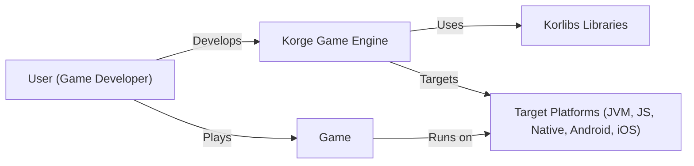
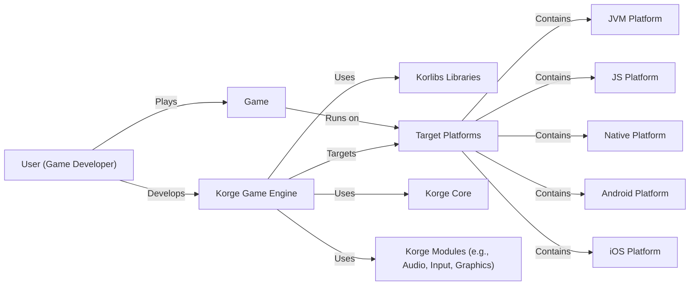
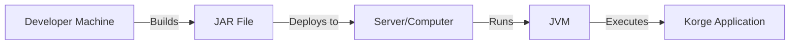
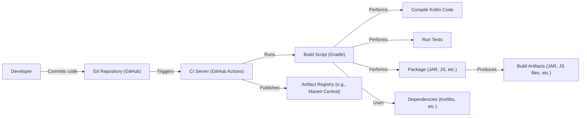

# BUSINESS POSTURE

Business Priorities and Goals:

*   Provide a modern, easy-to-use, and performant game development engine for Kotlin.
*   Support multiple platforms (JVM, JS, Native, Android, iOS) from a single codebase.
*   Offer a comprehensive set of tools and libraries for 2D game development.
*   Attract developers to the Kotlin ecosystem for game development.
*   Foster a vibrant community around the engine.
*   Potentially monetize through premium features, support, or services in the future (though this isn't explicitly stated, it's a common goal for open-source projects).

Most Important Business Risks:

*   Failure to attract and retain users (developers) due to competition, lack of features, or poor performance.
*   Inability to maintain the project long-term due to lack of resources (time, funding, contributors).
*   Security vulnerabilities that could compromise user projects or data.
*   Licensing issues or legal challenges.
*   Platform compatibility problems that limit the reach of the engine.
*   Negative community perception or lack of community engagement.

# SECURITY POSTURE

Existing Security Controls:

*   security control: The project is open-source, allowing for community review and contributions to security. (Described in the GitHub repository)
*   security control: Use of Kotlin, a language designed with null safety and other security features in mind. (Described in the GitHub repository)
*   security control: Dependency management using Gradle, which allows for tracking and updating dependencies. (Described in build.gradle.kts files)
*   security control: Some use of automated testing, which can help identify potential vulnerabilities. (Described in the GitHub repository, test directories)

Accepted Risks:

*   accepted risk: Reliance on third-party libraries, which may introduce their own vulnerabilities.
*   accepted risk: The project is still under development, and some security features may not be fully implemented.
*   accepted risk: Limited formal security review process.
*   accepted risk: No dedicated security team.

Recommended Security Controls:

*   security control: Implement Static Application Security Testing (SAST) tools in the CI/CD pipeline.
*   security control: Implement Dynamic Application Security Testing (DAST) for web-based components (if any).
*   security control: Conduct regular security audits and penetration testing.
*   security control: Establish a clear vulnerability disclosure and response process.
*   security control: Implement Software Composition Analysis (SCA) to identify and manage vulnerabilities in third-party dependencies.
*   security control: Provide security training for contributors.
*   security control: Use a secrets management solution to protect sensitive information (API keys, etc.).

Security Requirements:

*   Authentication:
    *   Not directly applicable to the game engine itself, but relevant for any associated services (e.g., forums, asset stores).
    *   If user accounts are used, strong password policies and secure storage of credentials (hashing, salting) are required.
*   Authorization:
    *   Not directly applicable to the core engine, but relevant for any associated services or multi-user features.
    *   Access control mechanisms should be implemented to ensure users can only access resources they are permitted to.
*   Input Validation:
    *   Crucial for preventing injection attacks and other vulnerabilities.
    *   All user-provided input (e.g., game assets, configuration files, network data) must be validated and sanitized.
    *   Use a whitelist approach whenever possible, only allowing known-good input.
*   Cryptography:
    *   If sensitive data is stored or transmitted, appropriate cryptographic techniques (encryption, hashing) must be used.
    *   Use well-established and vetted cryptographic libraries.
    *   Proper key management is essential.

# DESIGN

## C4 CONTEXT

Element Descriptions:

*   Element:
    *   Name: User (Game Developer)
    *   Type: Person
    *   Description: A developer who uses Korge to create games.
    *   Responsibilities: Writes game logic, designs game assets, configures the game engine, builds and deploys the game.
    *   Security controls: Follows secure coding practices, uses strong passwords for any associated accounts.

*   Element:
    *   Name: Korge Game Engine
    *   Type: Software System
    *   Description: The core game engine, providing APIs and tools for game development.
    *   Responsibilities: Rendering, input handling, audio playback, physics simulation, asset management, scene management.
    *   Security controls: Input validation, secure handling of game assets, safe interaction with underlying platforms.

*   Element:
    *   Name: Korlibs Libraries
    *   Type: Software System
    *   Description: A set of Kotlin libraries used by Korge, providing low-level functionalities.
    *   Responsibilities: Provide platform-specific implementations, utility functions, and optimized code.
    *   Security controls: Secure coding practices, regular updates to address vulnerabilities.

*   Element:
    *   Name: Target Platforms (JVM, JS, Native, Android, iOS)
    *   Type: Software System
    *   Description: The platforms that Korge games can run on.
    *   Responsibilities: Provide the runtime environment for the game.
    *   Security controls: Platform-specific security mechanisms, regular security updates.

*   Element:
    *   Name: Game
    *   Type: Software System
    *   Description: The final game produced by the developer using Korge.
    *   Responsibilities: Game-specific logic and functionality.
    *   Security controls: Depends on the developer's implementation, but should follow secure coding practices.

## C4 CONTAINER

Element Descriptions:

*   Element:
    *   Name: Korge Core
    *   Type: Container
    *   Description: The core functionality of the Korge engine.
    *   Responsibilities: Scene management, basic rendering, core utilities.
    *   Security controls: Input validation, secure handling of core resources.

*   Element:
    *   Name: Korge Modules (e.g., Audio, Input, Graphics)
    *   Type: Container
    *   Description: Modules providing specific functionalities within Korge.
    *   Responsibilities: Handle audio playback, process user input, manage graphics rendering.
    *   Security controls: Secure handling of module-specific resources, input validation for input module.

*   Element:
    *   Name: JVM Platform
    *   Type: Container
    *   Description: The Java Virtual Machine platform.
    *   Responsibilities: Running Korge games compiled for the JVM.
    *   Security controls: JVM security features, sandboxing (if applicable).

*   Element:
    *   Name: JS Platform
    *   Type: Container
    *   Description: The JavaScript platform (browser or Node.js).
    *   Responsibilities: Running Korge games compiled for JavaScript.
    *   Security controls: Browser security features, sandboxing.

*   Element:
    *   Name: Native Platform
    *   Type: Container
    *   Description: Native platforms (Windows, macOS, Linux).
    *   Responsibilities: Running Korge games compiled to native code.
    *   Security controls: Operating system security features.

*   Element:
    *   Name: Android Platform
    *   Type: Container
    *   Description: The Android platform.
    *   Responsibilities: Running Korge games on Android devices.
    *   Security controls: Android security model, permissions system.

*   Element:
    *   Name: iOS Platform
    *   Type: Container
    *   Description: The iOS platform.
    *   Responsibilities: Running Korge games on iOS devices.
    *   Security controls: iOS security model, sandboxing.

*   Element:
    *   Name: User (Game Developer)
    *   Type: Person
    *   Description: A developer who uses Korge to create games.
    *   Responsibilities: Writes game logic, designs game assets, configures the game engine, builds and deploys the game.
    *   Security controls: Follows secure coding practices, uses strong passwords for any associated accounts.

*   Element:
    *   Name: Korge Game Engine
    *   Type: Software System
    *   Description: The core game engine, providing APIs and tools for game development.
    *   Responsibilities: Rendering, input handling, audio playback, physics simulation, asset management, scene management.
    *   Security controls: Input validation, secure handling of game assets, safe interaction with underlying platforms.

*   Element:
    *   Name: Korlibs Libraries
    *   Type: Software System
    *   Description: A set of Kotlin libraries used by Korge, providing low-level functionalities.
    *   Responsibilities: Provide platform-specific implementations, utility functions, and optimized code.
    *   Security controls: Secure coding practices, regular updates to address vulnerabilities.

*   Element:
    *   Name: Target Platforms
    *   Type: Software System
    *   Description: The platforms that Korge games can run on.
    *   Responsibilities: Provide the runtime environment for the game.
    *   Security controls: Platform-specific security mechanisms, regular security updates.

*   Element:
    *   Name: Game
    *   Type: Software System
    *   Description: The final game produced by the developer using Korge.
    *   Responsibilities: Game-specific logic and functionality.
    *   Security controls: Depends on the developer's implementation, but should follow secure coding practices.

## DEPLOYMENT

Possible Deployment Solutions:

1.  **JVM:** Deploy as a standalone JAR file, executable with `java -jar`.
2.  **JS:** Deploy as a set of JavaScript files, HTML, and assets, served via a web server.
3.  **Native:** Deploy as a native executable for the target platform (e.g., .exe for Windows, .app for macOS).
4.  **Android:** Deploy as an APK file, installable on Android devices.
5.  **iOS:** Deploy as an IPA file, installable on iOS devices (requires Apple Developer account).

Chosen Solution (JVM Example):

Element Descriptions:

*   Element:
    *   Name: Developer Machine
    *   Type: Infrastructure Node
    *   Description: The machine used by the developer to build the game.
    *   Responsibilities: Compiling code, packaging assets, creating the deployment artifact.
    *   Security controls: Secure development environment, up-to-date software.

*   Element:
    *   Name: JAR File
    *   Type: Artifact
    *   Description: The Java Archive file containing the compiled game code and resources.
    *   Responsibilities: Contains all necessary components to run the game.
    *   Security controls: Code signing (optional), integrity checks.

*   Element:
    *   Name: Server/Computer
    *   Type: Infrastructure Node
    *   Description: The machine where the game is deployed and run. Could be a server or a user's computer.
    *   Responsibilities: Providing the runtime environment for the JVM.
    *   Security controls: Operating system security, firewall, antivirus.

*   Element:
    *   Name: JVM
    *   Type: Runtime Environment
    *   Description: The Java Virtual Machine.
    *   Responsibilities: Executing the Java bytecode in the JAR file.
    *   Security controls: JVM security manager, sandboxing (if enabled).

*   Element:
    *   Name: Korge Application
    *   Type: Software Component
    *   Description: The running instance of the Korge game.
    *   Responsibilities: Game logic, rendering, input handling, etc.
    *   Security controls: In-game security measures implemented by the developer.

## BUILD

Build Process Description:

1.  **Developer Commits Code:** The developer writes code and commits it to the Git repository (GitHub).
2.  **CI Trigger:** The commit triggers a build on the CI server (GitHub Actions, inferred from the repository structure).
3.  **Build Script Execution:** The CI server runs the Gradle build script (build.gradle.kts).
4.  **Dependency Resolution:** Gradle resolves and downloads dependencies (Korlibs, other libraries).
5.  **Compilation:** The Kotlin code is compiled for the target platforms (JVM, JS, Native, etc.).
6.  **Testing:** Unit tests and other tests are executed.
7.  **Packaging:** The compiled code and resources are packaged into the appropriate format (JAR for JVM, JS files for JS, etc.).
8.  **Artifact Creation:** Build artifacts are created (JAR files, JS files, native executables, etc.).
9. **Publish Artifacts:** Build artifacts might be published to the registry.

Security Controls in Build Process:

*   security control: **Dependency Management (Gradle):** Tracks and manages dependencies, allowing for vulnerability scanning.
*   security control: **Automated Testing:** Includes unit tests and potentially other types of tests to identify bugs and vulnerabilities.
*   security control: **CI/CD (GitHub Actions):** Automates the build process, ensuring consistency and reducing manual errors.
*   security control: **(Recommended) SAST:** Integrate Static Application Security Testing tools into the build process to scan for vulnerabilities in the code.
*   security control: **(Recommended) SCA:** Integrate Software Composition Analysis tools to identify vulnerabilities in dependencies.

# RISK ASSESSMENT

Critical Business Processes to Protect:

*   **Game Development Workflow:** Ensuring developers can efficiently create and deploy games using Korge.
*   **Community Engagement:** Maintaining a healthy and active community around the engine.
*   **Codebase Integrity:** Protecting the Korge codebase from malicious modifications or unauthorized access.
*   **Reputation:** Maintaining a positive reputation for Korge as a secure and reliable game engine.

Data to Protect and Sensitivity:

*   **Source Code (Public):** While the source code is public, protecting its integrity is crucial to prevent malicious modifications. Sensitivity: Medium (due to impact on reputation and user trust).
*   **User-Generated Content (Potentially Sensitive):** If Korge is used to create games that handle user data (e.g., high scores, player profiles), this data needs to be protected. Sensitivity: Varies depending on the type of data.
*   **Build Artifacts (Public):** Similar to source code, ensuring the integrity of build artifacts is important. Sensitivity: Medium.
*   **API Keys/Secrets (If Applicable):** Any API keys or secrets used by Korge or associated services must be protected. Sensitivity: High.

# QUESTIONS & ASSUMPTIONS

Questions:

*   Are there any plans for a dedicated security review or audit of the Korge codebase?
*   What is the process for handling reported security vulnerabilities?
*   Are there any specific security concerns related to the multi-platform nature of Korge?
*   Are there any plans to monetize Korge, and if so, how will this impact security considerations?
*   What level of security testing is currently performed (beyond unit tests)?
*   Is there any sensitive data handled by the engine itself (e.g., telemetry, crash reports)?
*   Are there any plans to support user authentication or authorization within Korge or related services?

Assumptions:

*   BUSINESS POSTURE: The primary goal is to provide a free and open-source game engine. Monetization is not a primary concern at this stage.
*   SECURITY POSTURE: There is no dedicated security team, and security relies heavily on community contributions and best practices.
*   DESIGN: The design is primarily focused on functionality and ease of use, with security considerations being addressed as needed. The project is actively developed, and the design may evolve. The build process relies on Gradle and GitHub Actions.