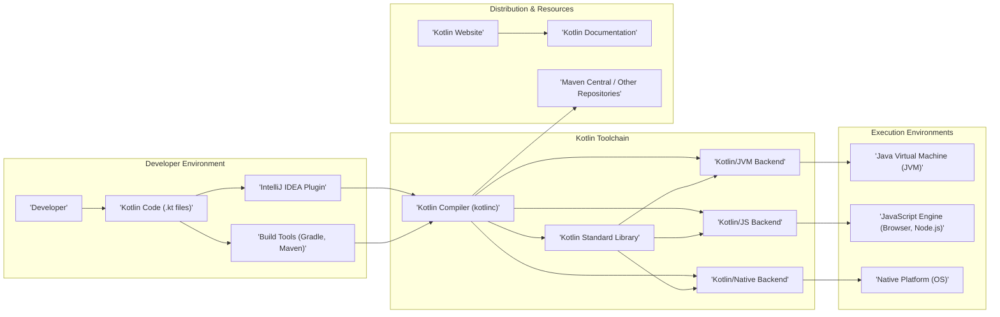
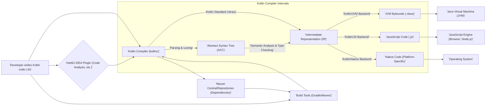

# Project Design Document: Kotlin Programming Language

**Version:** 1.1
**Date:** October 26, 2023
**Prepared By:** AI Software Architect

## 1. Introduction

This document provides an enhanced architectural design of the Kotlin programming language project, as represented by the codebase at [https://github.com/JetBrains/kotlin](https://github.com/JetBrains/kotlin). Building upon the previous version, this document aims to provide a more detailed and nuanced understanding of the project's components, their interactions, and data flow, making it even more suitable for subsequent threat modeling activities.

## 2. Goals

*   Provide a comprehensive and detailed overview of the Kotlin project's architecture.
*   Clearly identify key components, their specific responsibilities, and internal workings.
*   Describe the data flow within the system, including various scenarios and data transformations.
*   Highlight potential areas of interest for security analysis with more specific examples.
*   Serve as a robust and informative foundation for future threat modeling exercises.

## 3. Scope

This document focuses on the core components of the Kotlin project as represented in the GitHub repository. This includes:

*   The Kotlin compiler (`kotlinc`), including its frontend and backend stages.
*   The Kotlin standard library, including its multiplatform aspects.
*   The Kotlin/JVM backend and its interaction with the JVM.
*   The Kotlin/JS backend and its output for different JavaScript environments.
*   The Kotlin/Native backend and its compilation to native code.
*   The IntelliJ IDEA plugin for Kotlin, focusing on its interaction with the compiler.
*   Build tools integrations (e.g., Gradle, Maven) and their role in the build process.
*   The Kotlin website and documentation infrastructure.

This document does not cover:

*   Specific applications built using Kotlin.
*   Third-party libraries and frameworks used with Kotlin in detail.
*   The fine-grained implementation details of every compiler optimization pass.
*   The specific infrastructure used to host the Kotlin website.

## 4. High-Level Architecture

The Kotlin project comprises several interconnected components that enable the development and execution of Kotlin code across various platforms. The following diagram illustrates the high-level architecture:

## 5. Component Details

This section provides a more detailed description of the key components, elaborating on their functionalities and internal aspects.

### 5.1. Kotlin Compiler (`kotlinc`)

*   **Description:** The central component responsible for transforming Kotlin source code into executable code for different target platforms. It's a complex piece of software with distinct phases.
*   **Responsibilities:**
    *   **Frontend:**
        *   Lexing and parsing Kotlin source code into an Abstract Syntax Tree (AST).
        *   Performing semantic analysis, including type checking, symbol resolution, and ensuring language rules are followed.
        *   Generating an Intermediate Representation (IR).
    *   **Backend (Platform-Specific):**
        *   **Kotlin/JVM:** Translating Kotlin IR into Java bytecode (`.class` files). This involves tasks like generating method signatures, handling annotations, and ensuring compatibility with the JVM.
        *   **Kotlin/JS:** Translating Kotlin IR into JavaScript code. This includes managing interoperability with JavaScript libraries and generating different module formats.
        *   **Kotlin/Native:** Translating Kotlin IR into platform-specific machine code using LLVM. This involves memory management considerations and interoperability with native libraries.
    *   Providing a command-line interface for developers to invoke the compiler with various options.
*   **Key Technologies:** Primarily Kotlin, potentially some Java for historical or specific parts, LLVM for Kotlin/Native.

### 5.2. Kotlin Standard Library

*   **Description:** A foundational set of classes and functions that provide essential building blocks for Kotlin development, designed to be multiplatform where possible.
*   **Responsibilities:**
    *   Providing core data structures like `List`, `Set`, `Map`, and various collection utilities.
    *   Offering utility functions for common tasks such as string manipulation, file I/O, and mathematical operations.
    *   Supporting coroutines for asynchronous programming, enabling concurrent and non-blocking operations.
    *   Defining platform-agnostic APIs and providing platform-specific implementations through the `expect`/`actual` mechanism for multiplatform projects.
    *   Providing reflection capabilities for runtime inspection of code.
*   **Key Technologies:** Kotlin.

### 5.3. Kotlin/JVM Backend

*   **Description:** The part of the Kotlin compiler specifically responsible for generating Java bytecode that can be executed on the Java Virtual Machine (JVM).
*   **Responsibilities:**
    *   Translating the platform-independent Kotlin IR into JVM-specific bytecode instructions.
    *   Ensuring seamless interoperability with existing Java code and libraries. This includes handling Java annotations, generics, and reflection.
    *   Generating bytecode that adheres to the JVM specification for optimal performance and compatibility.
    *   Supporting features like inline classes and value classes on the JVM.
*   **Key Technologies:** Kotlin.

### 5.4. Kotlin/JS Backend

*   **Description:** The component of the Kotlin compiler that translates Kotlin code into JavaScript, enabling Kotlin to run in web browsers and Node.js environments.
*   **Responsibilities:**
    *   Converting Kotlin IR into semantically equivalent JavaScript code.
    *   Providing mechanisms for interoperability with JavaScript libraries and frameworks, including type declarations for external JavaScript code.
    *   Generating different JavaScript module formats (e.g., CommonJS, ES modules, UMD) to suit various JavaScript environments.
    *   Optimizing the generated JavaScript code for size and performance.
    *   Supporting features like DOM manipulation and integration with browser APIs.
*   **Key Technologies:** Kotlin.

### 5.5. Kotlin/Native Backend

*   **Description:** The backend of the Kotlin compiler that compiles Kotlin code to native machine code, allowing Kotlin to run on operating systems without a virtual machine.
*   **Responsibilities:**
    *   Translating Kotlin IR into platform-specific assembly code, leveraging the LLVM compiler infrastructure.
    *   Managing memory, either through automatic garbage collection (on some targets) or manual memory management.
    *   Providing mechanisms for interoperability with native libraries written in languages like C and Objective-C. This involves generating bindings and handling foreign function interfaces (FFI).
    *   Supporting compilation for various target platforms (e.g., macOS, Windows, Linux, iOS, Android).
*   **Key Technologies:** Kotlin, LLVM, C/C++.

### 5.6. IntelliJ IDEA Plugin for Kotlin

*   **Description:** A crucial component of the Kotlin development experience, providing rich IDE support within the IntelliJ IDEA environment.
*   **Responsibilities:**
    *   Providing advanced code editing features like syntax highlighting, code completion, and error detection as developers type.
    *   Performing static analysis of Kotlin code to identify potential issues and suggest improvements.
    *   Enabling debugging of Kotlin code, allowing developers to step through code execution and inspect variables.
    *   Offering refactoring tools to help developers restructure and improve their code.
    *   Integrating with build tools (Gradle, Maven) to manage the compilation and build process from within the IDE.
    *   Providing features for navigating Kotlin code, such as "Go to Declaration" and "Find Usages."
*   **Key Technologies:** Java, Kotlin.

### 5.7. Build Tools Integrations (Gradle, Maven)

*   **Description:** Plugins and integrations for popular build automation tools that streamline the process of building, testing, and deploying Kotlin projects.
*   **Responsibilities:**
    *   Configuring and invoking the Kotlin compiler (`kotlinc`) as part of the build process.
    *   Managing project dependencies, including downloading and linking required libraries.
    *   Running unit tests and integration tests written in Kotlin.
    *   Packaging Kotlin applications into distributable formats (e.g., JAR files, native executables).
    *   Automating build tasks and ensuring consistent builds across different environments.
*   **Key Technologies:** Gradle (Groovy/Kotlin DSL), Maven (XML), Kotlin.

### 5.8. Kotlin Website

*   **Description:** The official online presence for the Kotlin programming language, serving as a central hub for information and resources.
*   **Responsibilities:**
    *   Providing information about Kotlin's features, benefits, and use cases.
    *   Hosting official documentation, tutorials, and guides for learning Kotlin.
    *   Providing download links for the Kotlin compiler, standard library, and other tools.
    *   Facilitating community engagement through forums, blogs, and social media channels.
    *   Showcasing examples of Kotlin code and successful Kotlin projects.
*   **Key Technologies:** Web technologies (HTML, CSS, JavaScript), potentially a backend framework for content management and dynamic features.

### 5.9. Kotlin Documentation

*   **Description:** A comprehensive collection of documents explaining the Kotlin language, its standard library, and related tools.
*   **Responsibilities:**
    *   Clearly and accurately explaining Kotlin's syntax, semantics, and language features.
    *   Providing detailed documentation for the Kotlin standard library APIs, including function signatures, parameters, and return values.
    *   Offering guides and tutorials for various aspects of Kotlin development, from basic concepts to advanced topics.
    *   Providing examples of how to use different Kotlin features and libraries.
    *   Being searchable and easily navigable for developers to find the information they need.
*   **Key Technologies:** Markdown or a similar lightweight markup language, potentially a static site generator or a documentation generation tool like Dokka.

## 6. Data Flow

The following diagram illustrates the typical data flow during the Kotlin development and build process, highlighting key transformations:

**Detailed Data Flow Description:**

1. **Code Creation and IDE Assistance:** Developers write Kotlin source code in `.kt` files. The IntelliJ IDEA plugin provides immediate feedback, performing code analysis, syntax highlighting, and error checking.
2. **Compilation Invocation:** The Kotlin compiler (`kotlinc`) is invoked, either directly by the developer via the command line or indirectly through build tools like Gradle or Maven.
3. **Compiler Frontend Processing:**
    *   **Parsing and Lexing:** The compiler's frontend parses the `.kt` files, breaking them down into tokens and constructing an Abstract Syntax Tree (AST) representing the code's structure.
    *   **Semantic Analysis and Type Checking:** The compiler performs semantic analysis on the AST, resolving symbols, checking types, and ensuring the code adheres to Kotlin's language rules. This stage also utilizes information from the Kotlin Standard Library.
    *   **Intermediate Representation (IR) Generation:** The compiler transforms the semantically analyzed AST into an Intermediate Representation (IR), which is a platform-independent representation of the code.
4. **Compiler Backend Processing:**
    *   **Kotlin/JVM Backend:** The Kotlin/JVM backend takes the IR and generates Java bytecode (`.class` files) that can be executed on the JVM.
    *   **Kotlin/JS Backend:** The Kotlin/JS backend translates the IR into JavaScript code (`.js` files) suitable for running in web browsers or Node.js environments.
    *   **Kotlin/Native Backend:** The Kotlin/Native backend compiles the IR into platform-specific native machine code.
5. **Standard Library Usage:** The Kotlin Standard Library is used throughout the compilation process, providing core functionalities and data structures needed by the compiler.
6. **Execution:**
    *   JVM bytecode is executed by the Java Virtual Machine.
    *   JavaScript code is executed by a JavaScript engine in a browser or Node.js.
    *   Native code is executed directly by the operating system.
7. **Build Tool Integration and Dependency Management:** Build tools like Gradle and Maven orchestrate the compilation process, manage dependencies by downloading required libraries from repositories like Maven Central, and package the compiled output.

## 7. Security Considerations (Detailed for Threat Modeling)

This section expands on potential security concerns, providing more specific examples relevant for threat modeling.

*   **Compiler Vulnerabilities:**
    *   **Code Injection:** Maliciously crafted Kotlin code could exploit compiler bugs to inject arbitrary code into the generated bytecode or native executable.
    *   **Denial of Service:** специально crafted input could cause the compiler to crash or consume excessive resources.
    *   **Information Disclosure:** Compiler vulnerabilities could leak sensitive information about the source code or the compilation environment.
*   **Standard Library Vulnerabilities:**
    *   **Bypass Security Checks:** Flaws in standard library functions could allow bypassing security checks or constraints.
    *   **Memory Corruption:** Bugs in memory management within the standard library could lead to memory corruption vulnerabilities.
    *   **Algorithmic Complexity Attacks:** Inefficient algorithms in the standard library could be exploited for denial-of-service attacks.
*   **Backend-Specific Vulnerabilities:**
    *   **JVM Backend:** Exploitable bytecode generation flaws could lead to JVM vulnerabilities. Incorrect handling of Java interoperability could introduce security risks.
    *   **JS Backend:** Vulnerabilities in the generated JavaScript could expose web applications to cross-site scripting (XSS) or other client-side attacks. Incorrect handling of JavaScript interoperability could be exploited.
    *   **Native Backend:** Memory management issues, buffer overflows, and incorrect handling of native interoperability could lead to severe vulnerabilities.
*   **IntelliJ IDEA Plugin Security:**
    *   **Remote Code Execution:** Vulnerabilities in the plugin could allow attackers to execute arbitrary code on a developer's machine.
    *   **Information Disclosure:** The plugin could inadvertently expose sensitive information from the developer's environment or project.
    *   **Supply Chain Attacks:** Compromised dependencies of the plugin could introduce malicious code.
*   **Build Tool Chain Security:**
    *   **Dependency Confusion:** Attackers could introduce malicious packages with the same name as legitimate dependencies.
    *   **Compromised Repositories:** If dependency repositories are compromised, malicious libraries could be injected into the build process.
    *   **Build Script Vulnerabilities:** Flaws in Gradle or Maven build scripts could be exploited to execute malicious code during the build.
*   **Website Security:**
    *   **Cross-Site Scripting (XSS):** Vulnerabilities on the Kotlin website could allow attackers to inject malicious scripts into web pages viewed by other users.
    *   **SQL Injection:** If the website uses a database, vulnerabilities could allow attackers to execute arbitrary SQL queries.
    *   **Malware Distribution:** Attackers could compromise the website to distribute malicious versions of the Kotlin compiler or tools.
*   **Supply Chain Security (Distribution of Kotlin Tools):**
    *   **Compromised Download Servers:** If the servers hosting Kotlin downloads are compromised, attackers could distribute malicious versions of the compiler or standard library.
    *   **Code Signing Issues:** Weak or compromised code signing mechanisms could allow attackers to distribute modified binaries.
*   **Interoperability Risks:**
    *   **Java Interoperability:** Incorrectly handling Java security features or vulnerabilities could introduce risks when interacting with Java code.
    *   **JavaScript Interoperability:** Security vulnerabilities in JavaScript libraries used with Kotlin/JS could be exploited.
    *   **Native Interoperability:** Incorrectly handling native code or foreign function interfaces could lead to vulnerabilities.

## 8. Assumptions and Constraints

*   This document reflects the architectural understanding based on the publicly available codebase and documentation as of the current date.
*   The architecture and implementation details are subject to change as the Kotlin project continues to evolve.
*   The security considerations are based on common software security principles and potential attack vectors but may not be exhaustive.
*   Detailed performance characteristics and scalability aspects are not the primary focus of this document.

## 9. Future Considerations

*   Further detailed analysis of the compiler's internal pipelines and optimization stages.
*   In-depth examination of the security mechanisms implemented within each component.
*   Integration with specific threat modeling methodologies (e.g., PASTA, Trike).
*   Analysis of the security implications of new language features and platform integrations.
*   Regular updates to this document to reflect changes in the Kotlin project's architecture and security landscape.

This enhanced design document provides a more comprehensive and detailed understanding of the Kotlin project's architecture, making it a more effective foundation for thorough threat modeling activities. The added details and specific examples in the security considerations section should facilitate a more targeted and insightful security analysis.