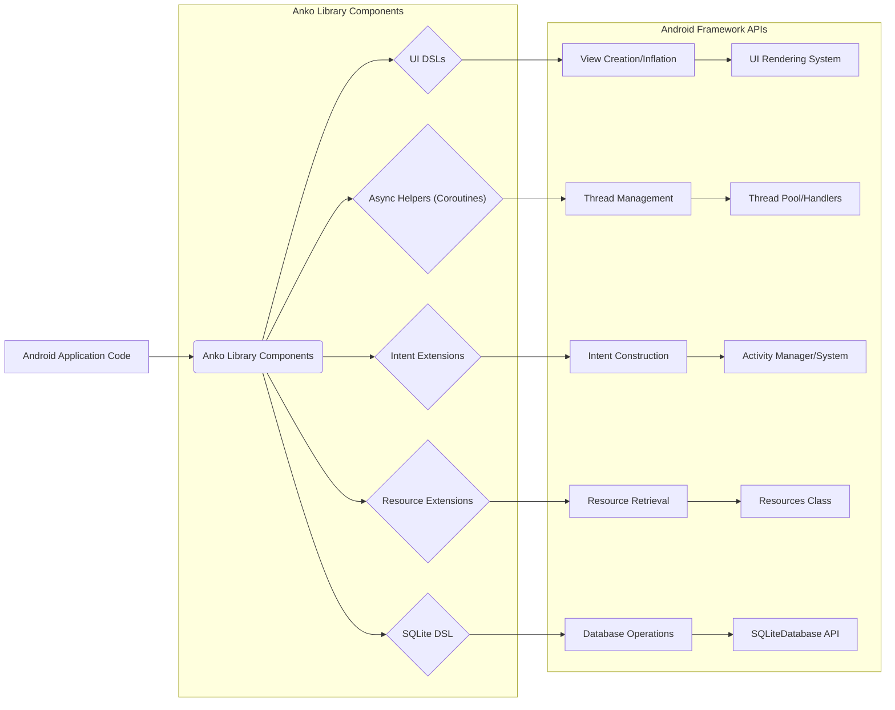
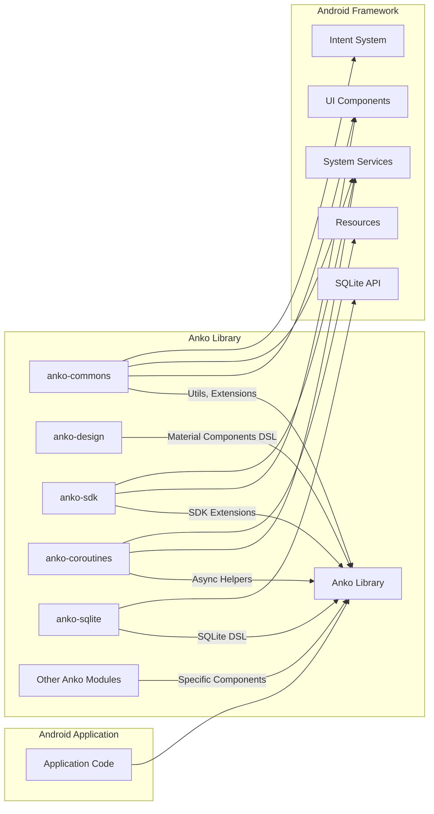
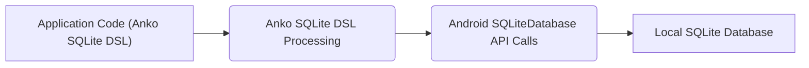

## Project Design Document: Anko Library (Improved)

**1. Introduction**

This document provides an enhanced design overview of the Anko library, a Kotlin library designed to streamline Android application development. This detailed description serves as a crucial foundation for subsequent threat modeling activities, explicitly outlining the architectural components, data flows, and external interactions relevant to identifying potential security vulnerabilities. Given Anko's deprecated status, understanding its internal workings is vital for assessing the risks associated with its continued use in legacy applications.

**2. Project Overview**

Anko aimed to simplify and accelerate Android development by offering a suite of Kotlin extensions and Domain Specific Languages (DSLs). These tools were intended to reduce boilerplate code and enhance the readability of common Android tasks, including:

*   Programmatic UI layout creation, offering an alternative to XML layouts.
*   Management of asynchronous operations and background tasks.
*   Simplified handling of Intents for inter-component communication.
*   Streamlined access to Android resources.
*   A DSL for interacting with SQLite databases.
*   Providing concise syntax for common UI interactions like displaying toasts and alerts.

It is critically important to reiterate that the Anko project is **archived and deprecated**. This status implies a cessation of active development, including security patching, making its continued use a significant security concern. This document highlights aspects relevant to understanding the attack surface of this deprecated library.

**3. Goals**

The primary objectives of this improved design document are to:

*   Provide a more granular definition of Anko's architectural components and their functionalities.
*   Offer clearer and more detailed illustrations of data flow within the library and its interactions with the Android framework.
*   Explicitly identify external dependencies and the nature of those interactions.
*   Establish a robust and detailed foundation for identifying potential security threats and vulnerabilities inherent in Anko's design, particularly in light of its deprecated status.

**4. Target Audience**

This document is primarily intended for:

*   Security engineers and architects tasked with performing threat modeling and security assessments on applications utilizing or having utilized Anko.
*   Development teams responsible for maintaining or migrating away from applications that incorporate the Anko library.
*   Individuals requiring a deep technical understanding of Anko's architecture for security analysis or historical context.

**5. Architectural Components (Detailed)**

Anko's modular architecture allows for targeted usage of specific functionalities. Key modules and their more specific roles include:

*   **`anko-commons`**:
    *   Provides extension functions for common Android APIs, reducing boilerplate (e.g., `runOnUiThread`).
    *   Offers logging utilities.
    *   Includes basic UI interaction helpers (e.g., `toast`, `alert`).
    *   Provides extension functions for Context and other fundamental Android classes.
*   **`anko-design`**:
    *   Wraps components from the Android Design Support Library (now Material Components), offering Kotlin-friendly access.
    *   Provides DSLs for creating elements like `FloatingActionButton`, `Snackbar`, and `NavigationView`.
*   **`anko-sdk`**:
    *   Contains a broad range of extension functions for various Android SDK classes and functionalities.
    *   Organized into version-specific modules (`anko-sdk15`, `anko-sdk25`, etc.) to provide API level-specific extensions.
    *   Offers helpers for tasks like working with `Intent`, `Bundle`, and `Service`.
*   **`anko-coroutines`**:
    *   Facilitates the use of Kotlin Coroutines for asynchronous programming.
    *   Provides extension functions for launching coroutines on different dispatchers (e.g., `async`, `bg`).
    *   Simplifies interaction between background threads and the UI thread.
*   **`anko-sqlite`**:
    *   Offers a type-safe DSL for interacting with SQLite databases.
    *   Provides builders for creating and managing database schemas.
    *   Simplifies database queries and data manipulation.
*   **`anko-appcompat-v7`**, **`anko-recyclerview-v7`**, etc.:
    *   Provide extension functions and DSLs for components within the Android Support Library (now AndroidX), enabling easier integration with `Toolbar`, `RecyclerView`, and other compatibility components.
*   **`anko-constraint-layout`**:
    *   Offers a DSL for constructing layouts using `ConstraintLayout` programmatically.
*   **`anko-cardview-v7`**:
    *   Provides extensions for working with the `CardView` component.
*   **`anko-sdk-v*`**:
    *   More granular, version-specific modules within `anko-sdk`, offering extensions tailored to particular Android API levels.

**6. Data Flow (Detailed)**

The primary data flow involves an Android application leveraging Anko to interact with the Android framework. Here’s a more detailed breakdown:

Detailed data flow within specific modules:

*   **UI Operations (e.g., Layouts, Views):**
    *   Application code uses Anko's UI DSLs (within modules like `anko-appcompat-v7`, `anko-constraint-layout`) to define UI elements programmatically.
    *   Anko's DSLs internally translate these declarations into standard Android `View` class instantiations and property settings.
    *   These `View` objects are then passed to the Android framework's UI rendering pipeline for display.
*   **Asynchronous Operations (using `anko-coroutines`):**
    *   Application code utilizes Anko's coroutine extensions (e.g., `async`, `bg`) to launch asynchronous tasks.
    *   Anko leverages Kotlin Coroutines to manage the execution of these tasks on background threads.
    *   Data exchange between background coroutines and the main UI thread often involves mechanisms like `withContext(Dispatchers.Main)` to ensure UI updates are performed safely. This might involve data fetched from network requests or database queries.
*   **Database Operations (using `anko-sqlite`):**
    *   Application code uses Anko's SQLite DSL to define database schemas, perform queries, and manipulate data.
    *   Anko's DSL translates these operations into standard Android SQLite API calls (`SQLiteDatabase`, `Cursor`, etc.).
    *   Data is read from and written to the application's private storage location where the SQLite database resides.
*   **Intent Handling:**
    *   Application code uses Anko's intent extensions to create and launch `Intent` objects for starting Activities, Services, or sending Broadcasts.
    *   Anko's extensions simplify the process of adding extras and flags to `Intent` objects.
    *   The Android framework's `ActivityManager` and related components handle the delivery and processing of these intents.
*   **Resource Access:**
    *   Application code uses Anko's resource extensions to access application resources (strings, colors, dimensions, etc.).
    *   Anko internally uses the standard `Resources` class provided by the Android `Context` to retrieve these resources.

**7. External Interactions (Detailed)**

Anko's interactions with external components are critical for understanding its dependencies and potential attack vectors:

*   **Android SDK:** Anko fundamentally relies on the Android SDK APIs for accessing device functionalities, UI building blocks, and system services. The specific API levels targeted by the application using Anko are relevant for identifying potential vulnerabilities associated with those SDK versions.
*   **Kotlin Standard Library:** As a Kotlin library, Anko depends on the Kotlin Standard Library for core language features and utilities. Vulnerabilities in the Kotlin Standard Library could indirectly impact Anko.
*   **Android Support Libraries / AndroidX:** Modules like `anko-appcompat-v7` and `anko-recyclerview-v7` directly interact with components from these compatibility libraries (now primarily AndroidX). Vulnerabilities in these underlying support libraries could be exposed through Anko. The deprecated nature of Anko means it likely relies on older, potentially vulnerable versions of these libraries.
*   **SQLite Database:** The `anko-sqlite` module interacts directly with the device's local SQLite database. Improper use of the DSL could lead to SQL injection vulnerabilities if user-provided data is not handled carefully within the application code.
*   **Gradle Build System:** Anko is typically included as a dependency managed by Gradle. Compromises in the Gradle build environment or dependency resolution process could introduce malicious code.
*   **Network (Indirectly):** While Anko doesn't provide direct networking capabilities, its coroutines module is frequently used in conjunction with networking libraries (e.g., Retrofit, OkHttp) to perform network requests. Vulnerabilities in these external networking libraries or insecure network communication practices within the application are relevant when considering Anko's role in asynchronous operations.
*   **Device Permissions:** Anko itself doesn't request permissions. However, the underlying Android APIs it wraps often require specific permissions. An application using Anko might inadvertently expose sensitive functionality without proper permission checks in its own code.

**8. Security Considerations (Detailed)**

Given Anko's deprecated status, the following security considerations are of paramount importance for threat modeling:

*   **Lack of Security Updates:** This is the most critical concern. No new security vulnerabilities discovered in Anko itself or in its dependencies will be addressed by the original developers. This leaves applications using Anko vulnerable to known exploits.
*   **Dependency Vulnerabilities:** Anko relies on specific versions of the Android Support Libraries/AndroidX and potentially other third-party libraries. These older versions may contain known security vulnerabilities that have been patched in later releases. Identifying the specific versions used by Anko is crucial for vulnerability scanning.
*   **Use of Deprecated Android APIs:** Anko might utilize deprecated Android APIs that have inherent security weaknesses or have been superseded by more secure alternatives. These deprecated APIs might also be removed in future Android versions, leading to application instability.
*   **Potential for SQL Injection (in `anko-sqlite`):** While the DSL aims to simplify database interactions, improper use, especially when incorporating user-provided input into database queries, could still lead to SQL injection vulnerabilities within the application.
*   **Exposure of Sensitive Data through Logging (in `anko-commons`):**  Careless use of Anko's logging utilities might inadvertently log sensitive information.
*   **Insecure Asynchronous Operations:** If not used correctly, the `anko-coroutines` module could introduce vulnerabilities related to thread safety, data races, or improper handling of exceptions in background threads, potentially leading to application crashes or unexpected behavior.
*   **Risk of Using Unsafe Intents:**  While Anko simplifies Intent creation, developers must still adhere to secure intent practices to prevent intent spoofing or information leakage.
*   **Maintenance and Remediation Burden:** Teams continuing to use Anko bear the sole responsibility for identifying, assessing, and mitigating any security vulnerabilities. This requires significant effort and expertise.

**9. Diagrams**

**9.1. High-Level Architecture**

**9.2. Data Flow Example (Database Operation)**

**10. Assumptions and Limitations**

*   This document provides a general architectural overview. Specific implementation details within each Anko module are not exhaustively covered.
*   The focus remains on the Anko library itself. Security vulnerabilities within the application code that utilizes Anko are outside the direct scope, though the interaction is considered.
*   The information is based on the publicly available source code and documentation of the Anko project at the time of its deprecation.
*   The deprecated status of Anko is a fundamental limitation and a primary driver for the security considerations outlined.

**11. Future Considerations and Mitigation Strategies**

Given Anko's deprecated state, the primary future consideration from a security perspective is **migration**. Organizations relying on Anko should prioritize transitioning to actively maintained and supported alternatives, such as:

*   **Jetpack Compose:** For modern UI development.
*   **Kotlin DSL for Layouts (Inflate):** For programmatic layout creation.
*   **Kotlin Coroutines (without Anko wrappers):** For asynchronous operations.
*   **Room Persistence Library:** For a more robust and type-safe approach to database interactions.
*   Direct use of Android SDK APIs:**  While potentially more verbose, this eliminates the dependency on the deprecated library.

Understanding Anko's architecture, as documented here, is crucial for planning and executing a secure migration strategy. This knowledge helps identify areas where direct replacements are needed and potential security vulnerabilities that need to be addressed during the migration process.