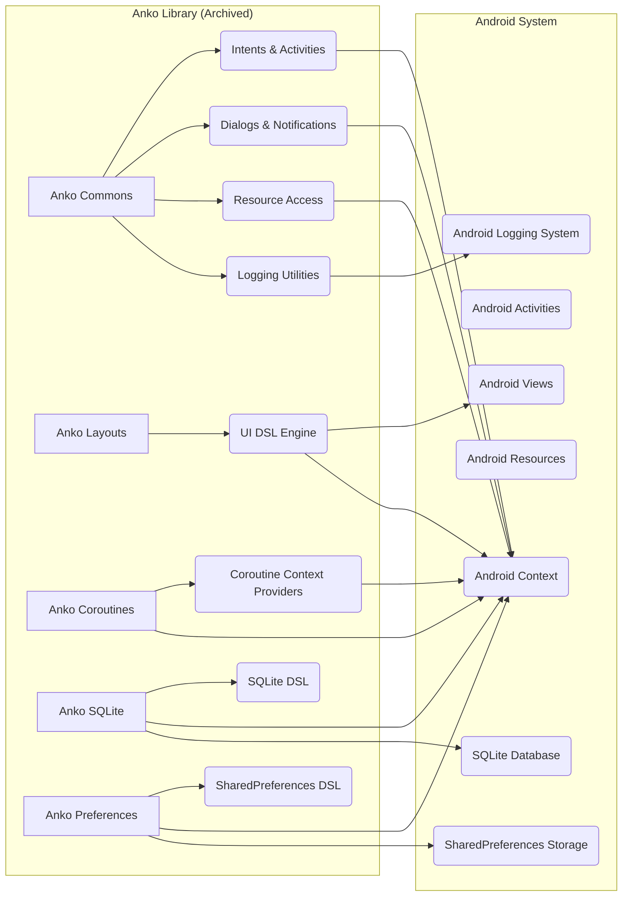

# Project Design Document: Anko (Archived) - Enhanced for Threat Modeling

**Version:** 1.1
**Date:** October 26, 2023
**Author:** AI Software Architect

## 1. Introduction

This document provides an enhanced design overview of the Anko library, an archived Kotlin library designed to streamline Android application development. This document is specifically tailored to facilitate threat modeling activities, focusing on architectural components, data flow, and potential security implications arising from its design and archived status. Understanding Anko's architecture is critical for assessing risks in legacy projects that still depend on it.

**Critical Note:** Anko is officially archived and receives no further development, bug fixes, or security patches. This fundamental fact is a primary security concern and should be central to any threat modeling exercise.

## 2. Original Goals and Objectives (Context for Threat Analysis)

Understanding Anko's original intentions helps contextualize potential security issues. The primary goals were to:

*   **Simplify UI Development:** Offer a Kotlin DSL for declarative UI creation, aiming for more concise and readable layouts compared to XML.
*   **Provide Convenience APIs:** Offer extension functions for common Android tasks (e.g., starting activities, displaying UI notifications, resource access), reducing boilerplate code.
*   **Facilitate Asynchronous Operations:** Integrate with Kotlin Coroutines to simplify background task management on Android.
*   **Streamline Data Persistence:** Provide DSLs for interacting with SQLite databases and SharedPreferences.

## 3. System Architecture - Focus on Attack Surface

Anko's architecture exposes several potential interaction points and dependencies that constitute the attack surface. The library is modular, with each module offering distinct functionalities and potential vulnerabilities.

### 3.1. Component Breakdown and Security Implications

*   **Anko Commons:** Provides core utilities. Security concerns include:
    *   **Intent Handling:** Potential for vulnerabilities if implicit intents are used insecurely, allowing unintended activity interception or data leakage.
    *   **Dialogs & Notifications:** Risk of UI redressing or spoofing if not implemented carefully.
    *   **Resource Access:** While generally safe, improper handling of resource IDs could lead to unexpected behavior.
    *   **Logging Utilities:**  Major risk of information disclosure if sensitive data is logged.
*   **Anko Layouts (UI DSL Engine):** Translates Kotlin DSL into Android Views.
    *   **Potential for Logic Errors:**  Bugs in the DSL engine could lead to unexpected UI behavior or vulnerabilities.
    *   **View Inflation Issues:**  While less likely to be a direct security issue, errors in view inflation could lead to denial-of-service or unexpected application states.
*   **Anko Coroutines (Coroutine Context Providers):** Manages coroutine execution on Android.
    *   **Context Switching Issues:** Improper context management could lead to race conditions or data corruption, although less likely to be a direct security vulnerability exploitable from outside.
*   **Anko SQLite (SQLite DSL):** Provides a type-safe DSL for database interactions.
    *   **High Risk of SQL Injection:** If user input is incorporated into SQL queries without rigorous sanitization, this module is a prime target for SQL injection attacks.
    *   **Database File Security:** Anko itself doesn't manage database file permissions, but its use can influence how securely the database is accessed.
*   **Anko Preferences (SharedPreferences DSL):** Offers a type-safe way to access SharedPreferences.
    *   **Insecure Data Storage:** Data in SharedPreferences is generally unencrypted. This module can expose sensitive data if not used cautiously.

### 3.2. Interaction Points and Attack Vectors

*   **Interactions with Android APIs:** Each Anko module interacts with various Android system APIs. Vulnerabilities in these APIs could be indirectly exploitable through Anko.
*   **Data Passing between Components:** Data passed between Anko components and the Android system (e.g., through Intents, database queries) represents potential points for interception or manipulation.

## 4. Data Flow Analysis for Threat Identification

Understanding how data flows through Anko is crucial for identifying potential vulnerabilities.

*   **UI Definition Flow:** Developer defines UI in Kotlin DSL -> `Anko Layouts` translates this into Android `View` objects -> Android renders the UI. Potential threats: Logic errors in DSL leading to UI issues, resource injection if data from untrusted sources influences the DSL.
*   **Intent Data Flow:** Application code uses `Anko Commons` to create and send Intents -> Data is serialized and passed through the Android system -> Target Activity receives the Intent. Potential threats: Data tampering during intent transmission, information leakage if sensitive data is passed without proper protection.
*   **Resource Access Flow:** Application code uses `Anko Commons` to access resources -> Android system retrieves the requested resource. Potential threats: Resource spoofing (less likely with direct resource access but possible in complex scenarios).
*   **Database Interaction Flow:** Application code uses `Anko SQLite` DSL to define queries/updates -> DSL translates this into SQL commands -> Commands are executed against the SQLite database -> Data is returned to the application. **Critical Threat:** SQL Injection if user input is not sanitized before being used in the DSL. Also, potential for unauthorized data access if database permissions are not properly configured.
*   **Preferences Data Flow:** Application code uses `Anko Preferences` to read/write data -> Data is stored in/retrieved from `SharedPreferences`. **Critical Threat:** Exposure of sensitive data as `SharedPreferences` is generally unencrypted.

## 5. Security Considerations - Prioritized Risks

Given Anko's archived status, the following security considerations are paramount:

*   **Unpatched Dependencies:** Anko relies on the Android SDK and potentially other libraries. Vulnerabilities discovered in these dependencies after Anko's archival will remain unaddressed, posing a significant risk.
*   **SQL Injection Vulnerabilities (Anko SQLite):** This is a high-priority concern if the application handles user-provided data in database interactions using Anko's SQLite DSL without proper sanitization.
*   **Insecure Data Storage (Anko Preferences):** Storing sensitive information in `SharedPreferences` accessed through Anko Preferences is inherently risky due to the lack of default encryption.
*   **Information Disclosure through Logging (Anko Commons):**  Overly verbose or insecure logging practices using Anko's utilities can expose sensitive data.
*   **Use of Deprecated APIs:** Anko might utilize older Android APIs with known security weaknesses.
*   **Lack of Ongoing Security Review:**  No active development means no ongoing security audits or proactive vulnerability identification.

## 6. Dependencies - Identifying Vulnerability Sources

Understanding Anko's dependencies is crucial for identifying potential sources of vulnerabilities. Key dependencies include:

*   **Kotlin Standard Library:**  While generally well-maintained, specific versions might have known issues.
*   **Android SDK Components:**  The specific Android SDK version targeted by Anko is critical. Older SDK versions may contain unpatched vulnerabilities.
*   **Kotlin Coroutines Library (for Anko Coroutines):**  The version of the coroutines library used by Anko needs to be considered for potential vulnerabilities.
*   **Potentially other third-party libraries:**  The presence and versions of any other transitive dependencies need to be investigated for known security flaws.

## 7. Deployment Model - Context for Exploitation

Anko is deployed as a library integrated directly into the Android application. This means:

*   **Vulnerabilities are within the Application's Process:** Exploits would occur within the application's runtime environment.
*   **Attack Surface is the Application Itself:**  Threats target the application leveraging Anko's functionalities.

## 8. Limitations - Impact on Security Posture

The fact that Anko is archived imposes significant limitations on its security posture:

*   **No Security Updates:**  Critical vulnerabilities will not be patched by the Anko maintainers.
*   **Increasing Risk Over Time:** As new vulnerabilities are discovered in its dependencies or the Android platform, applications using Anko become increasingly vulnerable.
*   **Limited Community Support for Security Issues:** While the community might offer workarounds, there's no guarantee of timely or comprehensive security fixes.

## 9. Recommendations for Threat Modeling and Mitigation

For teams dealing with applications using Anko, the following is recommended for threat modeling and mitigation:

*   **Prioritize Migration:** The most effective long-term solution is to migrate away from Anko to actively maintained libraries or standard Android development practices.
*   **Focus on High-Risk Areas:** Prioritize threat modeling efforts on areas with known high risks, such as SQL injection in `Anko SQLite` and insecure data storage with `Anko Preferences`.
*   **Static and Dynamic Analysis:** Employ static analysis tools to identify potential vulnerabilities in the codebase related to Anko usage. Conduct dynamic analysis to observe runtime behavior and identify exploitable weaknesses.
*   **Input Sanitization:** Implement rigorous input sanitization, especially when dealing with user-provided data used in database queries or UI rendering.
*   **Secure Data Storage Practices:** Avoid storing sensitive information in `SharedPreferences`. If necessary, implement encryption at the application level.
*   **Regular Security Audits:** Conduct regular security audits to identify and address potential vulnerabilities arising from Anko's use and its dependencies.
*   **Monitor Dependency Vulnerabilities:**  Continuously monitor the dependencies used by the application (including those transitive to Anko) for known vulnerabilities and explore mitigation strategies or alternative libraries.

This enhanced design document provides a more focused and detailed overview of Anko's architecture, specifically tailored for threat modeling. The emphasis on potential vulnerabilities and the implications of its archived status should aid in a more comprehensive security assessment.