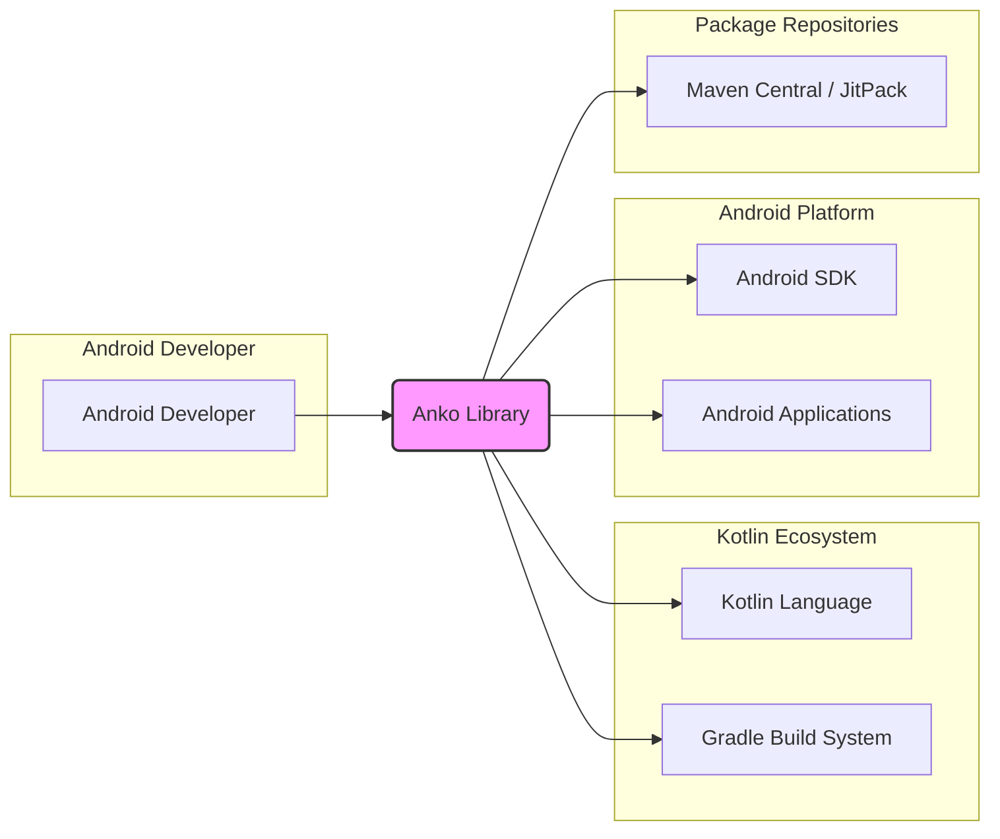

# BUSINESS POSTURE

- Business Priorities and Goals:
  - Simplify Android application development using Kotlin Domain Specific Languages (DSLs).
  - Increase developer productivity by providing concise and expressive ways to define UI layouts, common Android functionalities, and asynchronous operations.
  - Promote the adoption of Kotlin in Android development by offering a comprehensive and user-friendly library.
  - Enhance code readability and maintainability in Android projects.

- Most Important Business Risks:
  - Security vulnerabilities in the Anko library could be inherited by applications using it, potentially leading to application-level security breaches.
  - Poor code quality or lack of maintenance could lead to instability and reliability issues in applications using Anko.
  - Supply chain risks if dependencies used by Anko have vulnerabilities or if the Anko build and release process is compromised.
  - Negative developer perception if security concerns are not adequately addressed, hindering adoption and community growth.

# SECURITY POSTURE

- Existing Security Controls:
  - security control: GitHub repository with standard security features like branch protection and issue tracking. (Implemented in: GitHub repository settings)
  - security control: Open-source development model allowing for community review and contributions. (Implemented in: GitHub public repository)
  - security control: Usage of Kotlin language, which has its own security features and coding conventions. (Implemented in: Kotlin language design)
  - security control: Reliance on Android platform security model for applications built using Anko. (Implemented in: Android OS and SDK)

- Accepted Risks:
  - accepted risk: Vulnerabilities might be discovered in the library code after release, requiring patches and updates.
  - accepted risk: Third-party dependencies used by Anko might introduce security vulnerabilities.
  - accepted risk: Open-source nature means potential exposure of vulnerabilities to a wider audience, including malicious actors, once disclosed.

- Recommended Security Controls:
  - security control: Implement automated Static Application Security Testing (SAST) tools in the CI/CD pipeline to detect potential code vulnerabilities.
  - security control: Implement Dependency Vulnerability Scanning to identify and manage vulnerabilities in third-party libraries used by Anko.
  - security control: Conduct regular security code reviews, especially for critical components and new features.
  - security control: Establish a clear process for reporting and handling security vulnerabilities, including a security policy and contact information.
  - security control: Consider signing releases to ensure integrity and authenticity of the library artifacts.
  - security control: Publish security advisories for any identified vulnerabilities and their fixes.

- Security Requirements:
  - Authentication: Not directly applicable to a library. Anko itself does not handle user authentication. Applications using Anko will be responsible for their own authentication mechanisms.
  - Authorization: Not directly applicable to a library. Anko does not enforce authorization. Applications using Anko will manage authorization based on their specific needs.
  - Input Validation: Relevant if Anko DSLs process external input or user-provided data within applications. Ensure proper validation and sanitization of any input handled by Anko DSLs to prevent injection vulnerabilities in applications using the library.
  - Cryptography: Potentially relevant if Anko provides utilities for cryptographic operations (unlikely based on description). If cryptography is used, ensure usage of well-vetted and secure cryptographic libraries and practices. For general library usage, cryptography requirements are delegated to the applications using Anko.

# DESIGN

## C4 CONTEXT



- Context Diagram Elements:
  - - Name: Android Developer
    - Type: Person
    - Description: Developers who build Android applications using Kotlin and potentially Anko library.
    - Responsibilities: Uses Anko library to simplify Android development, writes application code, builds and deploys Android applications.
    - Security controls: Responsible for secure coding practices in their applications, including proper usage of libraries like Anko and handling of user data.

  - - Name: Anko Library
    - Type: Software System
    - Description: Kotlin library providing DSLs for Android development, simplifying UI layout, common tasks, and asynchronous operations.
    - Responsibilities: Provides DSLs and utilities to Android developers, is built and published to package repositories, and is used as a dependency in Android applications.
    - Security controls: Undergoes security controls during development and build process (SAST, dependency scanning, code reviews), aims to minimize vulnerabilities in library code.

  - - Name: Kotlin Language
    - Type: Software System
    - Description: Programming language used to develop Anko library and Android applications.
    - Responsibilities: Provides the language runtime and standard libraries for Kotlin development.
    - Security controls: Kotlin language design and compiler incorporate security considerations.

  - - Name: Android SDK
    - Type: Software System
    - Description: Software Development Kit provided by Google for Android application development.
    - Responsibilities: Provides APIs and tools necessary to build and run Android applications.
    - Security controls: Android SDK incorporates Android platform security features and best practices.

  - - Name: Gradle Build System
    - Type: Software System
    - Description: Build automation tool used to build Anko library and Android applications.
    - Responsibilities: Manages dependencies, compiles code, runs tests, and packages applications.
    - Security controls: Gradle build scripts and plugins can incorporate security checks and dependency management.

  - - Name: Maven Central / JitPack
    - Type: Software System
    - Description: Package repositories where Anko library is published and distributed.
    - Responsibilities: Hosts and distributes Anko library artifacts to developers.
    - Security controls: Package repositories have security measures to ensure integrity and availability of packages.

  - - Name: Android Applications
    - Type: Software System
    - Description: Applications built by Android developers that may use Anko library as a dependency.
    - Responsibilities: Provides functionality to end-users, runs on Android devices, and may utilize Anko library features.
    - Security controls: Android applications are responsible for implementing their own security controls, potentially leveraging security features of Anko and the Android platform.

## C4 CONTAINER

```mermaid
flowchart LR
    subgraph "Anko Library"
        subgraph "Modules"
            AC[anko-commons]
            AL[anko-layouts]
            ASQ[anko-sqlite]
            ACR[anko-coroutines]
            ACDK[anko-design-coroutines]
            AUI[anko-ui]
            AUIC[anko-ui-commons]
            AP[anko-platform]
            AB[anko-base]
            AA[anko-appcompat-v7]
            ARV[anko-recyclerview-v7]
            ADC[anko-design]
            AF[anko-fragments]
            AW[anko-widgets]
            AWC[anko-widgets-commons]
        end
    end
    K[Kotlin Language] --> AC
    K --> AL
    K --> ASQ
    K --> ACR
    K --> ACDK
    K --> AUI
    K --> AUIC
    K --> AP
    K --> AB
    K --> AA
    K --> ARV
    K --> ADC
    K --> AF
    K --> AW
    K --> AWC

    style "Anko Library" fill:#ccf,stroke:#333,stroke-width:2px
    style Modules fill:#eee,stroke:#333,stroke-width:1px
```

- Container Diagram Elements:
  - - Name: Anko Library
    - Type: Software System
    - Description:  Monolithic Kotlin library composed of multiple modules, each providing specific functionalities for Android development.
    - Responsibilities: Provides a collection of DSLs and utilities organized into modules for different aspects of Android development (UI, commons, SQLite, coroutines, etc.).
    - Security controls: Security controls are applied at the library level, encompassing all modules. Vulnerability scanning, SAST, and code reviews cover the entire codebase.

  - - Name: anko-commons
    - Type: Module
    - Description: Module providing common utilities and helper functions for Android development.
    - Responsibilities: Offers utility functions to simplify common Android tasks.
    - Security controls: Subject to library-level security controls.

  - - Name: anko-layouts
    - Type: Module
    - Description: Module providing DSL for defining Android UI layouts programmatically.
    - Responsibilities: Enables declarative UI layout definition in Kotlin code.
    - Security controls: Subject to library-level security controls, input validation might be relevant if layout DSL processes dynamic data.

  - - Name: anko-sqlite
    - Type: Module
    - Description: Module providing DSL for working with SQLite databases in Android.
    - Responsibilities: Simplifies database interactions in Android applications.
    - Security controls: Subject to library-level security controls, potential security considerations related to SQL injection if DSL is misused in applications.

  - - Name: anko-coroutines
    - Type: Module
    - Description: Module providing extensions for Kotlin Coroutines in Android development.
    - Responsibilities: Simplifies asynchronous programming in Android applications using coroutines.
    - Security controls: Subject to library-level security controls.

  - - Name: anko-design-coroutines
    - Type: Module
    - Description: Module providing coroutine extensions for Android Design Library components.
    - Responsibilities: Combines coroutines with Android Design Library components.
    - Security controls: Subject to library-level security controls.

  - - Name: anko-ui
    - Type: Module
    - Description: Core UI components and functionalities within Anko.
    - Responsibilities: Provides fundamental UI building blocks.
    - Security controls: Subject to library-level security controls.

  - - Name: anko-ui-commons
    - Type: Module
    - Description: Common UI utilities and extensions.
    - Responsibilities: Offers utility functions for UI development.
    - Security controls: Subject to library-level security controls.

  - - Name: anko-platform
    - Type: Module
    - Description: Platform-specific extensions and utilities.
    - Responsibilities: Provides platform-related functionalities.
    - Security controls: Subject to library-level security controls.

  - - Name: anko-base
    - Type: Module
    - Description: Base module providing core functionalities for Anko.
    - Responsibilities: Contains fundamental components of Anko library.
    - Security controls: Subject to library-level security controls.

  - - Name: anko-appcompat-v7
    - Type: Module
    - Description: Support for Android AppCompat v7 library.
    - Responsibilities: Integrates with AppCompat v7 components.
    - Security controls: Subject to library-level security controls.

  - - Name: anko-recyclerview-v7
    - Type: Module
    - Description: Support for Android RecyclerView v7 library.
    - Responsibilities: Integrates with RecyclerView v7 components.
    - Security controls: Subject to library-level security controls.

  - - Name: anko-design
    - Type: Module
    - Description: Support for Android Design Library.
    - Responsibilities: Integrates with Android Design Library components.
    - Security controls: Subject to library-level security controls.

  - - Name: anko-fragments
    - Type: Module
    - Description: Utilities and extensions for Android Fragments.
    - Responsibilities: Simplifies Fragment usage in Android applications.
    - Security controls: Subject to library-level security controls.

  - - Name: anko-widgets
    - Type: Module
    - Description: DSL for Android UI widgets.
    - Responsibilities: Provides DSL for creating UI widgets programmatically.
    - Security controls: Subject to library-level security controls.

  - - Name: anko-widgets-commons
    - Type: Module
    - Description: Common utilities for Android UI widgets.
    - Responsibilities: Offers utility functions for working with UI widgets.
    - Security controls: Subject to library-level security controls.

## DEPLOYMENT

- Deployment Model:
  - Anko library is not deployed as a standalone service or application. It is deployed as a library artifact to package repositories (Maven Central, JitPack).
  - Android developers then include Anko as a dependency in their Android applications.
  - The "deployment" context for Anko is its publication to package repositories and its integration into Android application build processes.

- Detailed Deployment Description (Publication to Maven Central/JitPack):

```mermaid
flowchart LR
    subgraph "Developer Workstation"
        DEV[Developer]
    end
    subgraph "CI/CD Pipeline (GitHub Actions)"
        B[Build Process]
        T[Automated Tests]
        P[Publish to Maven Central / JitPack]
    end
    subgraph "Package Repositories"
        M[Maven Central / JitPack]
    end

    DEV --> B
    B --> T
    T --> P
    P --> M

    style "Developer Workstation" fill:#eee,stroke:#333,stroke-width:1px
    style "CI/CD Pipeline (GitHub Actions)" fill:#eee,stroke:#333,stroke-width:1px
    style "Package Repositories" fill:#eee,stroke:#333,stroke-width:1px
```

- Deployment Diagram Elements:
  - - Name: Developer
    - Type: Person
    - Description: Software developer working on Anko library.
    - Responsibilities: Writes code, commits changes, triggers build process.
    - Security controls: Uses secure development workstation, follows secure coding practices, authenticates to Git repository.

  - - Name: CI/CD Pipeline (GitHub Actions)
    - Type: Automated System
    - Description: Automated build and deployment pipeline using GitHub Actions.
    - Responsibilities: Automates build process, runs tests, performs security checks (SAST, dependency scanning), and publishes artifacts to package repositories.
    - Security controls: Securely configured GitHub Actions workflows, secrets management for repository credentials, build environment security, automated security checks integrated into pipeline.

  - - Name: Build Process
    - Type: Process within CI/CD
    - Description: Steps involved in compiling, packaging, and preparing Anko library for release.
    - Responsibilities: Compiles Kotlin code, packages modules into JAR/AAR files, generates documentation.
    - Security controls: Secure build environment, dependency management, build process integrity.

  - - Name: Automated Tests
    - Type: Process within CI/CD
    - Description: Automated tests (unit tests, integration tests) run as part of the CI/CD pipeline.
    - Responsibilities: Verifies code functionality and quality, detects regressions.
    - Security controls: Test environment security, test case coverage including security-relevant scenarios.

  - - Name: Publish to Maven Central / JitPack
    - Type: Process within CI/CD
    - Description: Process of uploading and releasing Anko library artifacts to package repositories.
    - Responsibilities: Makes Anko library available to Android developers through package repositories.
    - Security controls: Secure credentials for package repository access, artifact signing for integrity and authenticity, secure transfer protocols (HTTPS).

  - - Name: Maven Central / JitPack
    - Type: Package Repository
    - Description: Public package repositories for distributing Java and Android libraries.
    - Responsibilities: Hosts and distributes Anko library artifacts.
    - Security controls: Repository security measures to protect against unauthorized access and tampering, integrity checks for published artifacts.

## BUILD

```mermaid
flowchart LR
    subgraph "Developer Workstation"
        DEV[Developer]
        IDE[IDE (IntelliJ IDEA)]
    end
    subgraph "Version Control (GitHub)"
        VCS[Git Repository (GitHub)]
    end
    subgraph "CI/CD Pipeline (GitHub Actions)"
        BC[Build & Compile]
        TEST[Automated Tests]
        SAST[SAST Scanners]
        DEP_SCAN[Dependency Scan]
        ARTIFACT[Artifact Generation]
        PUBLISH[Publish Artifacts]
    end
    subgraph "Package Repositories"
        REPO[Maven Central / JitPack]
    end

    DEV --> IDE
    IDE --> VCS
    VCS --> BC
    BC --> TEST
    TEST --> SAST
    SAST --> DEP_SCAN
    DEP_SCAN --> ARTIFACT
    ARTIFACT --> PUBLISH
    PUBLISH --> REPO

    style "Developer Workstation" fill:#eee,stroke:#333,stroke-width:1px
    style "Version Control (GitHub)" fill:#eee,stroke:#333,stroke-width:1px
    style "CI/CD Pipeline (GitHub Actions)" fill:#eee,stroke:#333,stroke-width:1px
    style "Package Repositories" fill:#eee,stroke:#333,stroke-width:1px
```

- Build Process Description:
  - Developer writes code in IDE (e.g., IntelliJ IDEA).
  - Code is committed to a Git repository hosted on GitHub.
  - GitHub Actions CI/CD pipeline is triggered on code changes (e.g., push, pull request).
  - Build & Compile stage compiles Kotlin code using Gradle build system.
  - Automated Tests stage runs unit and integration tests.
  - SAST Scanners stage performs static application security testing to identify potential code vulnerabilities.
  - Dependency Scan stage scans dependencies for known vulnerabilities.
  - Artifact Generation stage packages compiled code and resources into library artifacts (JAR/AAR).
  - Publish Artifacts stage publishes artifacts to Maven Central and JitPack package repositories.

- Build Security Controls:
  - security control: Secure Developer Workstations: Developers use secure workstations with up-to-date software and security configurations.
  - security control: Secure IDE: IDE with security plugins and best practices enabled.
  - security control: Version Control System (Git/GitHub): Code is stored and managed in a secure Git repository with access controls and audit logs.
  - security control: Branch Protection: Branch protection rules on main branches to prevent direct commits and enforce code review process.
  - security control: CI/CD Pipeline Security: Securely configured CI/CD pipeline (GitHub Actions) with proper access controls and secrets management.
  - security control: Automated Build Process: Automated build process using Gradle to ensure consistent and repeatable builds.
  - security control: Static Application Security Testing (SAST): Automated SAST tools integrated into CI/CD to detect code vulnerabilities early in the development cycle.
  - security control: Dependency Vulnerability Scanning: Automated dependency scanning tools to identify and manage vulnerabilities in third-party libraries.
  - security control: Automated Tests: Comprehensive suite of automated tests (unit, integration) to ensure code quality and detect regressions.
  - security control: Artifact Signing: Code signing of released artifacts to ensure integrity and authenticity.
  - security control: Secure Artifact Storage: Artifacts are published to reputable and secure package repositories (Maven Central, JitPack).
  - security control: Build Environment Security: Secure and hardened build environment in CI/CD pipeline.

# RISK ASSESSMENT

- Critical Business Processes:
  - Android application development using Kotlin.
  - Distribution of Anko library to Android developers.
  - Maintaining developer trust and community adoption of Anko.

- Data We Are Trying to Protect and Their Sensitivity:
  - Anko library source code: Sensitive as it represents the intellectual property and contains the logic of the library. Confidentiality and integrity are important.
  - Build artifacts (JAR/AAR files): Integrity and availability are crucial to ensure developers are using a safe and functional library.
  - Package repository credentials: Highly sensitive, as compromise could lead to unauthorized releases or tampering with the library. Confidentiality and integrity are paramount.
  - Security vulnerability information: Sensitive information that needs to be handled confidentially until a fix is released and publicly disclosed in a coordinated manner.

# QUESTIONS & ASSUMPTIONS

- Questions:
  - Are there specific security compliance requirements for the Anko project (e.g., OWASP, specific industry standards)?
  - Is there a dedicated security team or individual responsible for security aspects of the Anko project?
  - What is the process for handling security vulnerability reports from the community?
  - Are there any plans for formal security audits or penetration testing of the Anko library?
  - What is the expected risk appetite for security vulnerabilities in the Anko library?

- Assumptions:
  - Anko library is primarily intended for UI and general Android development utilities, and not designed to handle highly sensitive data directly.
  - Security focus is on preventing common software vulnerabilities (e.g., injection, cross-site scripting - although less relevant for a library, but potential for misuse in applications, dependency vulnerabilities).
  - The primary users of Anko are Android developers who are expected to implement application-level security controls in their own applications.
  - The project benefits from the security practices inherent in the Kotlin language, Android platform, and GitHub platform.
  - The project aims for a reasonable level of security appropriate for an open-source library, balancing security efforts with development velocity and community contributions.