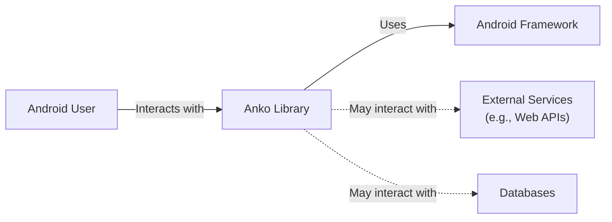
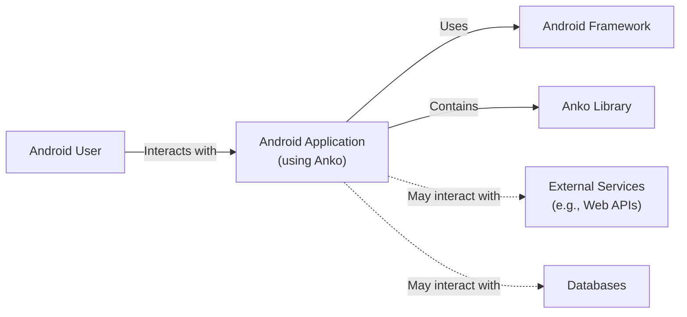
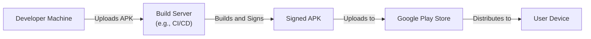
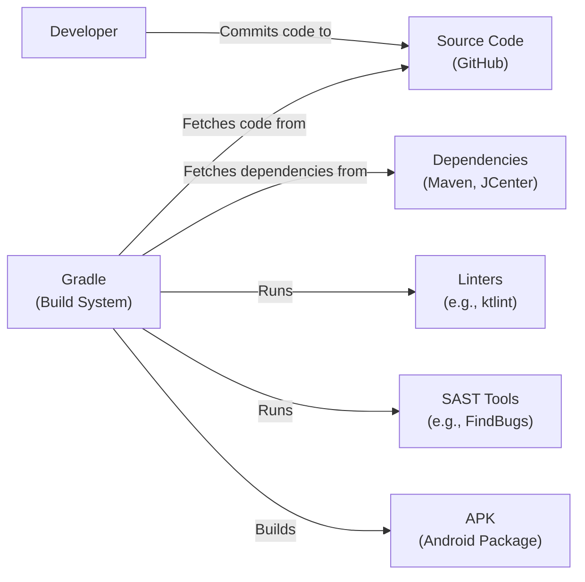

Okay, let's create a design document for the Anko project, keeping in mind its purpose and potential security considerations.

# BUSINESS POSTURE

Anko is a library, not a standalone application.  Its primary business purpose is to simplify and accelerate Android application development using Kotlin.  It aims to reduce boilerplate code, improve code readability, and provide convenient helpers for common Android tasks.  It's no longer actively maintained and is officially deprecated.

Business Priorities:

*   Reduce development time for Android applications.
*   Improve the maintainability of Android application code.
*   Provide a more concise and expressive way to interact with the Android framework.
*   Leverage the features of the Kotlin language.

Business Goals:

*   Increase developer adoption (historically).
*   Reduce the number of bugs related to common Android tasks.
*   Enable faster iteration cycles for Android development.

Most Important Business Risks:

*   **Security vulnerabilities introduced by the library:** Since Anko provides helpers for various Android components, vulnerabilities in Anko could be exploited in applications using it. This is the most critical risk.
*   **Compatibility issues:** As Android evolves, Anko (being deprecated) might become incompatible with newer versions of the Android SDK or Kotlin, leading to build failures or runtime errors.
*   **Performance overhead:** Poorly optimized Anko code could introduce performance bottlenecks in applications.
*   **Reliance on a deprecated library:** Using a deprecated library increases technical debt and makes future maintenance harder. Applications using Anko will eventually need to migrate away from it.

# SECURITY POSTURE

Existing Security Controls (based on the repository and common practices):

*   security control: Code Reviews: While not explicitly documented in every commit, it's reasonable to assume that some form of code review was performed before merging changes. (Inferred from the collaborative nature of GitHub).
*   security control: Static Analysis: The project uses Kotlin, which has built-in null safety and other features that help prevent common programming errors. (Inferred from the use of Kotlin).
*   security control: Community Scrutiny: Being an open-source project, Anko's code is publicly available and subject to scrutiny by the community, which can help identify potential vulnerabilities. (Inferred from being on GitHub).

Accepted Risks:

*   accepted risk: Deprecation: The library is officially deprecated, meaning no further security updates or bug fixes will be provided. This is a significant accepted risk.
*   accepted risk: Unknown Vulnerabilities: There might be undiscovered vulnerabilities in the library, especially given its deprecated status.

Recommended Security Controls:

*   High Priority: **Dependency Analysis:** Regularly scan the project's dependencies (although Anko itself has few) for known vulnerabilities using tools like OWASP Dependency-Check or Snyk. This is crucial for any project, but especially for a deprecated one.
*   High Priority: **Static Application Security Testing (SAST):** Integrate SAST tools into the build process (if a build process were to be re-established) to automatically scan the Anko codebase for potential vulnerabilities. Examples include SonarQube, FindBugs, and SpotBugs.
*   High Priority: **Migration Plan:** Develop a clear plan for migrating applications away from Anko to supported alternatives. This is the most effective long-term security control.

Security Requirements:

*   Authentication: Not directly applicable to Anko itself, as it's a library. Authentication is handled by the applications using Anko.
*   Authorization: Not directly applicable to Anko itself. Authorization is handled by the applications using Anko.
*   Input Validation: Anko's helpers should be reviewed to ensure they don't introduce any input validation vulnerabilities. For example, if Anko provides helpers for creating UI elements, those helpers should not allow for injection attacks (e.g., SQL injection if interacting with a database, or XSS if displaying user-provided data).
*   Cryptography: If Anko provides any cryptographic helpers (which is unlikely), they should use strong, well-established algorithms and follow best practices for key management.  It's more likely that applications using Anko would handle cryptography directly.

# DESIGN

## C4 CONTEXT

Element Descriptions:

*   Element:
    *   Name: Android User
    *   Type: Person
    *   Description: The end-user of an Android application that utilizes the Anko library.
    *   Responsibilities: Interacts with the Android application.
    *   Security controls: N/A (external to the system)

*   Element:
    *   Name: Anko Library
    *   Type: Software System
    *   Description: A Kotlin library that simplifies Android development.
    *   Responsibilities: Provides helper functions and DSLs for common Android tasks.
    *   Security controls: Code Reviews, Static Analysis, Community Scrutiny.

*   Element:
    *   Name: Android Framework
    *   Type: Software System
    *   Description: The underlying Android operating system and its APIs.
    *   Responsibilities: Provides core functionality for Android applications.
    *   Security controls: Android Security Model (Permissions, Sandboxing, etc.)

*   Element:
    *   Name: External Services
    *   Type: Software System
    *   Description: Any external services (e.g., web APIs, cloud services) that the Android application might interact with.
    *   Responsibilities: Varies depending on the specific service.
    *   Security controls: Dependent on the external service (e.g., HTTPS, API keys, OAuth).

*   Element:
    *   Name: Databases
    *   Type: Software System
    *   Description: Any databases that the Android application might use (e.g., SQLite, Realm).
    *   Responsibilities: Store and retrieve data.
    *   Security controls: Database security best practices (e.g., parameterized queries, encryption).

## C4 CONTAINER

Since Anko is a library, the container diagram is essentially an extension of the context diagram. It doesn't have separate deployable units in the traditional sense.

Element Descriptions:

*   Element:
    *   Name: Android User
    *   Type: Person
    *   Description: The end-user of an Android application.
    *   Responsibilities: Interacts with the Android application.
    *   Security controls: N/A (external to the system)

*   Element:
    *   Name: Android Application (using Anko)
    *   Type: Container: Mobile App
    *   Description: The Android application built using the Anko library.
    *   Responsibilities: Provides the application's functionality to the user.
    *   Security controls: Application-specific security controls (e.g., input validation, authentication, authorization).

*   Element:
    *   Name: Anko Library
    *   Type: Component
    *   Description: The Anko library, integrated within the Android application.
    *   Responsibilities: Provides helper functions and DSLs.
    *   Security controls: Code Reviews, Static Analysis, Community Scrutiny.

*   Element:
    *   Name: Android Framework
    *   Type: Container: Operating System
    *   Description: The underlying Android operating system.
    *   Responsibilities: Provides core OS functionality.
    *   Security controls: Android Security Model.

*   Element:
    *   Name: External Services
    *   Type: Container: External System
    *   Description: External services used by the application.
    *   Responsibilities: Varies depending on the service.
    *   Security controls: Dependent on the external service.

*   Element:
    *   Name: Databases
    *   Type: Container: Database
    *   Description: Databases used by the application.
    *   Responsibilities: Store and retrieve data.
    *   Security controls: Database security best practices.

## DEPLOYMENT

Anko, as a library, is not deployed independently. It's included as part of an Android application's build process and packaged within the APK (Android Package Kit).

Possible Deployment Solutions:

1.  **Direct Installation (Debugging):** Developers often install APKs directly onto devices or emulators during development.
2.  **Google Play Store:** The most common way to distribute Android applications to end-users.
3.  **Third-Party App Stores:**  Alternatives to the Google Play Store (e.g., Amazon Appstore, F-Droid).
4.  **Enterprise Distribution:**  For internal applications, companies might use Mobile Device Management (MDM) solutions or sideloading.

Chosen Solution (for detailed description): Google Play Store

Element Descriptions:

*   Element:
    *   Name: Developer Machine
    *   Type: Infrastructure Node
    *   Description: The developer's workstation where the code is written and built.
    *   Responsibilities: Code development, local testing.
    *   Security controls: Local machine security (e.g., antivirus, firewall).

*   Element:
    *   Name: Build Server (e.g., CI/CD)
    *   Type: Infrastructure Node
    *   Description: A server that automates the build and testing process.
    *   Responsibilities: Building the APK, running tests, signing the APK.
    *   Security controls: Secure configuration, access control, vulnerability scanning.

*   Element:
    *   Name: Signed APK
    *   Type: Artifact
    *   Description: The Android application package, digitally signed for integrity and authenticity.
    *   Responsibilities: Contains the application code and resources.
    *   Security controls: Digital signature (code signing).

*   Element:
    *   Name: Google Play Store
    *   Type: Infrastructure Node
    *   Description: Google's official app store for Android applications.
    *   Responsibilities: Distributing applications to users, providing updates.
    *   Security controls: Google Play Protect, app review process.

*   Element:
    *   Name: User Device
    *   Type: Infrastructure Node
    *   Description: The end-user's Android device.
    *   Responsibilities: Running the Android application.
    *   Security controls: Android Security Model, user-installed security software.

## BUILD

Anko, being a library, is built as part of the larger Android application build process.  The original build system used Gradle.

Security Controls in the Build Process:

*   security control: **Dependency Management (Gradle):** Gradle manages the project's dependencies, fetching them from repositories like Maven Central or JCenter.  It's crucial to use a dependency analysis tool to check for vulnerabilities in these dependencies.
*   security control: **Linters (e.g., ktlint):** Linters enforce coding style and can help identify potential code quality issues that might lead to vulnerabilities.
*   security control: **Static Application Security Testing (SAST) (e.g., FindBugs, SpotBugs):** SAST tools analyze the source code or bytecode for potential security vulnerabilities.
*   security control: **Code Signing:** The final APK is digitally signed to ensure its integrity and authenticity. This prevents tampering with the application after it's built.

# RISK ASSESSMENT

Critical Business Processes to Protect:

*   **Application Functionality:** The primary business process is the functionality provided by the Android applications *using* Anko.  Anko's role is to facilitate the development of that functionality.
*   **Developer Productivity:**  (Historically) Anko aimed to improve developer productivity.  Vulnerabilities or compatibility issues in Anko could hinder this.

Data to Protect and Sensitivity:

*   **Application Data:** The data handled by applications using Anko varies greatly in sensitivity.  This could range from non-sensitive data to highly sensitive personal information, financial data, etc. Anko itself doesn't directly handle this data, but vulnerabilities in Anko could potentially be exploited to access or manipulate it.
*   **Source Code:** The Anko source code itself is publicly available, so confidentiality is not a primary concern. However, the integrity of the source code is important to prevent malicious modifications.

# QUESTIONS & ASSUMPTIONS

Questions:

*   Were there any specific security audits or penetration tests performed on Anko during its active development period?
*   What were the specific criteria used for code reviews within the Anko project?
*   What were the reasons of deprecation?
*   Are there any known vulnerabilities in Anko that have not been publicly disclosed?

Assumptions:

*   BUSINESS POSTURE: It's assumed that the primary goal of using Anko was to improve developer productivity and code quality for Android applications.
*   SECURITY POSTURE: It's assumed that basic security practices like code reviews and static analysis (inherent to Kotlin) were followed, but no dedicated security tooling was consistently used. The major assumption is that the deprecated status introduces significant risk.
*   DESIGN: It's assumed that Anko's design primarily focused on providing convenient APIs and did not have explicit security-focused design considerations beyond following standard Android development practices. The deployment model is assumed to be standard Android application deployment via app stores or direct installation. The build process is assumed to be based on Gradle.