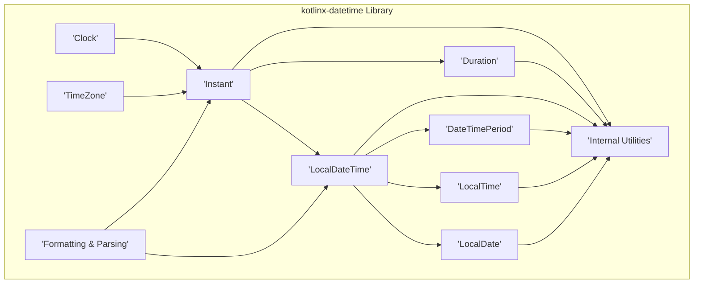
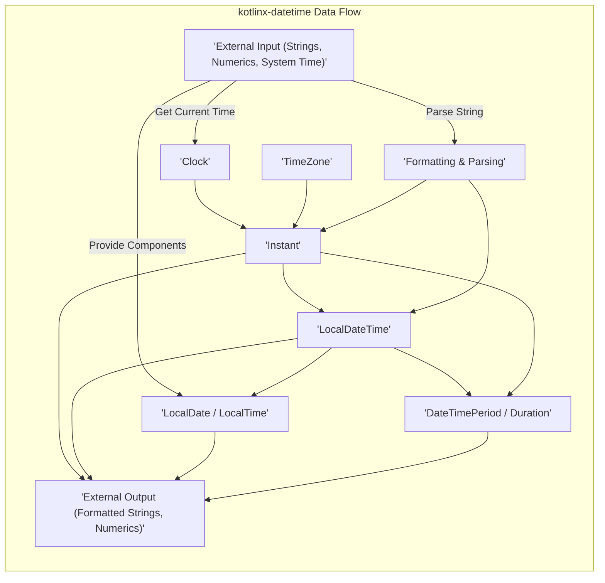
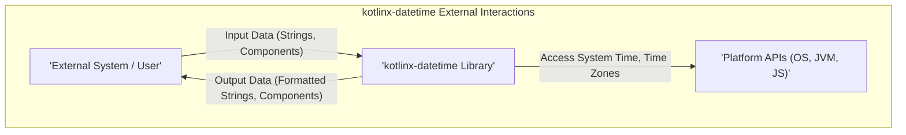

# Project Design Document: kotlinx-datetime Library

**Version:** 1.1
**Date:** October 26, 2023
**Author:** Gemini (AI Language Model)

## 1. Introduction

This document provides an enhanced architectural design of the `kotlinx-datetime` library, a multiplatform Kotlin library designed for robust and consistent date and time manipulation. This document is specifically crafted to serve as a foundation for thorough threat modeling, detailing the library's structure, data pathways, and interactions with external entities.

### 1.1. Project Overview

The `kotlinx-datetime` library offers a comprehensive and unified API for handling dates, times, time zones, and durations within Kotlin applications across diverse platforms (JVM, JS, Native). Its core functionalities encompass the creation, modification, formatting, and parsing of date and time values, ensuring platform consistency.

### 1.2. Goals

* To offer a precise and intuitive API for all date and time operations within Kotlin.
* To guarantee consistent behavior and functionality across all supported platforms, facilitating multiplatform development.
* To achieve optimal performance and resource utilization.
* To maintain an adaptable and extensible architecture capable of accommodating future enhancements and requirements.
* To provide a design document suitable for comprehensive threat modeling.

### 1.3. Scope

This design document is focused on the architectural aspects of the `kotlinx-datetime` library that are pertinent to security analysis and threat modeling. The scope includes:

* A detailed breakdown of the library's high-level architecture and its constituent components.
* An in-depth analysis of data flow within the library, highlighting potential transformation points.
* Identification of all interactions with external systems, data sources, and platform APIs.
* A preliminary assessment of security considerations from an architectural standpoint, laying the groundwork for detailed threat modeling.

### 1.4. Out of Scope

This document explicitly excludes:

* Granular implementation details of individual classes, methods, and algorithms.
* Specific performance metrics, benchmarking results, and optimization strategies.
* Concrete application-level use cases or integration patterns.
* The actual threat modeling process, including the identification of specific threats and vulnerabilities.

## 2. Architectural Overview

The `kotlinx-datetime` library employs a modular and layered architecture, promoting separation of concerns and platform independence. It strategically utilizes platform-specific APIs while presenting a unified, cross-platform interface to the developer.

### 2.1. High-Level Architecture

### 2.2. Key Components

* **Clock:**
    * Represents an abstract source of the current time.
    * Responsible for providing `Instant` values, the fundamental representation of a point in time.
    * Includes implementations for system clocks and allows for custom clock implementations (useful for testing or specific scenarios).
    * *Security Consideration:* The reliability and security of the time source are crucial. Tampering with the system clock could have significant implications.
* **TimeZone:**
    * Models a geographical region with uniform standard time and potential daylight saving time (DST) rules.
    * Manages the complexities of time zone transitions and historical time zone data.
    * Provides mechanisms for converting between the time zone-agnostic `Instant` and locale-specific `LocalDateTime`.
    * *Security Consideration:* Incorrect or outdated time zone data can lead to errors in time calculations, potentially impacting security-sensitive operations (e.g., scheduled events, access control).
* **Instant:**
    * Represents a specific moment in time with nanosecond precision, independent of any time zone or calendar system.
    * Serves as the foundational building block for other date and time types.
    * Typically represented as the number of nanoseconds from the Unix epoch.
* **LocalDateTime:**
    * Represents a date and time as perceived in a particular time zone (without the time zone information itself).
    * Consists of `LocalDate` and `LocalTime` components.
    * Used for representing local calendar dates and times.
* **LocalDate:**
    * Represents a calendar date, comprising year, month, and day.
    * Does not include time-of-day information.
* **LocalTime:**
    * Represents the time of day, including hour, minute, second, and nanosecond.
    * Does not include date information.
* **DateTimePeriod:**
    * Represents a period of time expressed in calendar units (years, months, days).
    * Useful for expressing durations that are dependent on the calendar.
* **Duration:**
    * Represents a length of time measured in seconds and nanoseconds.
    * Suitable for measuring precise intervals, independent of calendar systems.
* **Formatting & Parsing:**
    * Handles the conversion of date and time objects to and from string representations.
    * Supports a variety of formatting patterns, including standard and custom formats.
    * Incorporates locale-specific formatting rules.
    * *Security Consideration:* Parsing untrusted date/time strings can be a source of vulnerabilities if not handled carefully (e.g., format string bugs, denial-of-service through complex patterns).
* **Internal Utilities:**
    * Contains helper functions and classes used internally by the library.
    * Includes logic for platform abstraction and common calculations.

### 2.3. Data Flow

The primary data flow within `kotlinx-datetime` involves the creation, transformation, and representation of date and time information.

1. **Time Information Acquisition:**
    * Obtaining the current `Instant` from the configured `Clock`.
    * Receiving date and time components as numerical inputs (e.g., year, month, day, hour, minute).
    * Parsing date and time information from string representations using the `Formatting & Parsing` component.
2. **Date/Time Object Creation:**
    * Instantiating core date and time objects such as `Instant`, `LocalDateTime`, `LocalDate`, and `LocalTime`.
    * Constructing these objects using provided components, by converting from other date/time types, or through parsing.
3. **Manipulation and Calculation:**
    * Performing arithmetic operations on date and time objects, such as adding or subtracting `Duration` or `DateTimePeriod`.
    * Comparing date and time values to determine temporal order.
    * Extracting specific components from date and time objects (e.g., getting the day of the week from a `LocalDate`).
4. **Time Zone Conversion:**
    * Converting between the time zone-agnostic `Instant` and the time zone-aware `LocalDateTime` using `TimeZone` information.
    * Adjusting local date and time values based on the rules and offsets defined by a specific time zone.
5. **Formatting and Output:**
    * Converting date and time objects into human-readable string representations using the `Formatting & Parsing` component, potentially considering locale-specific rules.

## 3. External Interactions

`kotlinx-datetime` interacts with the external environment through well-defined interfaces, primarily relying on platform-specific functionalities and handling external data.

* **Platform-Specific APIs:**
    * Delegates to underlying platform APIs for core functionalities such as accessing the system clock and retrieving time zone information.
        * *Examples:* Java Time API (`java.time`) on the JVM, JavaScript `Date` object in JavaScript environments, and platform-specific timekeeping mechanisms on Native platforms.
    * The correctness and security of these interactions are dependent on the integrity of the underlying platform APIs.
* **Input Data:**
    * Accepts date and time information as strings adhering to various formats, which need to be parsed.
    * Receives individual date and time components as numerical values.
    * Relies on the underlying operating system or environment for the initial system time.
* **Output Data:**
    * Produces formatted date and time strings intended for human consumption or further processing.
    * Returns date and time components as numerical values.

## 4. Security Considerations (Architectural Level)

While `kotlinx-datetime` focuses on date and time manipulation and does not directly manage sensitive user data or network communications, its architectural design presents several security considerations:

* **Dependence on Platform API Security:**
    * The library's reliability and security are intrinsically linked to the security of the underlying platform's timekeeping and time zone data management. Vulnerabilities in these platform APIs could indirectly compromise `kotlinx-datetime`.
    * **Mitigation:** Stay informed about security advisories and updates for the target platforms. Implement defensive programming practices where interactions with platform APIs occur.
* **Input Validation During Parsing:**
    * The parsing functionality is a critical entry point and must be resilient against malformed or intentionally malicious input strings. Failure to properly validate input could lead to unexpected behavior, exceptions, or even denial-of-service attacks through resource exhaustion.
    * **Mitigation:** Implement rigorous input validation and sanitization techniques. Employ well-defined and strict parsing formats whenever possible. Consider using secure parsing libraries or techniques to mitigate format string vulnerabilities.
* **Time Zone Data Integrity:**
    * The accuracy and timeliness of time zone data are paramount. Incorrect or outdated time zone information can lead to incorrect date and time calculations, potentially causing security vulnerabilities in applications relying on precise timekeeping (e.g., scheduled tasks, audit logs, access control mechanisms).
    * **Mitigation:** Ensure the library utilizes up-to-date time zone data (e.g., by integrating with `tzdata`). Provide mechanisms for updating time zone data regularly. Consider validating the source and integrity of time zone data.
* **Potential for Denial of Service (DoS) through Computational Complexity:**
    * Although less probable, computationally intensive operations involving extremely large time intervals or highly complex formatting patterns could potentially be exploited to cause a denial of service by consuming excessive resources.
    * **Mitigation:** Be mindful of the performance implications of complex operations. Implement reasonable limits on input sizes and processing times. Consider adding safeguards against excessively complex formatting patterns.
* **Locale Handling Vulnerabilities:**
    * Improper handling of locale information during formatting and parsing could lead to unexpected output or potential vulnerabilities if locale-specific formatting rules are not correctly applied or sanitized. This could potentially be exploited in scenarios where formatted output is used in security-sensitive contexts.
    * **Mitigation:** Ensure proper handling and validation of locale information. Adhere to secure coding practices when dealing with locale-sensitive operations.

## 5. Deployment

The `kotlinx-datetime` library is typically deployed as a dependency within Kotlin projects. Its multiplatform nature enables its inclusion in projects targeting various environments.

* **JVM:** Included as a standard dependency using build tools like Maven or Gradle.
    * *Deployment Consideration:* Ensure the JVM environment has access to up-to-date time zone data.
* **JavaScript:** Integrated into JavaScript projects through the Kotlin/JS compiler.
    * *Deployment Consideration:* Be aware of the limitations and security considerations of the JavaScript `Date` object in different browser environments.
* **Native:** Linked into native applications using the Kotlin/Native compiler.
    * *Deployment Consideration:* Pay attention to the platform-specific timekeeping mechanisms and their security implications.

## 6. Technologies Used

* **Kotlin:** The primary programming language for the library.
* **Platform-Specific Date/Time APIs:**
    * Java Time API (`java.time`) on the Java Virtual Machine (JVM).
    * JavaScript `Date` object in JavaScript environments.
    * Platform-specific date and time functionalities on Native platforms (e.g., `Foundation.NSCalendar` on Apple platforms).

## 7. Diagrams

The diagrams presented in sections 2.1, 2.3, and 3 offer visual representations of the library's architecture, data flow, and external interactions, aiding in understanding its structure and potential attack surfaces.

## 8. Future Considerations

* **Enhanced Extensibility:** Providing more flexible mechanisms for developers to implement custom time zones, calendars, and clock sources.
* **Integration with External Time Sources:** Exploring options for integrating with more reliable and secure external time sources (e.g., NTP).
* **Formal Security Audits:** Conducting thorough security audits to identify and address potential vulnerabilities.

This enhanced design document provides a more detailed and nuanced understanding of the `kotlinx-datetime` library's architecture, specifically tailored for effective threat modeling. By carefully considering the components, data flow, external interactions, and potential security considerations outlined here, developers and security professionals can better assess and mitigate potential risks associated with the library's use.