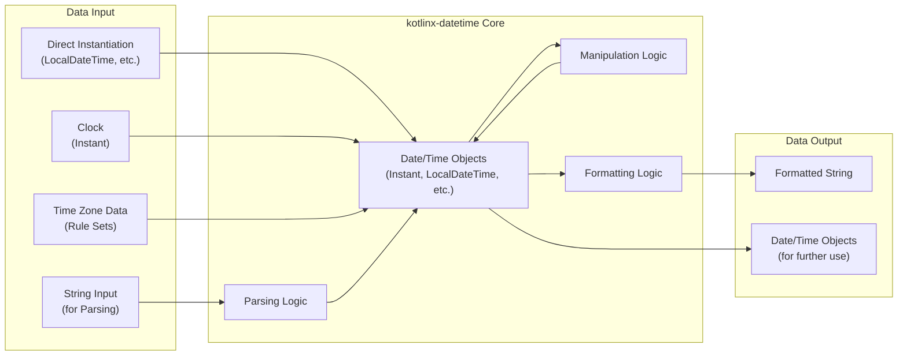

# Project Design Document: kotlinx-datetime for Threat Modeling (Improved)

**1. Introduction**

This document provides an enhanced and more detailed design overview of the `kotlinx-datetime` library (available at [https://github.com/kotlin/kotlinx-datetime](https://github.com/kotlin/kotlinx-datetime)). This improved version aims to provide a stronger foundation for subsequent threat modeling activities by offering greater clarity and specificity regarding the library's architecture, data flow, and potential security considerations.

**2. Goals and Objectives**

*   Deliver a refined and more granular architectural overview of the `kotlinx-datetime` library.
*   Provide a more detailed breakdown of key components and their interactions, emphasizing security-relevant aspects.
*   Clarify the data flow within the library, explicitly identifying data types and potential transformation points.
*   Offer a more comprehensive list of external dependencies, detailing their usage and associated security implications.
*   Sharpen the focus on potential areas of security concern, providing more specific examples for future threat modeling.
*   Enhance the overall clarity and readability of the document to facilitate a deeper understanding for security analysis.

**3. Architectural Overview**

`kotlinx-datetime` is a multiplatform Kotlin library designed to offer a consistent and robust API for handling dates and times across different platforms. Its multiplatform nature necessitates platform-specific implementations for core functionalities while maintaining a unified API.

The library's architecture revolves around core data types and functionalities:

*   **Instant:** Represents a precise point in time, independent of any calendar system or time zone.
*   **LocalDateTime:** Represents a date and time without any time zone information.
*   **LocalDate:** Represents a calendar date without any time zone information.
*   **LocalTime:** Represents a time of day without any time zone information.
*   **TimeZone:** Encapsulates the rules and offsets for a specific geographical region, crucial for converting between `Instant` and local date/time representations.
*   **DateTimeUnit:** Represents units of time (e.g., seconds, days, months) used for calculations.
*   **Period:** Represents a duration of time in terms of calendar units (years, months, days).
*   **Duration:** Represents a duration of time in terms of seconds and nanoseconds.
*   **Clock:** An abstraction for obtaining the current `Instant`, allowing for testability and controlled time sources.
*   **Formatting:**  Handles the conversion of date/time objects into human-readable string representations.
*   **Parsing:** Handles the conversion of string representations into date/time objects.

Platform-specific implementations handle the underlying interactions with the operating system's timekeeping mechanisms and time zone data.

**4. Component Diagram**

```mermaid
graph LR
    subgraph "kotlinx-datetime Core"
        direction LR
        A["Instant"]
        B["LocalDateTime"]
        C["LocalDate"]
        D["LocalTime"]
        E["TimeZone"]
        F["DateTimeUnit"]
        G["Period"]
        H["Duration"]
        I["Clock"]
        subgraph "Formatting & Parsing"
            J["Formatters"]
            K["Parsers"]
        end
    end
    subgraph "Platform Implementations"
        L["JVM (java.time)"]
        M["JavaScript (Date API)"]
        N["Native (OS Time APIs)"]
    end
    subgraph "External Data"
        O["Time Zone Database (IANA)"]
    end

    A --> B
    A --> E
    B --> C
    B --> D
    E --> O
    J --> A
    J --> B
    J --> C
    J --> D
    J --> E
    K --> A
    K --> B
    K --> C
    K --> D
    K --> E

    "kotlinx-datetime Core" --> L
    "kotlinx-datetime Core" --> M
    "kotlinx-datetime Core" --> N
```

**5. Data Flow**

The data flowing through `kotlinx-datetime` primarily consists of representations of date and time information. The flow can be described as follows:

*   **Input:**
    *   **Direct Instantiation:** Creating date/time objects directly in code (e.g., `LocalDateTime`). Data type: `LocalDateTime`, `LocalDate`, `LocalTime`, etc.
    *   **String Input (Parsing):**  Converting strings into date/time objects using formatters. Data type: `String` -> `LocalDateTime`, `Instant`, etc.
    *   **Clock Input:** Obtaining the current `Instant`. Data type: `Instant`.
    *   **Time Zone Data:** Loading time zone rules from external sources. Data type: Time zone rule sets.
*   **Processing:**
    *   **Creation & Manipulation:** Performing operations like adding durations, adjusting time zones, comparing dates. Data type: `LocalDateTime`, `Instant`, `Duration`, `Period`.
    *   **Formatting:** Converting date/time objects into strings. Data type: `LocalDateTime`, `Instant`, etc. -> `String`.
    *   **Parsing:** Converting strings into date/time objects. Data type: `String` -> `LocalDateTime`, `Instant`, etc.
*   **Output:**
    *   **Formatted String:**  Human-readable representation of date/time. Data type: `String`.
    *   **Date/Time Objects:**  Representations of dates and times for further use within the application. Data type: `LocalDateTime`, `Instant`, etc.



**6. Key Components and Their Functionality (with Security Focus)**

*   **Instant:** Represents a fundamental, unambiguous point in time. Security considerations are less direct but crucial for the accuracy of time-sensitive operations.
*   **LocalDateTime, LocalDate, LocalTime:** Represent local date and time information. Potential security issues arise from incorrect interpretation or manipulation without proper time zone context.
*   **TimeZone:**  Responsible for complex time zone calculations. Relies heavily on external time zone data.
    *   **Security Focus:** Outdated or corrupted time zone data can lead to incorrect calculations, impacting security-critical features like access control or event logging.
*   **DateTimeUnit, Period, Duration:** Used for time calculations.
    *   **Security Focus:**  Potential for integer overflow or underflow during calculations with very large or small time units, leading to unexpected behavior.
*   **Clock:** Provides the current time.
    *   **Security Focus:** While the library itself doesn't control the system clock, applications using the library should be aware of the security implications of relying on an untrusted clock source.
*   **Formatting:** Converts date/time objects to strings.
    *   **Security Focus:** Format strings, if influenced by user input, could potentially lead to vulnerabilities (though less common in modern APIs). Information leakage through overly verbose or sensitive formatting patterns is also a concern.
*   **Parsing:** Converts strings to date/time objects.
    *   **Security Focus:** This is a critical area for potential vulnerabilities.
        *   **Input Validation:**  Insufficient validation of input strings can lead to parsing errors, denial-of-service, or even code execution vulnerabilities in extreme cases (though less likely in this specific library).
        *   **Format String Mismatches:**  Incorrectly handling mismatches between the input string and the expected format can lead to unexpected results or errors.
        *   **Locale Handling:** Inconsistent or insecure handling of locale-specific formatting rules can introduce vulnerabilities.

**7. External Dependencies and Security Implications**

`kotlinx-datetime` relies on platform-specific APIs and data, introducing potential security considerations:

*   **JVM (java.time):** Utilizes the `java.time` package.
    *   **Security Implications:** Vulnerabilities in the underlying `java.time` implementation could affect `kotlinx-datetime`. Staying updated with JVM security patches is crucial.
*   **JavaScript (Date API):** Leverages the built-in `Date` object.
    *   **Security Implications:**  Inconsistencies and potential vulnerabilities in different browser implementations of the `Date` API could impact the library's behavior on the JavaScript platform.
*   **Native (OS Time APIs):** Relies on operating system-level timekeeping functions.
    *   **Security Implications:** Vulnerabilities in the underlying operating system's time handling mechanisms could affect the accuracy and security of `kotlinx-datetime` on native platforms.
*   **Time Zone Database (IANA):**  The accuracy of time zone calculations depends on this external database.
    *   **Security Implications:**
        *   **Outdated Data:** Using an outdated version of the IANA database can lead to incorrect time zone calculations, potentially impacting security-sensitive operations.
        *   **Data Integrity:** While less likely, if the IANA database itself were compromised, it could have widespread implications. The library's mechanism for obtaining and using this data needs to be considered.

**8. Security Considerations (Categorized)**

*   **Input Validation and Parsing:**
    *   Robust validation of input strings during parsing is crucial to prevent errors and potential vulnerabilities.
    *   Careful handling of different date/time formats and locales is necessary.
    *   Error handling during parsing should be secure and prevent information leakage.
*   **Time Zone Handling:**
    *   Ensure the library uses an up-to-date and trusted source for time zone data.
    *   Handle ambiguous local date-times (e.g., during DST transitions) correctly to avoid logical errors.
*   **Platform Dependencies:**
    *   Be aware of potential security vulnerabilities in the underlying platform's timekeeping APIs.
    *   Keep platform dependencies updated with the latest security patches.
*   **Arithmetic Operations:**
    *   Implement checks to prevent integer overflow or underflow during date/time calculations.
*   **Information Disclosure:**
    *   Avoid exposing sensitive information through overly detailed or poorly controlled formatting patterns.
*   **Denial of Service:**
    *   Guard against potential denial-of-service attacks by limiting resource consumption during parsing of excessively long or complex date/time strings.

**9. Potential Threats (Specific Examples)**

*   An attacker provides an excessively long date/time string to the parsing function, leading to excessive resource consumption and a denial-of-service.
*   An outdated IANA time zone database results in incorrect calculation of password reset link expiration times, allowing unauthorized access.
*   Integer overflow during a calculation involving `Duration` leads to an incorrect timestamp being used for an audit log entry.
*   A vulnerability in the underlying JVM's `java.time` implementation allows an attacker to craft a specific date/time string that crashes the application.
*   Improper handling of locale-specific parsing rules allows an attacker to bypass validation checks by providing a date in an unexpected format.

**10. Conclusion**

This improved design document provides a more detailed and security-focused overview of the `kotlinx-datetime` library. By elaborating on the architecture, data flow, key components, and external dependencies, it offers a stronger foundation for conducting thorough threat modeling. The identified security considerations and potential threats serve as valuable starting points for proactively addressing potential vulnerabilities and ensuring the secure usage of this library.