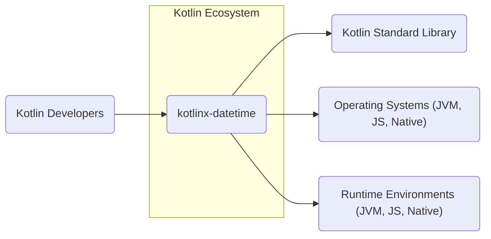
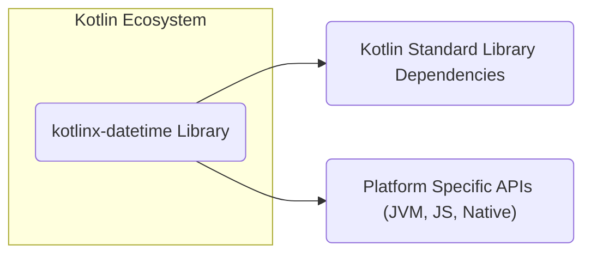
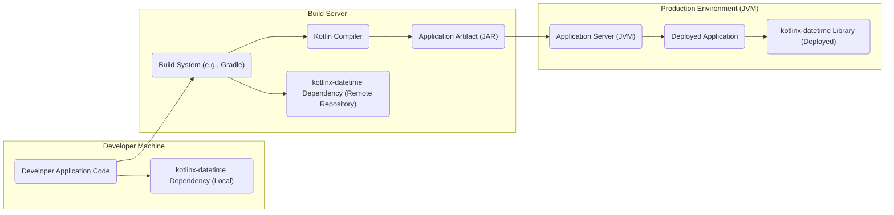
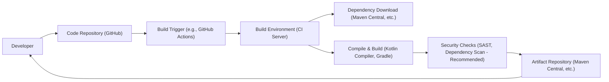

# BUSINESS POSTURE

This project, kotlinx-datetime, aims to provide a comprehensive, multiplatform date and time library for Kotlin. The primary business priority is to offer Kotlin developers a reliable and efficient way to handle date and time operations across different platforms (JVM, JS, Native). The goal is to improve developer productivity and code quality by providing a well-designed and easy-to-use API for date and time manipulation, reducing the need to rely on platform-specific or less robust alternatives.

Key business risks associated with this project include:
- Incorrect date and time calculations: If the library contains bugs or logic errors, it could lead to incorrect date and time representations and calculations in applications using it. This can result in business logic errors, data corruption, and incorrect system behavior.
- Performance issues: Inefficient date and time operations can negatively impact the performance of applications, especially those that heavily rely on date and time processing.
- Compatibility problems: Issues with cross-platform compatibility can limit the library's usability and adoption, defeating its purpose of providing a multiplatform solution.
- Security vulnerabilities: Although less likely in a date/time library, vulnerabilities could potentially exist, especially in parsing or formatting routines, which could be exploited if not properly handled.

# SECURITY POSTURE

Existing security controls for the kotlinx-datetime project are primarily those inherent in the open-source development model and GitHub platform:
- security control: Code review process via pull requests on GitHub. Implemented on GitHub.
- security control: Issue tracking and bug reporting via GitHub Issues. Implemented on GitHub.
- security control: Publicly accessible codebase on GitHub, allowing for community scrutiny. Implemented on GitHub.

Accepted risks for the project include:
- accepted risk: Dependency on the Kotlin language and its ecosystem.
- accepted risk: Potential for undiscovered vulnerabilities in the library code.
- accepted risk: Reliance on community contributions and maintenance.

Recommended security controls to enhance the security posture:
- recommended security control: Implement automated dependency scanning to detect known vulnerabilities in third-party dependencies used during development or testing.
- recommended security control: Integrate static analysis security testing (SAST) tools into the CI/CD pipeline to automatically scan the codebase for potential security weaknesses.
- recommended security control: Consider incorporating fuzz testing to identify potential vulnerabilities in parsing and formatting functions by providing a wide range of invalid or unexpected inputs.

Security requirements for the kotlinx-datetime project:
- Authentication: Not applicable. This is a library and does not handle user authentication.
- Authorization: Not applicable. This is a library and does not handle user authorization.
- Input validation: Input validation is crucial, especially when parsing date and time strings from external sources. The library must robustly handle invalid or malformed input to prevent unexpected behavior or potential vulnerabilities. Input validation should be implemented in parsing functions to ensure data conforms to expected formats and ranges.
- Cryptography: Not applicable. Cryptography is not a core requirement for a date and time library. However, if the library were to handle sensitive time-related data (which is not the current scope), cryptographic considerations might become relevant.

# DESIGN

The kotlinx-datetime project is designed as a Kotlin library providing date and time functionalities. It is intended to be used by Kotlin developers in various applications across different platforms.

## C4 CONTEXT

Elements of the context diagram:

- Name: Kotlin Developers
  - Type: User
  - Description: Developers who use the kotlinx-datetime library in their Kotlin projects.
  - Responsibilities: Utilize the library to implement date and time logic in their applications.
  - Security controls: Responsible for using the library correctly and securely within their applications.

- Name: kotlinx-datetime
  - Type: System
  - Description: The Kotlin multiplatform date and time library.
  - Responsibilities: Provide comprehensive date and time functionalities for Kotlin applications across different platforms.
  - Security controls: Input validation in parsing functions, adherence to secure coding practices during development.

- Name: Kotlin Standard Library
  - Type: System
  - Description: The standard library for the Kotlin programming language, which kotlinx-datetime may depend on.
  - Responsibilities: Provide core functionalities and utilities for Kotlin programs.
  - Security controls: Security controls are managed by the Kotlin language and standard library development team.

- Name: Operating Systems (JVM, JS, Native)
  - Type: System Environment
  - Description: The operating systems on which Kotlin applications using kotlinx-datetime are deployed (e.g., Windows, Linux, macOS, browsers, mobile OS).
  - Responsibilities: Provide the underlying platform for running Kotlin applications.
  - Security controls: Security controls are managed by the respective operating system vendors.

- Name: Runtime Environments (JVM, JS, Native)
  - Type: System Environment
  - Description: The runtime environments where Kotlin code executes (e.g., Java Virtual Machine, JavaScript engines, Native execution environments).
  - Responsibilities: Execute Kotlin bytecode or compiled code.
  - Security controls: Security controls are managed by the respective runtime environment developers.

## C4 CONTAINER

Elements of the container diagram:

- Name: kotlinx-datetime Library
  - Type: Library
  - Description: The core kotlinx-datetime library, implemented in Kotlin, providing date and time API.
  - Responsibilities: Encapsulate all date and time functionalities, expose API for developers, handle platform-specific implementations.
  - Security controls: Input validation, secure coding practices, potentially SAST during build process.

- Name: Kotlin Standard Library Dependencies
  - Type: Dependency
  - Description: Parts of the Kotlin Standard Library that kotlinx-datetime depends on for core functionalities.
  - Responsibilities: Provide basic utilities and data structures used by kotlinx-datetime.
  - Security controls: Security controls are managed by the Kotlin standard library development team.

- Name: Platform Specific APIs (JVM, JS, Native)
  - Type: Interface
  - Description: Platform-specific APIs that kotlinx-datetime might interact with to leverage underlying platform capabilities for date and time operations.
  - Responsibilities: Provide access to platform-specific date and time functionalities when necessary.
  - Security controls: Reliance on the security of the underlying platform APIs.

## DEPLOYMENT

The kotlinx-datetime library itself is not deployed as a standalone application. Instead, it is distributed as a library (e.g., JAR files for JVM, JS modules for JavaScript, and native libraries for Native platforms) and is included as a dependency in Kotlin applications.

Deployment Diagram (Example for a JVM application using kotlinx-datetime):

Elements of the deployment diagram:

- Name: Developer Application Code
  - Type: Software
  - Description: The Kotlin application code developed by a developer that utilizes the kotlinx-datetime library.
  - Responsibilities: Implement application-specific logic, including date and time operations using kotlinx-datetime.
  - Security controls: Secure coding practices by the developer, input validation at application level.

- Name: kotlinx-datetime Dependency (Local/Remote)
  - Type: Library Dependency
  - Description: The kotlinx-datetime library, either as a local dependency on the developer machine or fetched from a remote repository during build.
  - Responsibilities: Provide date and time functionalities to the application.
  - Security controls: Dependency management practices, vulnerability scanning of dependencies (recommended).

- Name: Build System (e.g., Gradle)
  - Type: Tool
  - Description: A build automation tool used to compile, build, and package the Kotlin application.
  - Responsibilities: Manage dependencies, compile code, create deployable artifacts.
  - Security controls: Secure build configurations, dependency integrity checks (recommended).

- Name: Kotlin Compiler
  - Type: Tool
  - Description: The Kotlin compiler that compiles Kotlin code into bytecode or native code.
  - Responsibilities: Compile Kotlin source code.
  - Security controls: Security of the Kotlin compiler itself (managed by Kotlin development team).

- Name: Application Artifact (JAR)
  - Type: Artifact
  - Description: The packaged application artifact (e.g., a JAR file for JVM) containing the application code and dependencies, including kotlinx-datetime.
  - Responsibilities: Deployable unit of the application.
  - Security controls: Artifact signing (optional), secure storage and transfer of artifacts.

- Name: Application Server (JVM)
  - Type: Environment
  - Description: The runtime environment where the application artifact is deployed and executed (e.g., a JVM application server).
  - Responsibilities: Host and run the deployed application.
  - Security controls: Server hardening, access controls, runtime environment security.

- Name: Deployed Application
  - Type: Software Instance
  - Description: An instance of the Kotlin application running in the production environment.
  - Responsibilities: Execute application logic, serve users or processes.
  - Security controls: Application-level security controls, input validation, authorization, monitoring.

- Name: kotlinx-datetime Library (Deployed)
  - Type: Library Instance
  - Description: Instance of the kotlinx-datetime library deployed as part of the application.
  - Responsibilities: Provide date and time functionalities to the running application.
  - Security controls: Inherited security from the library itself and the runtime environment.

## BUILD

The build process for projects using kotlinx-datetime typically involves the following steps, focusing on security aspects:

Elements of the build diagram:

- Name: Developer
  - Type: Person
  - Description: Software developer contributing to or using kotlinx-datetime.
  - Responsibilities: Write code, commit changes, initiate builds.
  - Security controls: Developer workstation security, secure coding practices, code review.

- Name: Code Repository (GitHub)
  - Type: System
  - Description: Version control system hosting the source code of kotlinx-datetime or projects using it.
  - Responsibilities: Store and manage source code, track changes, facilitate collaboration.
  - Security controls: Access controls, authentication, audit logging, branch protection.

- Name: Build Trigger (e.g., GitHub Actions)
  - Type: Automation
  - Description: Automated system that triggers the build process upon code changes or scheduled events.
  - Responsibilities: Automate build initiation, orchestrate build steps.
  - Security controls: Secure configuration of build triggers, access control to build pipelines.

- Name: Build Environment (CI Server)
  - Type: System
  - Description: Server environment where the build process is executed (e.g., GitHub Actions runners, Jenkins).
  - Responsibilities: Execute build steps, compile code, run tests, package artifacts.
  - Security controls: Secure build environment configuration, access controls, isolation of build processes.

- Name: Dependency Download (Maven Central, etc.)
  - Type: Process
  - Description: Downloading external dependencies required for building the project, including kotlinx-datetime itself or its dependencies.
  - Responsibilities: Fetch necessary libraries and components for the build.
  - Security controls: Dependency integrity checks (e.g., using checksums), using trusted dependency repositories, dependency scanning (recommended).

- Name: Compile & Build (Kotlin Compiler, Gradle)
  - Type: Process
  - Description: Compiling the Kotlin source code and building the library or application using build tools like Gradle and the Kotlin compiler.
  - Responsibilities: Convert source code into executable artifacts, manage build process.
  - Security controls: Secure build configurations, compiler security (managed by Kotlin team).

- Name: Security Checks (SAST, Dependency Scan - Recommended)
  - Type: Process
  - Description: Automated security checks performed during the build process, such as Static Application Security Testing (SAST) and dependency vulnerability scanning.
  - Responsibilities: Identify potential security vulnerabilities in the codebase and dependencies.
  - Security controls: SAST tool configuration, vulnerability database updates, integration with build pipeline.

- Name: Artifact Repository (Maven Central, etc.)
  - Type: System
  - Description: Repository where build artifacts (libraries, applications) are published and stored.
  - Responsibilities: Store and distribute build artifacts.
  - Security controls: Access controls, artifact signing, secure storage, vulnerability scanning of published artifacts (recommended for library maintainers).

# RISK ASSESSMENT

Critical business process protected by kotlinx-datetime is the correct handling of date and time in applications. Incorrect date and time calculations can impact various business processes depending on the application domain, such as financial transactions, scheduling systems, logging, data analysis, and more.

Data protected by kotlinx-datetime is primarily date and time information itself. The sensitivity of this data depends entirely on the context of the application using the library. In some applications, date and time might be considered non-sensitive public information. In others, especially those dealing with personal schedules, timestamps of events, or financial records, date and time data can be highly sensitive and require protection to maintain privacy, integrity, and compliance.

# QUESTIONS & ASSUMPTIONS

Questions:
- What are the specific performance requirements for kotlinx-datetime in different target platforms?
- Are there any specific compliance requirements (e.g., GDPR, HIPAA) that applications using kotlinx-datetime might need to adhere to, which could influence the library's design or security considerations?
- Is there a plan for regular security audits or penetration testing of kotlinx-datetime?

Assumptions:
- BUSINESS POSTURE: Correctness and reliability are the highest priorities for kotlinx-datetime. Ease of use and multiplatform compatibility are also critical business goals.
- SECURITY POSTURE: Standard open-source development security practices are followed. The project benefits from community scrutiny and contributions to identify and address potential issues. Security is primarily focused on preventing bugs and ensuring correct behavior, with less emphasis on traditional application security concerns like authentication or authorization, as it is a library.
- DESIGN: The library is designed to be modular and extensible to support various date and time functionalities and platform-specific requirements. The API is designed for ease of use and clarity, minimizing the potential for developer errors that could lead to security issues or incorrect behavior.