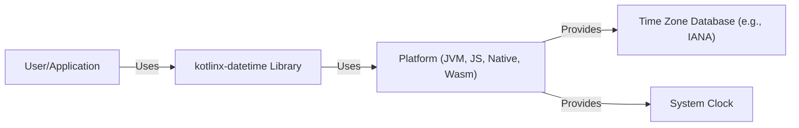
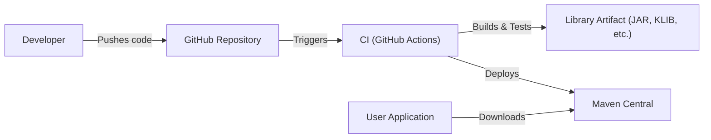
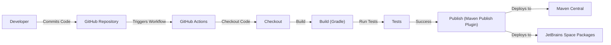

# Project Design Document: kotlinx-datetime

## BUSINESS POSTURE

Priorities and Goals:

*   Provide a multiplatform library for working with date and time in Kotlin.
*   Offer a more intuitive and modern API compared to the standard Java `java.time` API, while maintaining compatibility.
*   Ensure correctness and consistency across different platforms (JVM, JS, Native, Wasm).
*   Minimize external dependencies to keep the library lightweight.
*   Provide a stable and well-documented API for long-term maintainability.

Business Risks:

*   Incorrect date/time calculations leading to application errors. This is particularly critical in financial, scheduling, and logging applications.
*   Inconsistencies in behavior across different platforms, leading to platform-specific bugs.
*   Security vulnerabilities related to time-based attacks (e.g., timing attacks, although less likely in a date/time library).
*   Adoption risk: If developers don't find the library sufficiently better than existing solutions, it may not gain traction.
*   Maintenance risk: If the library is not actively maintained, it may become outdated and incompatible with future Kotlin versions.

## SECURITY POSTURE

Existing Security Controls:

*   security control: The library itself does not directly handle sensitive data or perform security-critical operations like authentication or authorization. Its primary function is date/time manipulation.
*   security control: The project uses GitHub Actions for continuous integration, which includes build checks and tests. (Described in .github/workflows directory).
*   security control: The project is open-source, allowing for community review and contributions, which can help identify and address potential security issues.
*   security control: The library aims to be consistent with the behavior of `java.time` where applicable, leveraging the security considerations already built into that library.
*   security control: The library uses a well-defined and documented API, reducing the risk of misuse.

Accepted Risks:

*   accepted risk: The library relies on the underlying platform's time zone database (e.g., IANA Time Zone Database), which may be subject to updates and potential inaccuracies.
*   accepted risk: The library does not directly address denial-of-service attacks, as it's primarily a computational library.
*   accepted risk: The library does not implement specific mitigations against timing attacks, as its primary focus is not on cryptographic operations.

Recommended Security Controls:

*   security control: Integrate static analysis tools (e.g., linters, SAST) into the CI pipeline to identify potential code quality and security issues.
*   security control: Regularly update dependencies to address any known vulnerabilities.
*   security control: Consider adding fuzz testing to test the library with unexpected or invalid inputs.

Security Requirements:

*   Authentication: Not directly applicable to this library.
*   Authorization: Not directly applicable to this library.
*   Input Validation: The library should validate input parameters to ensure they are within acceptable ranges and formats, preventing potential errors or crashes. This is crucial for preventing unexpected behavior.
*   Cryptography: Not directly applicable to this library, as it does not handle encryption or hashing.
*   Data Validation: The library should ensure that date and time values are consistent and valid, preventing illogical dates or times.

## DESIGN

### C4 CONTEXT

Element Descriptions:

*   Element:
    *   Name: User/Application
    *   Type: User/External System
    *   Description: A Kotlin application that uses the kotlinx-datetime library.
    *   Responsibilities: Consumes the kotlinx-datetime API to perform date and time operations.
    *   Security controls: Relies on the security controls implemented within the kotlinx-datetime library and the underlying platform.

*   Element:
    *   Name: kotlinx-datetime Library
    *   Type: Software System
    *   Description: The multiplatform Kotlin library for date and time manipulation.
    *   Responsibilities: Provides a consistent and intuitive API for date and time operations across different platforms.
    *   Security controls: Input validation, reliance on platform-specific time zone databases and system clocks.

*   Element:
    *   Name: Platform (JVM, JS, Native, Wasm)
    *   Type: Platform
    *   Description: The underlying platform on which the Kotlin code runs (JVM, JavaScript engine, Native environment, WebAssembly).
    *   Responsibilities: Provides the runtime environment and access to system resources, including the system clock and time zone database.
    *   Security controls: Platform-specific security mechanisms, including sandboxing and access controls.

*   Element:
    *   Name: Time Zone Database (e.g., IANA)
    *   Type: External System
    *   Description: The database containing time zone information.
    *   Responsibilities: Provides data for time zone conversions and calculations.
    *   Security controls: Relies on the integrity and accuracy of the time zone database provider.

*   Element:
    *   Name: System Clock
    *   Type: External System
    *   Description: The system's clock, providing the current time.
    *   Responsibilities: Provides the current time to the application.
    *   Security controls: Relies on the security and accuracy of the system's clock configuration.

### C4 CONTAINER

Since `kotlinx-datetime` is a library, the container diagram is essentially the same as the context diagram. The library itself is the single "container."

Element Descriptions:

*   Element:
    *   Name: User/Application
    *   Type: User/External System
    *   Description: A Kotlin application that uses the kotlinx-datetime library.
    *   Responsibilities: Consumes the kotlinx-datetime API to perform date and time operations.
    *   Security controls: Relies on the security controls implemented within the kotlinx-datetime library and the underlying platform.

*   Element:
    *   Name: kotlinx-datetime Library
    *   Type: Software System
    *   Description: The multiplatform Kotlin library for date and time manipulation.
    *   Responsibilities: Provides a consistent and intuitive API for date and time operations across different platforms.
    *   Security controls: Input validation, reliance on platform-specific time zone databases and system clocks.

*   Element:
    *   Name: Platform (JVM, JS, Native, Wasm)
    *   Type: Platform
    *   Description: The underlying platform on which the Kotlin code runs (JVM, JavaScript engine, Native environment, WebAssembly).
    *   Responsibilities: Provides the runtime environment and access to system resources, including the system clock and time zone database.
    *   Security controls: Platform-specific security mechanisms, including sandboxing and access controls.

*   Element:
    *   Name: Time Zone Database (e.g., IANA)
    *   Type: External System
    *   Description: The database containing time zone information.
    *   Responsibilities: Provides data for time zone conversions and calculations.
    *   Security controls: Relies on the integrity and accuracy of the time zone database provider.

*   Element:
    *   Name: System Clock
    *   Type: External System
    *   Description: The system's clock, providing the current time.
    *   Responsibilities: Provides the current time to the application.
    *   Security controls: Relies on the security and accuracy of the system's clock configuration.

### DEPLOYMENT

Possible Deployment Solutions:

1.  **Maven Central/Gradle:** The most common deployment method for Kotlin libraries. Developers add the library as a dependency in their build.gradle.kts or pom.xml file.
2.  **GitHub Packages:** Another option for distributing the library, particularly useful for pre-release versions or private repositories.
3.  **Local Repository:** Developers can build the library locally and include it directly in their projects.

Chosen Solution (Maven Central/Gradle):

Element Descriptions:

*   Element:
    *   Name: Developer
    *   Type: Person
    *   Description: A developer working on the kotlinx-datetime library.
    *   Responsibilities: Writes code, tests, and documentation.
    *   Security controls: Code review, secure coding practices.

*   Element:
    *   Name: GitHub Repository
    *   Type: Source Code Repository
    *   Description: The Git repository hosted on GitHub.
    *   Responsibilities: Stores the source code, tracks changes, and manages collaboration.
    *   Security controls: Access controls, branch protection rules, code review requirements.

*   Element:
    *   Name: CI (GitHub Actions)
    *   Type: Continuous Integration System
    *   Description: The CI system that automates builds, tests, and deployment.
    *   Responsibilities: Runs builds and tests on every code change, and deploys the library to Maven Central upon successful builds and tagging.
    *   Security controls: Secure configuration of CI workflows, access controls to secrets (e.g., deployment credentials).

*   Element:
    *   Name: Library Artifact (JAR, KLIB, etc.)
    *   Type: Artifact
    *   Description: The compiled library files (JAR for JVM, KLIB for Kotlin/Native, etc.).
    *   Responsibilities: Represents the deployable unit of the library.
    *   Security controls: Code signing (optional, but recommended).

*   Element:
    *   Name: Maven Central
    *   Type: Artifact Repository
    *   Description: The central repository for Maven artifacts.
    *   Responsibilities: Stores and distributes the library artifacts.
    *   Security controls: Access controls, integrity checks (checksums).

*   Element:
    *   Name: User Application
    *   Type: Application
    *   Description: An application that uses the kotlinx-datetime library.
    *   Responsibilities: Downloads the library from Maven Central and uses it in its code.
    *   Security controls: Dependency management, vulnerability scanning of dependencies.

### BUILD

Build Process Description:

1.  **Developer Commits Code:** A developer commits changes to the `kotlinx-datetime` repository on GitHub.
2.  **GitHub Triggers Workflow:** GitHub detects the commit and triggers the configured GitHub Actions workflow.
3.  **GitHub Actions:** The workflow starts running on a GitHub-hosted runner.
4.  **Checkout Code:** The workflow checks out the source code from the repository.
5.  **Build (Gradle):** The Gradle build system is invoked to compile the code for all target platforms (JVM, JS, Native, Wasm). This step may involve multiple sub-steps for different targets.
6.  **Run Tests:** The Gradle build runs the unit tests and integration tests for each target platform.
7.  **Publish (Maven Publish Plugin):** If all builds and tests are successful, the Gradle Maven Publish plugin is used to publish the library artifacts to Maven Central and JetBrains Space Packages. This typically involves signing the artifacts.
8.  **Deploy:** The artifacts are deployed to the respective repositories, making them available for developers to use.

Security Controls in Build Process:

*   security control: **GitHub Actions:** Provides a secure and automated build environment.
*   security control: **Gradle:** A well-established build system with built-in security features (e.g., dependency verification).
*   security control: **Tests:** Comprehensive unit and integration tests help ensure code quality and prevent regressions.
*   security control: **Maven Publish Plugin:** Supports artifact signing, which helps ensure the integrity and authenticity of the published library.
*   security control: **Dependency Management:** Gradle manages dependencies, allowing for version control and vulnerability scanning.
*   security control: **Static Analysis (Potential):** Integration of static analysis tools (linters, SAST) into the GitHub Actions workflow can further enhance security.

## RISK ASSESSMENT

Critical Business Processes:

*   Accurate date and time calculations in applications that rely on this library. This is critical for various domains, including finance, scheduling, logging, and data analysis.
*   Consistent behavior across different platforms.

Data Protection:

*   The library itself does not handle sensitive data directly. It primarily deals with date and time values, which are generally not considered sensitive in isolation. However, incorrect date/time handling can indirectly impact the security and integrity of sensitive data in applications that use the library.
*   Data Sensitivity: Low (for the library itself), but potentially high for applications using the library, depending on the context.

## QUESTIONS & ASSUMPTIONS

Questions:

*   Are there any specific compliance requirements (e.g., for financial applications) that need to be considered?
*   What is the expected level of accuracy for time zone calculations (e.g., handling of historical time zone changes)?
*   Are there any plans to support specific time scales (e.g., TAI, UTC-SLS) beyond the standard Gregorian calendar and UTC?
*   What level of backward compatibility is required for future releases?

Assumptions:

*   BUSINESS POSTURE: The primary goal is to provide a reliable and accurate date/time library for Kotlin developers.
*   BUSINESS POSTURE: The library is intended for general-purpose use and does not target any specific high-security domain.
*   SECURITY POSTURE: The underlying platform's time zone database and system clock are assumed to be reasonably accurate and secure.
*   SECURITY POSTURE: Developers using the library are responsible for securing their own applications and data.
*   DESIGN: The library's design prioritizes simplicity, consistency, and ease of use.
*   DESIGN: The library will be actively maintained and updated to address bug fixes and security vulnerabilities.