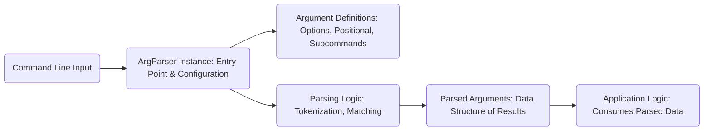
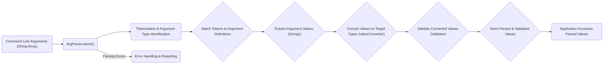

# Project Design Document: kotlinx.cli

**Version:** 1.1
**Date:** October 26, 2023
**Author:** AI Software Architect

## 1. Introduction

This document provides a detailed design overview of the `kotlinx.cli` library, a Kotlin library designed for parsing command-line arguments. The primary purpose of this document is to clearly articulate the library's architecture, its constituent components, and the flow of data during the argument parsing process. This detailed description will serve as a foundation for effective threat modeling activities, enabling the identification of potential security vulnerabilities within the library's design and functionality.

## 2. Goals and Non-Goals

### 2.1. Goals

*   Provide a comprehensive and easily understandable description of the `kotlinx.cli` library's architecture and its internal components.
*   Clearly illustrate the data flow within the library as it processes command-line arguments from input to application usage.
*   Identify the key areas and specific components within the library that are most relevant for security considerations and subsequent threat modeling exercises.
*   Serve as a foundational document to guide future security analysis efforts and the development of threat mitigation strategies.

### 2.2. Non-Goals

*   This document is explicitly not intended to be a security assessment or a threat analysis report. It focuses on describing the design, not evaluating its security.
*   The document will not delve into implementation details at the code level. The focus is on the architectural design and component interactions.
*   Performance characteristics, optimization strategies, and benchmarking of the library are outside the scope of this document.
*   Details regarding the library's testing methodologies, quality assurance processes, or build systems are not covered here.

## 3. High-Level Architecture

The `kotlinx.cli` library employs a structured, multi-stage approach to command-line argument parsing. The core process involves the definition of expected arguments, the actual parsing of the input provided by the user, the validation of the parsed values against defined rules, and finally, making the processed and validated data accessible for use within the application's logic.

*   **Command Line Input:** This represents the raw array of string arguments provided to the application when it is executed from the command line.
*   **ArgParser Instance: Entry Point & Configuration:** This is the central component of the library. It's responsible for holding the configuration of the argument parsing process, including the definitions of all expected arguments. It serves as the entry point for initiating the parsing operation.
*   **Argument Definitions: Options, Positional, Subcommands:** This refers to the declarations of the expected command-line elements. These definitions specify the types of arguments (options with flags, positional arguments based on order, and subcommands for more complex interfaces), their names, expected data types, and any validation rules associated with them.
*   **Parsing Logic: Tokenization, Matching:** This is the core engine of the library. It takes the raw input, breaks it down into individual tokens, and then attempts to match these tokens against the predefined argument definitions. This involves identifying options based on prefixes (like `-` or `--`), determining the order of positional arguments, and recognizing specified subcommands.
*   **Parsed Arguments: Data Structure of Results:** This represents the output of the parsing process. It's a structured data representation containing the extracted and potentially converted values of the arguments provided by the user. This structure makes the parsed data readily accessible to the application.
*   **Application Logic: Consumes Parsed Data:** This is the user's application code that utilizes the structured, parsed arguments to perform specific actions and execute the intended functionality of the program.

## 4. Component Details

This section provides a more detailed breakdown of the key components within the `kotlinx.cli` library and outlines their specific responsibilities in the argument parsing process.

*   **`ArgParser`:**
    *   Serves as the primary interface for defining and initiating the parsing of command-line arguments.
    *   Maintains a collection of all defined arguments, including options, positional arguments, and subcommands.
    *   Provides the core `parse()` method, which takes the input string array and orchestrates the parsing process.
    *   Handles overall parsing flow, including the management of errors encountered during parsing.

*   **`Arg` (Interface):**
    *   Represents a common interface for all types of command-line arguments.
    *   Defines fundamental properties shared by all arguments, such as the argument's name, a descriptive text explaining its purpose, and whether the argument is mandatory.

*   **`Option` (Implementation of `Arg`):**
    *   Represents optional arguments that are typically specified using a prefix (e.g., `-h`, `--help`).
    *   Can have both short (single character) and long (multi-character) names for user convenience.
    *   Can either accept a value following the option or act as a boolean flag (present or absent).
    *   Supports different cardinalities for values, such as expecting a single value or allowing multiple values to be provided.

*   **`PositionalArgument` (Implementation of `Arg`):**
    *   Represents arguments whose values are determined by their position in the command-line input.
    *   Typically expected in a specific order and are often required for the application to function correctly.
    *   Also supports different value cardinalities, allowing for single or multiple positional values.

*   **`Subcommand` (Implementation of `Arg`):**
    *   Represents a distinct command within the application, each potentially having its own set of specific arguments.
    *   Enables the creation of more structured and complex command-line interfaces by grouping related functionalities.
    *   Internally contains its own instance of `ArgParser` to handle the parsing of arguments specific to that subcommand.

*   **`ValueConverter`:**
    *   Responsible for transforming the string values received from the command line into the desired data types used by the application (e.g., converting a string "123" to an integer `123`, or "true" to a boolean `true`).
    *   Provides a set of built-in converters for common data types.
    *   Allows developers to define custom converters for handling more specialized or complex data types. Crucially, this component handles potential parsing errors during conversion.

*   **`Validator`:**
    *   Enforces specific constraints and rules on the values of arguments after they have been successfully parsed and converted to their target types.
    *   Allows developers to define custom validation logic, such as checking if a numerical value falls within a specific range or if a string matches a particular pattern.

*   **`Usage Information Generator`:**
    *   Generates human-readable help messages that describe the available arguments, their syntax, and their purpose.
    *   Typically invoked when the user provides a help flag (e.g., `-h` or `--help`) or when an error occurs during parsing, providing guidance to the user.

## 5. Data Flow

The following steps describe the typical flow of data as the `kotlinx.cli` library processes command-line arguments:

1. **Input Reception:** The application receives the command-line arguments as an array of strings directly from the operating system's command-line interface.
2. **`ArgParser.parse(args)` Invocation:** The application's code initiates the parsing process by calling the `parse()` method on an instance of `ArgParser`, passing the received array of string arguments as input.
3. **Tokenization and Argument Identification:** The `ArgParser` internally begins by iterating through the input string array. It identifies potential options (based on prefixes like `-` or `--`), positional arguments (based on their order), and any specified subcommands.
4. **Argument Matching:** The parser then attempts to match the identified tokens from the input with the predefined `Arg` instances (options, positional arguments, or subcommands) that have been configured within the `ArgParser`.
5. **Value Extraction:** For arguments that are expected to have associated values, the parser extracts the corresponding value(s) from the input string array, based on the argument's syntax and definition.
6. **Type Conversion:** The extracted string values are then passed to the appropriate `ValueConverter` associated with the argument's declared type. The `ValueConverter` attempts to convert the string representation into the desired data type.
7. **Validation:** Once the values have been successfully converted, they are passed to any associated `Validator` instances. The `Validator` checks if the converted values satisfy the defined constraints and rules.
8. **Storage of Parsed Values:** If the parsing, conversion, and validation are successful, the parsed and validated values are stored within the `ArgParser` instance or a related data structure, making them readily accessible.
9. **Result Availability:** The application can then access the parsed argument values through the `ArgParser` instance, typically by accessing properties or methods that correspond to the defined arguments.
10. **Error Handling:** If any stage of the parsing process fails (e.g., an invalid argument is provided, a required argument is missing, or validation fails), the `ArgParser` will typically throw an exception or provide a mechanism to access detailed error information, allowing the application to handle the parsing failure gracefully.

## 6. Security Considerations (For Threat Modeling)

This section highlights specific areas and components within the `kotlinx.cli` library that are particularly relevant for security considerations and should be the focus of threat modeling activities.

*   **Input Validation and Sanitization:**
    *   The library's security heavily relies on the correctness and robustness of user-defined `ValueConverter` and `Validator` implementations. Improperly implemented converters or validators can introduce significant vulnerabilities, such as allowing command injection if input is not properly sanitized or escaped before being used in system calls.
    *   Consider the potential for maliciously crafted command-line arguments designed to exploit weaknesses in the parsing logic itself or in custom validation routines. For example, excessively long input strings could potentially lead to buffer overflows (though less likely in modern managed environments like the JVM, resource exhaustion is still a concern).

*   **Resource Exhaustion (Denial of Service):**
    *   Extremely long or deeply nested command-line arguments could potentially consume excessive memory or processing time, leading to a denial-of-service (DoS) condition, making the application unresponsive. Consider scenarios with a very large number of arguments or arguments with extremely long values.

*   **Information Disclosure through Error Messages:**
    *   Error messages generated by the parser, while helpful for debugging, might inadvertently reveal sensitive information about the application's internal workings, file paths, or configuration details. Care should be taken to ensure error messages are informative but do not expose confidential data.
    *   The usage information generated by the library could also potentially expose details about available options and their expected values, which, in some cases, might provide attackers with insights into the application's functionality.

*   **Dependency Vulnerabilities:**
    *   While `kotlinx.cli` itself might not have inherent vulnerabilities, it depends on other libraries. Vulnerabilities in these dependencies could indirectly affect the security of applications using `kotlinx.cli`. Regularly auditing and updating dependencies is a crucial security practice.

*   **Security of Custom Argument Types and Actions:**
    *   If the application utilizes custom argument types or defines actions that involve interacting with the file system, network, or other external resources, these interactions represent potential attack surfaces and should be rigorously scrutinized for vulnerabilities such as path traversal, arbitrary file access, or network exploits.

*   **Subcommand Security Boundaries:**
    *   When using subcommands, it's important to ensure that the parsing and handling of arguments within each subcommand are secure and do not introduce vulnerabilities when combined with the arguments of the main command. Improper isolation or shared state could lead to unexpected behavior or security issues.

*   **Secure Defaults:**
    *   Consider whether the library provides secure defaults for parsing and validation. For example, are there built-in mechanisms to prevent common injection attacks or handle potentially dangerous input patterns?

## 7. Future Considerations

*   **Enhanced Built-in Validation Rules:** Explore the possibility of incorporating more robust and standardized built-in validation rules for common data types and input patterns to reduce the reliance on custom validators and minimize the risk of developer errors.
*   **Integration with Security Auditing Tools:** Investigate potential integration points with static analysis or security auditing tools to automatically identify potential vulnerabilities in argument definitions, custom converters, and validation logic.
*   **Mechanisms for Input Sanitization and Escaping:** Consider adding built-in features or recommendations for input sanitization and escaping within `ValueConverter` implementations to mitigate common injection attack vectors.
*   **Rate Limiting or Input Complexity Restrictions:** Explore options for implementing rate limiting or restrictions on the complexity of command-line input to help mitigate potential denial-of-service attacks.
*   **Clearer Guidance on Secure Customization:** Provide more explicit guidance and best practices for developers on how to implement secure custom `ValueConverter` and `Validator` implementations.

This design document provides a comprehensive and improved overview of the `kotlinx.cli` library's architecture, components, and data flow. It serves as a valuable resource for conducting thorough threat modeling and identifying potential security vulnerabilities, ultimately contributing to the development of more secure applications that utilize this library.