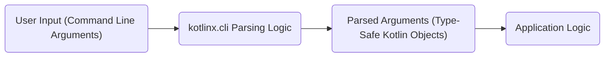
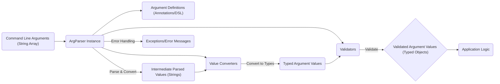

## Project Design Document: kotlinx.cli

**Version:** 1.1
**Date:** October 26, 2023
**Author:** Gemini (AI Language Model)

### 1. Project Overview

`kotlinx.cli` is a dedicated Kotlin library designed to streamline the process of parsing command-line arguments within Kotlin applications. It offers a type-safe and declarative approach for defining and accessing command-line options and arguments, enhancing code readability and reducing boilerplate. This document details the architecture and key components of `kotlinx.cli`, specifically for the purpose of facilitating thorough threat modeling and security analysis.

### 2. Goals

* Provide a developer-friendly and intuitive API for defining command-line interfaces in Kotlin.
* Ensure type-safe access to parsed command-line arguments, minimizing runtime errors.
* Support a comprehensive range of argument types, including strings, integers, booleans, and collections.
* Enable the clear definition of both options (identified by flags) and positional arguments.
* Simplify the automatic generation of user-friendly help messages and usage instructions.
* Maintain platform independence, ensuring seamless operation across various environments supported by Kotlin.
* Integrate smoothly within the Kotlin ecosystem, leveraging idiomatic Kotlin features.

### 3. Non-Goals

* Implementing a graphical user interface (GUI) framework for command-line applications. The focus remains solely on command-line parsing.
* Providing advanced shell integration features such as command completion, history management, or shell scripting capabilities.
* Directly managing environment variables or configuration files, although the parsed arguments can certainly be used in conjunction with such systems.
* Serving as a comprehensive application framework. `kotlinx.cli` focuses specifically on the command-line argument parsing aspect.

### 4. Target Audience

* Kotlin developers who are building command-line tools, utilities, and applications.
* Developers who prefer a type-safe, declarative, and concise method for handling command-line input in their Kotlin projects.

### 5. High-Level Architecture

At its core, `kotlinx.cli` operates by allowing developers to define the structure of their command-line interface declaratively. The library then takes the raw command-line arguments provided by the user and parses them according to this defined structure, making the validated and type-converted values readily accessible within the application.

**Detailed Workflow:**

* **Definition Phase:** The developer uses `kotlinx.cli`'s API, primarily through annotations or a Domain Specific Language (DSL), to specify the expected command-line options, arguments, and their properties (e.g., type, name, description).
* **Parsing Phase:** When the application is executed, `kotlinx.cli`'s parsing engine receives the raw command-line arguments (typically an array of strings) as input.
* **Validation Phase:** The library rigorously validates the provided arguments against the predefined structure, checking for missing required arguments, incorrect types, and other constraints.
* **Conversion Phase:** String-based command-line arguments are automatically converted into their corresponding Kotlin types based on the definitions (e.g., a string representing a number is converted to an `Int`).
* **Access Phase:** The successfully parsed and validated arguments are made available to the application logic as properties of the class used to define the command-line interface or through the parsing result object.

### 6. Components

This section provides a more detailed breakdown of the key components within `kotlinx.cli`.

* **`ArgParser`:**
    * The central orchestrator of the command-line argument parsing process.
    * Takes the raw command-line arguments (an array of `String`) as its primary input.
    * Internally utilizes the provided argument definitions to interpret the structure and meaning of the input.
    * Performs the crucial steps of parsing, validation, and type conversion of the arguments.
    * Holds the parsed argument values after successful processing.
    * Offers functionality to generate formatted help messages based on the defined arguments.

* **Argument Definitions (Annotations and DSL):**
    * The mechanism through which developers specify the expected structure of the command-line interface.
    * **Annotations:** Kotlin annotations like `@Arg`, `@Option`, and `@Subcommand` are used to annotate properties within a designated class, marking them as representing specific command-line elements. These annotations provide metadata about the argument (e.g., name, description, is it required?).
    * **DSL (Domain Specific Language):** A programmatic and expressive way to define arguments and options using Kotlin code. This approach offers more flexibility and control over the definition process.

* **Argument Types and Structures:**
    * Represents the different kinds of elements that can be present on the command line.
    * **Options:** Arguments that are typically preceded by a flag or identifier (e.g., `--output filename.txt`, `-v`).
        * **Named Options:** Options that require a value following the flag (e.g., `--name <value>`).
        * **Boolean Flags:** Options that act as switches, typically toggling a feature on or off (e.g., `--verbose`).
        * **Short Options:** Abbreviated versions of named options, often using a single hyphen (e.g., `-o <value>`).
    * **Arguments (Positional):** Arguments whose meaning is determined by their position in the command line, without a preceding flag (e.g., `input.txt output.txt`).
    * **Subcommands:** Allow structuring complex command-line applications into logical groups of commands (e.g., `git commit`, `git remote add`). Each subcommand can have its own set of options and arguments.

* **Value Converters:**
    * Responsible for transforming the string-based input from the command line into the appropriate Kotlin data types.
    * Provides built-in converters for common types such as `String`, `Int`, `Boolean`, `Double`, and collections of these types.
    * Offers the ability for developers to define custom converters for handling more complex or application-specific data types.

* **Validators:**
    * Implement the logic for ensuring that the parsed argument values meet specific criteria and constraints.
    * Can enforce rules such as:
        * **Range checks:** Verifying that numerical values fall within a specified range.
        * **Allowed values:** Restricting the input to a predefined set of options.
        * **Custom validation logic:** Allowing developers to implement arbitrary validation rules based on application requirements.

* **Help Generation Engine:**
    * Automatically generates user-friendly help messages based on the defined arguments, options, and subcommands.
    * Typically includes information on:
        * Usage instructions for the application or subcommand.
        * A list of available options with their descriptions and expected values.
        * A description of positional arguments.

* **Exception Handling Mechanism:**
    * Provides a structured way to handle errors that occur during the parsing process.
    * Defines specific exception types to indicate the nature of the error, such as `MissingArgumentException`, `NoSuchOptionException`, or `InvalidArgumentValueException`.
    * Allows applications to gracefully handle parsing errors and provide informative feedback to the user.

### 7. Data Flow

The following diagram illustrates the flow of data through the `kotlinx.cli` library during the command-line argument parsing process:

**Detailed Data Flow Steps:**

1. **Input Acquisition:** The application receives the command-line arguments as an array of strings, typically from the `main` function's arguments.
2. **`ArgParser` Initialization:** An instance of `ArgParser` is created, often associated with a class that represents the command-line interface definition.
3. **Definition Retrieval:** The `ArgParser` accesses the argument definitions that were specified using annotations or the DSL within the associated class.
4. **Parsing and Initial Conversion:** The `ArgParser` iterates through the input argument strings, attempting to match them to the defined options, flags, and positional arguments. Initial conversion might involve recognizing the type of argument.
5. **Value Conversion:**  Using the registered value converters, the string representations of argument values are transformed into their corresponding Kotlin types (e.g., "123" to `Int`, "true" to `Boolean`).
6. **Validation:** The converted argument values are then passed through the defined validators to ensure they meet the specified constraints (e.g., range checks, allowed values).
7. **Storage of Results:**  If parsing and validation are successful, the validated argument values (as typed Kotlin objects) are stored within the `ArgParser` instance or the associated definition class.
8. **Access by Application:** The application logic can then access these parsed and validated argument values as type-safe properties.
9. **Error Handling:** If any errors occur during parsing or validation (e.g., an invalid argument format, a missing required argument), the `ArgParser` throws a specific exception, allowing the application to handle the error appropriately.

### 8. Security Considerations

This section details potential security considerations relevant to `kotlinx.cli`, which are crucial for effective threat modeling.

* **Input Validation Vulnerabilities:**
    * **Risk:** Failure to properly validate command-line input can expose applications to various threats if malicious or unexpected input is processed.
    * **`kotlinx.cli` Mechanisms:** Provides robust mechanisms for defining argument types, custom converters, and validators to enforce expected input formats and values.
    * **Specific Threats:**
        * **Format String Injection:** If parsed string arguments are directly incorporated into format strings without proper sanitization, attackers could potentially execute arbitrary code or leak information.
        * **Integer Overflow/Underflow:** If string inputs representing numbers are converted to integer types without adequate range checks, it could lead to unexpected behavior or vulnerabilities.
        * **Command Injection (Less likely but possible):** If parsed string arguments are used to construct commands for external processes without proper escaping or sanitization, attackers could inject malicious commands. For example, `Runtime.getRuntime().exec("command " + userInput)`.
        * **Path Traversal:** If file paths are accepted as command-line arguments without validation, attackers could potentially access or modify files outside the intended directory.

* **Dependency Chain Risks:**
    * **Risk:** Vulnerabilities present in the dependencies of `kotlinx.cli` could indirectly impact applications that utilize the library.
    * **Mitigation Strategies:**  Employ best practices for dependency management, including regularly updating dependencies to their latest secure versions and utilizing vulnerability scanning tools to identify potential issues.

* **Information Disclosure through Error Messages:**
    * **Risk:** Verbose or poorly designed error messages might inadvertently reveal sensitive information about the application's internal workings, file paths, or configurations to potential attackers.
    * **Mitigation:** Carefully review and sanitize error messages generated by `kotlinx.cli` and the application itself to avoid exposing sensitive details.

* **Denial of Service (DoS) Potential:**
    * **Risk:**  Maliciously crafted command-line arguments could potentially consume excessive system resources (CPU, memory) during the parsing process, leading to a denial of service.
    * **Mitigation:** While `kotlinx.cli` itself is designed to be efficient, applications should be mindful of the complexity of their argument definitions and the potential for resource exhaustion if handling input from untrusted sources. Implement appropriate resource limits if necessary.

* **Risks Associated with Custom Converters and Validators:**
    * **Risk:** If developers implement custom value converters or validators that contain vulnerabilities (e.g., insecure deserialization, code execution flaws), this could introduce security risks.
    * **Mitigation:** Exercise caution when implementing custom converters and validators. Ensure they are thoroughly tested and follow secure coding practices. Avoid dynamic code execution based on user-controlled input within these components.

* **Implicit Behavior and Default Values:**
    * **Risk:** Unintended or poorly documented default values or implicit behavior in argument parsing could lead to unexpected application behavior or security vulnerabilities if not properly understood and handled.
    * **Mitigation:** Clearly define and document the default values for all options and arguments. Ensure that any implicit behavior is well-understood by developers and documented to avoid potential misinterpretations.

### 9. Future Considerations

* **Enhanced Validation Capabilities:** Explore integration with existing validation libraries to provide more sophisticated and reusable validation rules.
* **Improved Error Reporting and Context:** Provide richer and more context-aware error messages to aid users in understanding and resolving issues.
* **Localization and Internationalization:** Support the generation of help messages and potentially argument descriptions in multiple languages.
* **Integration with Configuration File Formats:**  Allow seamless loading of default values or configurations from common file formats (e.g., YAML, JSON) to complement command-line arguments.
* **More Advanced Argument Types:** Consider adding support for more complex argument types or structures.

This improved document provides a more detailed and comprehensive overview of the `kotlinx.cli` project's design, specifically tailored for the purpose of facilitating thorough threat modeling and security analysis.