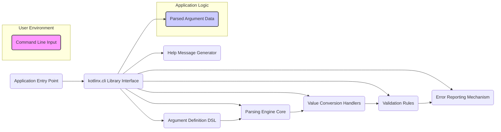
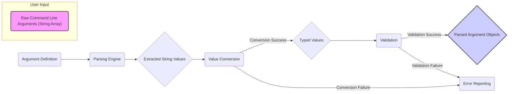

## Project Design Document: kotlinx.cli (Improved)

**1. Introduction**

This document provides an enhanced design overview of the `kotlinx.cli` library, a Kotlin library designed for parsing command-line arguments. This detailed description of the library's architecture, components, and data flow is specifically intended to serve as a robust foundation for subsequent threat modeling activities. By understanding the internal workings of `kotlinx.cli`, security professionals can more effectively identify potential vulnerabilities and assess the attack surface of applications utilizing this library.

**2. Goals**

* Provide a comprehensive and unambiguous description of the `kotlinx.cli` library's internal structure and interactions.
* Clearly delineate the responsibilities of each key component within the library.
* Illustrate the complete lifecycle of command-line input as it is processed by the library.
* Explicitly highlight potential areas where security vulnerabilities might arise, focusing on architectural aspects relevant to threat modeling.
* Serve as the primary reference document for security assessments and threat modeling exercises related to applications using `kotlinx.cli`.

**3. Non-Goals**

* This document will not delve into the minute details of individual function implementations or specific code within the `kotlinx.cli` library.
* This document does not aim to provide a definitive list of all possible security vulnerabilities. Its purpose is to inform threat modeling, which will uncover specific vulnerabilities.
* This document will not cover the intricacies of the library's public API from a developer usage perspective, focusing instead on its internal mechanisms.
* Performance benchmarks, optimization strategies, and non-security-related design choices are outside the scope of this document.

**4. Architecture Overview**

The `kotlinx.cli` library employs a declarative paradigm for defining and processing command-line arguments. The core of its architecture involves defining specifications for expected arguments and then using an engine to parse and validate the provided input against these specifications.

**5. Component Details**

* **Argument Definition DSL (Domain Specific Language):**
    * Allows developers to declaratively specify the expected structure of command-line arguments.
    * Defines argument names (short and long forms), types (String, Int, Boolean, etc.), descriptions, default values, and cardinality (required, optional, multiple).
    * Examples include defining positional arguments (e.g., `<input-file>`), options with values (e.g., `--output <file>`), and boolean flags (e.g., `--verbose`).
    * Security Relevance: Incorrect or overly permissive definitions can lead to unexpected input being accepted, potentially bypassing intended security controls.

* **Parsing Engine Core:**
    * The central component responsible for processing the raw command-line input (typically an array of strings).
    * Tokenizes the input and attempts to match each token against the defined argument specifications.
    * Handles different syntaxes for options (e.g., `-o value`, `--option=value`, `--option value`).
    * Maintains the parsing state and tracks which arguments have been encountered.
    * Security Relevance: Vulnerabilities in the parsing logic could allow attackers to craft malicious input that bypasses parsing or causes unexpected behavior. Improper handling of escape characters or special characters could be a concern.

* **Value Conversion Handlers:**
    * Responsible for transforming the string values extracted from the command line into the desired data types.
    * Provides built-in converters for common types and allows developers to define custom converters.
    * Handles potential conversion errors (e.g., trying to convert a non-numeric string to an integer).
    * Security Relevance: Insecure or missing conversion logic could lead to type confusion vulnerabilities or allow the injection of unexpected data types. Insufficient error handling during conversion could also reveal information.

* **Validation Rules:**
    * Enforces constraints and validation logic defined for the arguments.
    * Checks for required arguments, valid ranges for numerical values, allowed values for enumerations, and other custom validation rules.
    * Reports validation errors if the input does not meet the specified criteria.
    * Security Relevance: Weak or missing validation is a primary source of vulnerabilities. Failure to validate input can lead to buffer overflows, injection attacks, and other issues.

* **Help Message Generator:**
    * Creates user-friendly help messages based on the argument definitions.
    * Includes information about available options, their syntax, descriptions, and default values.
    * Typically triggered by a specific option like `--help` or `-h`.
    * Security Relevance: While seemingly benign, the help generator should not inadvertently reveal sensitive information about the application's internal configuration or logic.

* **Error Reporting Mechanism:**
    * Handles errors encountered during parsing, conversion, and validation.
    * Provides informative error messages to the user, indicating the nature of the problem and potentially the location in the input.
    * Security Relevance: Error messages should be carefully crafted to avoid revealing sensitive information that could aid an attacker. Excessive detail in error messages can be a security risk.

**6. Data Flow (Detailed)**

The flow of data through the `kotlinx.cli` library can be broken down into the following stages:

1. **Raw Command Line Arguments (String Array):** The user provides input to the application as an array of strings. This is the initial untrusted input.
2. **Argument Definition:** The application code provides the defined argument specifications to the parsing engine.
3. **Parsing Engine:** The parsing engine analyzes the raw input and attempts to match it against the defined arguments.
4. **Extracted String Values:** The parsing engine extracts the string values associated with each identified argument. These are still in their raw string form.
5. **Value Conversion:** The extracted string values are passed to the appropriate value conversion handlers based on the defined argument types.
    * **Conversion Success:** If the conversion is successful, the values are transformed into their typed representations (e.g., String to Int).
    * **Conversion Failure:** If conversion fails (e.g., invalid input format), an error is reported.
6. **Typed Values:** The successfully converted values are now in their intended data types.
7. **Validation:** The typed values are passed to the validation component, which enforces the defined constraints.
    * **Validation Success:** If the values pass all validation rules, they are considered valid.
    * **Validation Failure:** If validation fails, an error is reported.
8. **Parsed Argument Objects:**  Successfully parsed and validated arguments are made available to the application logic as structured data objects.
9. **Error Reporting:**  Errors encountered during conversion or validation are handled by the error reporting mechanism.

**7. Security Considerations (Detailed)**

This section expands on potential security concerns, aligning them with the components and data flow:

* **Argument Definition DSL:**
    * **Overly Permissive Definitions:** Defining arguments with overly broad types or without sufficient constraints can allow unexpected input. For example, accepting arbitrary strings for file paths without validation could lead to path traversal vulnerabilities.
    * **Conflicting Definitions:** Ambiguous or conflicting argument definitions might lead to unpredictable parsing behavior, potentially exploitable by attackers.

* **Parsing Engine Core:**
    * **Input Injection:** If the parsing engine doesn't properly handle escape characters or special characters in argument values, it could be vulnerable to injection attacks (e.g., command injection if parsed values are used in system calls).
    * **Denial of Service (DoS):**  Crafted input with a large number of arguments or deeply nested structures could potentially overwhelm the parsing engine, leading to a denial of service.
    * **Integer Overflow/Underflow:** If the parsing engine performs calculations on argument indices or lengths without proper bounds checking, it could be susceptible to integer overflow or underflow vulnerabilities.

* **Value Conversion Handlers:**
    * **Type Confusion:**  Insecure conversion logic could lead to the application interpreting data as a different type than intended, potentially bypassing security checks.
    * **Format String Vulnerabilities:** If string conversion involves formatting operations without proper sanitization, it could be vulnerable to format string attacks.
    * **Resource Exhaustion:** Custom converters that perform complex operations on untrusted input could be exploited to cause resource exhaustion.

* **Validation Rules:**
    * **Insufficient Validation:**  Lack of proper validation is a primary attack vector. Failing to validate input length, format, or range can lead to various vulnerabilities.
    * **Client-Side vs. Server-Side Validation:** While `kotlinx.cli` handles input within the application, it's crucial to remember that this is not a replacement for server-side validation if the application interacts with external systems.
    * **Regular Expression Vulnerabilities (ReDoS):** If validation rules rely on regular expressions, poorly written regexes could be vulnerable to Regular Expression Denial of Service (ReDoS) attacks.

* **Help Message Generator:**
    * **Information Disclosure:**  Carelessly constructed help messages could reveal sensitive information about the application's configuration, internal structure, or supported features, aiding attackers in reconnaissance.

* **Error Reporting Mechanism:**
    * **Information Leakage:**  Detailed error messages that expose file paths, internal variable names, or stack traces can provide valuable information to attackers.

**8. Deployment Considerations (Security Focused)**

Securing applications that utilize `kotlinx.cli` involves considering the deployment environment:

* **Principle of Least Privilege:** The application should run with the minimum necessary permissions. Avoid running with elevated privileges if possible, even when processing command-line arguments.
* **Secure Defaults:** Ensure that default values for arguments are securely configured and do not introduce vulnerabilities. For example, default file paths should be carefully chosen.
* **Input Sanitization Beyond `kotlinx.cli`:** While `kotlinx.cli` provides parsing and validation, applications should perform additional sanitization and validation of parsed arguments before using them in sensitive operations (e.g., database queries, system calls).
* **Regular Updates:** Keep the `kotlinx.cli` library and its dependencies updated to benefit from bug fixes and security patches.
* **Security Audits:** Regularly audit the application's use of `kotlinx.cli` and the defined argument specifications to identify potential security weaknesses.

**9. Future Considerations**

* **More Granular Validation Controls:**  Potentially introduce more sophisticated validation mechanisms, such as allowing developers to define custom validation functions directly within the argument definition.
* **Improved Error Handling Customization:** Provide more flexibility for developers to customize error reporting and handling behavior.
* **Formal Security Audits:**  Consider conducting formal security audits of the `kotlinx.cli` library itself to identify and address potential vulnerabilities within the library's core logic.

This improved design document provides a more detailed and security-focused overview of the `kotlinx.cli` library, making it a more effective resource for threat modeling and security assessments.