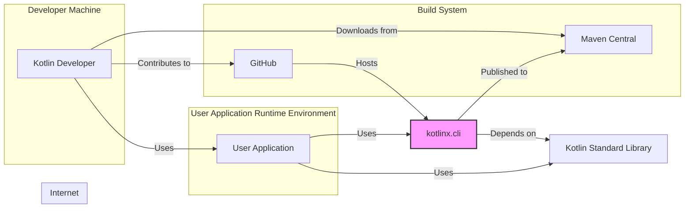
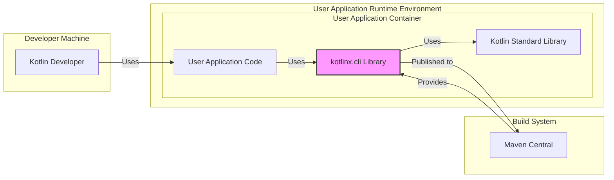
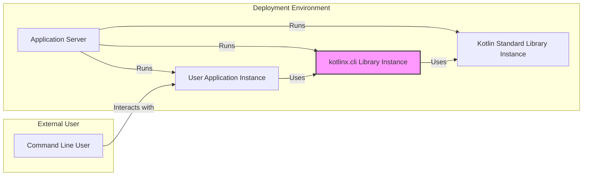
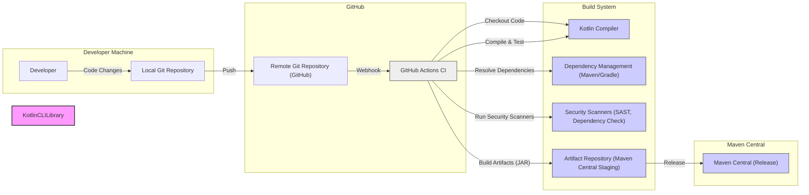

# BUSINESS POSTURE

This project, `kotlinx.cli`, provides a Kotlin library for parsing command-line arguments in applications.

- Business Priorities and Goals:
  - Provide a user-friendly and efficient way for Kotlin developers to handle command-line arguments.
  - Simplify the development of command-line tools and applications in Kotlin.
  - Offer a robust and reliable library that reduces boilerplate code for argument parsing.
  - Enable developers to create applications with clear and well-defined command-line interfaces.

- Business Risks:
  - Vulnerabilities in the library could lead to security issues in applications that use it. If the argument parsing logic is flawed, it could be exploited to inject malicious commands or cause unexpected application behavior.
  - Poor usability or lack of features could lead to low adoption and failure to meet developer needs.
  - Lack of maintenance and updates could result in the library becoming outdated and insecure over time.
  - Performance issues in argument parsing could negatively impact the performance of applications using the library.

# SECURITY POSTURE

- Existing Security Controls:
  - security control: Code hosted on GitHub, leveraging GitHub's infrastructure security. Implemented by: GitHub.
  - security control: Open-source project, allowing for community review and scrutiny. Implemented by: Open Source nature of the project.
  - accepted risk: Limited formal security testing or dedicated security team for this specific library. Assumed based on typical open-source library projects.
  - accepted risk: Reliance on user applications to properly handle parsed arguments and implement application-level security. Assumed as library responsibility is limited to parsing.

- Recommended Security Controls:
  - security control: Implement automated security scanning (SAST/DAST) in the CI/CD pipeline to detect potential vulnerabilities.
  - security control: Conduct regular dependency checks to identify and update vulnerable dependencies.
  - security control: Provide clear documentation and examples on secure usage of the library, especially regarding input validation of parsed arguments in user applications.
  - security control: Consider incorporating fuzz testing to identify edge cases and potential vulnerabilities in argument parsing logic.

- Security Requirements:
  - Authentication: Not directly applicable to a command-line argument parsing library itself. Authentication is the responsibility of the application using this library.
  - Authorization: Not directly applicable to a command-line argument parsing library itself. Authorization is the responsibility of the application using this library, based on the parsed arguments.
  - Input Validation: While the library parses arguments, robust input validation is crucial for applications using this library. The library should be designed to facilitate easy and secure input validation by the application developer. The library itself should handle parsing errors gracefully and prevent injection vulnerabilities during parsing.
  - Cryptography: Not directly required for the core functionality of a command-line argument parsing library. However, applications using this library might use cryptography based on parsed arguments (e.g., to handle encrypted files or network communication). The library should not introduce any cryptographic weaknesses.

# DESIGN

## C4 CONTEXT

- Context Diagram Elements:
  - Element:
    - Name: Kotlin Developer
    - Type: Person
    - Description: Software developers who use the `kotlinx.cli` library to build command-line applications in Kotlin.
    - Responsibilities: Develops and maintains Kotlin applications, integrates `kotlinx.cli` into their projects, and contributes to the `kotlinx.cli` project.
    - Security controls: Uses secure development practices on their local machines, authenticates to GitHub and Maven Central.
  - Element:
    - Name: User Application
    - Type: Software System
    - Description: Command-line applications built by Kotlin developers that utilize the `kotlinx.cli` library for parsing command-line arguments.
    - Responsibilities: Provides command-line functionality to end-users, processes user input, and performs application-specific tasks. Relies on `kotlinx.cli` for argument parsing.
    - Security controls: Implements application-level security controls, including input validation (using and beyond what `kotlinx.cli` provides), authorization, and secure data handling.
  - Element:
    - Name: `kotlinx.cli`
    - Type: Software System / Library
    - Description: The Kotlin command-line argument parsing library being designed. It is distributed as a library for use in other Kotlin projects.
    - Responsibilities: Provides functionality for parsing command-line arguments, defining command-line options and commands, and handling user input.
    - Security controls: Input validation during parsing, protection against injection vulnerabilities, and adherence to secure coding practices.
  - Element:
    - Name: Kotlin Standard Library
    - Type: Software System / Library
    - Description: The standard library for the Kotlin programming language, which `kotlinx.cli` depends on.
    - Responsibilities: Provides core functionalities for Kotlin programming language.
    - Security controls: Security controls are managed by the Kotlin project.
  - Element:
    - Name: Maven Central
    - Type: Software System / Package Repository
    - Description: A central repository for Java and Kotlin libraries, used to distribute `kotlinx.cli`.
    - Responsibilities: Hosts and distributes the `kotlinx.cli` library.
    - Security controls: Security controls are managed by Maven Central and Sonatype.
  - Element:
    - Name: GitHub
    - Type: Software System / Code Repository
    - Description: A web-based platform for version control and collaboration, hosting the source code of `kotlinx.cli`.
    - Responsibilities: Hosts the source code, manages contributions, and facilitates collaboration on the `kotlinx.cli` project.
    - Security controls: Security controls are managed by GitHub, including access control, vulnerability scanning, and infrastructure security.

## C4 CONTAINER

- Container Diagram Elements:
  - Element:
    - Name: `kotlinx.cli` Library
    - Type: Library
    - Description: Kotlin library providing command-line argument parsing functionality. Implemented in Kotlin and distributed as a JAR file.
    - Responsibilities: Parsing command-line arguments, defining options and commands, handling user input, and providing an API for user applications to access parsed arguments.
    - Security controls: Input validation within the parsing logic, secure coding practices during development, and potentially automated security scanning in the build process.
  - Element:
    - Name: User Application Code
    - Type: Application
    - Description: The Kotlin application code developed by users that integrates and utilizes the `kotlinx.cli` library.
    - Responsibilities: Defines the application's command-line interface using `kotlinx.cli`, processes parsed arguments, implements application logic, and handles user interactions.
    - Security controls: Application-level input validation (beyond basic parsing), authorization logic, secure data handling, and protection against application-specific vulnerabilities.
  - Element:
    - Name: Kotlin Standard Library
    - Type: Library
    - Description: The standard library for Kotlin, providing core functionalities used by both `kotlinx.cli` and user applications.
    - Responsibilities: Provides fundamental functionalities for Kotlin programs.
    - Security controls: Security controls are managed by the Kotlin project.
  - Element:
    - Name: Maven Central
    - Type: Package Repository
    - Description: Repository for distributing Java and Kotlin libraries, used to host and distribute `kotlinx.cli`.
    - Responsibilities: Stores and provides access to the `kotlinx.cli` library.
    - Security controls: Security controls are managed by Maven Central and Sonatype.

## DEPLOYMENT

`kotlinx.cli` is a library, so it is not deployed as a standalone application. It is included as a dependency in user applications. The deployment of `kotlinx.cli` is essentially its publication to a package repository like Maven Central. User applications then depend on this published library and are deployed according to the user application's deployment strategy.

Here we describe the deployment of a *user application* that uses `kotlinx.cli`. We assume a simple deployment scenario to a generic server environment.

- Deployment Diagram Elements:
  - Element:
    - Name: Application Server
    - Type: Infrastructure / Server
    - Description: A generic server environment (could be physical or virtual, cloud-based or on-premise) where the user application is deployed and executed.
    - Responsibilities: Provides the runtime environment for the user application, including CPU, memory, and network connectivity.
    - Security controls: Operating system security hardening, network security controls (firewalls, intrusion detection), access control to the server, and monitoring.
  - Element:
    - Name: User Application Instance
    - Type: Software Instance / Application Process
    - Description: A running instance of the user application that incorporates the `kotlinx.cli` library.
    - Responsibilities: Executes the application logic, parses command-line arguments using `kotlinx.cli`, processes user input, and performs application-specific tasks.
    - Security controls: Application-level security controls, input validation, authorization, secure session management (if applicable), and logging.
  - Element:
    - Name: `kotlinx.cli` Library Instance
    - Type: Software Instance / Library
    - Description: The instance of the `kotlinx.cli` library loaded and used by the User Application Instance.
    - Responsibilities: Provides command-line argument parsing functionality to the User Application Instance.
    - Security controls: Inherits security from the application server environment and the library's own secure design.
  - Element:
    - Name: Kotlin Standard Library Instance
    - Type: Software Instance / Library
    - Description: The instance of the Kotlin Standard Library loaded and used by both the User Application Instance and `kotlinx.cli` Library Instance.
    - Responsibilities: Provides core Kotlin functionalities.
    - Security controls: Inherits security from the application server environment and the library's own secure design (managed by Kotlin project).
  - Element:
    - Name: Command Line User
    - Type: Person
    - Description: End-user who interacts with the User Application through the command line.
    - Responsibilities: Provides input to the User Application via command-line arguments.
    - Security controls: User authentication to the system (if required), responsible for providing valid and expected input (though application should handle invalid input gracefully).

## BUILD

- Build Process Elements:
  - Element:
    - Name: Developer
    - Type: Person
    - Description: Software developer writing and modifying the `kotlinx.cli` library code.
    - Responsibilities: Writes code, performs local testing, and commits changes to the Git repository.
    - Security controls: Secure coding practices, local development environment security.
  - Element:
    - Name: Local Git Repository
    - Type: Software System / Version Control
    - Description: Local Git repository on the developer's machine, storing the source code.
    - Responsibilities: Version control of the source code on the developer's machine.
    - Security controls: Access control on the developer's machine.
  - Element:
    - Name: Remote Git Repository (GitHub)
    - Type: Software System / Version Control
    - Description: Remote Git repository hosted on GitHub, serving as the central repository for the project.
    - Responsibilities: Central source code repository, collaboration platform, and trigger for CI/CD pipelines.
    - Security controls: GitHub's security controls, access control, branch protection, and audit logs.
  - Element:
    - Name: GitHub Actions CI
    - Type: Software System / CI/CD
    - Description: GitHub's built-in CI/CD service, used to automate the build, test, and release process.
    - Responsibilities: Automated build process, running tests, performing security scans, and publishing artifacts.
    - Security controls: GitHub Actions security features, secure workflow definitions, secret management, and isolation of build environments.
  - Element:
    - Name: Kotlin Compiler
    - Type: Software System / Compiler
    - Description: The Kotlin compiler used to compile the `kotlinx.cli` source code into bytecode.
    - Responsibilities: Compiling Kotlin code into bytecode.
    - Security controls: Compiler security is managed by the Kotlin project.
  - Element:
    - Name: Dependency Management (Maven/Gradle)
    - Type: Software System / Build Tool
    - Description: Maven or Gradle used to manage project dependencies and build process.
    - Responsibilities: Resolving dependencies, managing build tasks, and packaging the library.
    - Security controls: Dependency vulnerability scanning (through plugins), secure dependency resolution.
  - Element:
    - Name: Security Scanners (SAST, Dependency Check)
    - Type: Software System / Security Tool
    - Description: Static Application Security Testing (SAST) tools and dependency vulnerability scanners used to identify potential security issues.
    - Responsibilities: Identifying potential vulnerabilities in the code and dependencies.
    - Security controls: Configuration and management of security scanning tools, integration into the CI pipeline.
  - Element:
    - Name: Artifact Repository (Maven Central Staging)
    - Type: Software System / Artifact Repository
    - Description: Staging repository for Maven Central, where artifacts are uploaded before release.
    - Responsibilities: Staging and validating artifacts before publishing to Maven Central.
    - Security controls: Access control, artifact integrity checks, and security policies of Maven Central staging.
  - Element:
    - Name: Maven Central (Release)
    - Type: Software System / Artifact Repository
    - Description: Public Maven Central repository where the released `kotlinx.cli` library is published and available for download.
    - Responsibilities: Public distribution of the `kotlinx.cli` library.
    - Security controls: Maven Central's security controls and policies.

# RISK ASSESSMENT

- Critical Business Processes:
  - For `kotlinx.cli` itself, the critical business process is providing a reliable and secure library for Kotlin developers.
  - For applications using `kotlinx.cli`, the critical business processes are those implemented by the application, which rely on correctly parsed command-line arguments.

- Data to Protect and Sensitivity:
  - `kotlinx.cli` library code itself: Sensitivity is moderate. Code integrity and availability are important to maintain developer trust and prevent supply chain attacks.
  - User application data: Sensitivity depends entirely on the application using `kotlinx.cli`. The library itself does not handle user data directly, but vulnerabilities could lead to data breaches in user applications. The sensitivity ranges from low to high depending on the application's purpose and the data it processes.

# QUESTIONS & ASSUMPTIONS

- BUSINESS POSTURE:
  - Question: What is the target audience for `kotlinx.cli`? Is it primarily for internal use within an organization, or for public consumption by a broad range of developers?
  - Assumption: We assume `kotlinx.cli` is intended for public consumption and aims to be a widely used library in the Kotlin ecosystem.
  - Question: Are there specific performance requirements or scalability goals for `kotlinx.cli`?
  - Assumption: We assume performance and efficiency are important considerations, but not to the extent of sacrificing security or usability.

- SECURITY POSTURE:
  - Question: Are there any existing security guidelines or policies that the `kotlinx` project follows?
  - Assumption: We assume standard open-source security practices are generally followed, but specific formal security processes might be limited for this individual library.
  - Question: Are there any known vulnerabilities or past security incidents related to `kotlinx.cli` or similar Kotlin libraries?
  - Assumption: We assume no major known security incidents, but standard security vigilance is still necessary.
  - Question: What is the expected lifespan and maintenance plan for `kotlinx.cli`?
  - Assumption: We assume long-term maintenance and updates are planned to address bugs and security vulnerabilities.

- DESIGN:
  - Question: Are there any specific complex use cases or edge cases that the design should explicitly address from a security perspective?
  - Assumption: We assume the library should handle a wide range of valid and invalid command-line inputs robustly and securely.
  - Question: Are there any plans for future extensions or features that might have security implications?
  - Assumption: We assume future development will consider security implications and follow secure design principles.
  - Question: What level of input validation is expected to be performed by `kotlinx.cli` versus the user application?
  - Assumption: `kotlinx.cli` should perform basic parsing and format validation, but user applications are responsible for application-specific semantic validation and sanitization of parsed arguments.